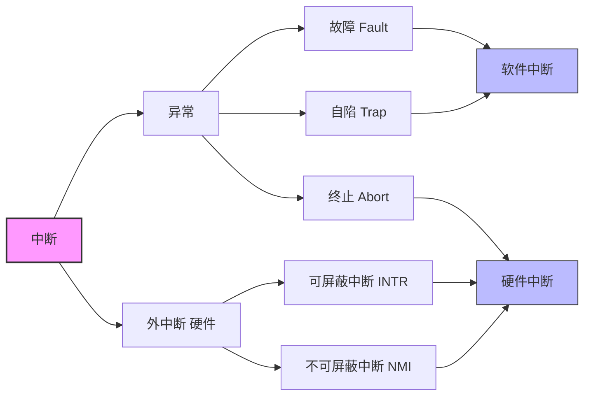

这里和计组5.5和7.3有关联
[中断 （连接7.3）](中断%20（连接7.3）.md)

# 操作系统内核
## 支撑功能
1. 时钟管理
**功能：** 计时和产生定时中断
课后题25
https://www.bilibili.com/video/BV1aNVP6YEp8?t=452.3&p=3
2. 中断机制
执行中断服务程序
3. 原语
原子性，不能被打断
通过关中断保证不被打断
[[指令，指令周期，原语的关系]]

## 资源管理功能
1. **进程管理**：负责进程的创建与撤销、状态转换、调度与分派，并维护进程控制块（PCB）等核心数据结构
2. **存储器管理**：实现内存的分配与回收、地址映射、内存保护及页面置换等机制，确保多道程序安全、高效地共享主存资源
3. **设备管理**：完成设备的分配与回收、缓冲区管理、I/O 调度及设备驱动调用，屏蔽硬件差异，为用户提供统一的设备访问接口

## 1.3.2 处理器的双重工作模式

| 模式 | 可执行指令 | 运行程序 |
| --- | --- | --- |
| 用户态 | 非特权指令 | 用户程序 |
| 内核态 | 特权指令 | 内核程序 |

### 特权指令
- 仅能在**内核态**执行
- 可访问**全部地址空间**（用户空间 + 系统空间）
- 可执行关键操作：启动外设、设置系统时钟、关闭中断、修改模式位、返回用户态等

### 非特权指令
- 通常在**用户态**执行
- 内存访问被限制在**用户地址空间**
- 只能做一般计算和数据处理，无法直接操作硬件或系统核心资源
## 中断和异常
[中断 （连接7.3）](中断%20（连接7.3）.md)

用户通过**中断或异常**进入内核态
[7IO系统](7IO系统.md)

# 系统调用
[1.1.2.系统调用](1.1.2.系统调用.md)
