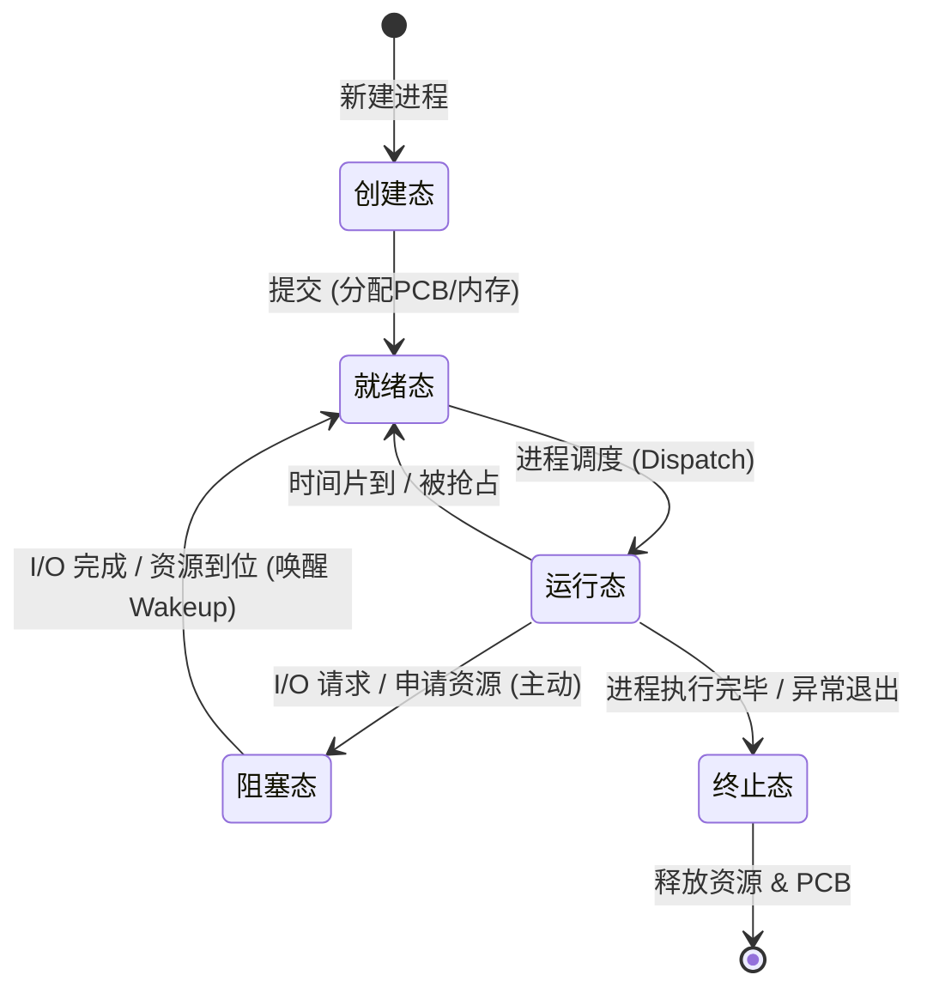

# 进程的概念

**引入背景**：多道程序环境下，允许多个程序并发执行。但并发性破坏了程序原本的封闭性，使执行过程呈现间断性，并可能导致结果不可再现。

**解决方案**：为有效描述和控制程序的并发行为，操作系统引入了**进程（Process）**这一核心概念，以支撑操作系统的两大基本特性——**并发性**与**共享性**。
**进程是资源分配的基本单位**
## 进程实体（进程映像）

**程序段 + 数据段 + PCB** 三者共同构成进程实体，也称进程映像。
[[2.1进程的组成]]

- **程序段**：存放要执行的代码
- **数据段**：存放程序运行时使用的数据
- **PCB**：存放进程的管理和控制信息

> 核心结论：
> - 创建进程的本质 = 创建其 PCB
> - 撤销进程的本质 = 释放该 PCB 及相关资源
> - **PCB 是进程存在的唯一标志**
## 进程定义

1. 进程是正在执行的程序实例。
2. 进程是程序及其数据从外存加载到内存后，在 CPU 上运行的过程。
3. 进程是具有独立功能的程序在一个特定数据集合上的执行活动。

**正式定义（传统OS）**：进程是进程实体的运行过程，是系统进行**资源分配和调度**的一个独立单位。

> "系统资源"不仅包括
> 内存空间、
> I/O 设备等硬件资源，也包括文件、信号量等软件资源。
> CPU的使用权

## 进程的特征

进程源于多道程序并发执行的需求，与**静态的程序**有着本质区别。其核心特征如下：

1. **动态性**：进程是程序的一次执行实例，具有明确的生命周期，包括创建、就绪、运行、阻塞和终止等状态变化。动态性是进程最根本的特征。
	**进程是动态的，而程序是静态的**

2. **并发性**：多个进程可同时驻留于内存，并在一段时间内交替或并行执行。引入进程的根本目的，正是为了支持程序的并发执行。

3. **独立性**：进程是能够独立运行、独立获取系统资源，并作为调度基本单位参与 CPU 竞争的实体。任何未建立 PCB 的程序，均不能被操作系统调度执行。

4. **异步性**：进程相互制约，以不可预知的速度向前推进。这种异步性可能导致执行结果不可再现，因此操作系统必须提供相关机制，以协调进程行为，确保执行的正确性。
## 进程的内存映像

当程序被加载运行时，操作系统会为其建立一个**虚拟地址空间**，该空间的逻辑布局称为**进程的内存映像**。它反映了进程在运行时代码、数据、堆、栈等部分的组织方式。

**与磁盘上的静态可执行文件不同，内存映像是动态的。** 在虚拟内存机制下，进程的整个地址空间无须全部驻留物理内存，只有在实际访问某一部分时，系统才会通过**缺页中断**将其从磁盘调入内存。

### 构成
1. 代码段
2. 数据段
3. PCB
4. 堆
5. 栈
6. 共享库的存储映射区

# 进程的转换

## 进程的状态与转换

进程在其生命周期中，由于与其他进程的相互制约以及系统运行环境的变化，其状态会不断发生转换。通常进程具有以下五种状态，其中前三种为基本状态。

1. **运行态**：进程正在 CPU 上执行。在单 CPU 中，任一时刻最多只有一个进程处于运行态。

2. **就绪态**：进程已获得除 CPU 外的所有必要资源，一旦获得 CPU，便可立即投入运行。系统中可能有多个就绪进程，通常组织为**就绪队列**。
**只缺少CPU**

3. **阻塞态**（等待态）：进程因等待某一事件（如资源可用、I/O 完成等）而暂停运行。此时即使 CPU 空闲，该进程也无法执行。系统通常将阻塞进程组织为**阻塞队列**，可按阻塞原因进一步划分为多个子队列。
**等待除了CPU以外的资源**
4. **创建态**：进程正处于创建过程中，尚未进入就绪态。

5. **终止态**：进程已完成执行，正在等待系统回收资源。此时进程不再参与调度，但 PCB 等信息可能暂时保留，直至完成最终清理。

## 转换的中间过程

- **就绪态 → 运行态**：就绪进程被调度程序选中，
	- 1. 获得 CPU（如分配到时间片）。

- **运行态 → 就绪态**：
	- 1.时间片用完主动让出 CPU；
	- 2.可剥夺式调度中更高优先级进程就绪，当前进程被强制切换回就绪。
	- 时间片用完

- **运行态 → 阻塞态**：**主动行为**
	-  运行中进程请求服务（如 I/O）无法立即满足，需等待外部事件，主动进入阻塞态。并非所有系统调用都导致阻塞。
	- IO操作：读磁盘
	- 资源不足：内存不足，申请临界资源但不足，缺页(数据在外存需要IO)
- [2.1进程的组成](2.1进程的组成.md#进程的阻塞和唤醒)

- **阻塞态 → 就绪态**：（唤醒）
- 所等待事件发生（如 I/O 完成），中断处理程序将其改为就绪态，重新插入就绪队列等待调度。

## 进程创建和删除的流程
[2.1进程的组成](2.1进程的组成.md#创建进程的流程)

# 线程（Thread）

轻量版进程
是程序执行流的最小单元
处理机调度的基本单位

线程的属性：

1. **轻量级执行实体**：不拥有独立系统资源，仅拥有线程 ID、程序计数器、寄存器集合、栈和线程控制块（TCB）等私有数据结构。

2. **共享代码段**：同一进程的多个线程可并发执行相同代码（如 Web 服务器多线程服务不同用户）。

3. **资源共享**：同进程线程共享代码段、数据段、堆、文件描述符等，线程间通信高效，无需 IPC。

4. **独立调度单位**：线程是 CPU 调度的基本单位。单 CPU 时间片轮转，多 CPU 可并行。

5. **生命周期**：从创建开始，经历就绪、运行、阻塞等状态变化，直至终止。

>例如，同时进行语音聊天和电话是通过两个不同的线程控制的

引入线程后，**进程成为除 CPU 外的系统资源分配单位，线程成为 CPU 调度和执行的基本单位**。同一进程内线程切换开销远小于进程切换。
## 进程和线程的比较

## 线程与进程的对比

| 维度       | 进程                        | 线程                            |
| -------- | ------------------------- | ----------------------------- |
| **调度**   | 传统OS中为调度基本单位，切换开销大        | 引入线程后成为调度基本单位，同进程内切换不触发进程切换   |
| **并发性**  | 进程间可并发                    | 进程间、同进程线程间、不同进程线程间均可并发        |
| **拥有资源** | 资源分配基本单位，拥有独立地址空间         | 不拥有系统资源，仅有 TCB/栈/寄存器等私有数据     |
| **独立性**  | 地址空间完全独立，互不可见             | 同进程线程共享地址空间；对其他进程不可见          |
| **系统开销** | 创建/撤销/切换开销大（PCB+地址空间+I/O） | 创建/撤销仅需栈和少量内核对象，切换仅需保存寄存器，开销小 |
## 线程控制块

## 线程控制块（TCB）

- **功能**：记录和管理线程的运行信息。

- **包含内容**：
    1. 线程标识符（Thread ID）
    2. 寄存器集合（程序计数器、状态寄存器、通用寄存器）
    3. 线程当前状态
    4. 调度优先级
    5. 线程局部存储区（线程私有数据）
    6. 堆栈指针（指向线程私有栈）**线程有自己的栈指针**
[[2.2线程题目]]
> 同进程线程共享地址空间和全局变量，但各有独立私有栈。技术上可跨线程访问栈但违反规范，应避免。

## 线程的实现方式

### 用户级线程（ULT）
- 线程管理由用户态线程库完成，内核感知不到线程存在
- 切换在用户态完成，无需陷入内核，开销极小
- **缺点**：一个线程阻塞则整个进程阻塞；无法利用多核并行（内核只按进程调度）
- 可以在不支持内核级线程的操作系统实现

### 内核级线程（KLT）
- 线程管理由 OS 内核完成，内核为每个线程维护 TCB
- 切换需陷入核心态，开销较大
- **优点**：一个线程阻塞不影响其他线程；可多核并行

### 多线程模型

| 模型 | 映射关系 | 特点 |
|---|---|---|
| 多对一 | 多个 ULT → 1 个 KLT | 开销小，但阻塞整个进程，无法并行 |
| 一对一 | 1 个 ULT → 1 个 KLT | 并发强、可并行，但开销大 |
| 多对多 | n 个 ULT → m 个 KLT | 折中方案，兼顾并发与开销 |
# CPU调度

调度：CPU调度是指按照一定的算法（兼顾公平性与效率），从就绪队列中选择一个进程，并将CPU分配给它运行，从而实现多个进程的并发执行。
## 调度的层次
1. 高级调度
作业调度，是一个大任务
从外存找一个放到内存
2. 中级调度（内存调度）
当内存紧张时，把无法运行的进程换出到外存
3. 低级调度（进程调度）

## 进程调度的任务

1. **保存 CPU 现场**：将当前进程的 CPU 状态（程序计数器、寄存器等）完整保存至其 PCB。

2. **选取待运行进程**：按调度算法从就绪队列中选一个进程，将状态改为运行态。

3. **完成 CPU 分配**：分派程序将选中进程的 PCB 现场加载到寄存器，移交 CPU 控制权。

## 进程调度的时机

调度程序是内核程序，请求事件发生后运行调度，选出就绪进程后才切换。

常见触发调度的四种情况：

1. **创建新进程后**：父子进程均就绪，需决定谁先运行。
2. **进程终止后**：需从就绪队列选一个运行；若无就绪进程，运行闲逛进程。（不让CPU停下来）
3. **进程阻塞时**：因 I/O、信号量等原因阻塞，必须调度其他进程。
4. **I/O 中断后**：等待 I/O 的进程转为就绪，需决定让新就绪进程运行还是当前进程继续。

> 抢占系统中，高优先级进程就绪或时间片用完也会触发调度并可能剥夺 CPU。

>以下情况**不能**进行进程调度和切换
>处理中断的过程
>执行原子操作的过程
## 进程调度的方式

1. **非抢占调度**（非剥夺）：即使更高优先级进程就绪，仍让当前进程继续执行，直到其主动阻塞或终止才切换。实现简单、开销小，适用于早期批处理，不满足实时要求。

2. **抢占调度**（剥夺）：更高优先级进程就绪时，可暂停当前进程，将 CPU 分配给更紧迫的进程。能提高吞吐率和响应效率。抢占原则主要有优先级、短进程优先、时间片等。
## 闲逛进程
优先级最低，永远不会阻塞

## 线程调度
1. 用户级：把CPU给进程，用户级线程库决定运行哪个进程
2. 内核级：直接当进程看就行了

## 调度的目标

## 调度算法的评价指标

1. **CPU 利用率**：$\text{CPU利用率} = \frac{\text{CPU有效工作时间}}{\text{CPU有效工作时间} + \text{CPU空闲等待时间}}$

2. **系统吞吐量**：单位时间内系统完成的作业数量。短作业提升吞吐量，长作业降低吞吐量。

3. **周转时间**：从作业提交到完成的总时间。$\text{周转时间} = \text{作业完成时间} - \text{作业提交时间}$
- **平均周转时间**：$\text{平均周转时间} = \frac{\sum_{i=1}^{n} \text{作业}_i\text{周转时间}}{n}$

- **带权周转时间**：$\text{带权周转时间} = \frac{\text{作业周转时间}}{\text{作业实际运行时间}}$

- **平均带权周转时间**：$\text{平均带权周转时间} = \frac{\sum_{i=1}^{n} \text{作业}_i\text{带权周转时间}}{n}$

1. **等待时间**：进程在就绪队列中等待 CPU 的总时间。调度算法只影响等待时间，不影响执行时间或 I/O 时间，是评估调度的核心指标。（可能有多段）

2. **响应时间**：从用户提交请求到系统首次产生响应的时间。交互式系统中比周转时间更重要。
## 进程的切换
对于进程创建，删除，调度，需要内核来完成

### 上下文切换

**定义**：将 CPU 切换到另一个进程时，保存当前进程状态并恢复新进程状态的过程。上下文存于 PCB 中（寄存器值、进程状态、内存管理信息等）。

**流程**：
1. 挂起当前进程，保存 CPU 上下文到其 PCB
2. 将 PCB 移入相应队列（就绪队列或阻塞队列）
3. 选择新进程，更新其 PCB
4. 恢复新进程的 CPU 上下文
5. 跳转到新进程的程序计数器所指位置，开始执行
**消耗**
开销很大
**模式切换和上下文切换**
模式切换在一个进程内部[1.1.2.系统调用](1.1.2.系统调用.md)
上下文切换在两个不同的进程
## [[2.2调度算法]]
