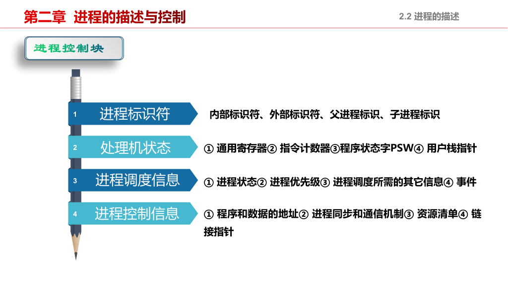

# 操作系统

# 二

## **[[2为什么程序并发执行会产生间断性特征]]**

程序并发执行产生间断性特征，其根本原因在于**资源的竞争与共享**以及**操作系统对CPU时间的调度机制**。

程序并发执行产生间断性特征，其根本原因在于**资源的竞争与共享**以及**操作系统对CPU时间的调度机制**。这种间断性是并发执行的核心特征之一，也是实现多任务处理的基础。

具体来说，间断性特征主要由以下几个方面导致：

### 1. 时间片轮转调度（Time-Slicing）

现代操作系统普遍采用**抢占式调度**策略。为了公平地让多个进程或线程共享CPU资源，操作系统会将CPU的执行时间划分为很短的时间片段（称为“时间片”），通常为几毫秒到几十毫秒。

- **过程**：一个程序开始执行，运行一段时间片后，即使任务未完成，操作系统也会强制暂停它，将CPU分配给其他等待执行的程序。
- **结果**：每个程序的执行被分割成多个不连续的片段，呈现出“走走停停”的间断性。

### 2. 资源竞争与等待
并发执行的程序通常需要访问共享资源，如I/O设备（磁盘、网络）、内存、文件等。当某个程序请求的资源正被其他程序占用或处于不可用状态时，它必须等待。

- **例子**：一个程序在执行过程中发起一个磁盘读取操作。由于I/O操作速度远慢于CPU，该程序会被阻塞（进入等待状态），CPU转而执行其他程序。
- **结果**：该程序的执行流程被I/O等待中断，待资源可用后才能继续，形成明显的执行间断。

### 3. 同步与互斥机制
当多个程序或线程访问共享数据时，为保证数据一致性，必须使用同步机制（如互斥锁、信号量）。如果一个程序试图获取已被其他程序持有的锁，它将被阻塞，直到锁被释放。

- **结果**：程序的执行流因等待锁而被迫中断，表现出间断性。

### 4. 外部事件中断
并发程序的执行还可能被外部事件打断，如用户输入、网络数据到达、硬件中断等。操作系统会暂停当前程序，优先处理这些中断。

- **结果**：程序的执行被强制中断，处理完中断后才可能恢复，造成执行的不连续。

---

### 总结
并发执行的间断性本质上是**多任务环境下资源有限性和操作系统调度策略共同作用的结果**。它使得每个程序的执行不再是连续的、独占的，而是被分割成多个片段，在时间上交替进行。这种“间断性”虽然增加了程序执行的复杂性（如需要考虑同步、死锁等问题），但正是它实现了资源的高效利用和系统的多任务处理能力。

## 3程序并发执行时为什么会封闭性和可再现性

您提到的“时区封闭性”和“可再现性”在操作系统和程序并发执行的语境中，通常更准确的术语是：

*   **封闭性**（而非“时区封闭性”）
*   **可再现性**

在程序**顺序执行**时，这两个特性是成立的。但在**并发执行**时，它们会**丧失**。这正是并发执行带来的主要挑战之一。

下面详细解释为什么在并发执行时会**失去**封闭性和可再现性：

---

### 1. 封闭性（Encapsulation / Isolation）

*   **定义**：指程序在执行过程中，其执行环境是封闭的，不受外界影响。程序的执行仅由其自身的输入决定，不会被其他程序干扰。
*   **顺序执行时**：成立。一个程序独占系统资源，运行期间没有其他程序与之交互或竞争资源。
*   **并发执行时为何丧失**：
    *   **资源共享**：多个程序（或进程/线程）同时运行，会竞争使用CPU、内存、文件、I/O设备等公共资源。
    *   **相互影响**：一个程序的行为（如修改共享变量、占用I/O设备）会直接影响其他并发程序的执行状态和结果。
    *   **外部干扰**：程序A的执行速度、资源获取情况会受到程序B的执行状态影响。例如，程序B长时间占用CPU，会导致程序A的响应变慢。

    **结论**：并发环境下，程序的执行环境不再是封闭的，它暴露在其他并发实体的影响之下，因此**封闭性被破坏**。

---

### 2. 可再现性（Reproducibility）

*   **定义**：指对于相同的输入，程序每次执行都应产生相同的结果。这是程序正确性和调试的基础。
*   **顺序执行时**：成立。执行路径是确定的，输入相同则输出必然相同。
*   **并发执行时为何丧失**：
    *   **执行的不确定性**：并发程序的执行顺序由操作系统调度器决定，而调度具有**随机性**（如时间片轮转、中断时机、资源可用性等）。这导致多个程序或线程的**相对执行速度和交叉顺序（interleaving）是不确定的**。
    *   **竞态条件（Race Condition）**：当多个线程或进程访问和操作**共享数据**，且最终结果依赖于它们执行的**精确时序**时，就产生了竞态条件。

    **经典例子**：
    假设有两个线程A和B，都执行 `counter = counter + 1`，初始值为0。
    *   **理想顺序**：A执行完，B执行完 → 结果为2。
    *   **交错执行**：
        1. A读取counter (0)
        2. B读取counter (0)
        3. A计算 0+1=1，写入counter
        4. B计算 0+1=1，写入counter
        → 结果为1，而非预期的2。

    每次运行时，A和B的指令交错顺序可能不同，导致结果不一致。

    **结论**：由于执行顺序的不确定性和竞态条件的存在，即使输入相同，多次并发执行也可能产生不同的结果，因此**可再现性被破坏**。

---

### 总结

| 特性         | 顺序执行 | 并发执行 | 原因                                                 |
| :----------- | :------- | :------- | :--------------------------------------------------- |
| **封闭性**   | ✅ 成立   | ❌ 丧失   | 程序间共享资源，相互影响，执行环境不封闭。           |
| **可再现性** | ✅ 成立   | ❌ 丧失   | 执行顺序由调度器决定，具有不确定性，易产生竞态条件。 |

> **关键点**：并发执行的“间断性”（如上一问所述）正是导致**失去可再现性**的直接原因。因为程序的执行被频繁中断和恢复，其与其他程序的**指令交叉顺序**变得不可预测，从而破坏了可再现性。

要解决这些问题，需要引入**同步机制**（如互斥锁、信号量、原子操作）来保护共享资源，协调执行顺序，从而在一定程度上恢复程序行为的确定性和可预测性。

## 在操作系统中为什么要引入进程？会有怎样的影响

**无法支持多任务**** **缺乏资源管理与隔离**

在操作系统中引入“**进程**”（Process）是一个根本性的设计决策，它解决了早期简单系统在多任务处理、资源管理和程序隔离方面的核心难题。其引入的必要性、目的以及带来的深远影响如下：

---

### 一、为什么要引入进程？

在没有进程概念的早期系统中，程序是直接加载到内存并顺序执行的，这带来了诸多严重问题：

1.  **无法支持多任务**：
    *   系统一次只能运行一个程序，用户必须等待一个程序完全结束后才能运行下一个，效率极低。
    *   **需求**：用户希望同时听音乐、写文档、浏览网页。进程的引入使得**并发执行**多个程序成为可能。

2.  **缺乏资源管理与隔离**：
    *   所有程序共享同一内存空间和硬件资源，一个程序的错误（如越界写内存）可能破坏其他程序或操作系统本身，导致系统崩溃。
    *   **需求**：需要一种机制来**隔离**不同程序，保护系统稳定性和用户数据安全。

3.  **程序状态无法保存与恢复**：
    *   程序执行时，其中断（如等待I/O）后无法有效保存其执行上下文（如寄存器状态、程序计数器），恢复时容易出错。
    *   **需求**：需要一个能**封装程序执行状态**的实体，以便在中断后能准确恢复执行。

4.  **无法实现公平调度**：
    *   没有明确的调度单位，操作系统难以公平、高效地分配CPU时间。

**因此，进程被引入作为操作系统进行资源分配、调度和管理的基本单位，以解决上述问题。**

---

### 二、进程的定义与核心要素

一个**进程**是**一个程序在某个数据集上的一次执行过程**，是操作系统进行资源分配和调度的独立单位。

一个进程通常包含：
*   **程序代码**（可执行文件）
*   **数据**（全局变量、堆、栈）
*   **进程控制块**（PCB, Process Control Block）：操作系统用来管理进程的核心数据结构，包含：
    *   进程ID (PID)
    *   程序计数器（PC）
    *   寄存器状态
    *   内存指针（代码、数据、堆、栈的起始地址）
    *   状态（就绪、运行、阻塞等）
    *   优先级、资源清单、账户信息等

---

### 三、引入进程带来的积极影响

1.  **实现多道程序设计和并发执行**：
    *   操作系统可以在内存中同时加载多个进程，通过**时间片轮转**等方式在它们之间快速切换，给用户“同时运行多个程序”的错觉，极大提高了CPU和系统资源的利用率。

2.  **提供独立的执行环境与资源隔离**：
    *   每个进程拥有**独立的虚拟地址空间**，一个进程的内存操作不会直接影响其他进程。
    *   操作系统通过PCB管理每个进程的资源（内存、文件、I/O设备），实现资源的分配、回收和保护。

3.  **支持程序的动态执行与状态管理**：
    *   进程的**生命周期**（创建、就绪、运行、阻塞、终止）清晰可管理。
    *   当进程因I/O等待或时间片用完被中断时，其**上下文**（PCB中的信息）被保存；恢复时，操作系统根据PCB恢复其状态，确保程序能从中断点继续正确执行。

4.  **实现公平和高效的调度**：
    *   进程是调度的基本单位。操作系统可以根据优先级、时间片等策略在多个就绪进程间选择下一个执行的进程，实现CPU资源的公平高效分配。

5.  **增强系统稳定性和安全性**：
    *   进程间的隔离机制（如内存保护）防止了一个进程的崩溃或恶意行为波及整个系统或其他进程。

---

### 四、引入进程带来的挑战与开销

尽管进程带来了巨大好处，但也引入了新的复杂性和开销：

1.  **上下文切换开销**：
    *   在进程间切换时，操作系统必须保存当前进程的PCB，并加载下一个进程的PCB，这个过程称为**上下文切换**。
    *   上下文切换涉及内存访问、寄存器操作等，消耗CPU时间。进程越多，切换越频繁，系统开销越大。

2.  **进程间通信（IPC）复杂**：
    *   由于进程地址空间隔离，它们之间**不能直接共享内存**。
    *   如果需要协作（如一个进程处理数据，另一个显示结果），必须通过复杂的IPC机制（如管道、消息队列、共享内存、套接字等），增加了编程复杂度。

3.  **资源占用较大**：
    *   每个进程都需要独立的地址空间和PCB，创建和销毁进程的开销较大，内存占用也较多。

---

### 五、后续发展：线程的引入

为了缓解进程开销大、通信难的问题，操作系统又引入了更轻量级的执行单位——**线程**（Thread）。一个进程可以包含多个线程，这些线程**共享**进程的地址空间和资源，但拥有独立的执行栈和寄存器状态。线程间的切换和通信开销远小于进程。

---

### 总结

| 方面         | 影响                                                         |
| :----------- | :----------------------------------------------------------- |
| **必要性**   | 实现多任务、资源隔离、状态管理、公平调度。                   |
| **积极影响** | 支持并发、提高资源利用率、增强系统稳定性、提供独立执行环境。 |
| **负面影响** | 带来上下文切换开销、进程间通信复杂、资源占用较大。           |

**总而言之，引入进程是操作系统发展史上的里程碑。它使得现代多任务、多用户操作系统成为可能，极大地提升了计算机的效率和用户体验，尽管也带来了管理和性能上的新挑战。**

## **.试说明PCB的作用具体表现在哪几个方面?为什么说PCB是进程存在的唯一标志**

-   **PCB的作用**：是操作系统管理进程的“总控信息表”，负责记录状态、保存上下文、管理资源、支持调度与通信。
-   **PCB是进程存在的唯一标志**：因为进程的生命周期完全由PCB的创建与撤销决定，且操作系统通过PCB来识别、管理和调度进程。**没有PCB，就没有操作系统意义上的“进程”**。

### PCB的作用具体表现在哪几个方面？

**PCB（Process Control Block，进程控制块）** 是操作系统内核中用于描述和管理进程的数据结构，是操作系统对进程进行控制和调度的核心依据。其作用主要体现在以下几个方面：

1.  **进程状态的记录与管理**  
    PCB中保存了进程的当前状态（如运行、就绪、阻塞等）。操作系统通过读取PCB中的状态信息来了解进程的执行情况，并根据调度算法决定是否切换进程或唤醒阻塞进程。

2.  **程序执行上下文的保存与恢复**  
    当进程因时间片用完或等待资源而被中断时，操作系统会将当前CPU的寄存器值（如程序计数器PC、通用寄存器、栈指针等）保存到PCB中；当该进程重新获得CPU时，操作系统再从PCB中恢复这些寄存器值。这保证了进程能够从中断点继续执行，实现**执行的连续性**。

3.  **资源信息的登记与管理**  
    PCB记录了进程所占用或已申请的资源，如：
    - 内存空间的起始地址和大小
    - 打开的文件列表
    - 使用的I/O设备
    - 信号量、锁等同步对象  
    这使得操作系统能够有效分配、回收和监控资源，防止资源泄漏。

4.  **调度信息的存储**  
    PCB中包含进程的调度信息，如：
    - 进程优先级
    - 时间片剩余值
    - 调度队列指针  
    操作系统依据这些信息进行进程调度，决定哪个进程获得CPU。

5.  **组织进程的运行结构**  
    PCB中通常包含指向进程代码段、数据段、堆栈的指针，以及用于组织就绪队列、阻塞队列的链表指针（如`next`指针）。这使得操作系统能够高效地管理和遍历所有进程。

6.  **提供进程间通信与同步的支持**  
    PCB中可能包含用于进程间通信（IPC）的信号量、消息队列标识符，或同步机制（如互斥锁、条件变量）的状态信息，支持进程协作。

---

### 为什么说PCB是进程存在的唯一标志？

这个论断可以从以下几个层面理解：

1.  **PCB是进程存在的“身份证”**  
    在操作系统中，只要一个进程被创建，内核就必须为其分配一个唯一的PCB。只要PCB存在，操作系统就认为该进程“存在”；当进程终止时，操作系统会回收其资源并**撤销其PCB**。一旦PCB被销毁，该进程就从系统中彻底消失。因此，**PCB的存在与否，直接决定了进程的存在与否**。

2.  **PCB封装了进程的全部管理信息**  
    进程的执行状态、资源使用、调度属性等所有管理信息都集中存储在PCB中。操作系统不直接操作“进程”，而是通过操作PCB来管理进程。没有PCB，操作系统就无法识别和管理该进程。

3.  **PCB是进程动态性的体现**  
    进程是程序的一次动态执行过程，而程序本身是静态的代码文件。PCB正是这个“动态性”的载体——它记录了程序执行过程中的实时状态和上下文。因此，**PCB是连接静态程序与动态执行过程的桥梁**。

4.  **操作系统通过PCB组织和调度进程**  
    操作系统维护着一个PCB表（或链表、队列），所有活动进程的PCB都登记在其中。调度器通过遍历PCB队列来选择下一个运行的进程。可以说，**操作系统眼中“进程”的集合，就是所有PCB的集合**。

---

### 总结

- **PCB的作用**：是操作系统管理进程的“总控信息表”，负责记录状态、保存上下文、管理资源、支持调度与通信。
- **PCB是进程存在的唯一标志**：因为进程的生命周期完全由PCB的创建与撤销决定，且操作系统通过PCB来识别、管理和调度进程。**没有PCB，就没有操作系统意义上的“进程”**。

## **进程控制块的组织方式有哪几种?**

进程控制块（PCB, Process Control Block）是操作系统管理进程的核心数据结构。为了高效地查找、遍历和管理所有进程的PCB，操作系统会采用特定的数据结构将它们组织起来。常见的组织方式主要有以下几种：

***

### 1. 线性表方式（Linear List）

* **原理**：将系统中所有进程的PCB组织在一个**线性表**（数组或链表）中。
* **特点**：
  * **实现简单**：结构直观，易于编程实现。
  * **查找效率低**：当系统中进程数量很多时，查找某个特定PCB（如按PID查找）需要遍历整个表，时间复杂度为 O(n)。
  * **适用于进程数量少的系统**。
* **适用场景**：小型或简单的操作系统。

***

### 2. 链接方式（Linked List）

* **原理**：将具有相同状态的进程的PCB链接成一个**链表**。通常会设置多个链表，例如：
  * 就绪队列（Ready Queue）
  * 阻塞队列（Blocked Queue）——可能按等待事件进一步细分
  * 运行队列（Running Queue，通常只有一个进程）
* **特点**：
  * **便于状态管理**：操作系统可以快速找到所有处于某一状态的进程（如所有就绪进程）。
  * **调度效率高**：调度器只需操作就绪队列的头尾即可。
  * **插入/删除方便**：进程状态改变时（如从运行变为阻塞），只需将其PCB从一个链表移至另一个链表。
  * **需要额外指针**：每个PCB中需包含指向下一个PCB的指针（`next` 指针）。
* **示例**：
  <pre style="background: none"><code class="language-c" data-language="c" identifier="0530d6843338446e80203c2cd5ae2d7a-0" index="0" total="1">struct pcb {
      int pid;
      int state; // 0: 运行, 1: 就绪, 2: 阻塞
      // ... 其他字段
      struct pcb *next; // 指向下一个同状态PCB
  };</code></pre>

***

### 3. 索引方式（Indexed / Index Table）

* **原理**：为每种进程状态建立一张**索引表**，表中每一项是一个指向PCB的**指针**。所有PCB通常存放在一个连续的数组中。
  * 例如：就绪索引表、阻塞索引表。
* **特点**：
  * **查找速度快**：通过索引表可以快速定位到某一状态的所有PCB。
  * **节省空间**：相比链接方式，索引表本身不存储PCB数据，只存储指针。
  * **适合状态种类少、进程数量多的系统**。
  * **需要维护索引表**：进程状态改变时需更新索引表。
* **与链接方式的区别**：
  * 链接方式是**动态链表**，PCB之间通过指针链接。
  * 索引方式是**静态数组 + 指针表**，PCB位置相对固定，通过索引表间接组织。

***

### 4. 多级反馈队列（Multi-level Feedback Queue, MFQ）

* **原理**：这是链接方式的一种**高级扩展**，用于实现复杂的调度算法（如时间片轮转 + 优先级调度）。
  * 设置多个就绪队列，每个队列有不同的优先级和时间片大小。
  * 高优先级队列时间片小，低优先级队列时间片大。
  * PCB根据进程行为（如是否用完时间片）在不同队列间移动。
* **特点**：
  * **调度策略灵活**：能兼顾响应时间和吞吐量。
  * **组织复杂**：需要维护多个队列和迁移逻辑。
  * **现代操作系统常用**：如Linux的CFS（虽然实现不同，但思想类似）。

***

### 总结对比

| 组织方式         | 数据结构       | 主要优点               | 主要缺点      | 适用场景             |
| :--------------- | :------------- | :--------------------- | :------------ | :------------------- |
| **线性表**       | 数组/链表      | 实现简单               | 查找慢 (O(n)) | 进程少的简单系统     |
| **链接方式**     | 链表（按状态） | 状态管理方便，调度高效 | 需额外指针    | 通用操作系统（主流） |
| **索引方式**     | 数组 + 指针表  | 查找快，节省空间       | 需维护索引表  | 进程多、状态少的系统 |
| **多级反馈队列** | 多个链表/队列  | 调度灵活高效           | 实现复杂      | 现代通用操作系统     |

> **补充说明**：现代操作系统（如Linux）通常采用**链接方式**或其变种（如使用红黑树等更高效的数据结构）来组织PCB，因为它在管理效率和实现复杂度之间取得了良好平衡。

