# 进程

-   是计算机程序关于某数据几何上的一次运行活动
-   ==系统进行资源分配的基本单位==
-   是操作系统结构的基础

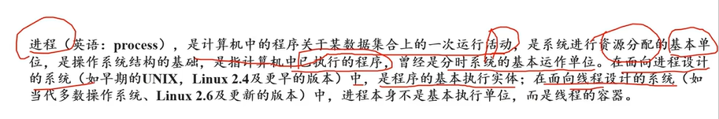

现在的进程几乎是线程的容器

## 进程四态

-   动态性
-   并发性
-   独立性
-   异步性

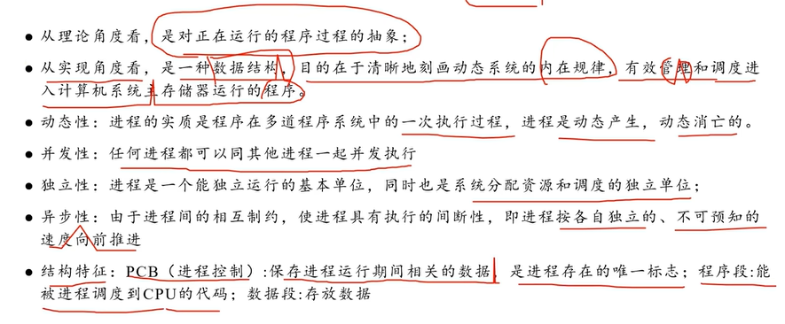

## 进程状态

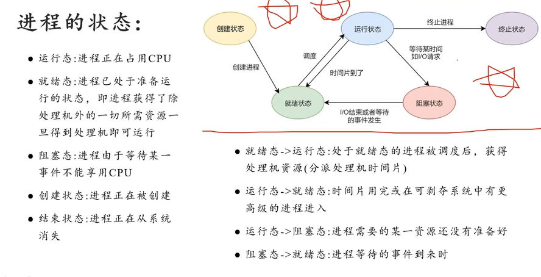

## 调度

-   分配cpu

### 分类

-   高级（作业调度）
-   中级（内存调度）
-   低级（进程调度）

-   掠夺式
-   非掠夺式

-   cpu利用率

### 算法

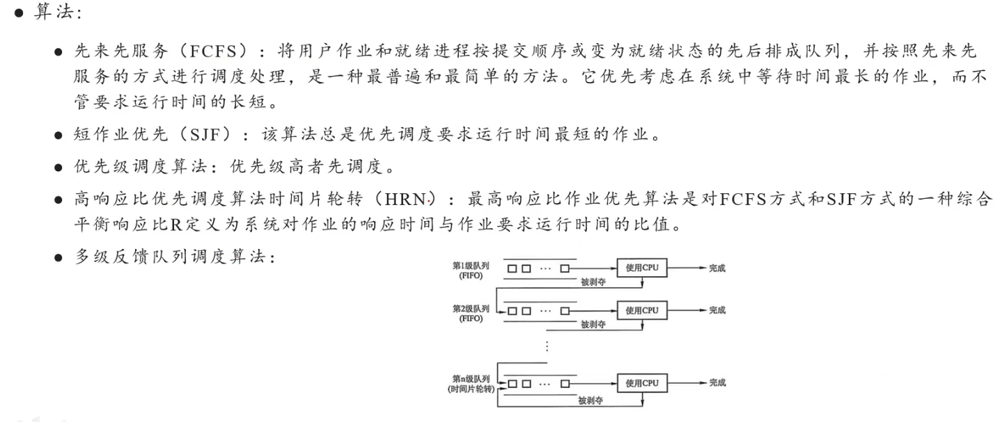

-   先来先服务（对列list）
-   短作业优先 （）
-   优先级
-   高相应比 
-   时间片轮转
-   多级反馈

### 作业和进程

| **步骤**     | **操作系统视角下的操作**                                     | **概念对应**        |
| ------------ | ------------------------------------------------------------ | ------------------- |
| **用户提交** | 用户点击运行或输入 `./a.out` 命令                            | **整个 Job** 的开始 |
| **作业调度** | 操作系统将编译和执行这个程序的所有步骤视为一个整体的**作业**，并将其加入等待队列。 | **Job Scheduling**  |
| **执行过程** | * 启动**编译程序**（Process 1）                              | 进程创建            |
|              | * 启动**链接程序**（Process 2）                              | 进程创建            |
|              | * 启动**最终可执行文件**（Process 3）                        | 进程创建            |
| **结果输出** | 程序输出斐波那契数列的结果到屏幕。                           | Job 完成            |

一个**作业**是一个**宏观**的概念，代表**用户请求的全部工作**。一个**进程**是一个**微观**的概念，代表**程序的一次执行实体**，是操作系统进行**CPU调度**的基本单位。一个**作业**可以由**一个或多个进程**组成。

## 进程同步

### 原因

协调进程之间的相互制约关系（一读一写）

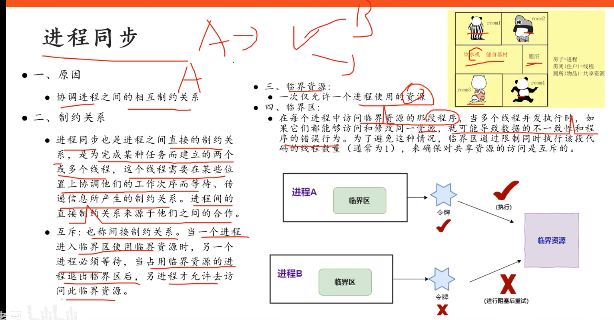

 

## 临界区的作用

-   保护共享资源（只有一个进程可以访问和修改共享资源）
-   防止竞态条件
-   程序稳定性

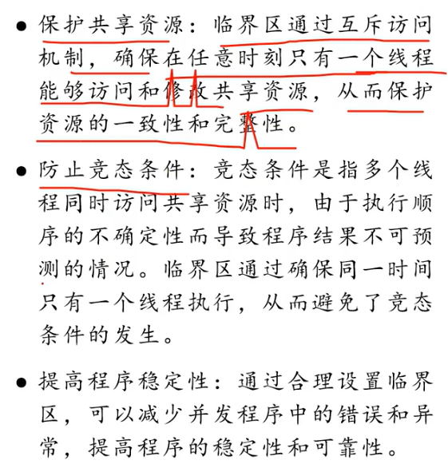

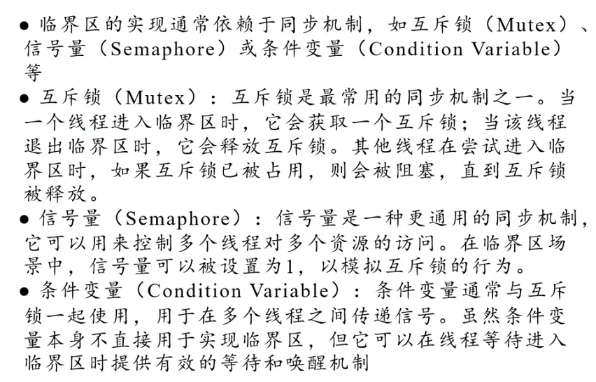

## 临界区互斥

-   空闲让进
-   忙则等待
-   有限等待
-   让权等待

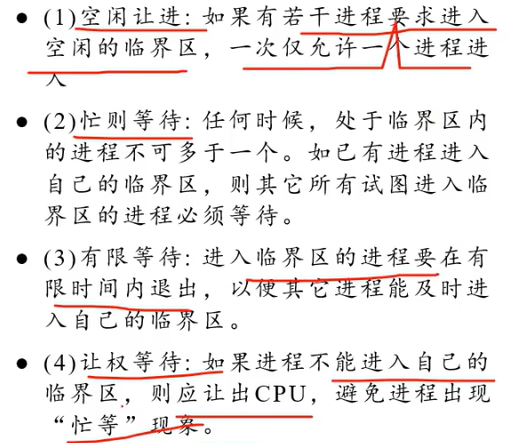

### PV

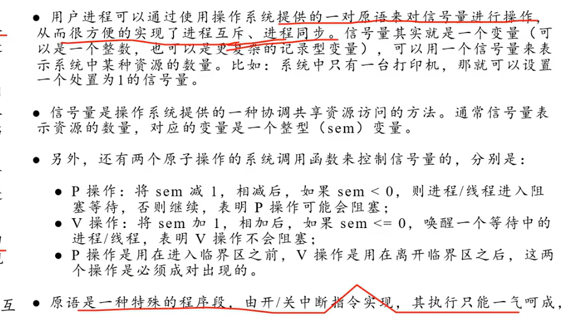

### 生产者和消费者

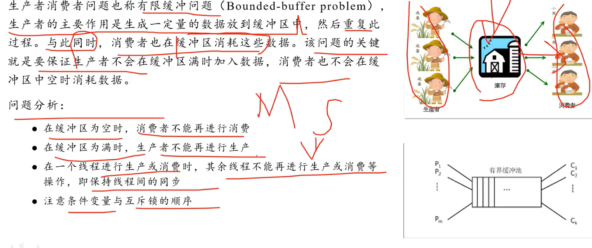

## 死锁

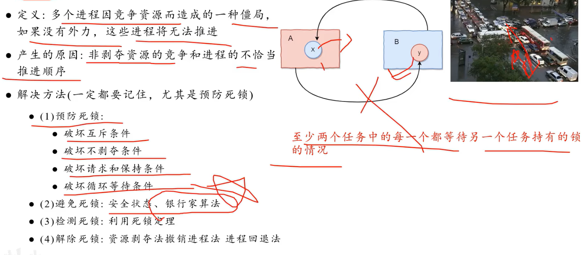

-   银行家算法