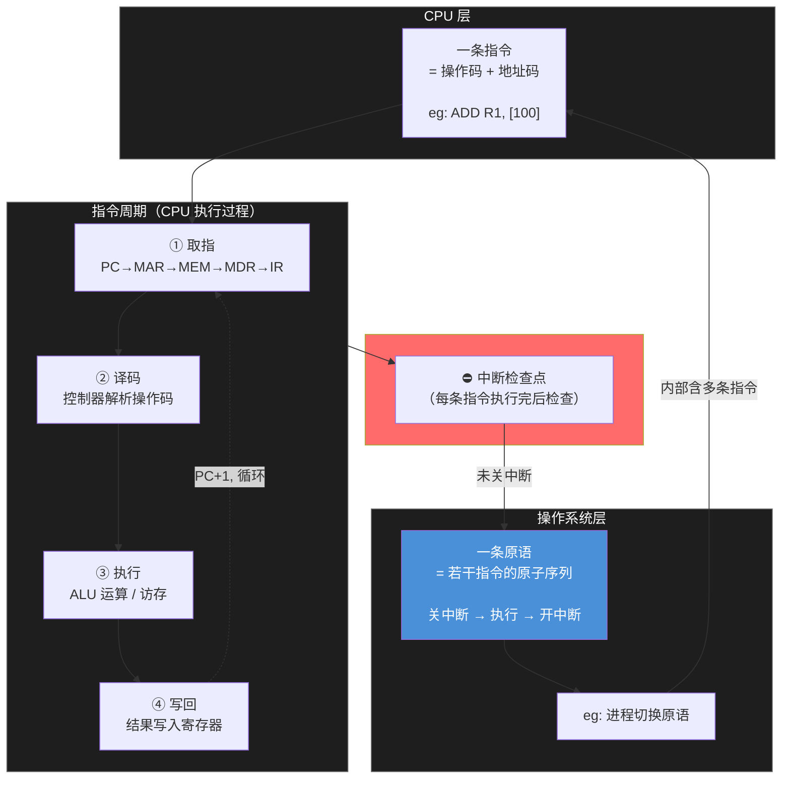
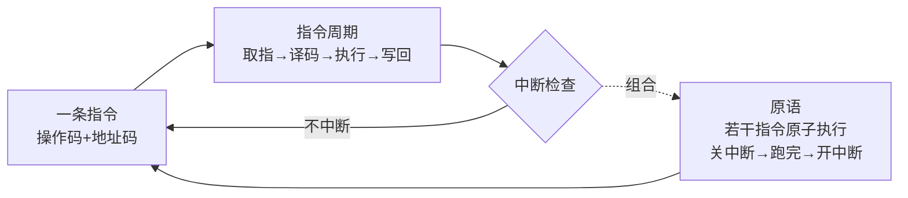

在计组中，硬件的运行被严格划分为“微观到宏观”的层级。为了帮你彻底理清，我们从**时序（时间）**、**数据/控制（空间）**以及**存储系统**三个最核心的维度来为你做完整总结，并排出清晰的大小关系。

## 一、 时序维度：从纳秒到毫秒（时间大小关系）

CPU 执行任务时，时间是被时钟信号切割的。它们的大小关系如下：

$$\text{时钟周期（节拍）} < \text{机器周期（CPU周期）} < \text{指令周期} < \text{总线周期}$$

### 1. 时钟周期（Clock Cycle / 节拍）

- **定义：** 主频的倒数（如 $4\text{ GHz}$ 的 CPU，时钟周期就是 $0.25\text{ ns}$）。
    
- **地位：** 计算机中**最基本的、最小的时间单位**。CPU 内部的一切微操作都在时钟脉冲的触发下发生。
- 这里可以完成把PC内的地址放到MAR
    

### 2. 机器周期（Machine Cycle / CPU周期）

- **定义：** 处于时钟周期和指令周期之间。通常把**从内存中读取一条指令字的最短时间**定义为一个机器周期。
    
- **关系：** **一个机器周期 = 若干个时钟周期。**
- 取指、间址、译码、执行、写回，每个都需要一个机器周期
### 3. 指令周期（Instruction Cycle）
    
- **定义：** CPU 取出并执行完一条机器指令所需要的全部时间。
    
- **关系：** **一个指令周期 = 若干个机器周期。**（例如：取指周期 + 间址周期 + 执行周期 + 中断周期）。
- 一条指令在一个指令周期完成
    

### 4. 总线周期（Bus Cycle）

- **定义：** CPU 通过外部总线对内存或 I/O 设备进行一次成功的数据读/写操作所需要的时间。
    
- **考点：** 它是系统级的时间单位。在现代流水线 CPU 中，总线周期往往比 CPU 内部的机器周期要慢得多。
    

## 二、 控制与结构维度：从电路到程序（结构大小关系）

在 CPU 的控制单元（CU）设计中，尤其是**微程序控制器**这一章，有一组极度容易混淆的“微”字辈概念。它们的大小关系如下：

$$\text{微操作} < \text{微指令} < \text{机器指令} \approx \text{微程序} < \text{程序}$$

### 4. 机器指令（Machine Instruction）

- **定义：** 汇编语言对应的一条代码（如 `MOV AX, BX`），是计算机硬件能直接识别并执行的二进制代码。
    

### 5. 程序（Program）

- **定义：** 解决某个特定问题而设计的**机器指令序列**，存储在主内存中。
    

## 三、 存储与数据维度：从位到块（空间大小关系）

在数据的存储和传输（特别是 Cache 和主存映射）中，大小关系直接决定了地址亲和度和硬件命中率。

$$\text{位 (bit)} < \text{字节 (Byte)} < \text{字 (Word)} < \text{Cache行 (Block / 块)}$$

### 1. 位（bit）与字节（Byte）

- **关系：** $1\text{ Byte} = 8\text{ bit}$。计算机存储的基本计量单位。
    

### 2. 字（Word）与字长

- **定义：** CPU 内部寄存器、ALU、数据总线一次性能直接处理的二进制数的位数。
    
- **关系：** 根据机器不同而不同。如果是 64 位处理器，则 $1\text{ 字} = 64\text{ bit} = 8\text{ Byte}$。
    

### 3. Cache行 / 主存块（Block / Line）

- **定义：** Cache 与主存进行**数据交换的最小单位**（通常是 $64\text{ Byte}$）。
    
- **考点（极其重要）：** 当 CPU 去内存拿一个字（Word）的数据时，硬件不会只拿这一个字，而是把包含这个字在内的**一整块（Block）数据**全部搬进 Cache 的一行（Line）里。
    

## 💡 终极大总结：一张表带你闭眼通关

|**维度**|**概念（从小到大排序）**|**核心记忆点**|**408 常见连线/考点**|
|---|---|---|---|
|**时序（时间）**|时钟周期 $\rightarrow$ 机器周期 $\rightarrow$ 指令周期|节拍 $\rightarrow$ 某阶段 $\rightarrow$ 完整指令|“流水线各个段的时间取决于**最慢**那个”|
|**控制（空间）**|微操作 $\rightarrow$ 微指令 $\rightarrow$ 微程序（机器指令）|硬件动作 $\rightarrow$ 并行控制 $\rightarrow$ 软件接口|“机器指令在**主存**，微程序在**控存(CM)**”|
|**数据（存储）**|位 $\rightarrow$ 字节 $\rightarrow$ 字 $\rightarrow$ 块（行）|$1\text{b} \rightarrow 8\text{b} \rightarrow$ 机器字长 $\rightarrow$ 交换单位|“Cache 映射时，地址码通常拆分为：**块号 + 块内地址**”|