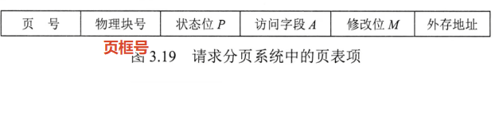
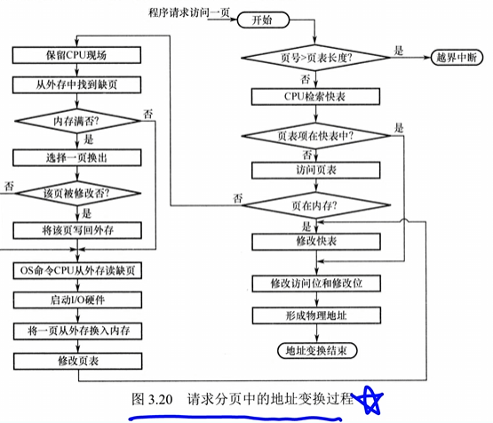
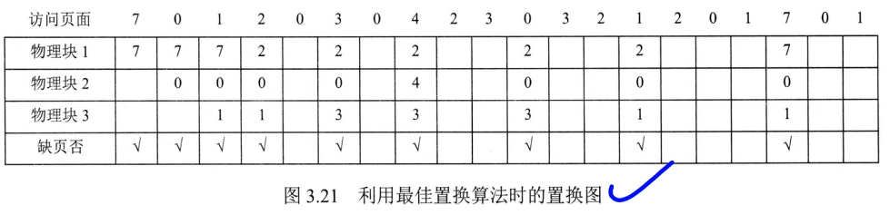
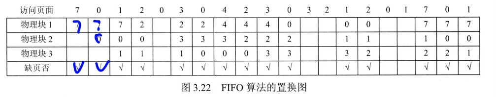
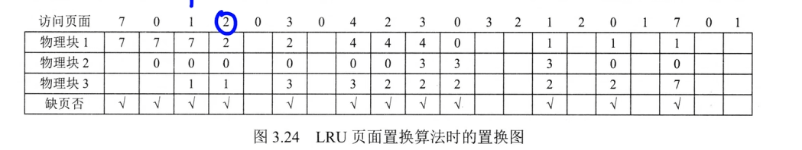
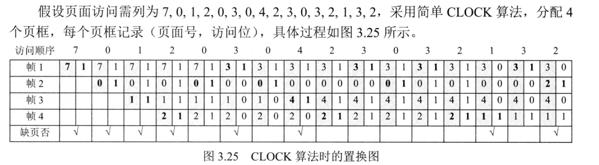

# 传统存储管理方式的特征

**多道程序设计**，它们有两个共同特征：

1. **一次性**：作业必须一次性全部装入内存后才能运行。问题：
   - 作业过大无法装入 → 无法运行
   - 大量作业请求时内存不足 → 只能少数作业先运行 → **并发度下降**

2. **驻留性**：作业装入内存后一直驻留，任何部分不会被换出，直至运行结束。运行中的进程常因等待 I/O 而被阻塞，长时间处于等待状态。

> 许多暂未使用或暂时不用的代码和数据仍占据大量内存，而急需运行的作业却因内存不足无法装入，造成**内存资源严重浪费**。这正是引入虚拟内存的根本原因。

## [程序访问的局部性原理](3第三章存储.md#程序访问的局部性原理)
时间局部性
空间局部性
# 虚拟存储器的定义和特征

基于**局部性原理**，程序装入时仅需将当前运行所需的**少数页面或段**装入内存，其余部分暂留外存，即可启动执行。

**1. 请求调页**
在程序执行过程中，若所访问的信息不在内存中，操作系统会**自动将其从外存调入内存**，然后继续执行，这一机制称为**请求调页**（或请求调段）。

**2.页面置换**
当内存空间不足时，操作系统会把**暂时不用的信息换出到外存**，以腾出空间存放即将调入的内容，这一机制称为**页面置换**（或段置换）。

> **请求调页 + 页面置换**协同工作，使用户感觉系统提供了比实际物理内存大得多的**逻辑地址空间**，这是虚拟内存管理的核心思想。整个过程对用户**透明**。

**虚拟存储器**
系统为用户提供了一个逻辑上远大于物理内存的地址空间

## 虚拟存储器的三个特征

1. **多次性**：无需一次性全部装入，可分多次调入内存（按需加载）
2. **对换性**：作业运行时允许换入换出，不要求一直驻留内存
3. **虚拟性**：从逻辑上扩充内存容量，使用户感觉拥有远大于物理内存的可用空间

> 多次性 + 对换性是手段，**虚拟性**是本质特征和根本目标。

## 虚拟内存的技术实现
1. 请求分页存储管理
2. 请求分段存储管理
3. 请求段页式存储管理

>这里全是**请求**....上一节都是基础...[基本分页管理](3.1.3分页，分段管理.md#基本分页管理)

## 请求分页管理方式
在运行过程中
1. 所访问的页面不在内存中，通过请求调页功能将其从外村调入
2. 当内存空间不足时，通过页面置换功能将暂时不用的页面换出到外存

### 页表机制

对比分页管理新增了
1. 状态位P：标记是否已经调入内存
2. 访问字段A
3. 修改位M(脏位)：标记是否被修改过，决定换出时是否徐写回外存
4. 外存地址：指示在外存的存放地址

### 缺页中断机构（页故障）
当进程访问的页面尚未调入内存时，硬件会自动触发**缺页中断**，由操作系统处理：

- 内存有**空闲页框** → 分配页框，将缺页从外存装入，更新页表
- 内存**无空闲页框** → 置换算法选一页淘汰；若该页被修改过（脏页），需写回外存，否则直接丢弃

> 页面调入涉及磁盘 I/O，耗时较长，系统可在此期间调度其他进程。调入完成后，**重新执行引发缺页的那条指令**。

缺页中断的两个特点：**内中断**

1. **在指令执行期间触发**：由当前指令的地址访问直接引发，而非指令执行完毕之后（与外部中断不同）
2. **一条指令可能引发多次缺页**：如 `copy A to B`，指令本身及两个操作数各自可能跨页，最坏情况下一条指令可触发 **6 次**缺页中断（二地址指令引发多次缺页中断）

1

1. 检索快表
	1. 命中：从表项取出该页的物理块号，访问位 = 1
2. 未命中快表：需要访问页表，
	1. 若在内存中（状态位 = 1）取出物理块号，并放入快表
	2. 若慢，则淘汰一项
3. 未命中页表：缺页中断，
	1. 将页表从外存调入内存，更新页表和快表
4. 将获得的物理块号和页内地址拼接，形成物理地址

## 页框分配
解决以下问题：
1. 确定最小页框数
2. 每个进程分配的页框数是可变的还是固定的
3. 为不同进程分配页框时，按照平均分配还是进程大小比例分配

### 最小页框数

保证进程能正常运行所需的**最少页框数**，与**硬件结构**有关（指令格式、寻址方式）：

- 单地址指令 + 直接寻址 → **2 个**（指令页 + 数据页）
- 间接寻址 → **3 个**（指令页 + 指针页 + 数据页）
- 复杂指令各操作数跨页 → 最坏需 **6 个**（如 `copy A to B`，指令和两个操作数各跨两页）

> 若分配页框少于最小值，进程将**无法执行**。

## 驻留集

进程实际分配到内存中的**页框集合**，由 OS 动态决定。
是进程已装入内存页面的集合

- 驻留集**太小** → 缺页频繁，性能下降
- 驻留集**太大** → 浪费内存，并发度降低

> **驻留集 ≥ 最小页框数**。

## 内存分配策略
**请求分页系统中**采用内存分配策略
1. 固定分配局部置换
2. 可变分配策略
**进行置换时**
3. 全局置换
4. 局部置换
### 固定分配局部置换

- **固定分配**：为每个进程分配**固定数量**的页框，运行期间保持不变
- **局部置换**：缺页时只能从自己已分配的页框中选一个换出，维持驻留集大小恒定

> 若初始分配页框太少 → 频繁缺页；分配太多 → 浪费内存、降低并发数。

**页框调入算法**
1. 平均分配算法
2. 按比例分配算法
3. 优先权分配算法

1. **平均分配**：将系统中所有空闲页框**均等**分配给每个进程
2. **按比例分配**：根据进程**大小比例**分配页框，进程越大分配越多
3. **优先权分配**：P216
### 可变分配全局置换

- **可变分配**：初始分配一定数量页框，运行时根据需求**动态调整**页框数
- **全局置换**：缺页时先从空闲页框队列获取；无空闲则从**整个内存**中选一页换出（不限于本进程）
每次缺页都要分配一个新页框

> 优点：灵活高效，能动态扩充驻留集。
> 缺点：若无调控，活跃进程可能不断抢占其他进程页框，导致其他进程频繁缺页甚至**抖动**，削弱并发能力。

### 可变分配局部置换
系统会动态调整页框数，但是只能跟自己换
- **可变分配**：系统根据进程**缺页率**动态调整页框数——缺页率高则增加，缺页率低则回收
- **局部置换**：缺页时只能从**本进程自身**页框中选一页换出，不影响其他进程

> 优点：避免进程间干扰，资源利用更高效。
> 缺点：实现复杂，需监控缺页率并动态调整。相比频繁调页的 I/O 开销，管理代价是值得的。

## 从何处调入页面

外存分为两部分：**文件区**（离散分配）和**对换区**（连续分配，I/O 更快）。
文件区：存放文件
对换区：存放换出页面

**情况一：对换区空间充足**

进程运行前将文件从文件区复制到对换区，缺页时全部从对换区调入，速度最快。

**情况二：对换区空间不足**

- 不会被修改的页面 → 从文件区调入，换出时无需写回
- 可能被修改的页面 → 换出时写入对换区，后续从对换区调入

**情况三：UNIX 方式**

进程相关文件始终保留在文件区。
未运行过的页面从文件区调入；
已被换出的页面从对换区调入。
若多个进程共享同一页面，已在内存则直接复用，无需重复调入。

# 页面置换算法
选择哪一页置换
50 53 59 22 23 
## 最佳置换（理想）OPT
选择淘汰以后永不使用或在最长时间内不再被访问的的页面
看未来


## 先进先出FIFO
先进先出页面置换算法选择淘汰最早进入内存的页面。
未使用局部性原理，性能差

会出现Belady的现象
增加物理块反而缺页次数增加

## 最近最久未使用LRU
替换最近最长时间未使用的页面

往前看
需要硬件支持，
开销大：需要维护历史并遍历查找
## 时钟CLOCK算法
51 55
### 简单的CLOCK（NRU）
1. 每个页面设置一个访问位，当首次装入或被访问设置为1
2. 构成一个循环队列，并维护一个替换指针，检查当前检查位置

淘汰：
1. 当指针指向的页面为0直接淘汰，指针++
2. 为1的话，置0，指针++


### 改进的CLOCK算法
多加入一个修改位M
淘汰的顺序：

基于**访问位A**和**修改位M**的高低组合将页面分为四类，**优先级从1类到4类逐级降低**：

> 淘汰优先级：**1类(A=0,M=0) → 2类(A=0,M=1) → 3类(A=1,M=0) → 4类(A=1,M=1)**。核心思想：先淘汰"未访问"的，再淘汰"未修改"的，尽量减少写回磁盘的开销。

1. **1类（A=0, M=0）**：最近未被访问且未被修改 → **最佳淘汰页**，直接丢弃无需写回
2. **2类（A=0, M=1）**：最近未被访问但已被修改 → **次佳淘汰页**，淘汰时需写回外存
3. **3类（A=1, M=0）**：最近已被访问但未被修改 → 可能再次被访问，暂不淘汰
4. **4类（A=1, M=1）**：最近已被访问且已被修改 → 最可能再次被访问，**最后淘汰**

**执行步骤**

1. **第一轮扫描**：寻找 A=0 且 M=0 的 1 类页面，找到即淘汰。此轮不修改访问位 A。
2. **第二轮扫描**：寻找 A=0 且 M=1 的 2 类页面，找到即淘汰。此轮将所有经过页面的 A 置 0。
3. **第三轮**：若前两轮失败，指针复位，重复第 1 步；若仍无 1 类页面则执行第 2 步，此时必能找到可淘汰页面。

# 抖动和工作集
**抖动：**
在页面置换过程中，最糟糕的情形是：刚刚换出的页面马上又要换入内存，而刚刚换入的页面又立即被换出。
抖动原因：
分配给进程的物理块数量太少
**工作集**
是指在某段时间间隔内，进程**实际访问过的页面集合**。工作集 W 由时间 t 和**窗口尺寸 Δ** 共同确定。

> 驻留集大小不应小于工作集大小，否则进程将频繁缺页。

例：访问序列 `... 3, 2, 2, 1, 1, 1, 3, 4, 5, 4, 4, 2, 1, 1, 3 ...`，Δ=5：
- t₁ 时刻窗口内 `{2,3,5,3,2}` → 工作集 `{2,3,5}`
- t₂ 时刻窗口内 `{4,2,1,1,3}` → 工作集 `{1,2,3,4}`

对于局部性好的程序，工作集大小通常远小于窗口尺寸 Δ。


# 虚拟存储器性能的影响因素
**缺页率**
1. 页面大小
2. 分配的物理块进程数
3. 页面置换算法
4. 写回磁盘的频率

> 脏页换出时若逐页写回，频繁 I/O 效率极低。系统引入**已修改换出页面链表**：脏页换出时暂不写回，挂入链表；积累一定数量后**批量写回**，大幅减少 I/O。若进程在批量写回前再次访问这些页面，直接从链表中复用，无需从外存调入。

5. 程序的局部化程度

> 程序局部性越好，缺页率越低。例如数组按行存储时应**按行访问**，按列访问会破坏空间局部性，导致缺页率异常升高。

# 题
1. 虚拟内存的大小由虚拟内存管理机制和操作系统决定，一般不同操作系统不同，和内存和硬盘没关系
2. 产生**缺页异常**时，需要把磁盘调度到内存，页和页框产生对应关系，修改页的存在位
3. 虚拟存储器包括部分硬盘


```plaintext
[ 进程的虚拟地址空间 ]             [ 页 表 ]             [ 物理内存 (主存) ]
+---------------------+         +-------------+         +---------------------+
| 虚拟页 0 (Page 0)    | --------> | 页0 -> 块3  | --------> | 物理块 0 (Frame 0)  |
|---------------------|         |-------------|         |---------------------|
| 虚拟页 1 (Page 1)    | --------> | 页1 -> 块0  | --------> | 物理块 1 (Frame 1)  |
|---------------------|         |-------------|         |---------------------|
| 虚拟页 2 (Page 2)    | ---\     | 页2 -> 块5  | ---\     | 物理块 2 (Frame 2)  |
+---------------------+     \   +-------------+     \   +---------------------+
                             \                       \->| 物理块 3 (Frame 3)  |
                              \------------------------>| ...                 |
                                                        | 物理块 5 (Frame 5)  |
                                                        +---------------------+
```