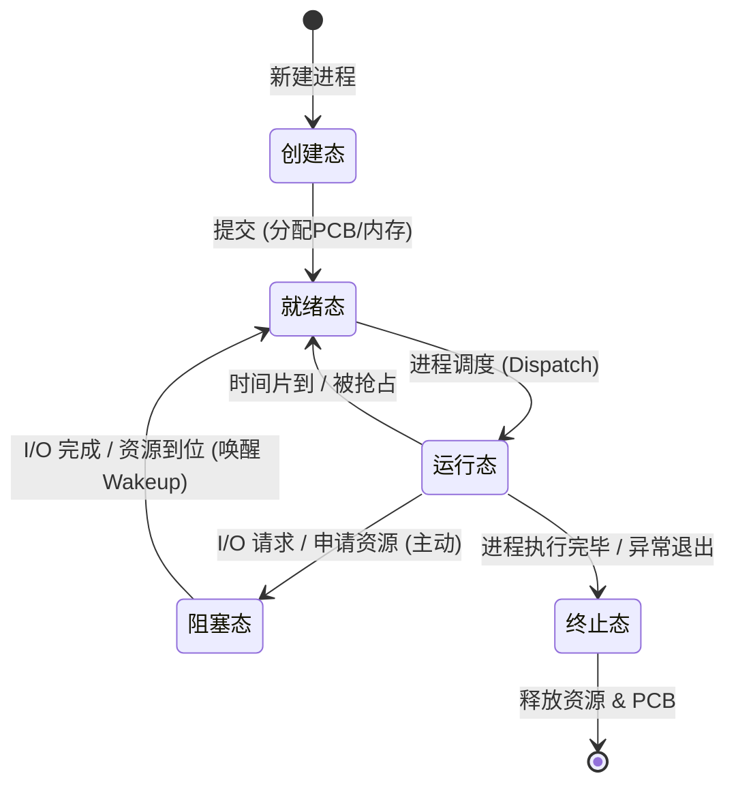

# 进程的状态与转换

进程在其生命周期中，由于与其他进程的相互制约以及系统运行环境的变化，其状态会不断发生转换。通常进程具有以下五种状态，其中前三种为基本状态。

1. **运行态**：进程正在 CPU 上执行。在单 CPU 中，任一时刻最多只有一个进程处于运行态。

2. **就绪态**：进程已获得除 CPU 外的所有必要资源，一旦获得 CPU，便可立即投入运行。系统中可能有多个就绪进程，通常组织为**就绪队列**。
**只缺少CPU**

3. **阻塞态**（等待态）：进程因等待某一事件（如资源可用、I/O 完成等）而暂停运行。此时即使 CPU 空闲，该进程也无法执行。系统通常将阻塞进程组织为**阻塞队列**，可按阻塞原因进一步划分为多个子队列。
**等待除了CPU以外的资源**
4. **创建态**：进程正处于创建过程中，尚未进入就绪态。

5. **终止态**：进程已完成执行，正在等待系统回收资源。此时进程不再参与调度，但 PCB 等信息可能暂时保留，直至完成最终清理。

# 转换的中间过程

- **就绪态 → 运行态**：就绪进程被调度程序选中，
	- 1. 获得 CPU（如分配到时间片）。

- **运行态 → 就绪态**：
	- 1.时间片用完主动让出 CPU；
	- 2.可剥夺式调度中更高优先级进程就绪，当前进程被强制切换回就绪。
	- 时间片用完

- **运行态 → 阻塞态**：**主动行为**
	-  运行中进程请求服务（如 I/O）无法立即满足，需等待外部事件，主动进入阻塞态。并非所有系统调用都导致阻塞。
	- IO操作：读磁盘
	- 资源不足：内存不足，申请临界资源但不足，缺页(数据在外存需要IO)
- [2.1进程的组成](2.1进程的组成.md#进程的阻塞和唤醒)

- **阻塞态 → 就绪态**：（唤醒）
- 所等待事件发生（如 I/O 完成），中断处理程序将其改为就绪态，重新插入就绪队列等待调度。

# 进程创建和删除的流程
[2.1进程的组成](2.1进程的组成.md#创建进程的流程)

# 进程的切换
1. 需要保存程序计数器的值（PC），并恢复新线程的PC
2. 每个线程有自己的栈，需要保存当前线程的栈基址寄存器的值，并加载新线程的栈基址
3. 一个进程的线程共享进程的虚拟地址，**不需要更新页基址寄存器的值**
4. 一个进程所打开的文件也是被所有线程共享的，不需要更新
5. 对于进程创建，删除，调度，需要内核来完成
[2.1进程错题](2.1进程错题.md#进程的切换过程)

