# 图

# 定义

**顶点集V**，也表示顶点的个数。也成为图的阶

**边集**，边

**无向边**

**无向图**

**简单图**:不存在重复边，和自环

**多重图**

**路径**

路径——顶点 $v_p$ 到顶点 $v_q$ 之间的一条路径是指顶点序列，$v_p, v_{i_1}, v_{i_2}, \dots, v_{i_m}, v_q$

回路——第一个顶点和最后一个顶点相同的路径称为回路或环

简单路径——在路径序列中，顶点不重复出现的路径称为简单路径。

简单回路——除第一个顶点和最后一个顶点外，其余顶点不重复出现的回路称为简单回路。

路径长度——路径上边的数目

点到点的距离（最短）

**子图**：

**生成子图**：顶点不少只有边少

**稀疏图**

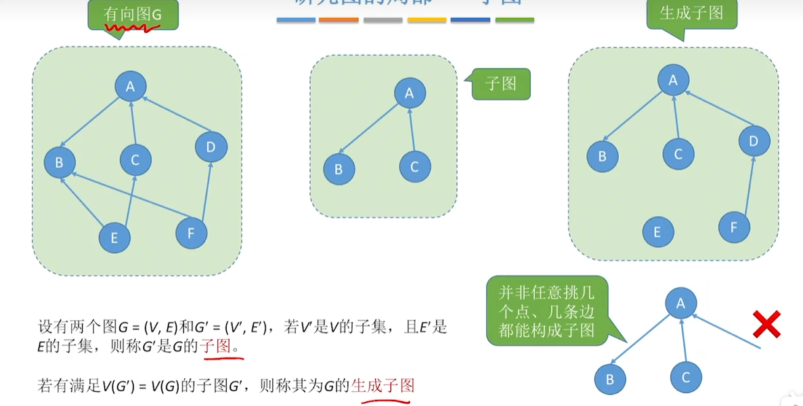

## **有向图的定义**

**有向边**

**弧尾**：发出的结点A

**弧头**：接收的结点E

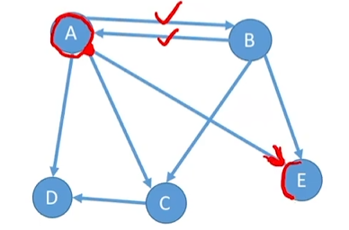

**入度**：以为终点的边的条数

**出度**：以为起点的边的条数

**强连通**：图中任意两个顶点 vi,vj之间都存在路径。

**强连通图：**任意一对结点都是强连通的

**极大强连通图**：子图强连通，并且边数最多

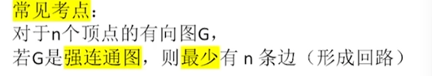

## 无向图的定义

**顶点的度**：依附于该顶点的边的条数

**连通**

**连通图**：任意两个节点都是连通的

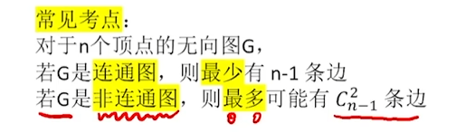

**生成树**：全部顶点的极小连通子图（多个，n个顶点，n - 1个边）

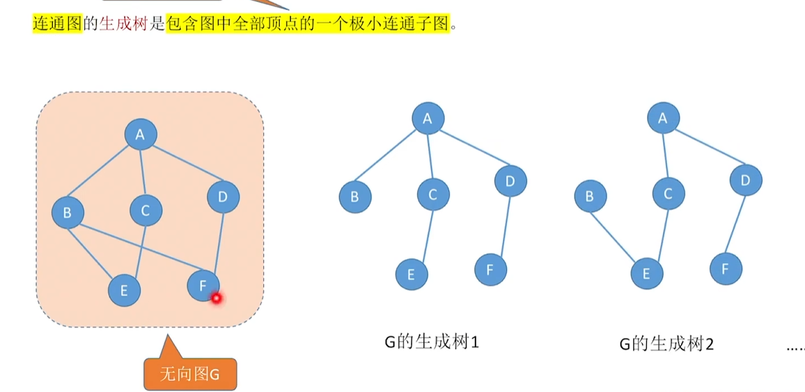

**生成森林**：在非连通图中，
连通分量的生成树构成了非连通图的生成森林。

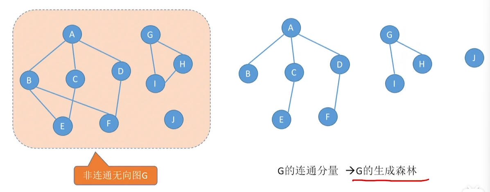

连通分量：极大连通子图

	-  子图
	-  联通
	-  含有极大顶点数

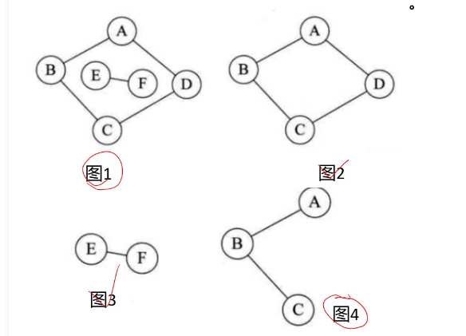

# 图的存储

-   邻接矩阵
-   邻接表
-   十字链表
-   邻接多重表

## 邻接矩阵

-   适合存稠密图
-   O(N*N)
-   顺序存储

**无向图**

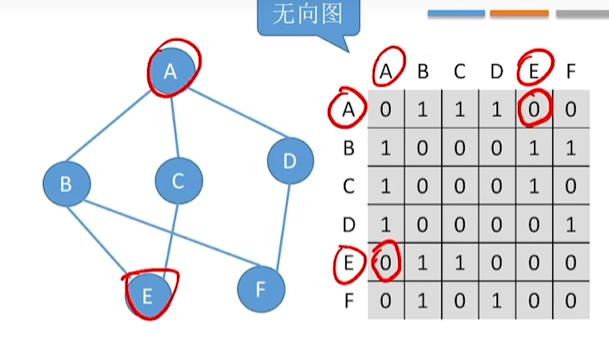

-   1表示有边
-   0表示没边

度：行的值

**有向图**

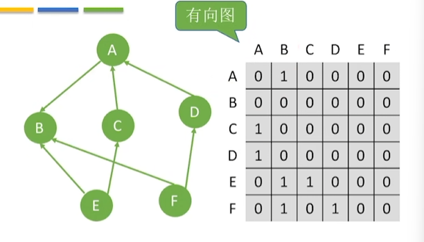

~~~
int a[N][N];

typedef struct{
	char V[N];
	int a[N][N];
	int num,arcnum;//图的当前顶点数和边数/弧数 
}
~~~

出度：第i行非零

入度：第i列非零

度：之和

**性质**

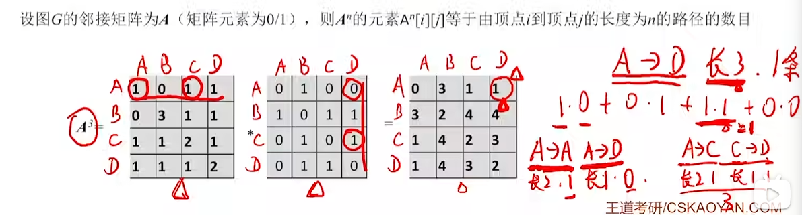

感觉没啥用

## 邻接表

(树的孩子表示法)

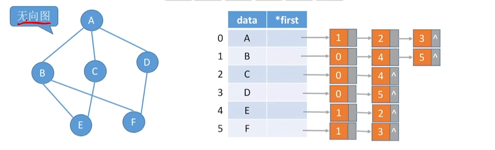

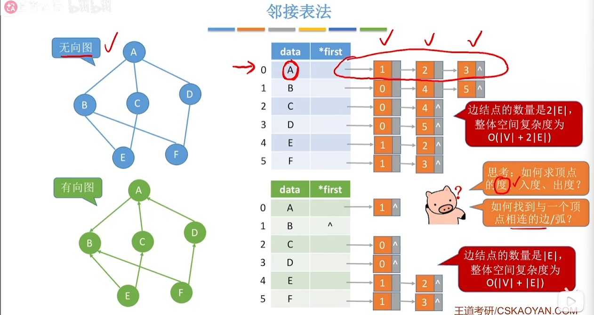

1.   无向图会把边重复存

## 十字链表

O(V+E)

存**有向图**

**顶点结点**

-   数据域，
-   该顶点作为弧头的**第一条弧**
-   该顶点作为弧尾的**第一条弧**

**弧结点**

-   弧尾顶点编号
-   弧头顶点编号
-   权值
-   弧头相同的下一条弧
-   弧尾相同的下一条弧

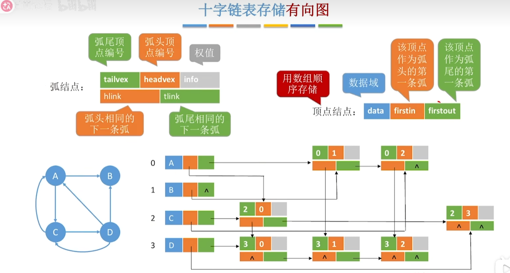

出边表 + 入边表

 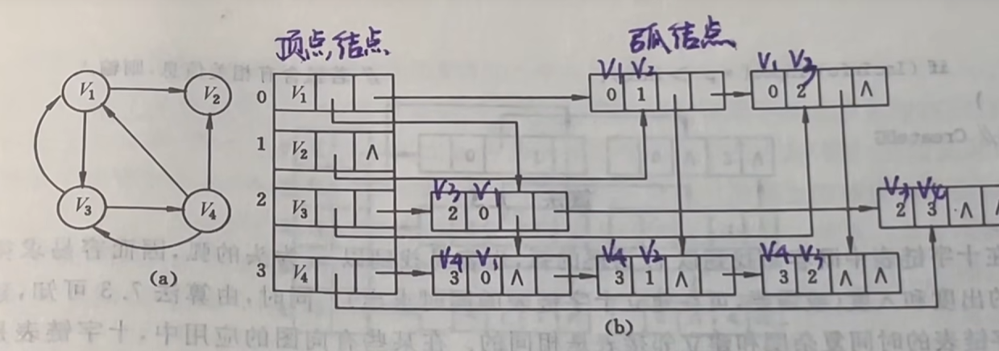

先横着看

能找到所有从自己出发的所有的弧

竖着看

能找到所有指向自己的边

~~~
data firstin firstout
数据
	首个弧头结点
			首个弧尾结点
~~~

~~~
tailvex
headvex
hlink
tlink
~~~

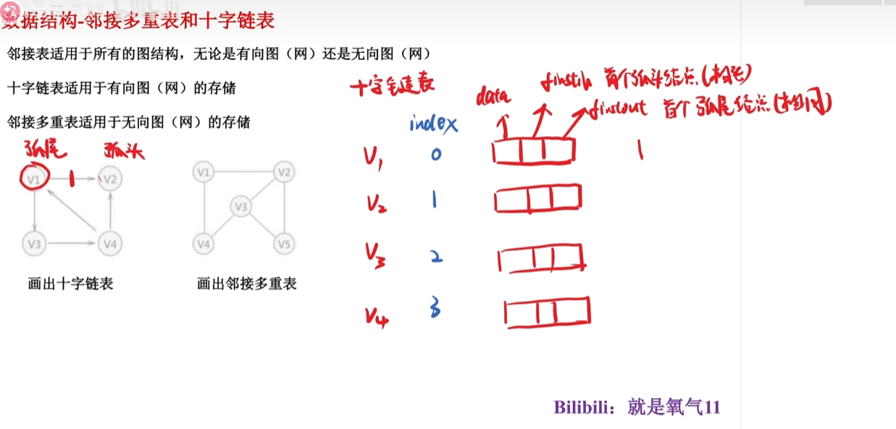

-   画出首结点

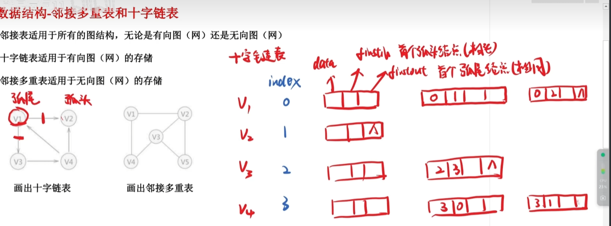

-   画出边的信息

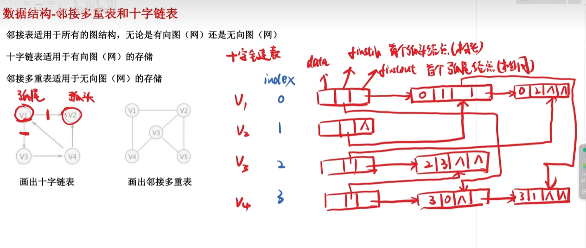

-   找第二位和当前i是相同的的，串起来

## 邻接多重表

存**无向图**

~~~
mark 是否遍历过 1
idex 
ilink
idex
ilink

~~~

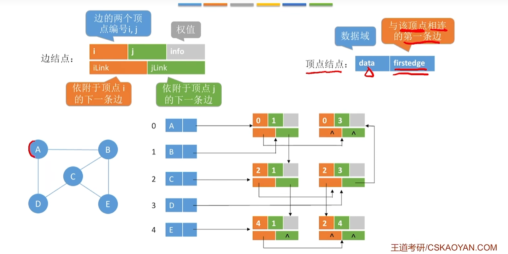

-   先写下总结点

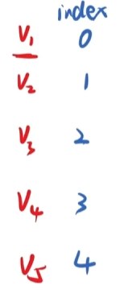

-   依次遍历

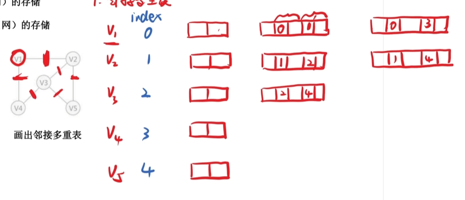

-   再找和i有关系的结点，连接

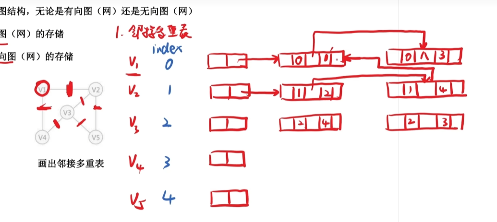

前两个一组，后两个一组

https://www.bilibili.com/video/BV1gqAZeyEaB/?spm_id_from=333.337.search-card.all.click&vd_source=088c1e78206ad2b55500662df5f6652f

## 总结

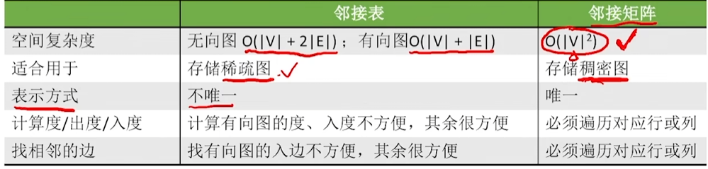

----

$A^n代表i到j长度为n的路径数量$

---

# 图的操作

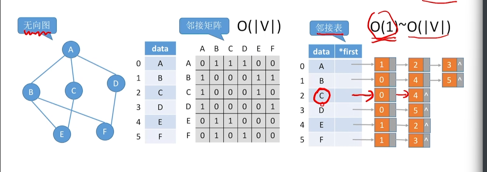

## 是否存在边

<x,y>有向边

(x，y)无向边

-   邻接矩阵`a[i][j]` O(1)
-   邻接表 O(n)

## 和x相邻的边

-   邻接矩阵 O(N) for(int j = 1;j <= n ;j ++)	`a[k][j] == 1`
-   邻接表O（N）

# 最小生成树

若生成树不唯一，则一定存在权值相等的边

若无向图的最小生成树不唯一，则边一定大于n -1

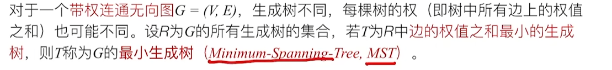

-   带权
-   连通
-   无向

## Prim

从某个顶点开始构建树

每次将代价最小的新顶点纳入生成树

<video src="./../../../jianying/output/4月18日.mp4"></video>

## Kruskal

每次选择一条权最小的边，使这条边的两头连通（原本已经连通的就不选）

<video src="./../../../jianying/output/4月18日 (1).mp4"></video>

# 最短路

最短路一定是简单路径

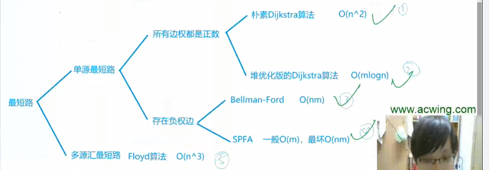

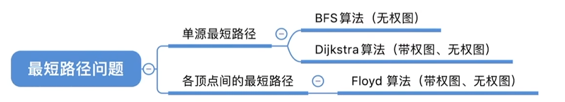

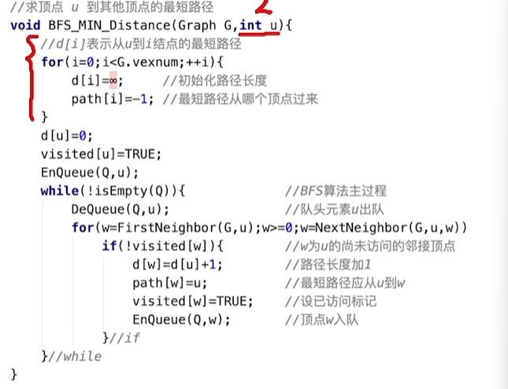

## dijkstra O（N*N）

给定一个 n 个点 m 条边的有向图，图中可能存在重边和自环，所有边权均为正值。

请你求出 1 号点到 n 号点的最短距离，如果无法从 1 号点走到 n 号点，则输出 −1。

-   负权图不能用

~~~
dist[n] //用于存储每个点到起点的最短距离
st[n]   //用于在更新最短距离时 判断当前的点的最短距离是否确定 是否需要更新
~~~

-   初始化距离 dist[1] = 0   1号点到的距离为0，dist[i] = 0x3f
-   s 当前已经确定了最短距离的点
-   for i in range(n):
    -   找到当前不在s中的距离最短的点
    -   t 加入s
    -   t 更新其他所有点的距离（从t出去所有的边，组成的路径能不能更新其他点的距离）

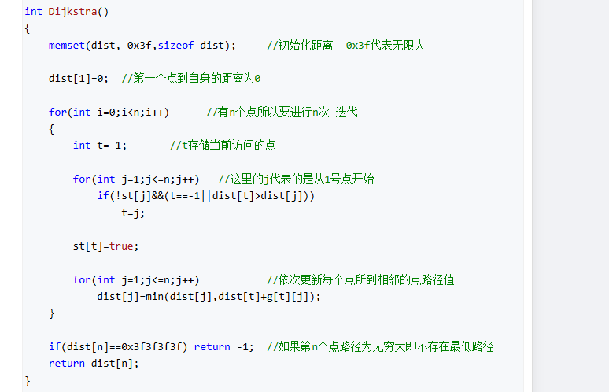

王道书是这样的

-   初始化
-   选最小的点加入集合
-   更新

## bfs

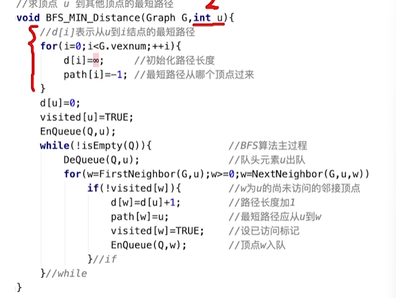

## Floyd

**不允许有负权回路**

给定一个 n 个点 m 条边的有向图，图中可能存在重边和自环，边权可能为负数。

再给定 k 个询问，每个询问包含两个整数 x 和 y，表示查询从点 x 到点 y 的最短距离，如果路径不存在，则输出 `impossible`。

-   求多源汇最短路

~~~
d[i][j] 存所有的边
d[k][i][j] 从i点只经过k点到达j点的最短距离
d[k][i][j] = d[k - 1][i][k] + d[k - 1][k][j] 
三维优化

for(int k = 1; k < n;k ++)	
	for(int i = 1 ;i <= n ;i ++)
		for(int j = 1 ;j <= n ; j ++)
			d[i][j] = min(d[i][j],d[i][k] + d[k][j])
			
			
d[i][j] 最短路的长度
~~~

# 有向无环图DAG描述表达式

把表达式用有向无环图表示

例

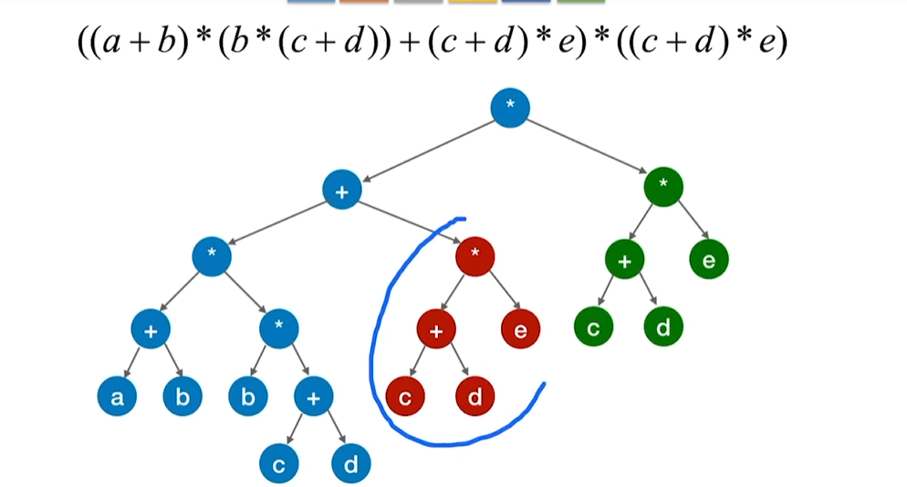

发现有重复的地方可以不用存

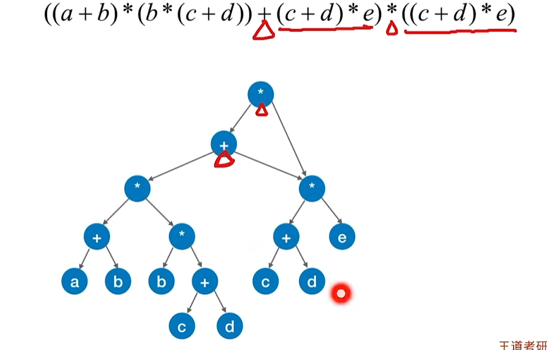

-   结果的操作数不可能重复

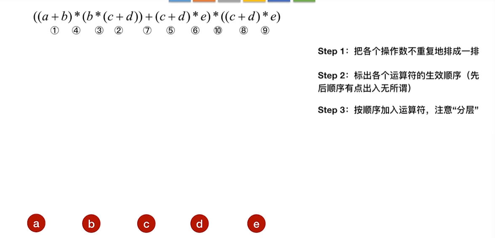

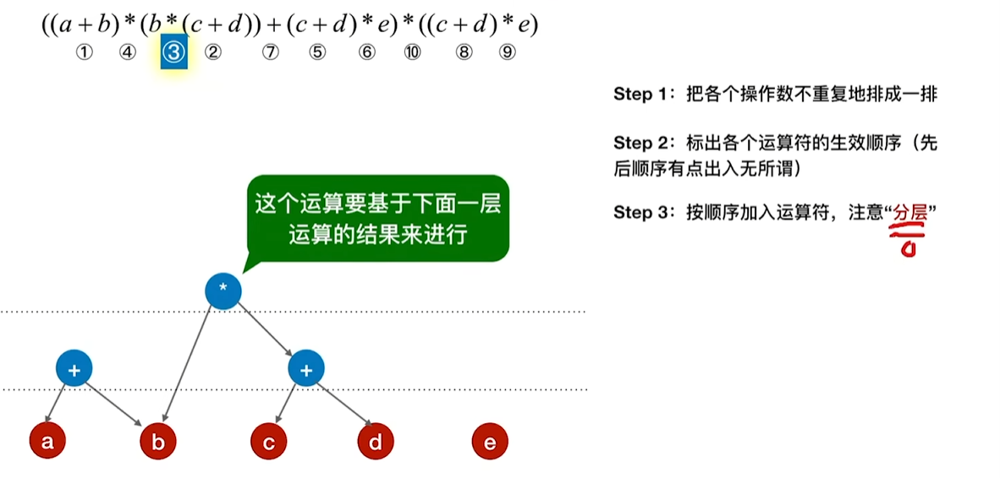

-   **分层**

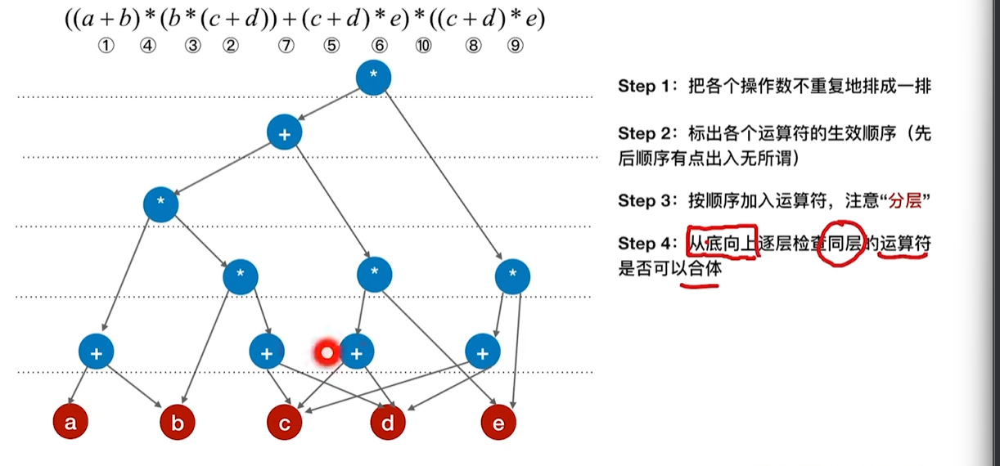

-   开始合并
-   检查同一层的运算符
-   相同运算符且操作数相同的可以合并

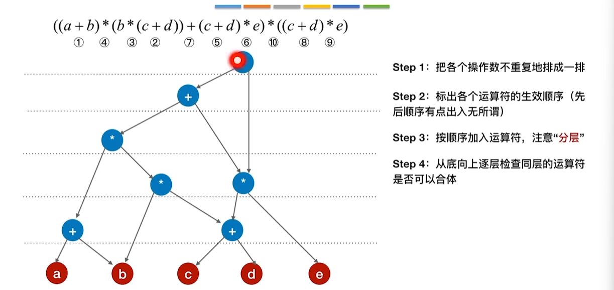

# 拓扑排序

AOV网

-   有向无环图
-   顶点表示活动

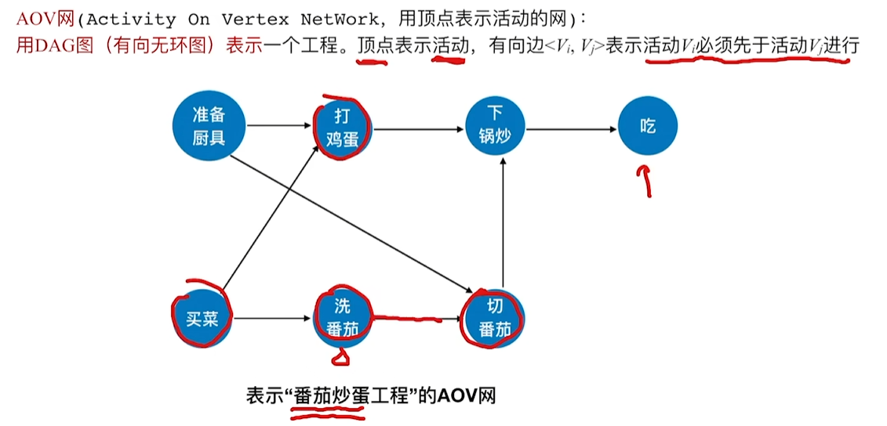

**拓扑排序：**找到做事的先后顺序

## 实现

`while V != 0 || 没有无前驱的点（环路）`   

1.   **从网中找一个没有前驱的（入度 = 0）的点并输出**
2.   从网中删除该顶点和所有以他为起点的有向边

-   拓扑排序不唯一

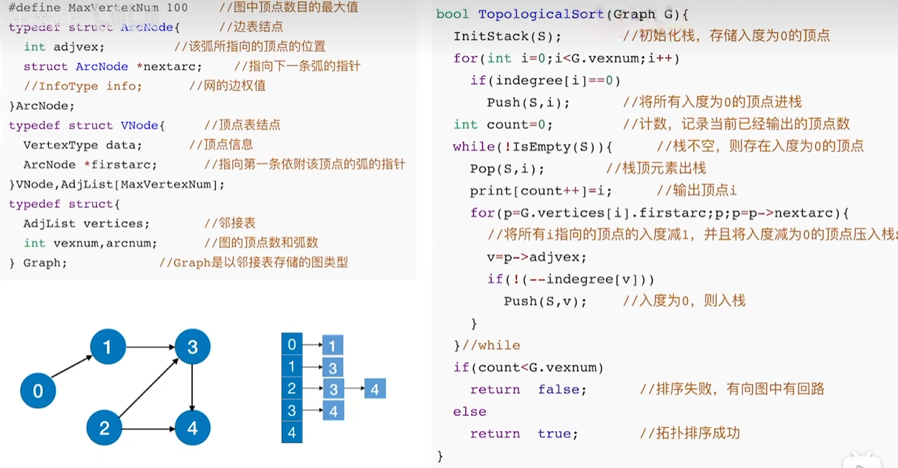

~~~
两个数组
a[N] 存当前结点的入度数
b[N] 存拓扑排序的顺序，并且未被遍历过的值为-1

~~~

## 逆拓扑排序

只是删除出度为0的点，反过来记录

# 关键路径

AOE网

-   带权有向图中
-   顶点为事件
-   边为活动
-   权值表示开销

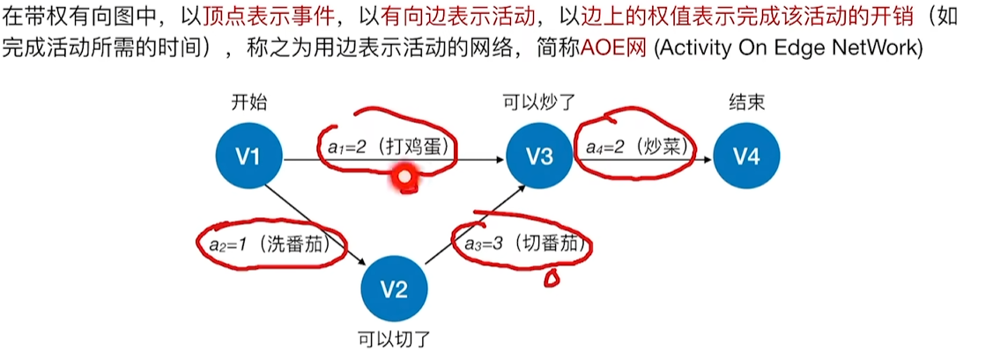

-   只有“开始”事件开始了，才可以进行"打鸡蛋"，“洗蕃茄”
-   只有进入某顶点的各有向边的活动都结束了才表示事件的完成

## 性质

-   只有一个入度为0的 -- 源点
-   只有一个出度为0的 -- 汇点
-   缩短会导致关键路径改变，但是延长不会变

**关键路径**：从源点到汇点的**最大的（权值）**有向路径

**关键活动**：关键路径的活动

能找到影响整个工程的最重要的是哪些事

----

**事件v的最早发生时间ve(k)** --- 决定了所有从vk开始的活动能够开工的最早时间

**活动ai的最早开始时间a(i) **--- 指该活动弧的起点所表示的事件的最早发生时间

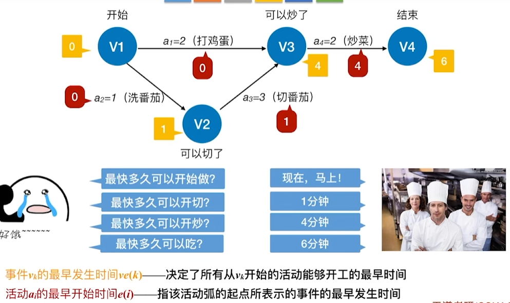

---

**事件v的最迟发生时间v(k)**一它是指在不推迟整个工程完成的前提下，该事件最迟必须发生的时间。

**活动a的最迟开始时间(i)**—它是指该活动弧的终点所表示事件的最迟发生时间与该活动所需时间之差。

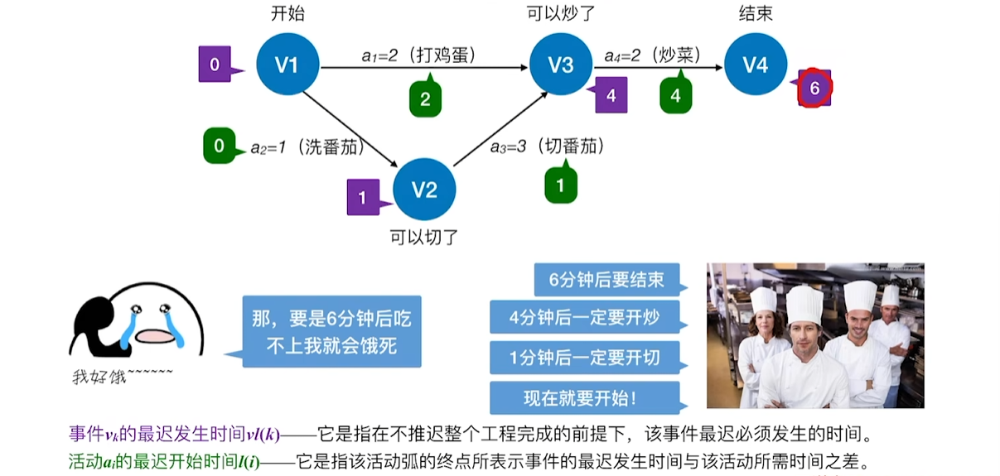

对于不在关键路径的活动，可以延迟

**时间余量** 2 - 0

## 求解

1.   求所有事件的最早发生时间ve()
2.   求所有事件的最迟发生时间vl()
3.   求所有活动的最早发生时间e()
4.   求所有活动的最迟发生时间I()
5.   求所有活动的时间余量d()

---

1 == 3

-   拓扑排序

先正序推所有事件的最早发生时间**max**

~~~
ve = 0
ve(k) = max(ve(j) + W(j,k))
最早是需要前面的都完成才可以
~~~

到头后逆推 所有事件的最晚发生时间

~~~
vl =
vl(K) = min(vl(j) - w(k,j)) 
~~~

再求时间余量

**时间余量== 0的是关键路径**

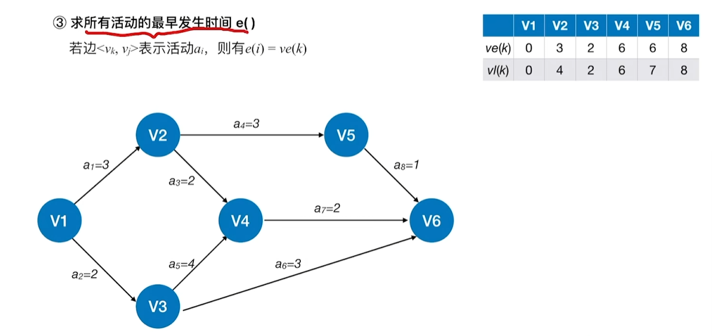

# 做题

-   可以判断有向图有无环路的是：
    -   dfs
    -   bfs
    -   拓扑

-   顶点数大于的强连通图不能进行拓扑排序

-   若有向无环图的拓扑排序唯一，则**不可以**唯一确定此图
-   有向图存在拓扑序列，则不存在回路

## 强连通分量

### 1. 最直观的定义：相互通达的“小圈子”

在一个有向图中，如果两个点 $A$ 和 $B$ 能够“**你中有我，我中有你**”——即从 $A$ 出发能走到 $B$，同时从 $B$ 出发也能走回 $A$，那么这两个点就是“强连通”的。

**强连通分量**就是图中最大的这种“互通小圈子”。在这个圈子里：

-   **任意两个点**之间都可以通过有向路径互相到达。
-   **最大性**：如果你尝试把圈子外的任何一个点拉进来，这个“互相到达”的规则就会被打破。
