# 查找

-   查找
-   查找表：用于查找的数据结构
-   关键字：区分数据的唯一标识

## 分类

静态和动态

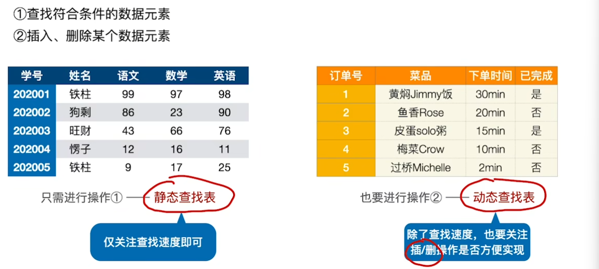

## 评价

查找长度：需要对比关键字的次数

**ASL平均查找长度**：查找过程中，进行关键字的比较次数的平均值

类比二排序树

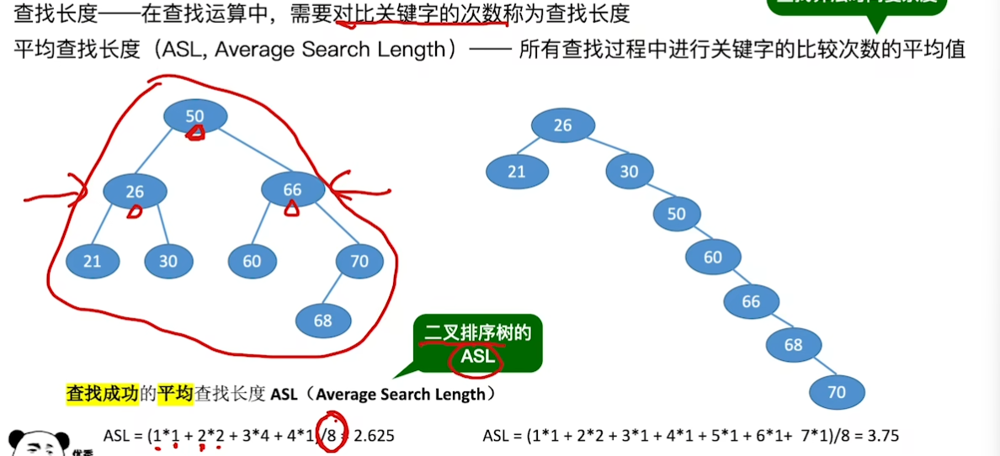

## 对于二分查找

### 成功的ASL计算

每个层结点的个数 * 层数求和

1 + 4 + 3 * 4 + 4 * 4

### 失败的ASL计算

从根节点到对应失败结点的父节点的路径上的节点数

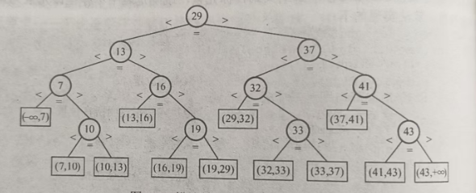

圆形的是列表结点，方形的是失败结点

即 第三层有四个结点：3*4

第四层有8个结点：4*8

# 顺序查找

$\frac{n + 1}{2}$

`for i in range(n):`

## 哨兵模式

-   下标从1开始
-   把目标元素放到a[0]
    -   a[i] == a[0]
-   从后往前遍历

# 二分查找

-   相当于一颗平衡二叉树

$log_2(n+1)$

-   有序
-   顺序表

~~~
int l = 0,r = n
while (l < r)
    int mid = l + r >> 1;
    if(a[mid] >= x) r = mid;
    else l = mid + 1
~~~

~~~
int l = 0,r = n
while (l < r)
    int mid = l + r + 1 >> 1;
    if(a[mid] <= x) l = mid;
    else r = mid - 1
~~~

~~~

while (l <= r)
{
    int mid = l + r >> 1;
    if (q[mid] >= x) r = mid - 1;
    else l = mid + 1;
}
if (q[l] != x) cout << "-1 -1" << endl;
else
{
    cout << l << ' ';
    int l = 0, r = n - 1;
    while (l <= r)
    {
        int mid = l + r + 1 >> 1;
        if (q[mid] <= x) l = mid + 1;
        else r = mid - 1;
	}
cout << r<<endl;
~~~

# 分块

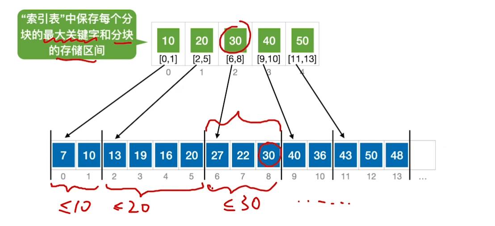

最下的时候，分成$s = \sqrt{n}时最下时ASL  = \sqrt {n} + 1$

-   
-   块内无序
-   块间有序

上一级存最大key和区间

-   先确定分块
-   再顺序查找

# 二叉排序树

-   左子树 < 根 < 右子树
-   递归满足

-   **中序遍历**可以获得有序的序列

-   不同的插入顺序会得到不同的二叉排序树

-   ASL：

## 最好情况

数的高度为 logn + 1

ASL = logn

### 最坏情况

树的高度为n

ASL = n

## ASL失败

在所有叶子节点的左右子树的位置，

ASL失败 = 层数 * 个数 求和 / 个数

## 查找操作

~~~
root 
if(root.data > x)
	root = root.lchild
else:
	root = root.rchild;
	

~~~

### 代码

~~~
BSTNode *BST_Search(BSTree T,int key)
{
	while(T != NULL && Key != T -> key)
	{
		if(key < T->key) T = T->;child;
		else T = T -> rchild;
	}
}
~~~

~~~
BSTNode *BST_Search(BSTree T,int key)
{
	if(T == NULL)
		return NULL;
	if(key == T->key)
		return T;
	else if(T -> key > key)
		return BST_Search(T -> lchild,key);
	else BST_Search(T -> rchild,key);
}
~~~

## 插入

~~~
int BST_Insert(BSTree &T,int k)
{
	if(T == NULL){// 新插入为根
		T = (BSTree)malloc(sizeof(BSTNode));
		T -> key = k;
		T -> lchild = T -> rchild = NULL;
		return 1;
	}
	else if(k == T -> key)
		return 0; // 相同的数字
	else if(k > T -> key)
		return BST_Insert(T -> lchild,k); // 插入到左子树
	else:
		return BST_Insert(T -> rchild,k)
		// 插入到右子树
}
~~~

## 删除

-   叶子结点，直接删除
-   若只有右子树（左子树），直接让子节点替代就可以了

-   若都有，需要找到右子树，中序遍历的第一个树（最小的树）替代需要删除的结点
    **查找左子树的最右下结点，是左子树中最大结点**
    **查找右子树的最左下结点，是右子树中最小结点**
    -   此时因为是最左下的结点，一定没有左子树
    -   就可以直接用子节点替代自己

# 平衡二叉树AVL

-   主要的问题是怎么保证平衡

-   平衡因子

-   树上任意结点的左子树和右子树高度之差不超过1

## 插入

当插入数据时，一整条查找路径的结点都会受到影响，

我们向上找，找到第一个不平衡的结点，调整这个不平衡子树

## 调整

### LL型

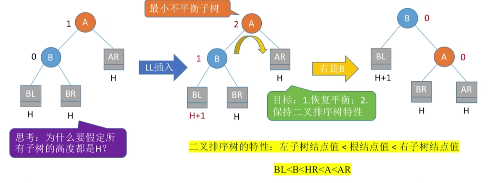

把B右旋，B作为根节点，A作为右子树

B左和A右都不变

B右比右大但比A小，换位置

~~~
gf ->A(f) -> B(p)

f -> lchild = p -> rchild;
p -> rchild = f;
gf ->child = p;
~~~

### RR型

B左旋，B作为根，A作为左子树

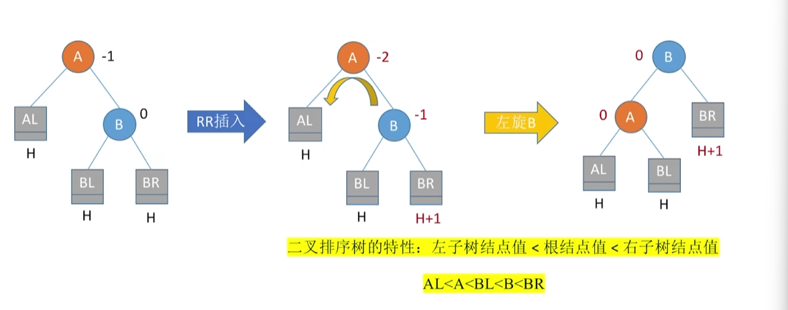

A左和B右不变

B左连到A上

~~~
f -> rchild = p -> lchild;
p -> lchild = f;
gf -> child = p;
~~~

### LR型

C左旋右旋

孙子当爷爷

爷爷和爸爸都当儿子

C的右子树给右边的结点（A）

### RL型

-   C右旋左旋

孙子当爷爷

爷爷和爸爸都当儿子

C的左子树给左边的结点（B）

### 总结

-   只有左孩子才会右旋
-   右孩子可以左旋

## 删除

先删除，如果没有平衡因子大于1的就不变

### 否则

删除找到最小不平衡子树

找到更深的儿子和孙子

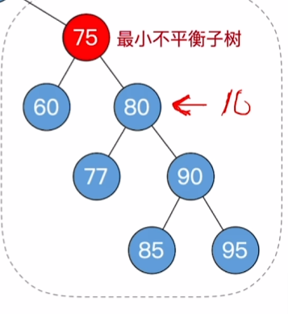

即80 和90

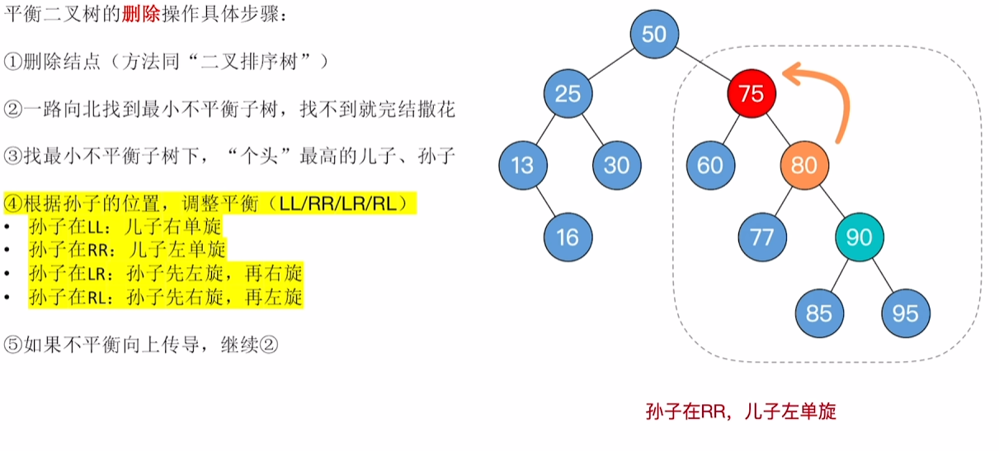

-   和插入操作类似

-   找到最小的不平衡子树
-   找到最高的儿子和孙子

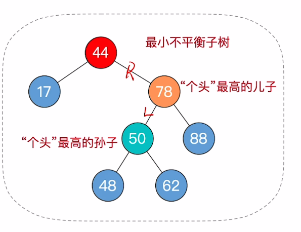

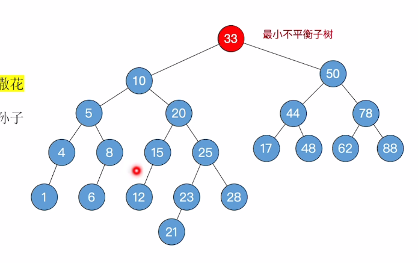

10是最高的儿子

20是最高的孙子

## 二叉树结点的个数

$n_h = n_{h - 1} + n_{h - 2} + 1$

这个递归看，而且几乎是从简单开始找规律

| h    | 1    | 2    | 3    | 4    | 5    | 6    | 7    |
| ---- | ---- | ---- | ---- | ---- | ---- | ---- | ---- |
| n    | 1    | 2    | 4    | 7    | 12   | 20   | 33   |

**最小个数，此时所有非叶节点的平衡因子均为1**

-   高度为h的平衡二叉树含有的最小结点个数？

-   含有x个结点的平衡树的最大深度

## 深度

最理想得到情况下得到的深度为log(n+1)上取整

希望可以得到完全二叉树

# 红黑树RBT

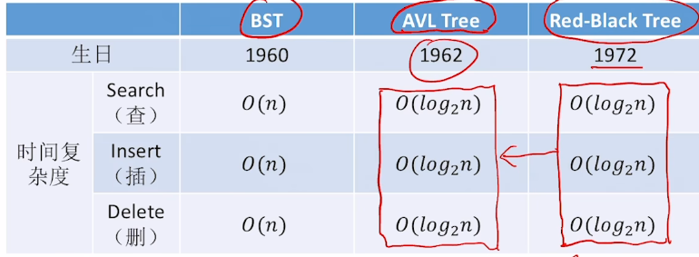

-   因为在删除和插入的时候会影响平衡二叉树的形态，需要频繁调整（平衡容易破坏）
-   每次需要重新计算平衡因子，找不平衡子树
-   RBT不需要

---

平衡二叉树：适用于以查为主、很少插入/删除的场景
红黑树：适用于频繁插入、删除的场景，实用性更强

---

 ## 定义

是一种优化的二叉排序树

左 < 根 < 右

~~~
struct RBnode{
	int key;关键字的值
	RBnode* parent; 父节点指针
	RBnode* lChild; 左孩子指针
	RBnode* rchild; 右孩子指针
	int color;结点颜色
}

黑高BH：从某个结点出发，达到任意空叶节点的路径上的黑节点的总数
~~~

-   每个结点是红色或者黑色
-   根节点是黑色==根黑==
-   叶节点（外部节点，NULL结点，失败节点）都是黑色
    ==叶黑==
-   不存在两个相邻的红色结点(父子一定不是双红，兄弟可以是)==双红==
-   每个节点，从该节点到任意叶节点的路经上，黑节点的数目相同==相同==

 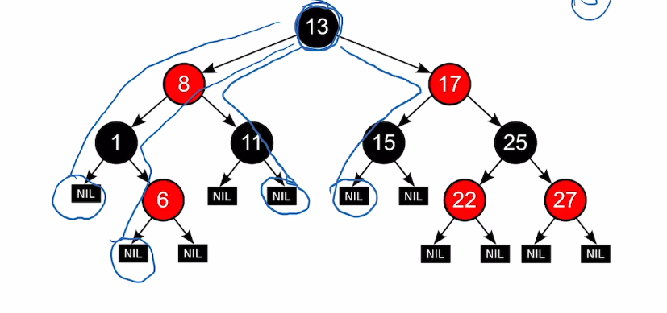

## 性质

1.   根节点到叶节点的最长路径不大于最短路径的两倍

     -   根节点到叶节点黑色数目相同

     -   任意多的方式就是中间会穿插红色，同时他不可能多余一倍

2.   有n个内部节点，H = $2log_2(n+1)$
     -   查找操作O（logn)

## 查找

-   与二叉排序树和平衡树是相同的

## 插入

-   先查找确定位置
-   为根：黑色
-   非根：红色（保证黑路同，到达任意叶节点的黑色结点数目相同）
    -   若满足则结束
    -   不满足，需调整
    -   黑叔：旋转 染色
        -   染色染的都是刚刚更换辈分的结点
        -   LL：右单旋，父换爷    染色
        -   RR：左单旋，父换爷    染色
        -   LR：左右旋，儿换爷    染色
        -   RL：右左旋，儿换爷    染色
    -   红叔：染色加变新
        -   叔父爷染色，爷变成新节点

 

LR的变换方法

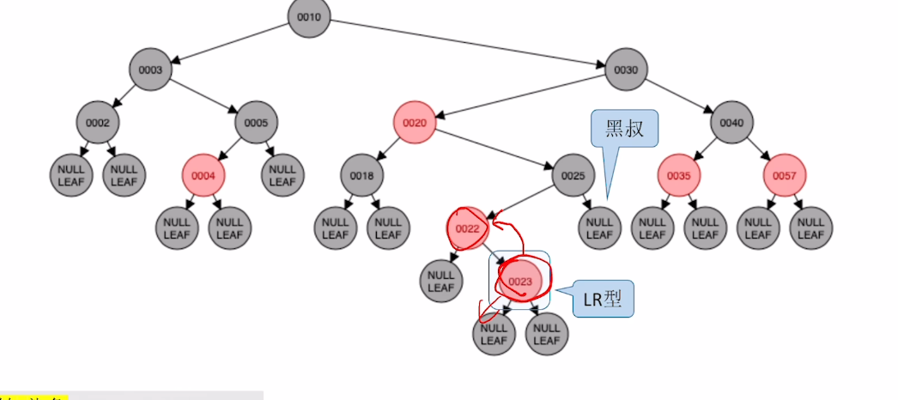

## 删除

O（logn）

和二叉排序树的删除是相同的

需要调整颜色和位置

==不考==？

# B树

## 王道

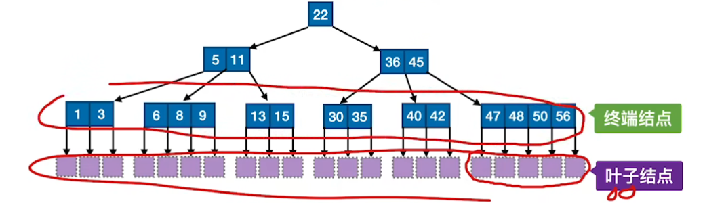

多路平衡查找树

B树的阶：m：所有节点的孩子的个数的最大值

-   树中每个节点最多m棵子树，至多有m-1个关键字
-   若根节点不是终端结点，至少有两棵子树
-   出根节点外，所有非叶节点至少有**(m+1)/2**棵子树，即至少有**(m+1)/2-1**个关键字
-   所有叶节点都在**同一层上**，并且是NULL
-   所有子树的**同高度的**
-   所有的关键字都是树内结点，并且代表下一层的区间，例如关键字是a b c，对应下一层就是<a,(a,b),(b,c),c<

-   树内节点都是递增的

$log_m(n+1)<=h<=log_{(m+1)/2}(n+1)/2+1$

-   **最小高度**（不包括叶节点），让每个结点满，n<=(1 + m,m*m,...+m^h-1)
    -   $$h >= log_m(n+1)$$

-   **最大高度**,根节点最少有两个分叉，其他结点只有(m+1)/2个分叉

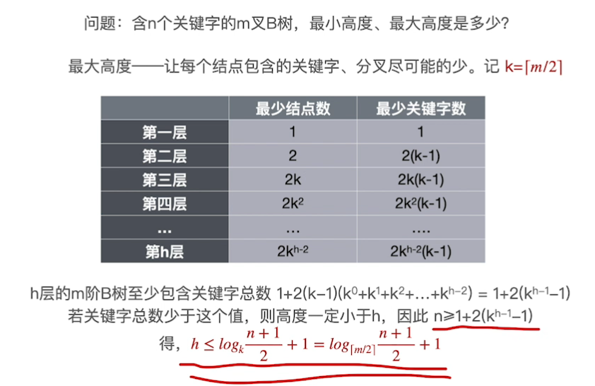

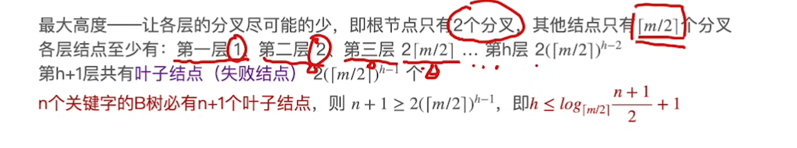

-   n个关键字的B树必有n+1个叶子节点

## 抖音

**(a,b)-tree**

-   节点里存放键值，并且递增
-   叶子节点不放任何值
-   每个键值都分隔两个子树
    -   左边放小于自己的值
    -   右边..
-   每个结点存放的数量由ab决定

-   a是每个结点所拥有的最小的子节点数
    -   必须根节点个数=1，那么拥有两个子树，就是两个子节点数
-   b是每个结点最大的子节点数

**其他结点所包含的结点数必须在a，b之间**

**根节点的节点数必须在2,b之间**

-   叶子节点在同一层
-   **a>=2,b>=2a-1**

m阶

a = (m+1)/2 - 1

b = m - 1

## 插入

先依次在结点插入，当key超过b时分裂

在中间位置(m+1)/2分裂，左边放到原结点中，右边放到新节点，中间节点插入到原结点的父节点

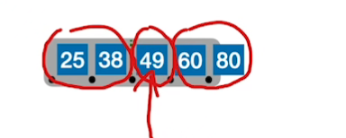

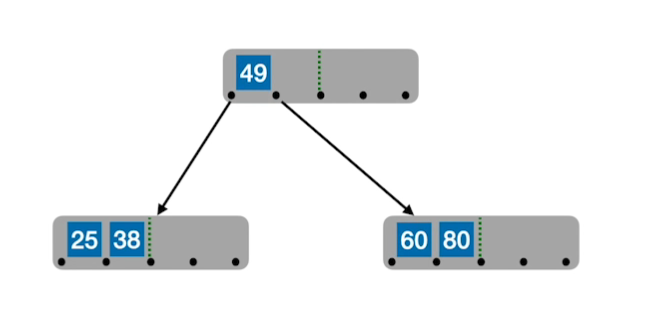

-   每次通过查找，将元素插入到最底层的终端节点中

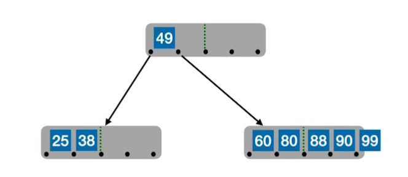

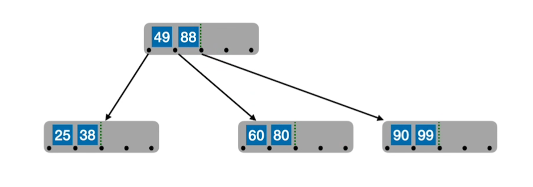

-   两次分裂，都是从中间分裂

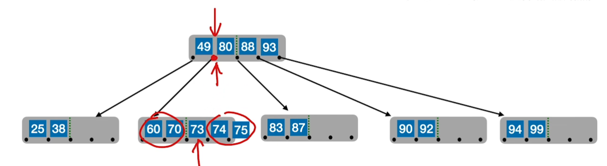

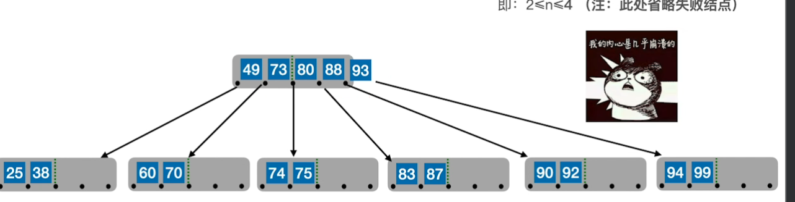

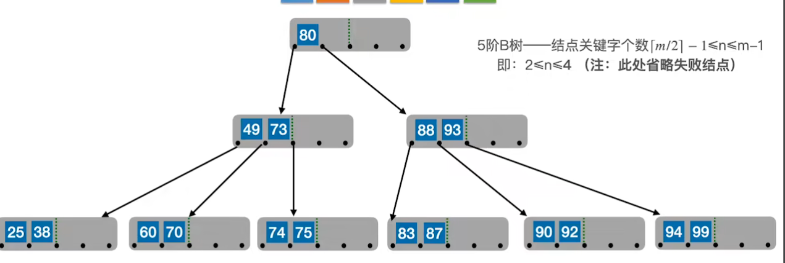

## 删除

-   叶节点删除可以直接删除
-   如果是根节点，可以找到左子树的最右结点或者，右子树的最左结点（直接前驱和直接后继）

**借**：若被删除关键字所在结点删除前的关键字个数低于下限，可以向左右结点及双亲结点借（下放和上移）

-   兄弟够借

删除38

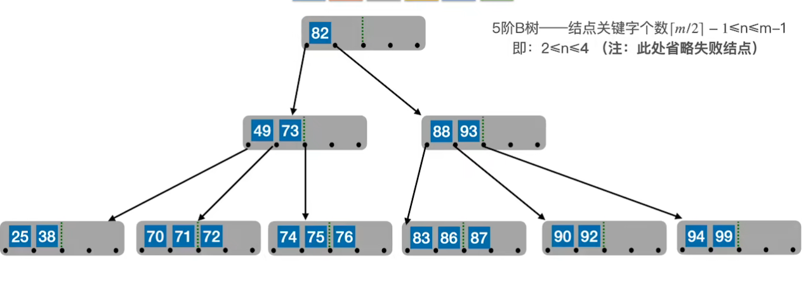

-   把父节点的值下放，再把兄弟结点的值上移

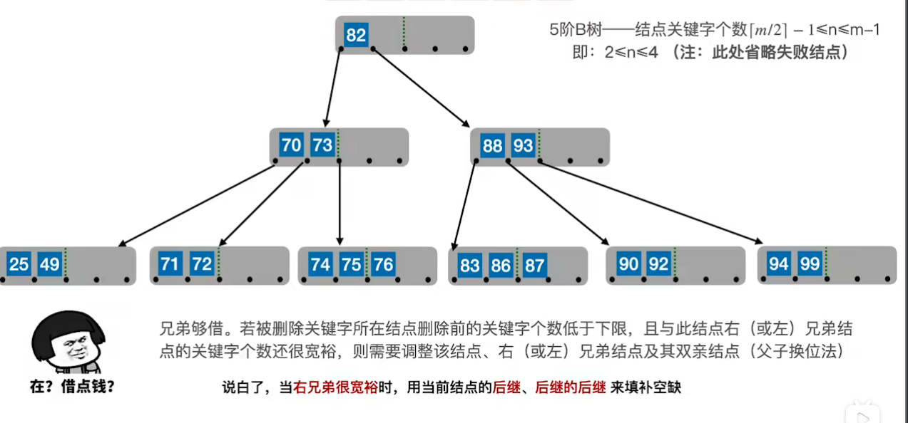

**合并**：兄弟结点不够借，那么合并兄弟节点（**把左右结点和父结点的中间节点合并**）

删除49

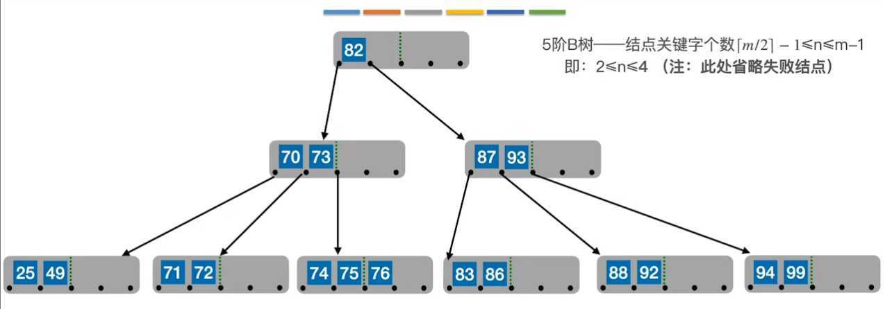

把左右结点和父节点合并

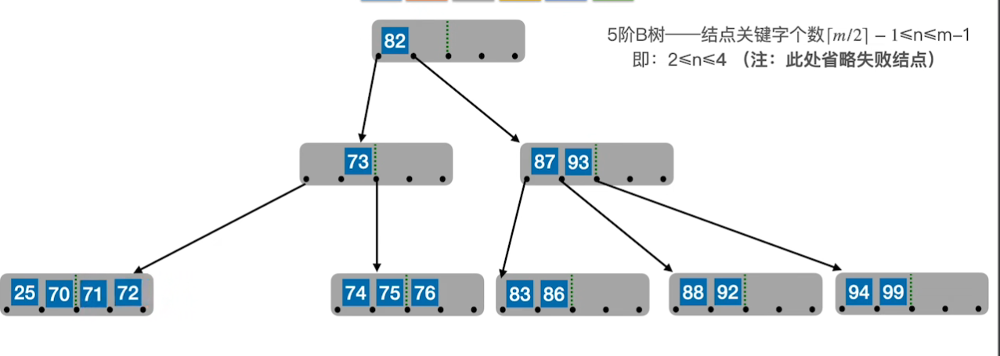

此时父节点少于2，还需合并

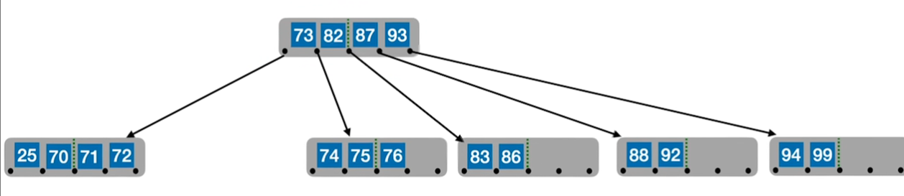

# B+

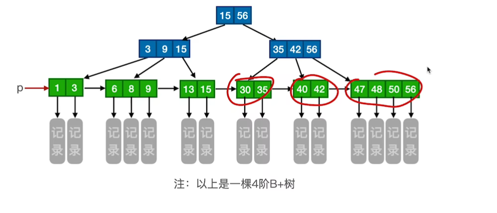

类似分块查找

m阶 的B+数

-   每一个结点最多有m棵子树
-   非叶根节点至少有两棵子树，其他每个分支节点至少有(m+1)/2棵子树
-   **结点子树的个数和关键字个数相等**
    -   B树中每个节点有n+1个子树

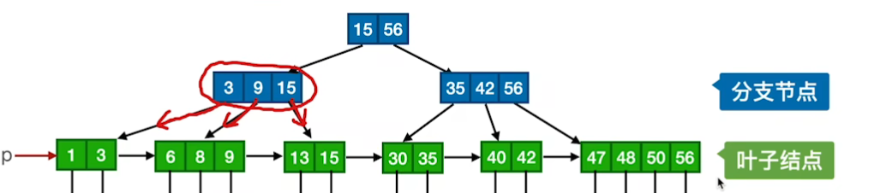

3 9 15这个结点对应三个子树

-   所有叶结点包含全部关键字及指向相应记录的指针，叶结点中将关键字按大顺序排列，并且相邻叶结点按顺序相互链接起来。

-   B+树所有的值都会在叶子节点被串起来

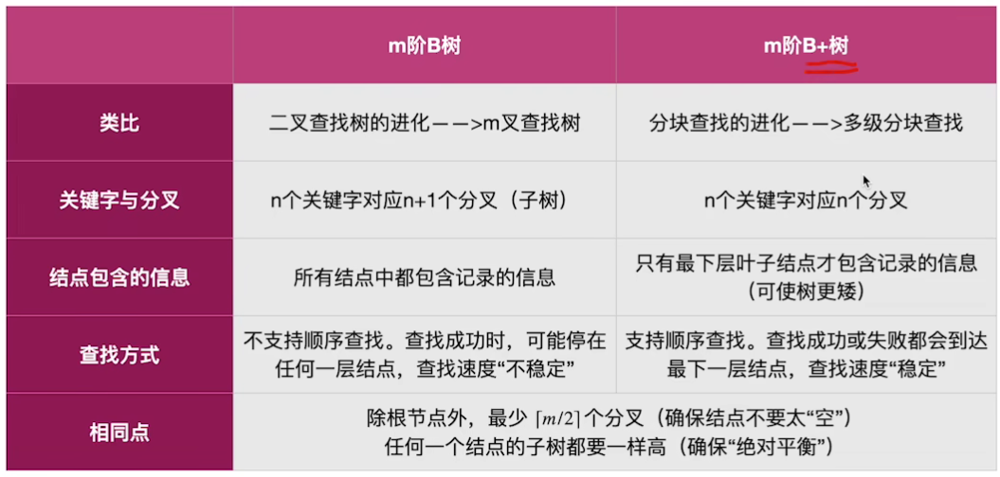

# 散列表

哈希

可以通过关键字算出存储地址

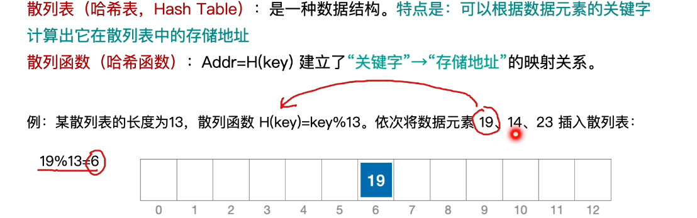

-   冲突：算出了相同的值
-   同义词：两个哈希值相同的值

## 如何减少冲突

-   拉链法：把冲突存链表里
-   开放定址法：给她找个新位置

## 构造散列函数

-   散列函数必须覆盖所有可能出现的关键字
-   

### 除留余数法

散列表表长为m，取一个不大于m但最接近或等于m的质数p

几乎是选一个最大的质数

### 直接定址法

关键字分布连续

### 数字分析法

用分布均匀的部份数当映射数

把手机号后四位作为映射

### 平方取中法

去关键字的平方值的中间几位作为散列地址

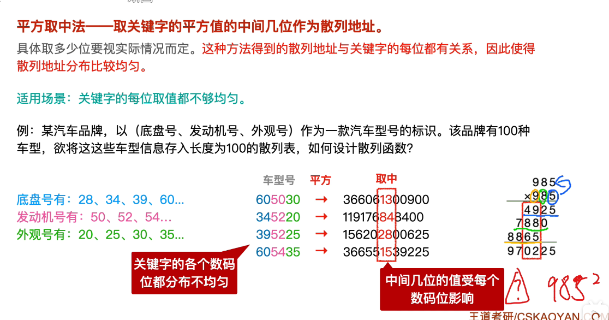

## 拉链法

默认头插法

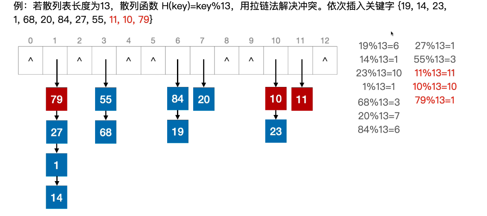

查找长度：统计关键字的对比次数

-   选出映射值
-   去链表对比

**优化：**还可以让链表变成有序的，这样可以让查找时更快

## 开放地址法

设定探测序列，

以上四种方法来设计探测序列

~~~
1 -1 2 -2 3 -3 4 -4...
~~~

$H_i = (H(key) + d_i) % m$ % m可以循环

----

d[0] = 0

-1 < d[i] < m 

---

## 分析

ASL平均查找长度

发生冲突时，线性探测

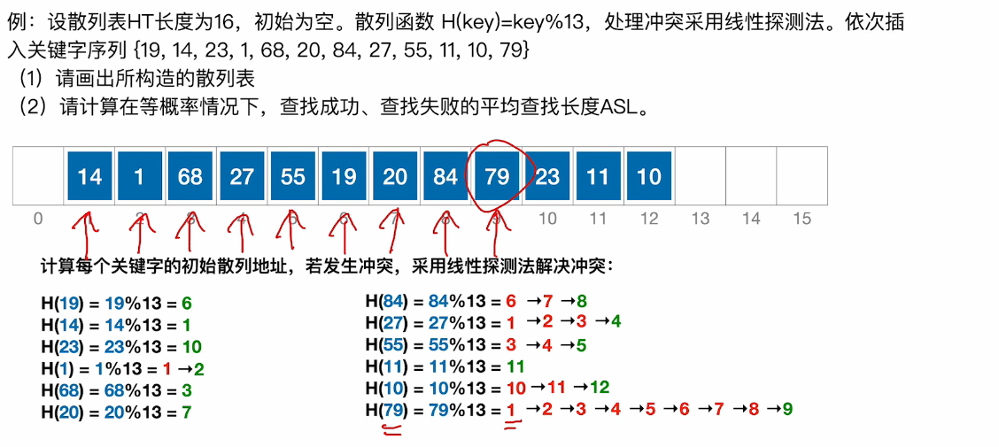

成功的：ASL = （6 + 2 + 3 + 4 + 3 + 3 + 9）/12 = 2.5

失败的：ASL

没有数字的直接是1 + ：：

-   除以13，散列函数的取值范围是13而不是**表长**

**第三问：**删除了一个数问ASL

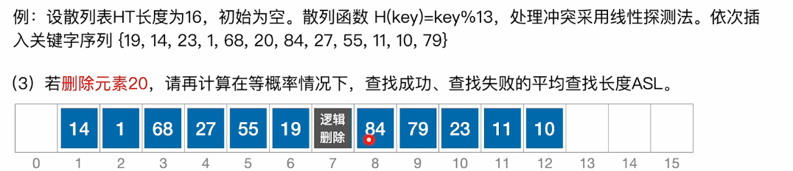

-   逻辑删除而不是物理删除

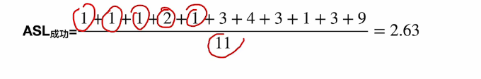

### 装填因子

表中的数/表长

因子越大，冲突越容易发生，效率会变低

### 堆积

多个数全都在一起

换一个探测法

## 总结

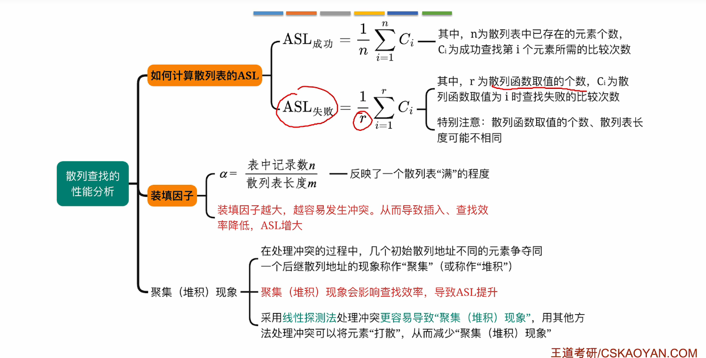
