# 栈

## 定义

-   只允许一端进行插入删除操作的线性表

## 特点

-   后进先出（LIFO）

-   插入删除只能在栈顶

## 操作

### 初始化

**顺序栈**

-   顺序表存数据
-   栈顶指针指向-1

~~~
#define MaxSize 10;
typedef struct{
	int data[MaxSize];
	int top;
}SqStack;
void Init(SqStack &S){
		S.top = -1;
}
void main(){
	SqStack S;
}
~~~

### 插入

-   判断栈满
-   入栈

~~~
bool Push(SqStack &S,int e){
	if(e == MaxSize - 1)	
		return false;
	S.data[++ S.top] = e;
	return true;
}
~~~

### 出栈

-   判断栈空
-   出栈
-   返回出栈值

~~~
bool Pull(SqStack &S,int &x)
{
	if(e == -1)	return false;
	x = S.data[S.top--];
	// 先赋值再--
	return true;
}
~~~

## 共享栈

-   两个栈共享一片内存

-   设置两个栈顶指针

### 初始化

~~~
void init(ShStack &S)
{
	S.top0 = -1;
	S.top1 = MaxSize;
}
~~~

### 栈满

~~~
S.top0 + 1 = S.top1
~~~

## 链栈

头节点+头指针（逆序的方法）完美实现

~~~
typedef struct LinkNode{
	int data;
    struct Linknode *next;
}*LiStack;

~~~

## 常见题型

### 卡特兰数

如果有n个不同元素进栈，则出栈元素不同排列的个数为$$
\frac{1}{n+1}C_{2n}^{n}
$$

~~~
n = 1 ------ 1/2 * C1,2 = 1
n = 2 ------ 1/3 * C2,4 = 2
n = 3 ------ 1/4 * C3,6 = 5
n = 4 ------ 1/5 * C4,8 = 14
n = 5 ------ 1/6 * C5,10 = 42
~~~

# 队列 & 循环队列

-   只允许一段插入另一端删除的线性表
-   先进先出

## 操作

### 初始化

~~~
#define MaxSize 10;
typedef struct{
	int data[MaxSize];
	int front,rear;
}SqQueue;

void Init(SqQueue &L)
{
	L.front = 0;
	L.rear = 0;
}
~~~

### 判空

`L.rear == Q.front`

### 已满

通过取模运算会让队列变成一个循环队列

需要**牺牲**一个元素位置，来判断是否已满

~~~
if((Q.rear + 1) % MaxSize == Q.front)
~~~

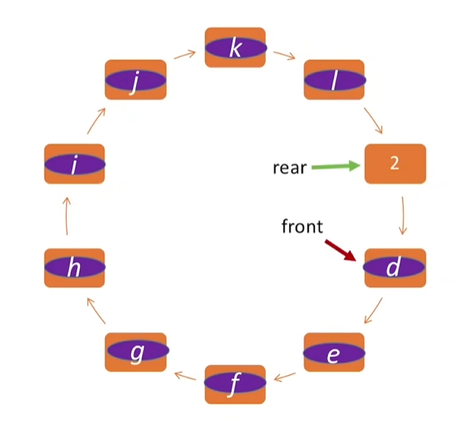

**第二种方法判断满空**

-   初始化时定义一个size记录长度

**第三种**

-   初始化时定义一个flag，每次删除操作成功时flag = 0，插入成功时flag = 1

则此时队满

`front == rear && tag == 1`

### 入队

-   从队尾进入，直接操作rear 再++

~~~
bool EnQueue(SQList &L,int x)
{
	if((Q.rear + 1) % MaxSize == Q.front)
		return false;
	L.data[L.rear] = x;
	L.rear = (L.rear + 1 ) % MaxSize;
	return true;
}
~~~

### 出队

~~~
bool DeQueue(SQList &L,int &x)
{
	if(L.front == L.rear)
		return false;
	x = L.data[L.front];
	L.front = (L.front + 1) % MaxSize;
	return true;
}
~~~

### 队列元素的个数

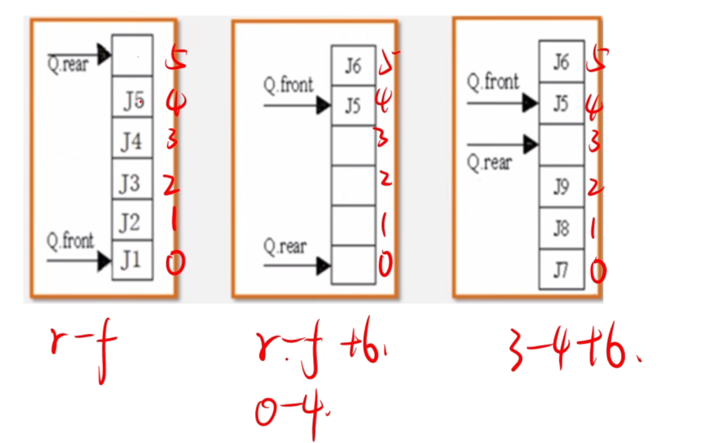

~~~
(rear + MaxSize - front) % MaxSize
~~~

 ### 总结

-   队尾rear指向队尾元素的下一个位置

~~~
初始状态front = 0,rear = 0;
入队 ： L[rear] = x; rear = (rear + 1) % n;
队空:front == rear;
队满：(rear + 1) % n == front
~~~

-   队尾指向元素本身

~~~
初始状态front = 0,rear = n - 1;
入队 ： rear = (rear + 1) % n;L[rear] = x;
队空:(rear + 1) % n = front;
队满：(rear + 2) % n == front牺牲了一个空间，再跳一个到front
~~~

-   下标从1开始[1,n]

~~~
初始值可能是front = rear = 1
~~~

不管题目怎么变，你只需要在草稿纸上画一个 **4 个格子**的圆环，然后做两件事：

1.  **填入第一个数**：根据题目要求，把第一个数放进 $A[0]$ 或 $A[1]$。
2.  **摆放指针**：根据题目要求（是“指向元素”还是“指向空位”），把 `front` 和 `rear` 挪到正确的位置。
3.  **倒推一步**：在填入这个数之前，指针在哪里？那个位置就是**初始值**。

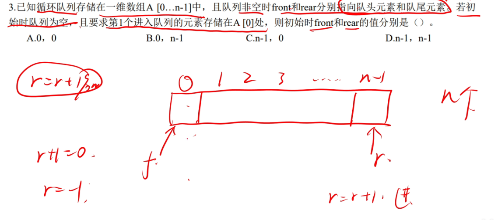

## 链式队列

-   设置尾指针和头指针

~~~
typedef struct LinkNode{
	INT DATA;
	struct LinkNode *next;
}LinkNode;
typedef struct{ // 队列结构体
	LinkNode *front,*rear;
}LinkQ;
void Init(LinkQ & L)
{
	Q.front = Q.rear = (LinkNode *)malloc(sizeof(LinkNode));// 指向头节点
	Q.front -> next = NULL;
}
~~~

-   判空

~~~
带头节点
if(L.front == L.rear)

不带头节点时
init
Q.front = Q.rear = NULL;
if(Q.front == NULL)判空
~~~

### 入队

-   带头结点

~~~
void EnQueue(LinkQ & Q,int x)
{
	LinkNode *s = (LinkNode *)malloc(sizeof(LinkNode));
	s -> data = x;
	s -> next = NULL;
	Q.rear -> next = s;
	Q.rear = s;
}
~~~

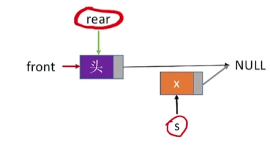

-   不带头节点

~~~
void F(LinkQ &Q,int x)
{
	LinkNode *s = (LinkNode *)malloc(sizeof(LinkNode));
	s -> data = x;
	s -> next = NULL;
	if(Q.front == NULL) // 对于头节点需要特殊操作
	{
		Q.front = s;
		Q.rear = s;
	}
	else{
	Q.rear -> next = s;
	Q.rear = s;
	}
}
~~~

### 出队

-   带头节点	
    -   申请要释放的节点
    -   修改头节点指针（跳过）
    -   如果是最后一个节点需要把rear指向head
    -   释放

~~~
bool DeQueue(LinkQ &Q,int &x){
	if(Q.front == Q.rear)
		return 0 //空
	LinkNode *p = Q.front -> next;
	x = p -> data;
	Q.front -> next = p -> next;//修改头节点next指针
	if(Q.rear == p)//最后一个元素
		Q.rear = Q.front;
	free(p);
	return 1;
	
}
~~~

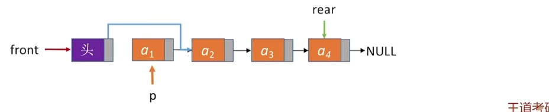

-   如果是最后一个节点
-   

把rear 指针从a4指向head指针

## 双端队列

-   允许从两端删除和插入

### 分类

~~~
普通的双端队列
=================================
插入删除                    插入删除
=================================

=================================
插入                    插入删除
=================================

=================================
删除插入                    删除
=================================
等...
~~~

### 判断输出序列是否合法

1.    输入序列为1234哪些输出序列是合法的

~~~
解体步骤
先找到1
1的左右两边必须是升序或者降序的顺序，出现了逆序则一定是不可能的序列

5 4 3 1 2 
5 3 1 2 4
4 2 1 3 5 

4 1 3 2 5 有逆序不成立
~~~

# 括号匹配

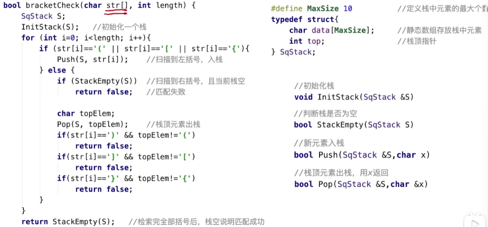

# 表达式求值

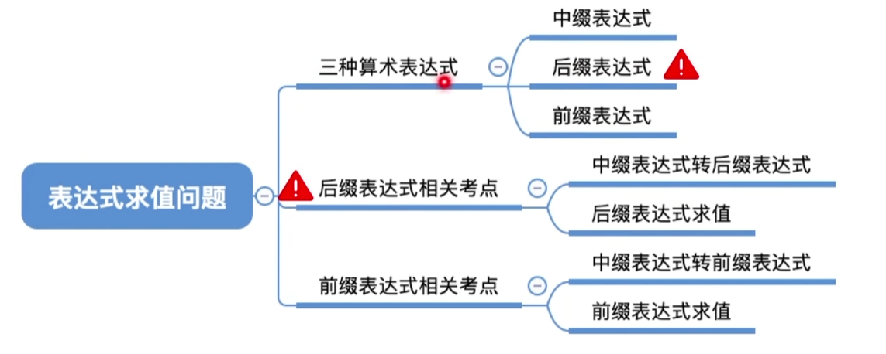

-   操作数 运算符 界限符（括号）

## 表达式

-   前缀表达式 ----波兰表达式
-   后缀表达式 ---- 逆波兰表达式

~~~
中缀       后缀       前缀
a + b     a b +     + a b  
~~~

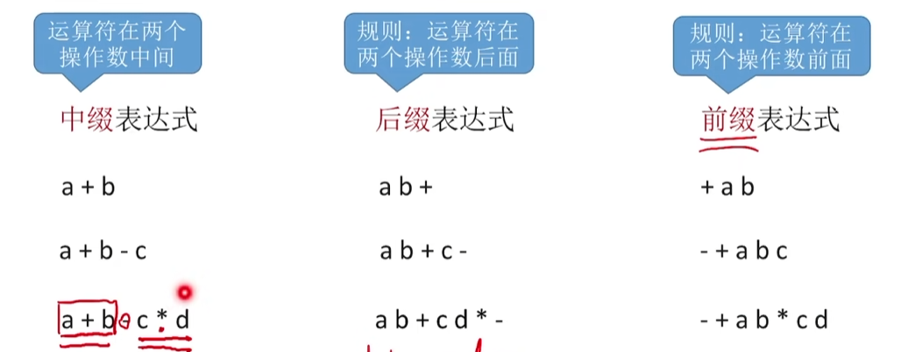

## 代码 栈（后缀表达式）

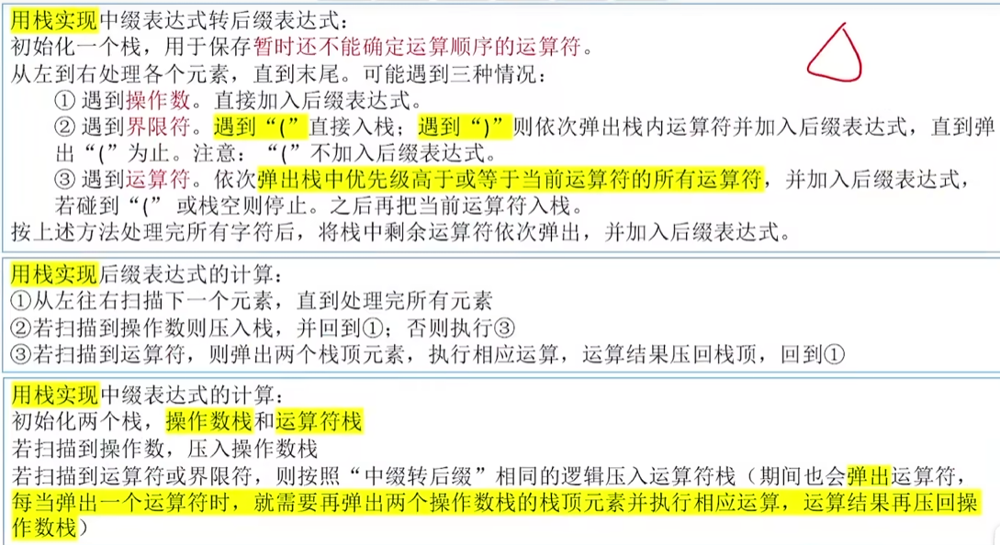

-   中缀转后缀
    -   遇到操作数直接加入表达式（string +=）
    -   遇到**(**括号入栈，遇到**)** 一次弹出栈内运算符并加入后缀表达式,直到遇到**(**停止
    -   运算符：将栈中所有等级大于等于的操作符加入后缀表达式，遇到右括号停止，然后把**自己压入栈**

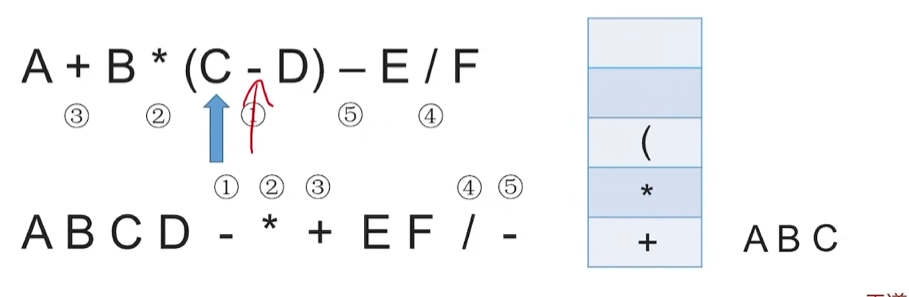

-   后缀计算

    -   从左向右遇到数字入栈

    -   遇到操作符两次出栈再将结果入栈

    -   **后缀表达式 -- 左优先原则**

    -   **优先算左边的保证计算的唯一（）**

-   ~~~
    A + B - C * D / E + F
    
    AB+ CD*E/-F+
    
    x + y * (z - u) / v
    栈内 +*(-
    xyzu-
    when c = / 向前找，把大于等于的都输出
    xyzu-*
    栈内+/
    xyzu-*v/+
    ~~~

~~~
#include <iostream>
#include <stack>
#include <string>
#include <cctype>

using namespace std;

// 函数：返回运算符优先级
int precedence(char op) {
    if (op == '+' || op == '-') return 1;
    if (op == '*' || op == '/') return 2;
    return 0;
}

// 判断是否为运算符
bool isOperator(char c) {
    return c == '+' || c == '-' || c == '*' || c == '/';
}

// 中缀转后缀
string infixToPostfix(const string& infix) {
    stack<char> ops;
    string postfix;

    for (size_t i = 0; i < infix.size(); i++) {
        char c = infix[i];

        if (isspace(c)) continue; // 忽略空格

        if (isalnum(c)) {
            // 操作数直接加入后缀表达式
            postfix += c;
            postfix += ' '; // 添加空格分隔
        }
        else if (c == '(') {
            ops.push(c);
        }
        else if (c == ')') {
            while (!ops.empty() && ops.top() != '(') {
                postfix += ops.top();
                postfix += ' ';
                ops.pop();
            }
            if (!ops.empty() && ops.top() == '(')
                ops.pop();
        }
        else if (isOperator(c)) {
            while (!ops.empty() && precedence(ops.top()) >= precedence(c)) {
                cout<<c<<' '<<ops.top()<<endl;
                
                postfix += ops.top();
                postfix += ' ';
                ops.pop();
            }
            ops.push(c);
        }
    }

    // 弹出栈中剩余的运算符
    while (!ops.empty()) {
        postfix += ops.top();
        postfix += ' ';
        ops.pop();
    }

    // 去掉末尾空格
    if (!postfix.empty() && postfix.back() == ' ')
        postfix.pop_back();

    return postfix;
}

int main() {
    string infixExpr;
    // cout << "请输入中缀表达式: ";
    getline(cin, infixExpr);

    string postfixExpr = infixToPostfix(infixExpr);
    cout << "对应后缀表达式: " << postfixExpr << endl;

    return 0;
}
~~~

## 代码 （前缀表达式）

-   从右向左扫描，遇到数字入栈否则...

**前缀表达式 -- 右优先原则**

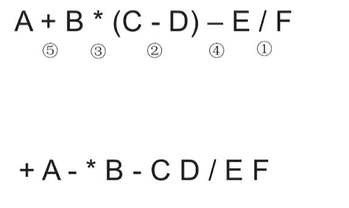

# 数的层次遍历（列表应用）

# 矩阵压缩存储

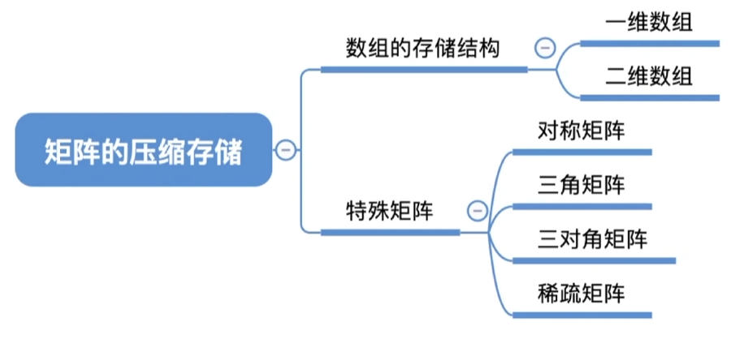

## 二维数组

**注意**

~~~
A[n][n] 等价于A[0...n - 1][0...n - 1]
A[1...n][1...n] 表示下标从1开始
~~~

-   行优先

~~~
b[i][j] = LOC + (i * N + j) * sizeof(int)
~~~

-   列优先

~~~
b[i][j] = LOC + (j * N + i) * sizeof(int)
~~~

## 对称矩阵

-   关于主对角线对称
-   存上三角区或下三角区 + 主对角线

-   下标从0开始

| **存储区域** | **常见顺序** | **一维数组下标 k 的计算公式**     | **备注**                 |
| ------------ | ------------ | --------------------------------- | ------------------------ |
| **下三角**   | **行优先**   | $k = \frac{i(i+1)}{2} + j$        | **最常考**，逻辑最顺     |
| **下三角**   | **列优先**   | $k = \frac{(2n-j+1)j}{2} + (i-j)$ | 等同于上三角行优先的逻辑 |
| **上三角**   | **行优先**   | $k = \frac{(2n-i+1)i}{2} + (j-i)$ | 每一行长度递减           |
| **上三角**   | **列优先**   | $k = \frac{j(j+1)}{2} + i$        | 等同于下三角行优先的逻辑 |

-   下标从1开始的

| **存储区域** | **存储方向** | **对应公式 k=…**                    | **元素个数**       |
| ------------ | ------------ | ----------------------------------- | ------------------ |
| **下三角**   | 行优先       | $\frac{i(i-1)}{2} + j$              | $\frac{n(n+1)}{2}$ |
| **下三角**   | 列优先       | $\frac{(2n-j+2)(j-1)}{2} + (i-j+1)$ | $\frac{n(n+1)}{2}$ |
| **上三角**   | 行优先       | $\frac{(2n-i+2)(i-1)}{2} + (j-i+1)$ | $\frac{n(n+1)}{2}$ |
| **上三角**   | 列优先       | $\frac{j(j-1)}{2} + i$              | $\frac{n(n+1)}{2}$ |

-   `行优先就是把i --> i + 1` 长度递增
-   `列优先就是把j --> j - 1` 长度递减

## 三角矩阵

### 下三角

**特点**：主对角线以上的元素均为同一常数 $c$（通常为 0）。

**存储内容**：下三角区域的 $\frac{n(n+1)}{2}$ 个元素 + 1 个常数 $c$（存放在最后）。

#### 行优先存储 (Row Major)

若 $i \ge j$（在下三角区域）：
$$
k = \frac{i(i+1)}{2} + j
$$

若 $i < j$（在上三角区域）：
$$
k = \frac{n(n+1)}{2}
$$

### 上三角

**特点**：主对角线以下的元素均为同一常数 $c$。

#### 行优先存储 (Row Major)

若 $i \le j$（在上三角区域）：
$$
k = \frac{(2n - i + 1)i}{2} + (j - i)
$$
若 $i > j$（在下三角区域）：
$$
k = \frac{n(n+1)}{2}
$$

### 总结

###  “行优先” vs “列优先” 的互换规律

这是理清所有矩阵压缩问题的“降维打击”工具：

-   **下三角的行优先** $\equiv$ **上三角的列优先**
    -   公式都是：$\frac{\text{下标}(\text{下标}+1)}{2} + \text{偏移}$。
-   **上三角的行优先** $\equiv$ **下三角的列优先**
    -   公式都是：$\frac{(2n - \text{下标} + 1)\text{下标}}{2} + \text{偏移}$。

>   **记忆技巧**：看“变长”的方向。如果每一行越来越长（1, 2, 3...），公式就是简单的 $i(i+1)/2$；如果每一行越来越短（n, n-1, n-2...），公式就需要用到 $n$ 来倒扣。

## 三对角矩阵

除了主对角线和相邻的两条对角线外，其余元素均为 0。

对于一个 $n \times n$ 的三对角矩阵 $A$，只有满足 $|i - j| \le 1$ 的元素 $A[i][j]$ 才非零。

**总元素个数**：$2 \times 2 + (n - 2) \times 3 = \mathbf{3n - 2}$。

-   映射函数L:

`K = 2i + j(下标从a[0][0]开始)`

`K = 2i + j - 3(下标从a[1][1]开始)`

如果你知道一维数组的下标 $k$，想找回它在矩阵中的位置：

-   **行号 $i$**：$i = \lfloor (k + 1) / 3 \rfloor$
-   **列号 $j$**：$j = k - 2i$

## 稀疏矩阵

-   三元组 + 行列值 + 非零元素的个数

`(i,j,value)`

失去了随机存取的特性

-   十字链表法

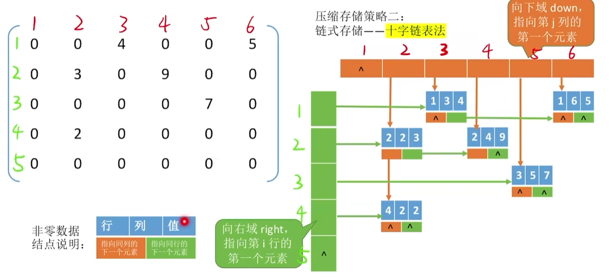
