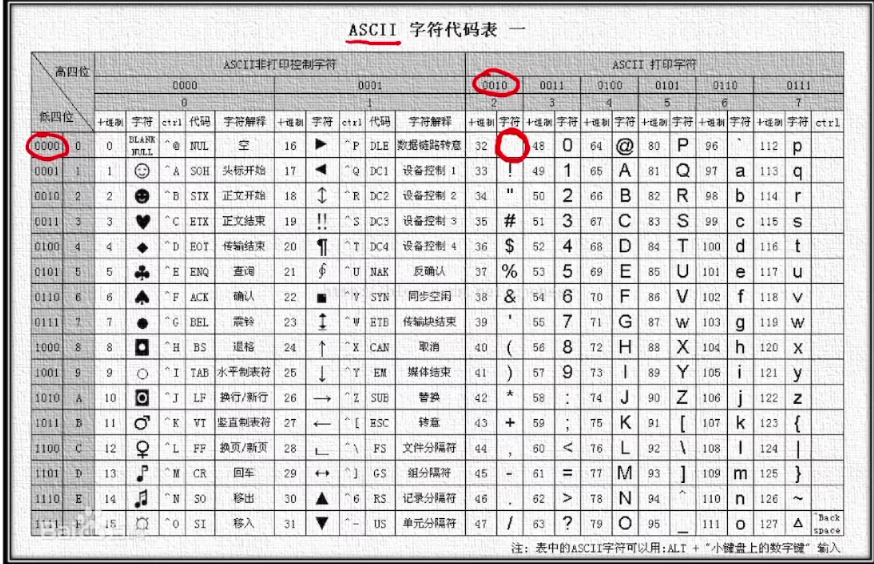
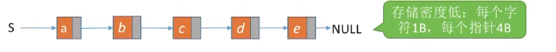
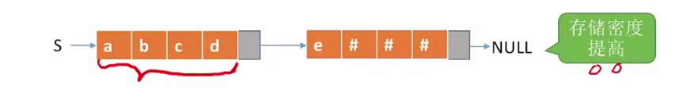
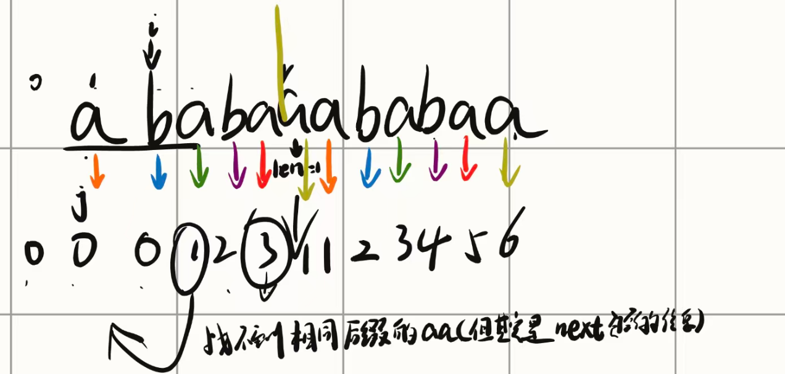

# 串定义

**默认从char[1]开始访问**

-   由字符组成的有限变量

-   子串：串中任意个连续的字符组成的子序列。
-   主串：包含子串的串。
-   字符在主串中的位置：字符在串中的序号。
-   子串在主串中的位置：子串的第一个字符在主串中的位置。

## 性质

是一个特殊的线性表

## 操作

-   赋值
-   复制
-   判空
-   len
-   清空
-   销毁
-   拼接
-   截取
-   定位
-   比较

## 字符集编码



-   英文：ASCII
-   中英文：Unicode（uft-8）

# 存储

## 顺序存储

**静态存储**

~~~
#define MaxLen 255
typedef struct{
	char ch[MaxLen];
	int length;
}SString;
~~~

**动态存储**

~~~
typedef struct{
	char *ch;
	int length;
}HString;

HString S;
S.ch = (char *)malloc(sizeof(char));
S.length = 0;
~~~

## 链式存储

~~~
typedef struct StringNode{
	char ch;
	strcut StringNode *next;
}StringNode,* string;
~~~

-   存储密度低
-   
-   一般来说一个结点存四个字符

~~~
typedef struct StringNode{
	char ch[4];
	strcut StringNode *next;
}StringNode,* string;
~~~



-   char不满，拿别的东西填("#")

# 操作

## 求子串

~~~
#include<stdio.h>
#include<string.h>

#define l 255
typedef struct String{
    char ch[l];
    int length;
}SString;

SString subString(SString &S, int st, int ed)
{
    SString ans;
    // 初始化ans
    memset(ans.ch, 0, sizeof(ans.ch));
    ans.length = 0;
    
    // 边界检查
    if(st < 0 || ed >= S.length || st > ed) {
        return ans;
    }
    
    ans.length = ed - st + 1;
    // 修正：数组下标从0开始
    for(int i = st; i <= ed; i++) {
        ans.ch[i - st] = S.ch[i];  // 这里原来是 i - st + 1，应该是 i - st
    }
    ans.ch[ans.length] = '\0';  // 添加字符串结束符
    
    return ans;
}

int main(){
    SString S;
    // 初始化S
    strcpy(S.ch, "Hello World");
    S.length = strlen(S.ch);
    
    SString result = subString(S, 1, 2);
    
    // printf不能直接打印结构体
    printf("Substring: %s\n", result.ch);
    printf("Length: %d\n", result.length);
    
    return 0;
}
~~~

## 比较子串

~~~
int f(String A,String B)
{
	for(int i = 1 ;i <= A.length&&B.length ;i ++)	
		if(A.ch[i] != B.ch[i])	
			return A.ch[i] - B.ch[i];
	return A.length - B.length// 长度更大
}
~~~

## 定位子串&&模式匹配

-   字串中找到与模式串相同的子串

~~~
主串长度为n
子串为m
一共有 n - m + 1个字串

可以爆搜 O(nm)

int Index(SString S, SString T) {
    int i = 1, n = StrLength(S), m = StrLength(T);
    SString sub;      // 用于暂存子串

    // 只要 i 没越界，就继续循环
    // n-m+1 是主串中剩余长度足以匹配模式串 T 的最后一个起始位置
    while (i <= n - m + 1) {
        // 取出从位置 i 开始，长度为 m 的子串
        SubString(sub, S, i, m);

        // 如果不相等（返回值 != 0），则继续比较下一个位置
        if (StrCompare(sub, T) != 0)
            ++i;
        else
            return i; // 返回子串在主串中的位置
    }
    return 0; // S 中不存在与 T 相等的子串
}
--------------------------------------------------------
双指针O(NM)


~~~

# KMP


`O(n+m)`

双指针i是不会递减的

` next数组就是找子串中最长的前缀`

## 求next

-   当 `P[0..i]` 匹配失败时，模式串可以移动到的位置，也就是最长的**真前缀 = 真后缀**长度。
    -   前缀指的是串开头的字母
    -   后缀指的是以当前字母结尾的尾i
-   匹配失败时，模式串应该从哪一位继续尝试，而不用重新匹配已经确认过的部分。       

**找前缀时是从第一个位置开始看，如果相同则公共前缀长度才加1**

-   查看当前字母和最大长度位置的字母是否相同
    -   不同：
        -   len == 0时，next添加一个0 
        -   否则 更新公共长度while(s\[len] != s\[i])`len = next[len - 1]`直到相同，
    -   相同
        -   公共长度++
        -   把当前的字母next添加进去



~~~
S = 
p = "ABABABAB"
    "12345678"
next[1] = 0
next[2] = 0前两个匹配前缀和后缀都不相等
next[3] = 1最大的前缀和后缀是多少 len = 1 aa len = 2 ab ba 
next[4] = 2 len = 2 ab ab
next[5] = 3 len = 3 aba aba
next[6] = 4 len = 4

~~~

~~~
上面的是PM数组
0 0 1 2 3 1 1 2 3 4 5 6
next数组
把"-1" += pm
next1 = -1 0 0 1 2 3 1 1 2 3 4 5
或者
next2 += 1 
0 1 1 2 3 4 2 2 3 4 5 6
~~~

## 求
```
ababaaababaa

```

PM
```c
#include <iostream>
#include <vector>
#include <string>

using namespace std;

// 计算 PM（部分匹配表 / 最长公共前后缀长度）数组
vector<int> get_pm(const string &p) {
    int n = p.length();
    vector<int> next(n, 0); // 初始全部置 0，next[0] 默认即为 0
    int len = 0;            // 当前最长公共前后缀长度
    int i = 1;              // 从第 1 个字符开始遍历

    while (i < n) {
        if (p[i] == p[len]) {
            len++;
            next[i] = len;
            i++;
        } else {
            if (len == 0) {
                next[i] = 0;
                i++;
            } else {
                // 回退到上一个可能的最长公共前后缀位置
                len = next[len - 1];
            }
        }
    }
    return next;
}
```
第一位默认是0
a ！= b
```
0012312345
```
next
```c
#include <iostream>
#include <vector>
#include <string>

using namespace std;

// 1. 标准 408 版本的 next 数组求解
// 注意：传入的 p 最好在首部补一个占位符，如 p = " " + pattern
vector<int> get_408_next(const string &p) {
    int m = p.length() - 1; // 模式串实际有效长度（从下标 1 到 m）
    vector<int> next(m + 1, 0);

    int j = 1; // 当前正在处理的字符位置
    int k = 0; // 回退指针 / 匹配的前缀长度
    next[1] = 0;

    while (j < m) {
        if (k == 0 || p[j] == p[k]) {
            j++;
            k++;
            next[j] = k;
        } else {
            k = next[k]; // 失配时指针回退
        }
    }
    return next;
}

// 2. 408 优化版 nextval 数组（同步构造）
vector<int> get_408_nextval(const string &p) {
    int m = p.length() - 1;
    vector<int> nextval(m + 1, 0);

    int j = 1;
    int k = 0;
    nextval[1] = 0;

    while (j < m) {
        if (k == 0 || p[j] == p[k]) {
            j++;
            k++;
            // 关键优化：检查回退后的字符是否与当前字符相同
            if (p[j] != p[k]) {
                nextval[j] = k;          // 字符不同，保留当前位置
            } else {
                nextval[j] = nextval[k]; // 字符相同，继承其优化值（隐式递归）
            }
        } else {
            k = nextval[k]; // 失配时利用 nextval 回退加速
        }
    }
    return nextval;
}
```
1. 整个平移，最前面插一个-1
2. 第二种是在第一种整体加1
```
-10012312345
或整体加1
```
nextval
第一位默认是0
两个平移
不一样的等于next2的值


求出原 `next` 数组后，逐位检查当前字符 $P[j]$ 与其回退位置字符 $P[\text{next}[j]]$：

- 若 **$P[j] == P[\text{next}[j]]$**：说明回退后依然是相同的字符，必失配，需继承其优化值：
    
    $$\text{nextval}[j] = \text{nextval}[\text{next}[j]]$$
    
- 若 **$P[j] \neq P[\text{next}[j]]$**：字符不同，回退有意义，保留原值：
    
    $$\text{nextval}[j] = \text{next}[j]$$
    
- **特例**：第 1 位固定为 $0$（即 $\text{nextval}[1] = 0$）。
```c
求nextval
int get_nextval(int j) {从1开始
    if (j == 1) return 0;
    
    // 如果当前字符和退回去的字符一样
    if (P[j] == P[next[j]]) {
        // 递归调用自身！继续往前剥，直到找到不一样的字符或者退到 0
        return get_nextval(next[j]); 
    } else {
        return next[j];
    }
}
```