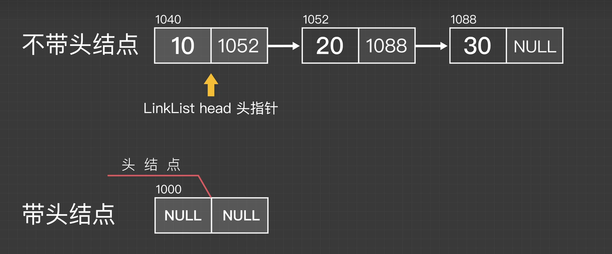
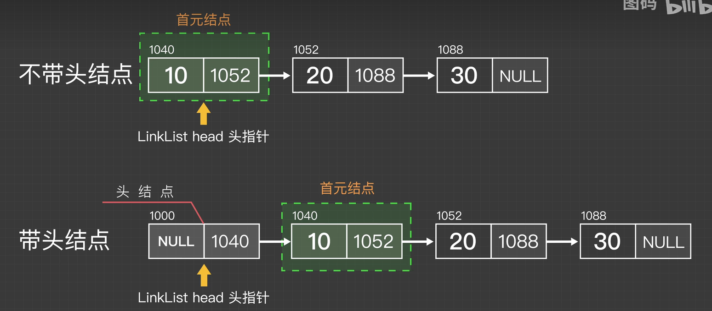
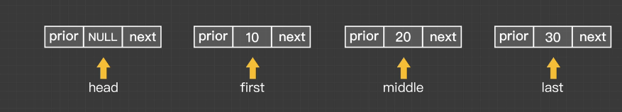
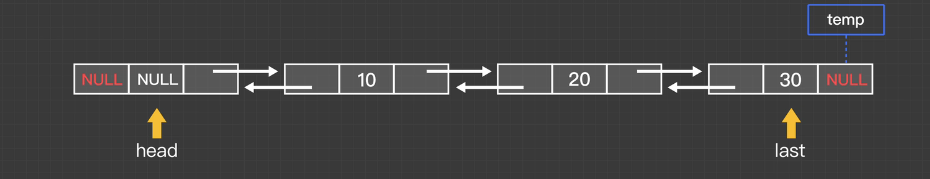

# 定义（逻辑结构，运算，存储结构）

-   逻辑结构是一条线
-   线性表是具有**相同数据**类型的n（n≥0）个数据元素的**有限** **序列**，其中n为表长，当n=0时线性表是一个空表。若用L命名线性表，则其一般表示为   L = （a1，a2,a...an）

## 性质

-   相同的数据类型
-   有序
-   有限个

# 基本操作

-   初始化  -- 分配内存

~~~
InitList(&L)
~~~

-   销毁--- 释放内存

~~~
DestoryList(&L)
~~~

-   插入
-   输出

~~~
ListInsert(&L,i,e)
ListDelete(&L,i,&e)
~~~

-   按值查找
-   按位查找

~~~
(L,e）
(L,i)
~~~

-   表长
-   输出
-   判空

# 线性表

## 顺序表

-   逻辑上相邻的元素存储在物理位置上也相邻的存储单元
-   `sizeof(int) = 4B`

~~~c
# 定义一个顺序表,静态分配
#define Maxsize = 10
typedef struct{
	ElemType data[Maxsize];
	int length;
}SqList;//顺序表的类型定义

void InitList(SqList &L){
	for(int i = 0 ;i < Maxsize ;i ++)
		L.data[i] = 0;  // 如果补初始化，数组会被之前的数据污染（遗留有脏数据）
	L.length = 0;
}
int main(){
	SqList L;
	InitList(L);
}
~~~

~~~c
# 动态分配
#include<strlib.h>

#define InitSize 10
typedef struct{
	ElemType *data; // 指针指向第一个数据元素
	int MaxSize;
	int length;
}SeqList;

void InitList(SeqList &L)
{
    // 申请连续的存储空间
	L.data = (int *)malloc(InitSize*sizeof(int));
	L.length = 0;
	L.MaxSize = InitSize
}
// 动态增加数组长度
void IncreaseSize(SeqList &L,int len){
	int *p = L.data;
	L.data = (int *)malloc(sizeof(int)*(len + L.MaxSize));
	for(int i = 0 ;i < L.length; i ++)
		L.data[i] = p[i];
	L.MaxSize = L.MaxSize + len;
	free(p);
	
}

int main(){
	SeqList L;
	InitList(L);
	IncreaseSize(L,5);
	
}
~~~

## malloc

`动态申请内存 malloc`、

~~~c
L.data = (ElemType *)malloc(sizeof(ElemType)*InitSize)
L.data = (int *)malloc(sizeof(int)*InitSize)
malloc 返回一个指针,返回申请的初始内存地址。需要强制转型为int类型的指针
malloc 在申请内存时，绝对不会保留或复制旧内存中的数据。它只是向操作系统请求一块新的、未初始化的内存空间。
只负责“圈地”，不负责“搬家”。它给的新内存是空的（或者说充满随机噪声）。
~~~

在实际开发中，这种“分配新内存 -> 拷贝旧数据 -> 释放旧内存”的操作非常常见，C 标准库提供了一个专门的函数来做这件事：**`realloc`**。

使用 `realloc` 可以简化代码，它会自动尝试在原地扩容，如果不行则会自动分配新内存并帮你把旧数据拷贝过去：

~~~c
void IncreaseSize(SeqList &L, int len) {
    // 尝试重新分配内存：大小为 (当前最大容量 + 新增长度) * 单个元素大小
    // realloc 会自动将旧内存中的数据拷贝到新内存中（如果需要移动的话）
    int *new_data = (int *)realloc(L.data, sizeof(int) * (L.MaxSize + len));
    
    // 【重要】必须检查 realloc 是否成功
    // 如果内存不足，realloc 返回 NULL，但原内存 (L.data) 依然有效且未被释放
    if (new_data == NULL) {
        // 处理分配失败的情况（例如：打印错误、退出程序或保持原状）
        // 这里选择直接返回，保持顺序表原状，防止程序崩溃
        return; 
    }
    
    // 只有分配成功，才更新指针和最大容量
    L.data = new_data;
    L.MaxSize = L.MaxSize + len;
    
    // 注意：L.length (当前元素个数) 不需要改变，因为只是扩大了容量空间
}

realloc 的智能行为：
如果原地后面有足够的空间，它直接在原地扩容，速度极快。
如果原地不够，它会自动分配新内存 -> 拷贝旧数据 -> 释放旧内存。这完全替代了你之前手写的 malloc + for 循环 + free 的过程。
if (new_data == NULL) 检查至关重要：
如果 realloc 失败（返回 NULL），原来的 L.data 指针依然是有效的，里面的数据也还在。
如果你不检查直接写 L.data = realloc(...)，一旦失败，L.data 就会变成 NULL，导致你丢失了原数据的地址（内存泄漏），后续访问还会导致程序崩溃。
所以必须先赋值给一个临时指针 new_data，确认成功后再赋给 L.data。
参数含义：
L.MaxSize + len：这是扩容后的总容量。
L.length：这是当前实际存储的元素个数，扩容操作不改变它。
~~~

`动态释放内存 free`

## 插入，删除操作

~~~c
// 插入操作
// 静态存储方式

#include<stdlib.h>
#include<stdio.h>
#define MaxSize 10

typedef struct{
    int data[MaxSize];
    int length;
}SeqList;

void InitList(SeqList &L){
    for(int i = 0 ;i < MaxSize;i ++)
        L.data[i] = 0;
    L.length = 0;
}

void InsertList(SeqList &L,int j,int war){
    for(int i = L.length;i > j ;i--)
        L.data[i] = L.data[i - 1];
    L.data[j] = war;
    L.length ++;
}

bool DeleteList(SeqList &L,int j)
{
    int length = L.length;
    if(j < 0 || j >= length)  
        return false;
    for(int i = j ;i < length; i ++)
        L.data[i] = L.data[i + 1];
    L.length --;
    return true;
}
int main(){
    SeqList L;
    InitList(L);
    for(int i = 0 ;i < 5 ;i ++)
        L.data[i] = i;
    L.length = 5;
    for(int i = 0 ;i < L.length ;i ++)
        printf("%d ",L.data[i]);
    printf("\n");
    InsertList(L,2,100);
    for(int i = 0 ;i < L.length ;i ++)
        printf("%d ",L.data[i]);
    
}
~~~

O(n)

## 顺序表的特点

-   随机访问：O（1）找到第i个元素
-   存储密度高，每个节点只存储数据元素
-   拓展容量不方便
-   插入删除不方便

# 单链表

-   一个结点要存两个数据
    -   数据
    -   指向下一个结点的指针

## 定义结点

~~~c++
typedef struct LNode{
	int data;
	struct LNode *next;
}LNode,*LinkList;
表示先重命名为LNode，LinkList表示指向LNode的指针
    
LNode * Getelem(LinkList L,int i)
LNode * ==== LinkList L
返回一个结点      强调是单链表
    
    
~~~

## 增加新结点

~~~
LNode *p = (LNode *)malloc(sizeof(LNode)); 
~~~

 ## 不带头结点的单链表

~~~
typedef struct LNode{
	int data;
	struct LNode *next;
}LNode,*LinkList;
// 初始化一个空的单链表
bool InitList(LinkList &L)
{
L = NULL; // 空表
return true;
}
// 判断空
bool Empty(LinkList L)
{
	return (L == NULL);
}

~~~

## 带头结点

~~~
typedef struct LNode{
	int data;
	struct LNode *next;
}LNode,*LinkList;
// 初始化一个空的单链表
bool InitList(LinkList &L)
{
	L = (LNode *)malloc(sizeof(LNode));
    if(L = NULL) // 内存不足
	    return false;
	L ->next = null;
	return true;
}
// 判断空
bool Empty(LinkList L)
{
	return (L->next == NULL);
}

int main(){
	LinkList L;
	InitList(L);
}
~~~

-   头结点不存储数据
-   写起来比较方便

## 单链表的插入

### 带头结点，插入操作(后插入)

==找到第i-1个结点，插入==

在表L中的第i个位置上插入指定元素e

-   找到第i-1个结点，将新结点插入其后

----

操作步骤 ---- 3个核心步骤

-   申请一个结点空间
-   s.data 值指向e
-   (以下两句顺序不能颠倒)
-   s的指针指向p.next
-   p.next 指向s

----

~~~
bool ListInsert(LinkList &L,int i,int e)
{
    if(i < 1)   return false;
    int j = 0;  
    LNode *p = L;
    while(p != NULL && j < i - 1)
    {
        p = p -> next;
        j ++;
    }
    LNode *s = (int)malloc(sizeof(LNode));
    s -> data = e;
    s -> next = p->next;
    p -> next = s;
}
~~~

### 完整代码

~~~
#include <stdio.h>
#include <stdlib.h> // 包含 malloc 和 free

// 1. 定义单链表节点结构
typedef struct LNode {
    int data;           // 数据域
    struct LNode *next; // 指针域
} LNode, *LinkList;

// 2. 初始化链表（带头结点）
// 返回 true 表示成功，false 表示失败
bool InitList(LinkList *L) {
    *L = (LNode *)malloc(sizeof(LNode)); // 分配头结点
    if (*L == NULL) return false;        // 内存分配失败
    (*L)->next = NULL;                   // 头结点的 next 置空
    return true;
}

// 3. 在第 i 个位置插入元素 e
// L: 头指针的引用（二级指针或指向指针的指针，但在 C 中通常传头指针的地址或者直接用全局/外部变量，这里为了模拟 C++ 的引用，我们传 LinkList* 或者假设 L 已经初始化好）
// 注意：标准 C 没有引用(&)，如果要在函数内修改头指针本身（如不带头结点的情况），需要传 LinkList *L。
// 但本题是带头结点，且只修改头结点后的内容，直接传 LinkList L 即可。
// 为了和你之前的代码签名保持一致（模拟引用效果），这里我们直接操作传入的 L（假设调用者已经确保了 L 有效）。
// 修正：标准的 C 语言实现通常直接传 LinkList L，因为头结点地址不变。
bool ListInsert(LinkList L, int i, int e) {
    if (i < 1) return false;

    int j = 0;
    LNode *p = L; // p 指向头结点

    // 寻找第 i-1 个结点
    while (p != NULL && j < i - 1) {
        p = p->next;
        j++;
    }

    // 如果位置非法（超过了链表长度+1），p 会变成 NULL
    if (p == NULL) {
        return false;
    }

    // 创建新结点
    // 【重要修正】：malloc 返回 void*，在 C 中强转为 (LNode*)，而不是 (int)
    LNode *s = (LNode *)malloc(sizeof(LNode));
    if (s == NULL) return false; // 内存分配失败检查

    s->data = e;
    s->next = p->next;
    p->next = s;

    return true;
}

// 4. 打印链表
void PrintList(LinkList L) {
    LNode *p = L->next; // 从第一个实际数据结点开始（跳过头结点）
    printf("链表内容: ");
    while (p != NULL) {
        printf("%d -> ", p->data);
        p = p->next;
    }
    printf("NULL\n");
}

// 5. 销毁链表（释放内存）
void DestroyList(LinkList L) {
    LNode *p = L;
    while (p != NULL) {
        LNode *temp = p;
        p = p->next;
        free(temp);
    }
}

int main() {
    LinkList L;

    // 初始化
    if (!InitList(&L)) {
        printf("初始化失败！\n");
        return -1;
    }
    printf("链表初始化成功（带头结点）。\n");

    // 测试插入
    printf("\n--- 开始插入测试 ---\n");

    // 在第 1 个位置插入 10
    if (ListInsert(L, 1, 10)) {
        printf("插入 10 到位置 1: 成功\n");
    } else {
        printf("插入 10 到位置 1: 失败\n");
    }
    PrintList(L);

    // 在第 2 个位置插入 20
    if (ListInsert(L, 2, 20)) {
        printf("插入 20 到位置 2: 成功\n");
    }
    PrintList(L);

    // 在第 1 个位置插入 5 (插在 10 前面)
    if (ListInsert(L, 1, 5)) {
        printf("插入 5 到位置 1: 成功\n");
    }
    PrintList(L);

    // 尝试插入到非法位置 (例如第 10 个位置，当前只有 3 个元素)
    if (ListInsert(L, 10, 99)) {
        printf("插入 99 到位置 10: 成功\n");
    } else {
        printf("插入 99 到位置 10: 失败 (位置越界)\n");
    }
    PrintList(L);

    // 清理内存
    DestroyList(L);
    printf("\n链表已销毁。\n");

    return 0;
}
~~~

### 不带头节点

-   需要对第一个结点特殊处理
-   需要改变头指针的指向

~~~
bool ListInsert(LinkList &L,int i,int e)
{
    if(i < 1)   return false;
    if(i == 1)
    {
    	LNode *s = (LNode *)malloc(sizeof(LNode));
    	s ->data = e;
    	s ->next = L; // L指向第一个结点
    	L = s; // 头指针指向新第一结点
    	return true;
    }
    int j = 1; // 这里要变成1  
    LNode *p = L;

    while(p != NULL && j < i - 1)
    {
        p = p -> next;
        j ++;
    }
    LNode *s = (int)malloc(sizeof(LNode));
    s -> data = e;
    s -> next = p->next;
    p -> next = s;
}
~~~

### 前插入

不知道前面的结点是什么？

解决：

-   传入头指针一次，以此遍历，找到前驱
-   先插到后面，在把值换位置

~~~
struct LNode{
	int data;
	LNode *next;
}lnode;
bool ListInsert(LNode *p,int e)
{
    if(p == NULL)
        return false;
    LNode *s = (LNode *)malloc(sizeof(LNode));
    if(s == NULL)
        return false;
    s -> next = p -> next;
    s -> data = p -> data;
    p -> next = s;
    p -> data = e;
    return true;
}
~~~

## 删除

### 带头节点

-   先找到前驱结点
-   

~~~
#include<stdlib.h>
#include<stdio.h>
#define MaxSize 10

struct LNode{
    int data;
    LNode *next;
}LNode,*LinkList;

bool ListDelete(LinkList &L,int i,int &e)
{
    if(i < 1)
        return false;
    LNode *p = L;
    if(p == NULL)
        return false;
    int j = 0;
    while(p != NULL && j < i - 1)
    {
        p = p -> next;
        j ++;
    }
    if(p == NULL)
        return false;
    LNode q = p -> next;
    e = q -> data;
    p -> next = q -> next;
    free(q);
    
}
int main(){
    LNode L;
    
}
~~~

~~~
// 1. 【安全检查】必须先判断 p 和 p->next 是否为空
if (p == NULL || p->next == NULL) {
    return false; // 删除失败，位置非法
}

// 2. 用 q 记住要删除的节点（防止丢失地址）
LNode *q = p->next; 

// 3. 保存数据 (你写的这行是对的)
e = q->data; 

// 4. 断链 (你写的这行也是对的，但用 q 写更清晰)
p->next = q->next; 

// 5. 【关键】释放内存 (你漏掉的这一步)
free(q); 
~~~

## 单链表的建立

-   带头节点 头插
-   带头节点 尾插

-   不带头节点 头插
-   不带头节点 尾插

### 不带头节点和带头节点的区别

-   head指向链表中第一个元素

~~~
# 不带头节点
## 判空
head -> null ==== head == null
## 初始化
LinkList head = NULL;

# 带头节点
## 判空
head -> next == null
## 初始化
LinkList head = (LNode *)malloc(sizeof(LNOde));
head ->next = null
~~~

**给很多个数据元素怎么存？**

-   初始化   [带头节点](带头节点.md)(#带头结点):
-   去一个数据元素查到表头或表尾

### 头插法

~~~
# 不带头结点
// 创建一个新节点
LinkList *newNode = (LNode *)malloc(sizeof(LNOde));
newNode -> data = e;
// 将新节点成为第一个结点，并连接到原链表中
newNode -> next = head;
head = newNode;

# 带头节点
LinkList *newNode = (LNode *)malloc(sizeof(LNOde));
newNode -> data = e;

newNode -> next = head -> next;
head -> next = mewNode;
~~~

-   在头节点插入一个新结点

~~~
例如
head - 1 - 2 - 3 - null 插入一个5
带头结点
head - 5 - 1 - 2 - 3 - null
~~~

**他会让先插入的在最末尾，插入顺序如果是1 2 3 4 5 6，那么从头节点开始看就是 head - 6 5 4 3 2 1**

### 尾插法

-   相反与头插法，元素插入到尾部，
    -   先要找到最后一个元素

-   带头结点的链表

~~~
LinkList *newNode = (LNode *)malloc(sizeof(LNOde));
newNode -> data = e;
newNode -> next = NULL;

让lastNode 指向头结点，当作最后一个结点
LNode *lastNode = head;
while(lastNode -> next != null)
	lastNode = lastNode -> next;
lastNode -> next = newNode;
head -> data = head -> data + 1
~~~

# 双链表

-   data
-   前驱
-   后继

**链接这四个结点**

~~~
head无前驱
head.prior = null
head.next = first

first.prior = head;
first.next = second
~~~

## 遍历

-   创建一个tmp指针

~~~
DNode * tmp = head —>next;
while(temp!=NULL)
{
	printf
	tmp = tmp -> next;
}
~~~

## 初始化

-   分配头节点
-   定义前驱后继

~~~
L = (DNode *)malloc(sizeof(DNode));
if(L == NULL)
	return false;
	
L -> prior = NULL;
L -> next = NULL;
return true;

void main(){
	DLinkList L;
	init(L)
}
~~~

## 插入

~~~
p s m

s -> next = p -> next;
s -> prior = p;
p -> next -> prior = s;
p -> next = s;
~~~

## 删除

~~~
p q删除q

q -> next -> prior = p;
p -> next = q -> next;
free(q)
~~~

# 循环链表

## 循环单链表

尾结点 `-> next = head而不是null`

### 初始化

同时也是判空条件

~~~
L -> next = L;
~~~

### 查看是否表尾

~~~
s -> next == L;
~~~

## 循环双链表

### 初始化

同时也是判空条件

~~~
L -> next = L;
L -> prior = L;
~~~

### 查看是否表尾

~~~
s -> next == L;
~~~

# 静态链表

-   连续的内存空间，各个节点集中安置
-   a[0]是头节点

-   每个存的都是下一个元素的位置

~~~
头 2
e2 6
e1 1
e4 -1

头 -> e1 -> e2 -> ... ->  -1
~~~

~~~
~~~

