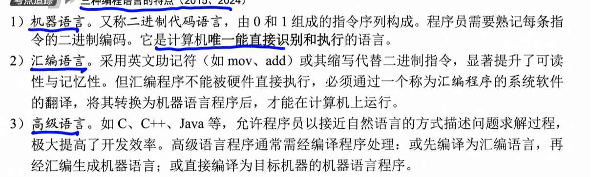
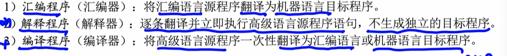
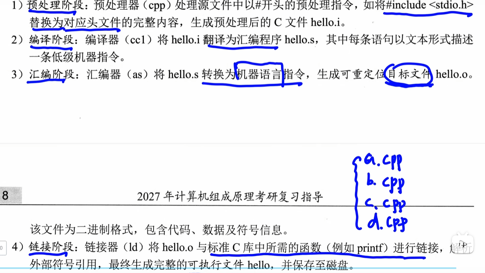
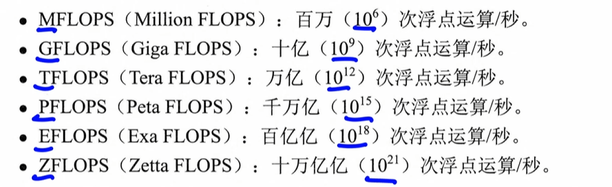

# [[计算机系统概述]]

# [[1.2计算机系统的层次结构]]

## [[1.2.1计算机系统组成]]

-   一个完整的计算机系统由**硬件**和**软件**组成

## [[1.2.2 冯诺依曼基本思想]]

首先他提出了存储程序的思想

1.   采用“存储程序”的工作方式：将编制好的程序和初始数据预先存入**主存储器**，计算机启动后能**自动连续的取地址**并执行，直至程序结束，无需人工干预
2.   硬件系统的组成：运算器，控制器，存储器，输入设备，输出设备
3.   **指令和数据**在存储器中**以相同形式存放**，仅凭内容无法区别，但计算机可以识别他们
4.   指令和数据均采用二进制编码
5.   指令由操作码和地址码组成，
     1.   操作码：指明操作类型
     2.   地址吗：指出操作数的地址

## [[计算机的部件]]

### CPU （中央处理器）

：将运算器，控制器和各类寄存器高度集成

组成：运算器和控制器，又叫做数据通路和控制单元

### 存储器

分为内存和外存

### 外部设备

IO

由物理功能不见和设备控制器

### 总线

总线是计算机中用于在**各个部件**之间传输信息的**公共通路。**

## [[编程语言]]

1.   机器语言
2.   汇编语言
3.   高级语言

## [[翻译程序]]

1.   汇编程序
2.   解释程序
3.   编译程序

### 高级程序变成可执行文件的过程

1.   预处理
2.   编译
3.   汇编
4.   链接

# [[1.3计算机性能指标]]

1.   CPU时钟周期：是CPU工作的**最小时间单位**

~~~
问一个指令需要执行四个周期
~~~

2.   主频：时钟周期的倒数，（每秒包含的时钟周期数）
3.   CPI:执行一条指令所需的时钟周期数
4.   平均CPI = $\frac{时钟周期总数}{指令条数}$，一条指令占的时钟
5.   IPS每秒执行多少条指令：$\frac{主频}{平均CPI}$
     1.   MIPS，每秒执行几百万条指令
6.   CPU执行时间：运行一个程序所需的时间

$T = \frac{n*CPI}{f}$

7.   FLOPS,每秒执行的浮点运算次数

