# [[2数据的表示和运算]]

# [[计算机常见进制及转换]]

## [[常见进制定义]]

-   **十进制**：0～9
-   **二进制**：0～1
-   **八进制**：0～7
-   **十六进制**：0～15（由 0～9 和 a～f / A～F 组成）
    -   a / A = 10
    -   b / B = 11
    -   c / C = 12
    -   d / D = 13
    -   e / E = 14
    -   f / F = 15

## [[进制转换关系]]

-   **十进制** ⇄ **二进制** ⇄ **十六进制**
-   **十进制** ⇄ **十六进制**

2.   按权展开

## [[一、 常见进制定义与数码表]]

-   **十进制 (Decimal)**：$0 \sim 9$
-   **二进制 (Binary)**：$0 \sim 1$
-   **八进制 (Octal)**：$0 \sim 7$
-   **十六进制 (Hexadecimal)**：$0 \sim 15$
    -   常规数字：$0 \sim 9$
    -   字母对应关系（大小写通用）：
        -   $a / A = 10$
        -   $b / B = 11$
        -   $c / C = 12$
        -   $d / D = 13$
        -   $e / E = 14$
        -   $f / F = 15$

## [[二、 进制转换核心关系]]

在计算机基础中，各进制间常见的转换路径如下：

1.  **十进制 $\rightleftarrows$ 二进制**
2.  **二进制 $\rightleftarrows$ 十六进制**
3.  **十进制 $\rightleftarrows$ 十六进制** （通常可以通过二进制作为中介快速转换，也可以直接计算）

## [[三、 不同进制的按权展开式 (重点)]]

通过将各进制数按权展开，可以直观地将其转换为**十进制数**。

### 1. 整数部分的按权展开

-   **十进制**：$1234 = 1 \times 10^3 + 2 \times 10^2 + 3 \times 10^1 + 4 \times 10^0$
-   **二进制**：$1011 = 1 \times 2^3 + 0 \times 2^2 + 1 \times 2^1 + 1 \times 2^0$
-   **十六进制**：$BF6D = 11 \times 16^3 + 15 \times 16^2 + 6 \times 16^1 + 13 \times 16^0$ （注：$B=11, F=15, D=13$）
-   **八进制**：$6724 = 6 \times 8^3 + 7 \times 8^2 + 2 \times 8^1 + 4 \times 8^0$

### 2. 含有小数部分的按权展开

当数字包含小数时，小数点右侧的数位权值依次为底数的负整数次幂（$-1, -2, -3 \dots$）：

-   **十进制小数**：

    $$123.456 = 1 \times 10^2 + 2 \times 10^1 + 3 \times 10^0 + 4 \times 10^{-1} + 5 \times 10^{-2} + 6 \times 10^{-3}$$

-   **二进制小数**：

    $$101.101 = 1 \times 2^2 + 0 \times 2^1 + 1 \times 2^0 + 1 \times 2^{-1} + 0 \times 2^{-2} + 1 \times 2^{-3}$$

# [[进制转换]]

1.   十进制D
2.   二进制B
3.   十六进制H   0x
4.   八进制O

## [[进制的展开]]


## [[十进制转二进制]]

方法：短除法一直除以2


从下往上写

~~~
对于十进制来说，/10可以得到最后一位
最先得到的是最低位
所以写的时候要逆着写
~~~

**十进制转任意进制**

就是一直 取余x，然后逆序

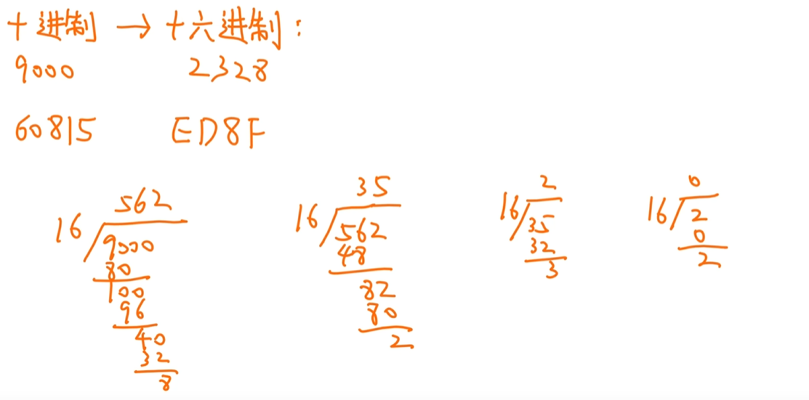

9000D转16进制

末尾是8，然后是2，3，到达0的时候停止，

| 0    | 1    | 2    | 3    | 4    | 5    | 6    | 7    | 8    | 9    | 10   | 11   | 12   | 13   | 14    | 15    | 16    |
| ---- | ---- | ---- | ---- | ---- | ---- | ---- | ---- | ---- | ---- | ---- | ---- | ---- | ---- | ----- | ----- | ----- |
| 1    | 2    | 4    | 8    | 16   | 32   | 64   | 128  | 256  | 512  | 1024 | 2048 | 4096 | 9192 | 16384 | 32768 | 65536 |

## [[十六进制转二进制]]

二进制转十六进制：每四个一组，不够的去最前面补0，然后合起来

十六进制转二进制：一个数分开成四个位，展开

## [[小数的二进制转换]]

**一直乘2，如果大于1，就给一个1，否则给0**

~~~
0.6875*2 = 1.3750 如果大于1，就给一个1   ----- 0.1
0.3750*2 = 0.75 否则给0 ----- 0.10
0.75*2 = 1.5 ----- 0.101
 ----- 0.1011
~~~

有的十进制小数不能转成二进制


# [[2编码表示]]

**真值：实际的数字 +5  -9  +100**

**机器数：0,101符号位 ,数值位 = +5**

**有符号数：第一位是正负，后面是数值位（）**

**无符号数：所有二进制都是数值(内存地址，指针)**

同一个机器数在不同的规定下有不同的数值

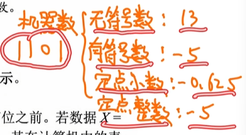


**定点表示：**

​	**定点整数：**

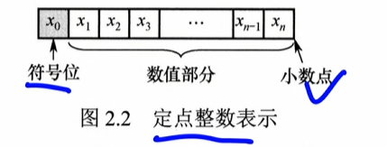

​	**定点小数**

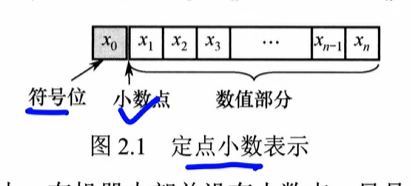

**浮点表示：**

## [[原码]]

0 表示正数，1表示负数

~~~
符号位 + 数值位(绝对值)
5 = 0 101
-5 = 1 101
~~~

~~~
四位原码
-（2^3-1）,2^3-1
8位原码
-（2^7-1）,2^7-1
n位原码
-（2^n-1）,2^n-1
~~~

### 最大值

0 111 => 2^3 - 1

### 最小值

1 111 => -2^3 + 1

### 0

两种

1 000

0 000 

## [[补码]]

正数：补码 = 原码

负数 ： 符号位保留，其余位都取反然后加一（从右开始找到第一个1，把之后的全部取反，符号位不变）

~~~
补码
5 = 0 101
-5 = 1 011


~~~

按照同样的方法，可以把补码变成原码

~~~
-5 = 1 011
1 011
1 100 + 1
= 1 101
~~~

~~~
四位补码
-2^3,2^3-1
8位补码
-2^7,2^7-1
n位补码
-2^n,2^n-1
~~~

补码计算舒服

如果溢出就不要了，符号位也要计算

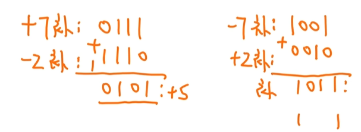

### 最小值

1 000 => -2^3

### 最大值

0111 = 2^3 - 1

### -1

全1

1 111

### 0

0 000

### 补码数轴看法

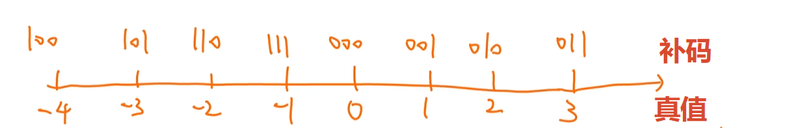

特点：

1.   正数的话，补码越大真值越大
2.   负数的话，补码越小真值也越小，但是在0处断开

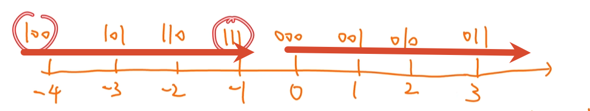

转换问题：

给-3的补码问-1的补码

直接给补码加上2就可以了

~~~
-3(101) + 2(010) = -1(111)

FFF8 + 5 = FFFD
~~~

**比大小**

同为负数，把整个当成无符号数

~~~
FAFF < FFAB < 7A18
~~~


## [[反码]]

正数：等于原码

负数：符号位不变，数值位取反

~~~
5 = 0 101
-5 = 1 010
~~~

# [[方法：补码真值求法]]

如果给的是负数，当加上某个数变成1后面全零，那么这个数就是他的绝对值

**十六进制**

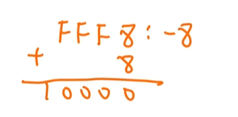

加上一个8，变成了1 0000 == -8

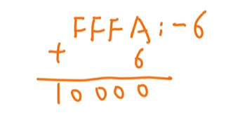

-6

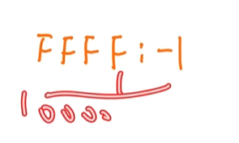

-1

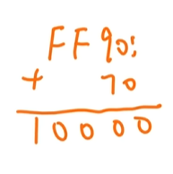

-70H = 7*16 = -122

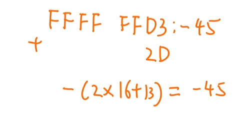

-2D

**二进制**

看成无符号数，

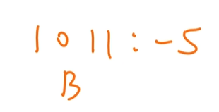

11 + 5 = 16

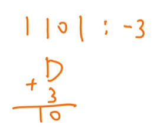

-3


-2

## [[给真值求补码]]

逆推

-8 = FFF8 （16位补码）

FFFF FFF8(32位)

如果是正数的话

直接求16进制

https://www.bilibili.com/video/BV1bsoaB1EN7?t=516.3&p=8

## [[移码]]

真值 + 偏置值(2^(n-1))

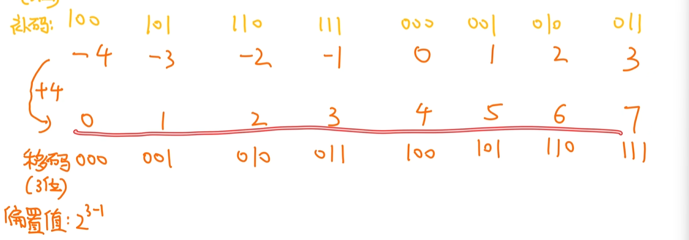

-4 ~ 3 ---> 0 ~ 7

移码最高位取反就是补码

## [[移码求真值]]

移码 - 偏置值（2^(n-1)）

255 - 128 = 127

先求补码 (最高位取反)再求真值


### 真值求移码

真值 + 偏置值

127 + 128 = 255

补码 - > 移码

## [[码的规则]]

1.   正数的原码，反码，补码相同，移码不同
2.   原码与反码在数轴上关于原点对称，二者都存在+0与一0。
3.   补码和移码的0表示都唯一
4.   补码或反码的数值部分越大，其真值也越大。

## [[题]]

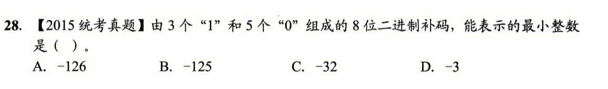

1.   最小负数

~~~
负数，
1 ...
补码越小，真值越小
1000 0011 
~~~

2.   最大负数

~~~
1110 0000
~~~


3.   最大整数

~~~
正数
正数的补码和原码相同
0111 0000
~~~


4.   最小整数

~~~
负数，
1 ...
补码越小，真值越小
1000 0011 
~~~

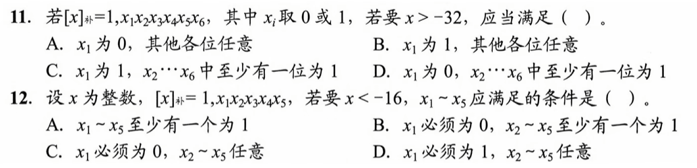

大于-32

~~~
1 10 0000原码
1 10 0000补码
比-32大，那么补码的数值位大于目前的数值位就可以了
C
~~~

## [[类型转换]]

**短整型：short16位**

**整型：int32位**

**长整型：long32位系统是32位，64位系统是64位**  

**unsigned无符号数**

默认有符号类型

### 长变成短

只保留最低位数

~~~
8位                  4位
1011 0110 --->      0110

~~~


### 短变成长

有符号数，补码

正数往前补0

负数往前补1

~~~
有符号数，补码
0101 ----> 0000 0101
1010 ----> 1111 1010
~~~

### 题

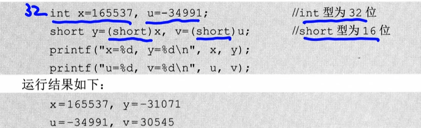

~~~
x = 0000 0000 0000 0010 1000 0110 1010 0001
y = 				   1000 0110 1010 0001
~~~

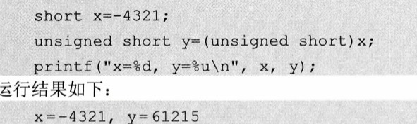

~~~
有符号变成无符号
X = -4321 = 1110 1111 0001 1111
Y = 
~~~

# [[运算方法和电路]]

## [[基本运算部件]]

运算器ALU

组合逻辑电路

标志位

## [[移位运算]]

移位：小数点固定，把数整体左移，右移

~~~
123.456 = 1.23456 右移
1.23456 = 123.456 左移
~~~

### 1. 左移 2 位（未溢出）

-   **过程：** `0034` $\xrightarrow{\text{左移 2 位}}$ `3400`
-   **数学关系：** $3400 = 34 \times 10^2$

### 2. 左移 2 位（溢出）

-   **过程：** `1234` $\xrightarrow{\text{左移 2 位}}$ `3400`
-   **数学关系：** $3400 \neq 1234 \times 10^2$ ，**溢出**

### 3. 右移 2 位（未丢失精度）

-   **过程：** `3400` $\xrightarrow{\text{右移 2 位}}$ `0034`
-   **数学关系：** $0034 = 3400 / 10^2$

### 4. 右移 2 位（丢失精度）

-   **过程：** `1234` $\xrightarrow{\text{右移 2 位}}$ `0012`

-   **数学关系：** $0012 \neq 1234 / 10^2$ ，**丢失精度**

    *(注：实际值为 12.34)*

### 逻辑移位（无符号数）

### 1. 左移 2 位

-   `0011 (3)` $\xrightarrow{\text{左移 2 位}}$ `1100 (12) = 3 × 4`
-   `1011 (11)` $\xrightarrow{\text{左移 2 位}}$ `1100 (12) ≠ 11 × 4`

### 2. 右移 2 位

-   `1100 (12)` $\xrightarrow{\text{右移 2 位}}$ `0011 (3) = 12 / 4`
-   `1011 (11)` $\xrightarrow{\text{右移 2 位}}$ `0010 (2) ≠ 11 / 4`（丢失精度）

### 算术移位(有符号补码)

符号位也要参与移位

4位补码：

### 左移 2 位

-   `0001 (1)` $\xrightarrow{\text{左移 2 位}}$ `0100 (4) = 1 × 4`
-   `1110 (-2)` $\xrightarrow{\text{左移 2 位}}$ `1000 (-8) = -2 × 4`
-   `1101 (-3)` $\xrightarrow{\text{左移 2 位}}$ `0100 (4) ≠ -3 × 4`
-   `0010 (2)` $\xrightarrow{\text{左移 2 位}}$ `1000 (-8) ≠ 2 × 4`
-   `1010 (-6)` $\xrightarrow{\text{左移 2 位}}$ `1000 (-8) ≠ -6 × 4`
-   `0101 (5)` $\xrightarrow{\text{左移 2 位}}$ `0100 (4) ≠ 5 × 4`

**丢失精度：当你除2等于之前的数除以2时就不是丢失精度**

逻辑左移和算数左移都是移除最高位，最低位补零

逻辑右移和算数右移则不同


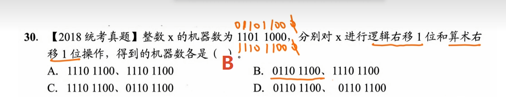

都不会丢失精度

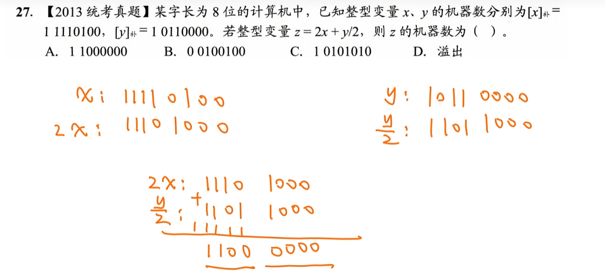

判断溢出：负数+负数还是负数就不算溢出

多出去的1就不要了

# [[补码加减法]]

1.   符号位运算
2.   最后多的进位直接舍去
3.   最后的结果范围如果大于位数包含的范围就溢出

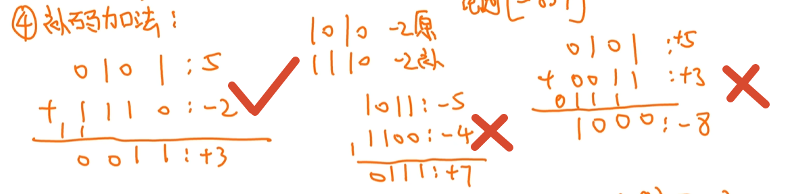

**溢出：最高两位的进位如果相同则不溢出**

第一个进位都是1 不溢出

第二个进位是1 0 溢出

第三个进位是0 1 溢出

## [[求相反数的补码]]

给[x]补码，求[-x]补的补码

~~~
0101 ：+5求-5的补码
~~~

方法：

先把符号位取反

然后直接求补码

~~~
0 101补码 +5
1 101
1 011补码 -5
~~~

## [[补码减法]]

[A]补 - [B]补 = [A]补 + [-B]补

可以直接计算

但n位数字时，第n+1位默认有一个一

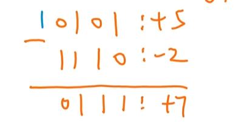

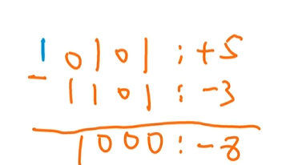

也可以转换成加法：[A]补 - [B]补 = [A]补 + [-B]补

~~~
0 101   0 101
1 110 =>0 010
= 	    0 111 = 7

0 101   0 101
1 101=> 0 011
=       1 000 = -8
~~~

## [[标志位P37]]

有符号数需要的标志位：

**零标志ZF：当结果F=0时，ZF=1；否则ZF=0。对无符号数和有符号数均有意义。**

**溢出标志OF：最高两位的进位异或值（符号位，数值最高位）**

**符号标志SF：等于符号位的数值**


无符号数需要的标志位：

**零标志ZF：当结果F=0时，ZF=1；否则ZF=0。对无符号数和有符号数均有意义。**

**进位/借位CF：用于表示无符号数运算中的进位/借位情况，判断是否溢出。**
加法时：CF=1有进位，发生上溢CF=Cout
减法时：CF=1有借位，不够减，CF=-Cout

---
每次运算的时候，无论有符号数计算还是无符号数计算都需要求出这四个标志

```

	0101
+   1110
1（上溢出）0011
	CF=1溢出了，结果不对，不要了直接
	OF=0
	SF=0
	ZF=0
```

## 加减运算电路

减法：
X-Y
Sub = 1
选下边
==把Y取反Y'==第一个输入
Y' + Cin(Sub = 1) = 第二个输入
# 浮点数的表示和运算
