# [[5 CPU中央处理器]]

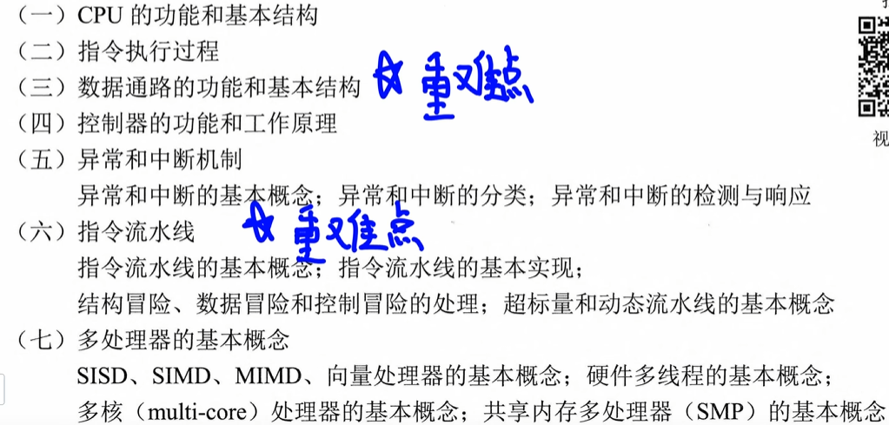

# [[5.1CPU供能和结构]]

## [[功能]]

1.   执行指令
2.   检测并响应各类异常和中断的能力

1.   取值 译码 控制信号
2.   PC
3.   算数运算 逻辑运算
4.   访问主存和IO接口
5.   处理异常5.5
6.   控制指令按照顺序执行

## [[结构]]

运算器 & 控制器

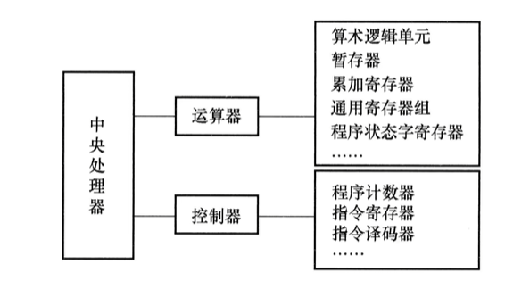

1.   执行部件 ALU
2.   寄存器
3.   控制部件
4.   中断

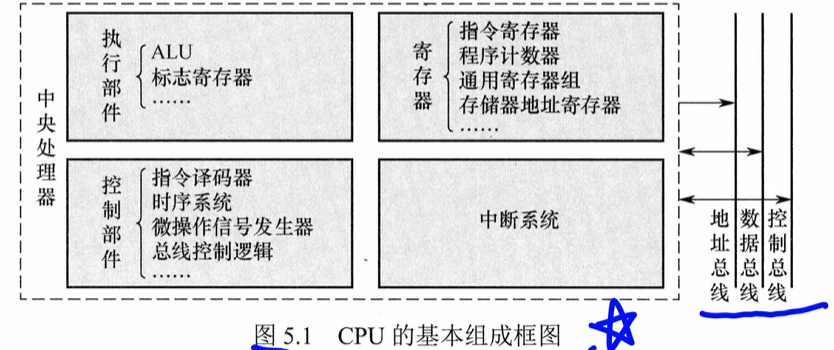

## [[CPU中各种寄存器的特点]]

1.   程序计数器 PC ：存放即将执行指令**内存**地址
2.   指令寄存器 IR ：暂存当前正在执行的指令（指令从主存中取出送入IR，提供给指令译码器使用）
3.   指令译码器 ID ：对IR中操作码分析，识别类型，输出译码信号
4.   通用寄存器组 GPRs ：暂存操作数，中间结果或地址指针----减少对主存的访问
5.   算数逻辑单元 ALU：执行数据运算的核心，完成算数和逻辑运算，结果送回寄存器，状态标志写入FR
6.   标志寄存器FR（也叫程序状态字寄存器PSWR），保存ALU产生的状态信息，用于条件判断与控制转移
7.   存储器地址寄存器MAR：存放当前要访问的主存地址。（地址先送入MAR再通过地址总线传送到存储器）
8.   存储器数据寄存器 MDR ： 暂存从主存中独处的数据和要写入的数据，起到缓冲与同步的作用
9.   时序信号产生部件
10.   操作控制信号形成部件
11.   总线控制逻辑
12.   中断机构：处理异常和处理外部中断请求

## [[寄存器]]

### 用户可见寄存器

可读 可修改：

可读不可修改：标志寄存器FR 内容有ALU运算结果自动生成

### 用户不可见寄存器

1.   指令寄存器IR
2.   存储器地址寄存器MAR 
3.   存储器数据寄存器MDR
4.   页表基址寄存器
5.   移位寄存器

# [[5.2指令执行过程]]

指令执行完还需进行终端与异常检测

## [[流程]]

1.   通过PC，送到MAR，送到地址总线，找到内存的某一个地址
2.   译码：知道是加法减法..
     1.   分支指令：满足条件的话，PC更新为分支目标地址
     2.   非分支指令：完成取操作数，执行运算，写回

3.   未检测到中断或异常进入下一条
4.   检测到中断：
     1.   见5.5

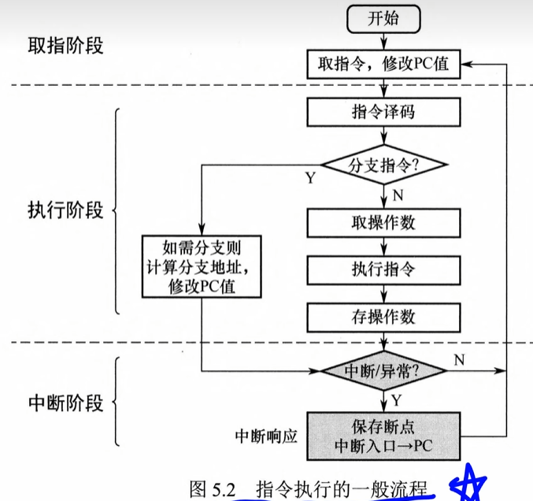

## [[5.2.2CPU时序控制]]

一个指令周期分为若干机器周期

但现在都使用时钟周期来衡量

**时钟周期：它的物理上限和基准频率是出厂时固定的，但在实际运行中可以动态调整**

## [[5.2.3指令周期的基本概念]]

**指令周期：一条指令从主存读出到执行完成所经历的全部时间**

划分：

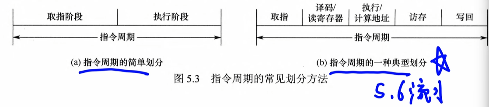

1.   取值IF

根据PC的值从主存或cache取指令，送到IR，PC更新

2.   译码

识别操作码和寻址方式，从寄存器中读取所需的操作数

3.   执行/计算地址EX

算数和逻辑指令：ALU

访存类：计算操作数再主存中有效地址

分支指令：计算目标地址，判断是否转移

4.   访问内存WEM

5.   写回WB

把结果写回到寄存器

## [[5.2.4处理器指令执行模型]]

1.   单周期处理器
     1.   每条指令仅需一个时钟周期，串行
     2.   时钟周期的长度由最长的指令决定
2.   多周期处理器
     1.   动态分配执行周期数，不同指令可以占用不同数量的时钟周期，串行执行的
3.   流水线处理器
     1.   理想情况下CPI = 1，一个时钟可以完成一个指令
     2.   多条指令再流水线中重叠执行

# [[5.3数据通路的功能和基本结构]]

无论**CPU**的内部结构多么复杂都可以视为**数据通路** + **控制部件**

## [[数据通路]]

数据通路：指令在执行过程中经过的路径，包括硬件部分

描述了：数据从哪里开始，经过了哪些，最终传送到哪里，生成相应的控制信号

### 构成

1.   组合逻辑元件（操作单元），**内部不含记忆单元**，例如：加法器，ALU，译码器，多路选择器，三态门
2.   时序逻辑元件，**必然包含存储信息的记忆单元**

## [[分类]]

### 内部部件的连接方式

1.   总线式数据通路：
     1.   单总线结构：所有数据传输共享一条内部总线
     2.   多总线结构：提供多条独立总线

优点是硬件简洁、易于扩展；缺点是同一时刻仅能传输一组数据，存在总线竞争问题。

2.   专用数据通路

点多点，两个部分专用一条线

优点是数据传输效率高、延迟低；缺点是布线复杂、扩展性差、成本较高。

### 时序组织方式

1.   单周期数据通路（理论上的理想国）
     1.   每条指令的操作（取指，译码，执行，访存，写回）在一个时钟周期完成
     2.   一个时钟周期只允许一次操作
2.   多周期数据通路（省器件的折中方案）
     1.   一个指令可以消耗多个周期
3.   流水线数据通路（现代工业的统治者）
     1.   可重叠，不同指令在不同阶段并发推进

## [[单总线结构的数据通路]]

rs rd是源寄存器和目的寄存器

YZ表示暂寄存器，暂存操作数

FR标志寄存器，保存ALU产生的状态结果

所有可向总线输出数据的（寄存器，MDR，PC）通过三态门与总线连接，控制通断，避免冲突、

AB是地址线

CB控制总线

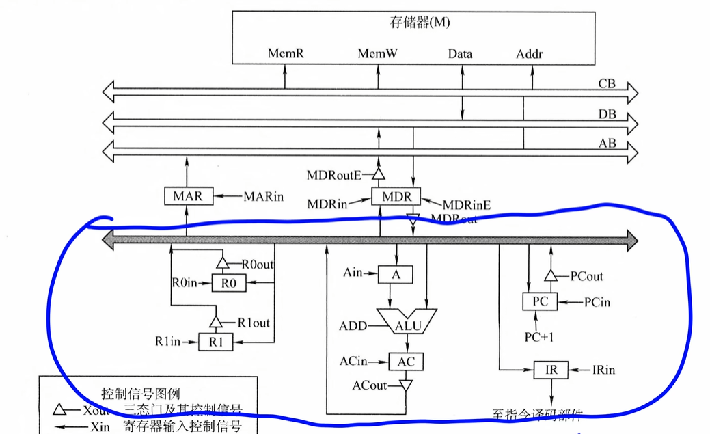

单总线数据通路结构

每次部件只能用总线传递信息

每个时钟的功能和控制信号

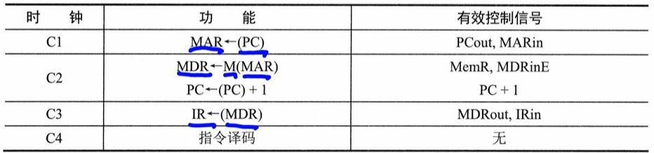

# [[中断 （连接7.3）]]

[中断](7IO系统.md#程序中断)
[7IO系统](7IO系统.md)
# [[5.5流水线]]

1.   时间上并行
     1.   允许多个任务在不同阶段同时推进
2.   空间上并行
     1.   多个硬件

流水线：

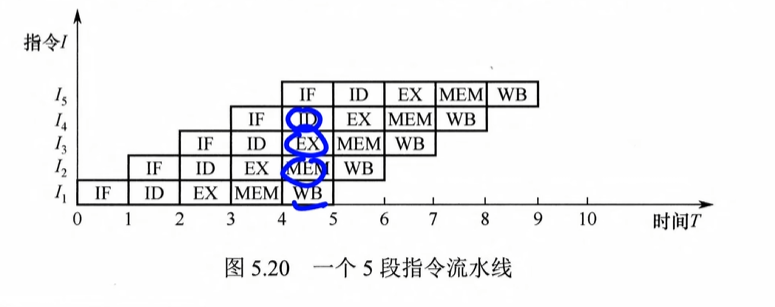

通过重叠执行，可在第k条指令处于译码阶段时，启动第k+1条指令的取指阶段

**特点**：

每个时钟周期均有一条新指令进入流水线

平均CPI  = 1

总时间是k + (n - 1)n是阶段，k是个数

**指令特征**：

1.   长度统一
2.   格式规整
3.   采用仅允许加载和存储指令访问主存（LOAD和STORE）
4.   数据和指令按边界对其存放

# [[流水线的冒险与处理]]

 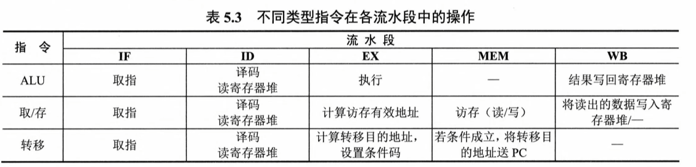

任意一个指令第一步都需要取址

然后译码

ID = **译码/取数**

 ## 结构冒险

又叫资源冲突，同一时刻使用同一功能部件所引发的冲突

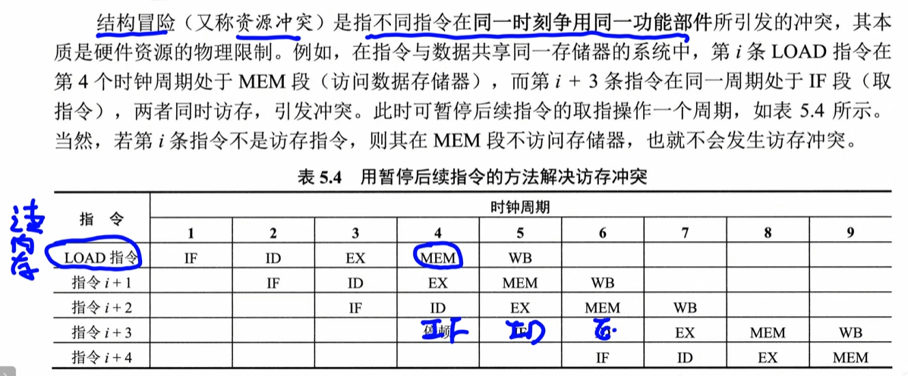

LOAD指令需要访问内存

指令不需要访问

在4时冲突需要等待一下

但是之后的MEM不需要访问内存，所以不冲突

**如何解决**

1.   遵循功能部件的使用原则
2.   增加硬件
     1.   指令存储器和数据存储器分离

## [[数据冒险]]

又叫数据相关

其根本原因是：后面指令用到前面指令的结果时，前面指令的结果还未产生或写回。

在按序发射、按序完成的流水线中，所有数据冒险都是因为前一条指令写结果之前，后面指令就需要读取而造成的，称为写后读RAW

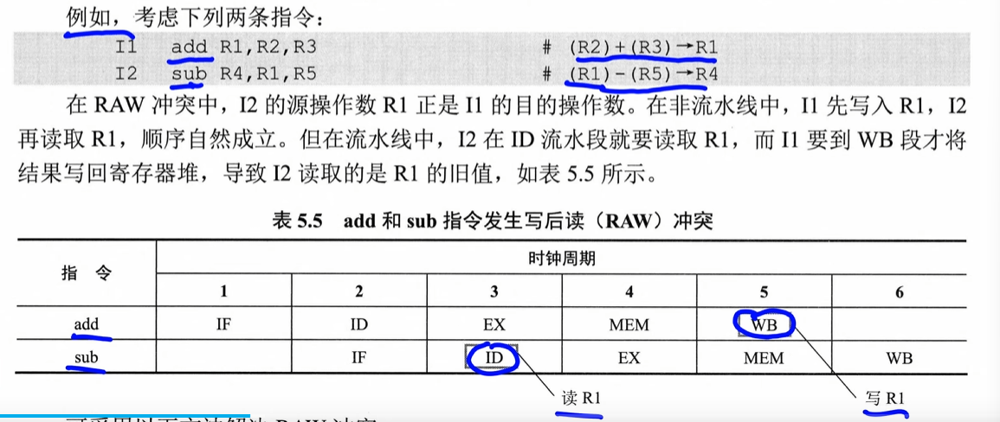

### 解决1 - 延迟执行相关指令

1.   软件插入空操作
2.   硬件自动插入气泡

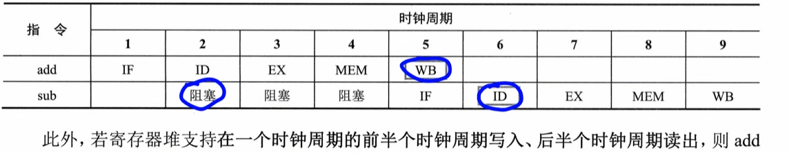

也可以只推迟ID

IF 阻塞 阻塞 阻塞 ID

**延迟**

### 解决2 - 采用转发技术

正常来说，上一条指令运算完的数据要存放到寄存器中，下一条指令再在这个寄存器中读

但此时当EX计算完后直接发给下一条指令的EX

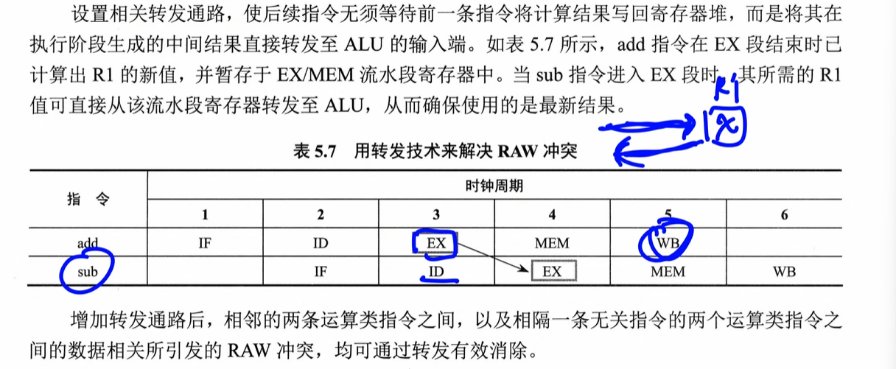

所以只要EX1在EX2之前就可以了

**转发**

### 解决3 - 数据冒险处理

若load 指令与其后紧邻的运算类指令存在数据相关，则无法通过转发技术解决，这种情况称为load-use数据冒险。考虑以下两条指令：

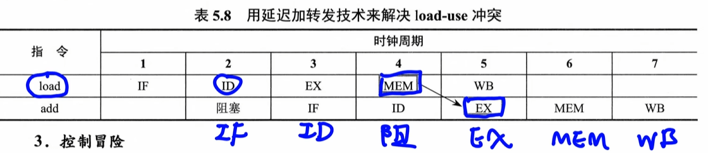

访存类指令在MEM才拿到数据

EX需要写道MEM之后

**延迟加转发**

## [[控制冒险]]

指令通常按顺序执行，但在遇到转移、返回、中断或异常等事件时，程序计数器（PC）的值会被修改，导致流水线断流，这种现象称为控制冒险（又称控制冲突）。

**选择分支结构**

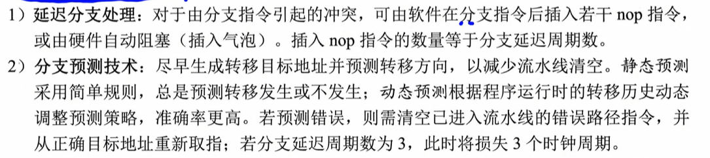

### add + add

在add时

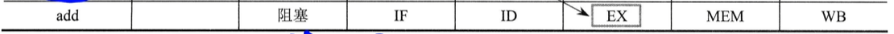

第一种时WB写回之后，第二个在ID读出来

所以此时要让WB1 在 ID2前一个，此时要阻塞三次

~~~ 
IF ID EX M  WB
   IF 阻 阻  阻 ID EX M WB
~~~

第二种时，EX计算完，本来是要放到寄存器的，但是因为下一轮还要继续用，现在直接放到ALU的暂存器中，然后把下一个数也读进来，就可以直接计算了，所以EX1在EX2上一个就可以了

~~~
IF ID EX M  WB
   IF ID EX M  WB
   此时是有数据的可以直接计算
~~~

### load + add

~~~
I2  load r2,12(r1)    #M[(r1)+12]→(r2)
r1 的地址 + 12 放到r2
13 add r4,r3,r2   #(r3)+(r2)→(r4)
~~~

LOAD在EX计算出新地址，M阶段取数，WB写到寄存器

，既然add需要用，那么此时M的数是需要用的，不送到寄存器直接给ALU暂存器去

~~~
IF ID  EX  M  WB
   阻塞 IF ID EX M  WB
M1 在EX之前一个就可以
~~~

### add + bne + add

~~~
loop:add R1,R1,1  #(R1)+1→R1
bne R1,R2,loop #if(R1)!=(R2) goto loop
~~~

转移指令

EX阶段计算转移的目标地址 ，M阶段把转移的指令送到PC

不让下一条指令开始的太早

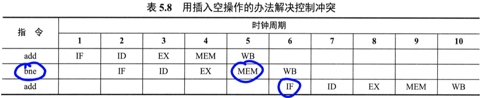

~~~
M2 早一个ID就可以
~~~

## [[高级流水线技术]]

1.   超标量流水线技术（动态多发射）
     1.   配置多个功能部件
     2.   结合动态调度技术
2.   超长指令字技术（静态多发射）
     1.   不同指令打包成一个，使用了不同硬件
3.   超流水线技术
     1.   把流水线继续细分，4阶段->8阶段
     2.   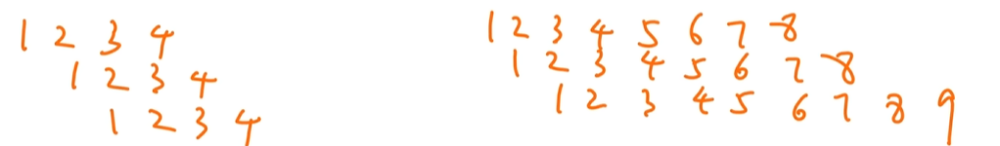

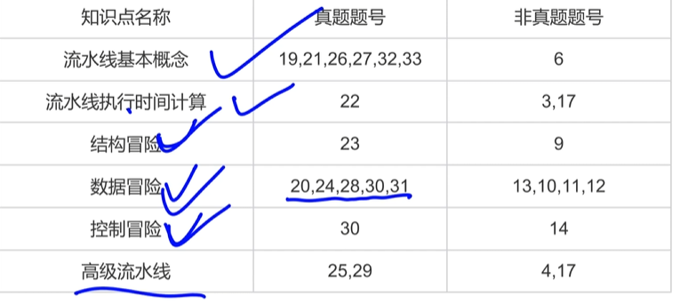
