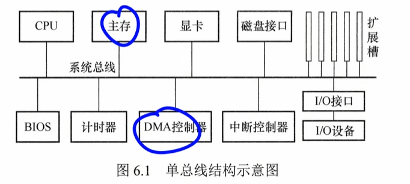
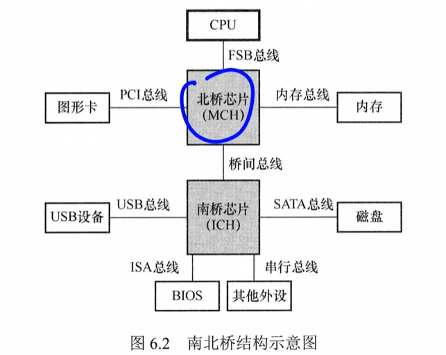
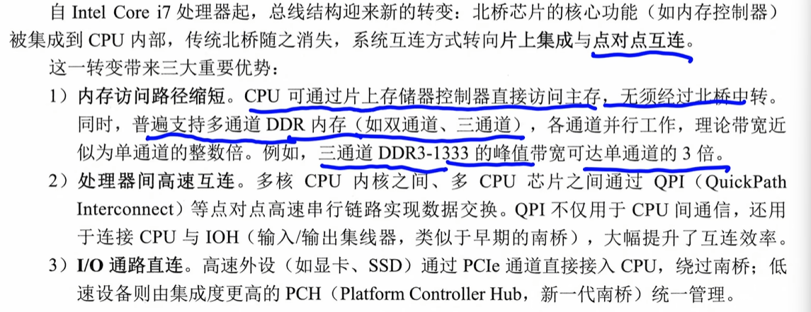
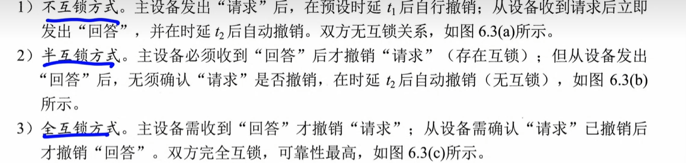
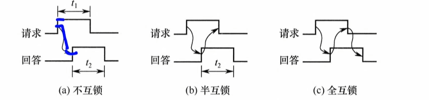

# [[总线]]

# [[总线概述]]

## [[1.分类]]

1.   内部总线：CPU内部与各寄存器间的总线
2.   系统总线：各部件（CPU，主存，IO）之间相互连接的总线
     1.   地址总线：指定要访问的主存单元或IO端口的地址，单向总线
     2.   控制总线：传输各种协调和控制信号，
          1.   控制信息和状态信息---单向传输
     3.   数据总线：在各部件双向传递信息，双向，
3.   IO总线：连接主机与内部各类的IO控制器
4.   通信总线：主机和外部IO设备或者不同计算机的通信

 ## 2. 性能

1.   传输周期（总线周期）：完成一次完整的总线事务的总时间
2.   总线时钟频率：
3.   总线工作频率：每秒能进行的有效数据传输次数。

~~~
1个总线时钟传送2次数据
2个总线时钟周期传送一次数据

时钟频率f = 2f
	   f = f/2
~~~

4.   总线宽度：数据线的条数
5.   总线带宽：最大数据传输率
6.   总线复用：地址/数据线复用，初期传输地址，后期传输数据
7.   寻址能力

## [[3. 结构]]

1.   单总线结构

需要分时

2.   分层总线：南北桥

3.   集成化总线结构

# [[6.2总线事务和定时]]

## [[事务]]

事务的三个阶段：

1.   地址传送阶段
2.   从设备相应阶段（数据准备）
3.   数据传送阶段

### 连续数据传输的方式

1.   非突发传输方式
     1.   每次仅传输一个数据单元
     2.   必须要有 先发送地址，等待从设备准备数据 ， 传输数据
     3.   地址开销大，效率低
2.   突发传送
     1.   仅发送一个首地址，连续传送多个数据单元，后续地址由硬件递增生成

## [[串行和并行传输]]

1.   同步串行
     1.   适合长距离，抗干扰，简单
     2.   USE PCIe SATA

2.   异步并行
     1.   适合短距离，长距离会被干扰
     2.   芯片，内存总线

## [[总线定时]]

1.   同步定时方式

     1.   统一的时钟信号
     2.   优点：传送速度快，具有较高的传输速率；总线控制逻辑简单。
          缺点：主从设备之间属于强制性同步，所有操作严格受时钟节拍约束；缺乏应答或握手机制，无法根据从设备的实际状态动态调整时序，可靠性较差。

2.   异步定时方式

     1.   异步定时方式不依赖统一的时钟信号，而是通过主从设备之间的握手信号实现定时控制：主设备发出“请求”信号；从设备准备就绪后，发出“回答”信号。
     2.   不互锁：发一个请求然后t时间后自动撤销
     3.   半互锁：接收方发送确认后撤销
     4.   全互锁：收到 确认才撤销

     

