# [[第三章存储]]

# [[存储器的分类]]

## [[ 存储元件]]

1.   半导体器件：半导体存储器DRAM，SRAM
2.   磁表面存储器：硬盘，磁带
3.   光存储器：光盘

## [[存取方式]]

1.   随机存取存储器RAM：**可以随机访问**，半导体存储器属于这类，常用于主存和cache
2.   顺序存储存储器：**必须顺序存取**（链表），越靠前的数据访问时间越快，磁带属于这类，容量大，速度慢
3.   直接存取存储器：既可以随机访问，也可以按顺序读取数据，**属于12的集合体**，机械磁（硬）盘
4.   相联存储器：按内容存取，查找速度块，且与存储位置无关，但是成本高。块表（TLB）

## [[按信息可更改性分类]]

1.   可读可写存储器RAM：
2.   只读存储器：ROM(通常不可修改)

两个都是随机存取的方式

## [[按信息可保存性分类]]

1.   易失性存储器：RAM，内存
2.   非易失性存储器：ROM，Flash存储器，磁盘，光盘

# [[主存储器的组成和基本操作]]

主存储器MM

 **作用：**存储二进制数0或1的记忆单元（存储元）

**编址单位：**具有相同地址的一组记忆单元，称为一个存储单元

## [[CPU访问一个地址]]

左边是CPU，右边是内存

[跳转到 MAR/MDR](特有名词.md)

1.   MAR通过地址线送到地址寄存器，和地址译码器，找到存储单元

2.   同时，CPU通过控制先向主存发送读写信号

     1.   写：将待写的数据送到MDR,经过数据线写入
     2.   读：将选中的单元内容哦经过数据线送到MDR

# [[存储器的层次化结构]]

1.   速度块，容量小，价格高

**三级存储系统的层次结构**

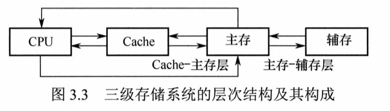

1.   CPU可以直接访问cache和主存(内存)，
2.   只有主存可以和辅存(外存)相互访问

1.   cache-主存层：主要用于缓解主存速度不匹配的问题
2.   主存-辅存层：解决容量不足的问题

 ## 概念

**存储周期：**存储器连续两次独立的读写操作所需时间最小间隔

**存储周期 = 存取时间 + 复原时间**

1.   存取时间≠存储周期

2.   每次读完还需要一定时间恢复（DRAM破坏性读出

     [破坏性读出](存储周期.md)）

# [[3.2主存]]

RAM分为**静态SRAM和动态DRAM**，均为易失性存储器

主存采用DRAM

Cache采用SRAM

**SRAM**

速度快，集成度低，功耗大，成本高

非破坏性，无需再生

**DRAM**

通过电容上的电荷存储信息，基本存储元仅由一个晶体管和一个电容构成，结构简单，集成度高

价格低，功耗小，容量大

速度慢，电荷会因为漏电而消失，必须定时刷新维持数据，**破坏性读出，读取后需要恢复**

刷新按**行**刷新，刷新时就是全读一遍

与cpu异步方式交换数据

**行缓冲器**：使用SRAM实现

作用:可以存储一行中所有存储单元的数据总量

## [[存储芯片的组成]]

1.   存储体(**存储矩阵**).是存储单元的集合
2.   地址译码器，将输入地址转换为电平信号，驱动读写电路
     1.   单译码法
     2.   双译码法
3.   I/O电路：控制读写，由放大信号
4.   片选控制线：可以控制哪些芯片被选中
5.   读写控制线：根据CPU发出的读写命令，通过读写控制线选择单元执行相应操作

### 单译码法

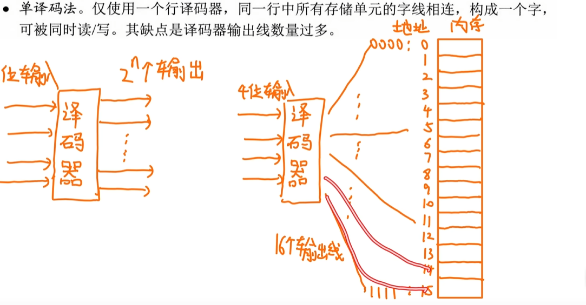

**n位输入 - 2^n个输出**

假设是4位

译码器把他翻译成0000 ...1111然后放到内存

缺点：译码器输出线太多了

### 双译码法

分为XY两部分，唯一确定一个存储单元

**行列地址复用**，只需要两条地址线

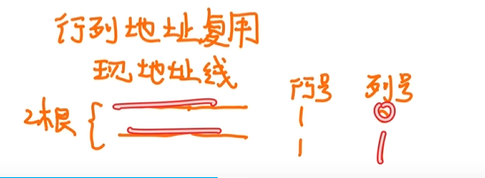

**地址复用**

先传行号2位

再传列号2位

这样的话就又少了两条地址线

## [[5. 同步DRAM（SDRAM）]]

在传统的异步DRAM中，CPU发出地址和控制信号后，需要等待一段不确定的延迟时间，在这段时间，CPU不断轮询存储器的状态信号，不误执行其他任务

**同步DRAM预设了若干时钟后完成返回数据或写入数据，不需要CPU轮询等待，可以在这段时间执行其他指令**

1.   与CPU同步方式交换数据
2.   需要定期刷新
3.   由SRAM实现

## [[SRAM和DRAM比较]]

## [[非易失性存储器ROM]]

ROM

-   断电后数据不丢失
-   结构简单

**ROM分类：**

1.   MROM不可编程
2.   PROM仅可编程一次
3.   EPROM可多次编程，但需要擦除紫外线

**Flash存储器(闪存)**

主板采用flash存储BIOS

兼具ROM和RAM部分优点

1.   断电后信息可以长期保存
2.   支持电擦除和在线重写
3.   读取速度接近RAM但写入很慢
4.   必须先擦除再写入
5.   电脑，手机，手表等内部存储

**固态硬盘SSD**

基于FLash存储构建

1.   非易失性
1.   无机械部件
1.   读取速度快
1.   速度快
1.   功耗低
1.   价格高

## [[3.2.3 多模块存储器]]

通过多个结构完全相同的存储模块并行工作来提高存储器吞吐率

**类型：连续编制和交叉编址**

n个存储模块需要编址（给他分配一个地址）

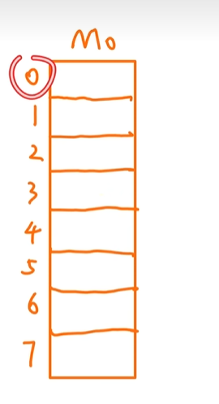

### 连续编址（高位）

**竖着编址**

4个模块，每个都是八个存储单元

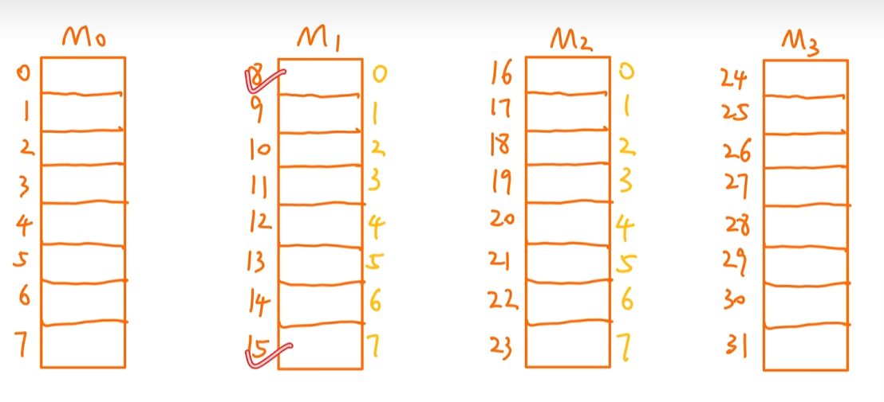

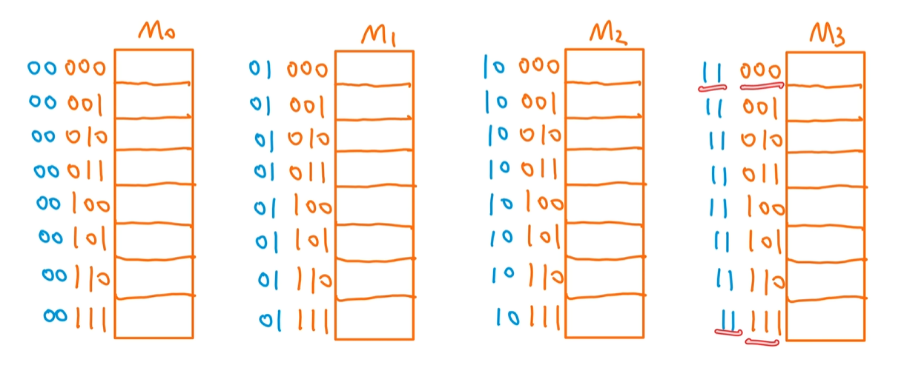

~~~
问11在哪个模块
11/8 = 1
11%8 = 3
01011 / 2^3 = 01   011

(1,3)
~~~

高位：模块号，体号

低位：相对地址，体内地址

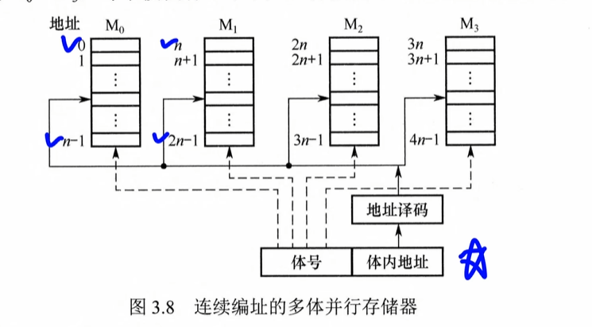

**译码的时候只看体内地址**

高位时体号，低位是体内地址

### 交叉编址（低位）

**横着编址**

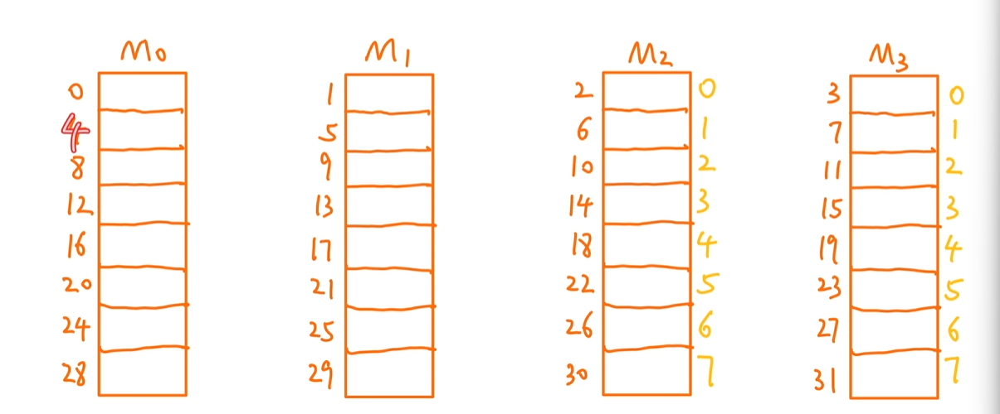

~~~
11
三号模块
2号位置

11 / 4 = 2
11 % 4 = 3

01011 / 2^2 = 010 .. 11
余数是模块号
商是相对位置
~~~

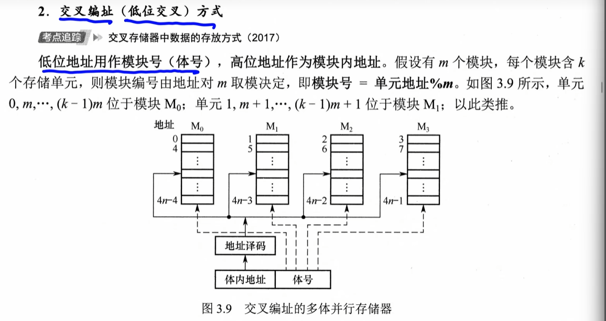

和上一个直接反过来的

**通过这种方式的存储器叫做交叉存储器**

### 同一个存储模块的数据不能在一个周期同时访问

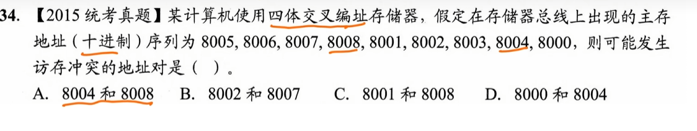

如果你想在一个周期内同时读取模块 0 里的“第 4 号字”和“第 8 号字”，CPU 就必须同时把地址 `4` 和地址 `8` 传给模块 0 的 MAR。 但一个寄存器在同一个瞬间**只能锁存一组二进制数据**，译码器也**只能稳定输出一根选通线**。地址冲突了，硬件根本无法识别你想读哪一个。

### 交叉存储器两种启动方式

取数据的方式

1.   #### **轮流启动**

**T：模块的存取周期****：指存储器进行**连续两次独立的存储器操作**（如连续两次读或两次写）之间所需的**最小时间间隔**。

​	数据从存储模块到数据总线叫存取时间

​	还需要一个回复时间

**r：总线周期**：总线把数据传送到MDR

**m：存储器模块数：>=T/r**

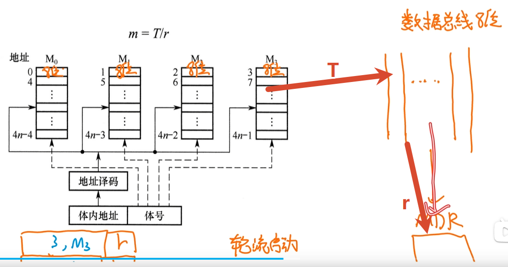

使用总线的时候必须分开传

模块启动可以同时进行，但是总线使用不能同时使用，所以使用轮流启动的方式

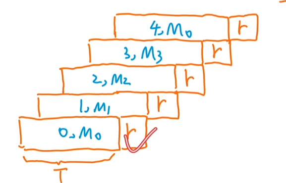

~~~
t = T + 5r
~~~

**访问同一个模块的间隔：一个存取周期**

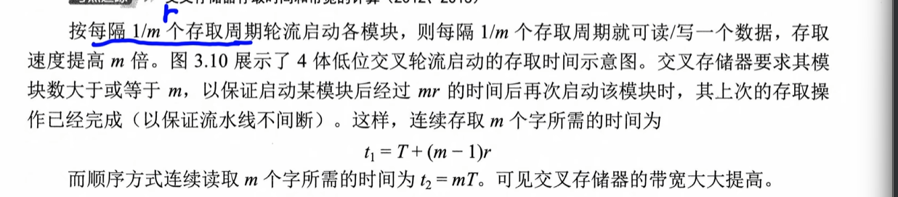

~~~
1/m = r
~~~

2.   #### 同时启动

当所有存储模块一次并行读/写的总位数恰好等于存储器数据总线宽度时，可采用同时启动方式

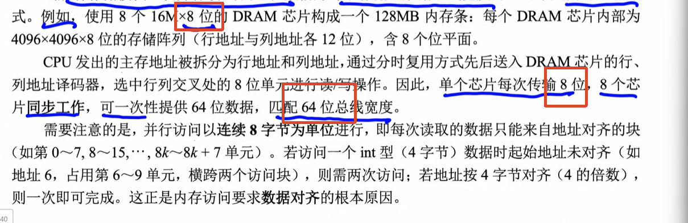

数据总线的宽度 == 所有存储器的位数

# [[交叉寻址的题]]

https://www.bilibili.com/video/BV1bsoaB1EN7?t=551.0&p=30

# [[主存储器与CPU的连接]]

由于单个存储芯片的容量有限，实际系统中需通过存储器扩展技术将多个芯片集成在内存条上

## [[主存的扩展]]

**nK × m位** 的含义就是：

-   **nK 个存储单元**（也叫 nK 个地址）
-   **每个存储单元能存 m 位** 数据

存储单元 = 一个“格子”（地址）

### 位扩展

CPU数据总线宽度大于单个芯片的数据位宽的情况，通过**并联**多个芯片，使总数据位宽与CPU总线匹配

增加存储字的长度

例：使用8片 8K*1位的RAM芯片扩展位8K\*8位的存储器

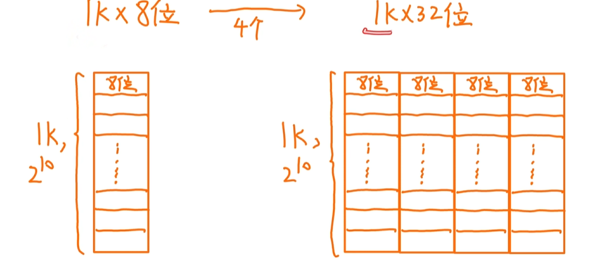

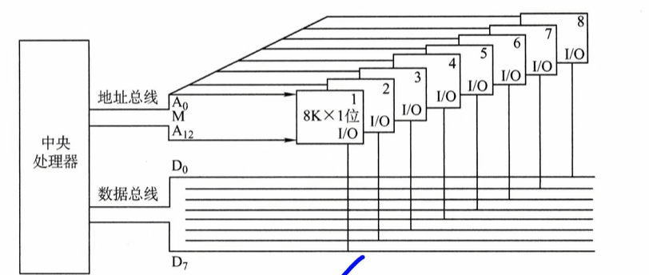

### 字扩展

字扩展用于增加存储单元的数量（扩大地址空间）

**例：用4片16K×8位的RAM芯片构成64K×8位的存储器。**

这里主要是题

还是回来看吧

# [[3.5高速缓冲存储器]]

Cache由SRAM组成，集成在CPU内部

## [[程序访问的局部性原理]]

**时间局部性**：时间局部性是指如果某条指令或数据项当前被访问，则在不久的将来很可能再次被访问

程序中存在循环，重复调用的子程序，对统一数据的多次操作

**题：**每个数组只用过一次就代表没有时间局部性

**空间局部性**：存储单元被访问，则其**邻近**的存储单元在不久的将来很可能也被访问。

指令常常是顺序存放顺序执行，数据是以连续快的形式存储

**全由硬件实现**

# [[cache的工作原理]]

cache和主存都被划为大小相等的块，

cpu需要取指令的时候，先访问cache，如果没有则取访问主存，将该地址所在的一个主存块整体调入cache，写入一个**块**（替换算法），给cpu用**字**传

**cache对程序员完全透明**

**在单条指令周期完成**

**完全由硬件实现**

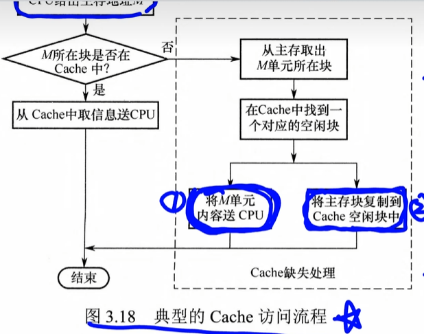

## [[命中率]]

**Nc为cache命中次数，Nm为没命中的次数，H为命中率**

$H = \frac{Nc}{Nc + Nm}$

**CPU从cache中读取数据，耗时Tc，把内存的一个块调到cache的时间，耗时Tm**

Tm又叫缺失损失

**cache-主存平均访问时间Ta**

$Ta = HTc + (1 - H)(Tm + Tc) = Tc + (1 - H)Tm$

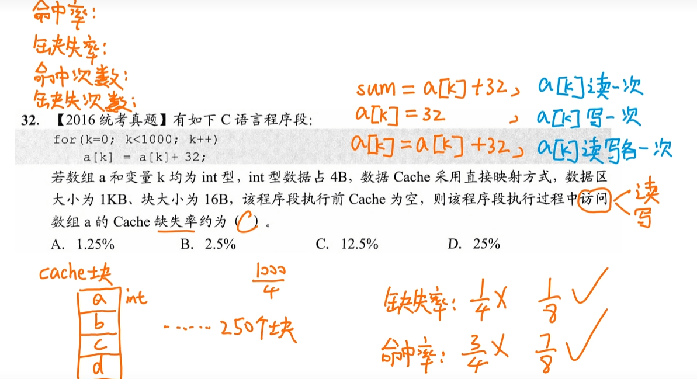

~~~
a[k] = a[k] + 32
需要先读出a[k]再写回a[k]
访问数据a包括“读”“写”
一次未命中则进入四个值进入cache
循环1000次 一共需要放250次
缺失率 1/8
命中率 7/8
缺失次数：250
命中次数 ：250 * 7
~~~

# [[cache的主存映射方式]]

地址映射是指将主存地址空间按一定规则映射到
Cache地址空间，即决定主存块如何装入Cache。常见的映射方式有三种，包括直接映射、组相联映射和全相联映射。

**把主存按规则放到cache中**

需要设置一个标记位--记录主存块号，一个有效位表示数据是否有效

**cache的结构**

| 有效位 | 脏位 | 替换控制位 | 标记位 | 数据 |
| ------ | ---- | ---------- | ------ | ---- |
| 1b     | 1b   | nb         | nb     | nb   |

**有效位 (Valid Bit, 占 1 bit)**：

-   **作用**：标记这一行里的数据是否有效。
-   **原理**：电脑刚开机时，Cache 里全是垃圾数据，有效位全为 `0`。只有当主存块被调入该行后，有效位才置为 `1`。

**标记位 (Tag, 占若干 bit)**：

-   **作用**：用来核心比对的数据。
-   **原理**：主存太大了，多个不同的主存块都有可能映射到同一个 Cache 行。Tag 就是这个主存块的“身份证号前几位”，用来区分当前这一行里躺着的到底是哪一个主存块。

**脏位 (Dirty Bit / 修改位, 占 1 bit)**：

-   **触发条件**：只有当 Cache 写策略采用 **写回法 (Write-Back)** 时才需要。
-   **作用**：如果 CPU 修改了 Cache 中的数据，但还没写回主存，脏位就置 `1`。当这一行要被替换出去时，如果脏位是 `1`，就必须把数据写回主存，否则直接覆盖即可。

**替换算法控制位 (LRU / FIFO 位, 若干 bit)**：

-   **触发条件**：只有在 **组相联映射** 或 **全相联映射** 中才需要（直接映射每位置只能放一个块，不需要选择替换谁）。
-   **作用**：用来记录这一行多久没被访问了，以便在 Cache 满了的时候决定踢走谁（比如 2 路组相联需要 1 bit 记录谁最久没用）。

**数据块 (Data / Cache Block)**：

-   **作用**：真正存放从主存复制过来的数据的地方。

## [[直接映射]]

主存中的每一块只能装入Cache中的唯一指定位置。

 每一块放到指定位置，如果有内容（冲突）直接替换，无需替换算法

冲突概率最高，空间利用率最低

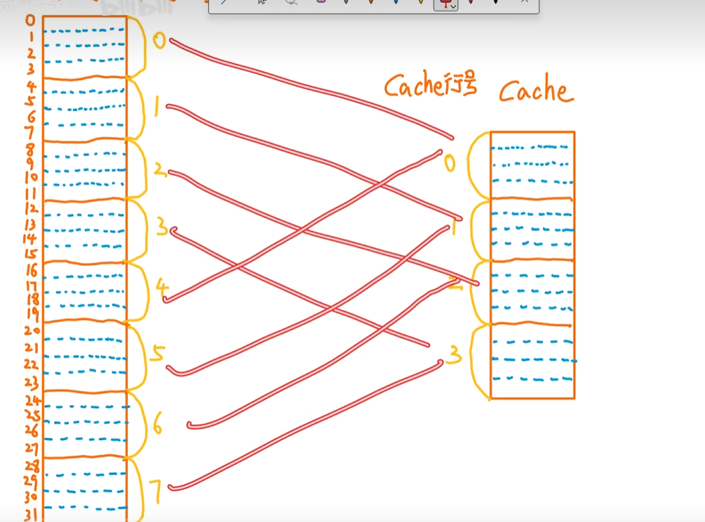

**0和4冲突，二选一，冲突时直接替换**

cache行号 = 主存块号 mod cache总行数

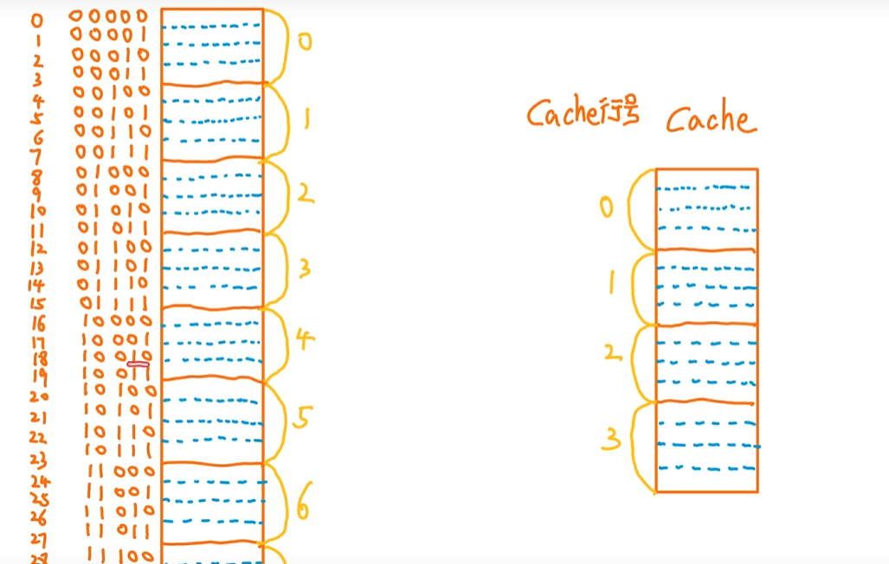

~~~
例如18
100 10
通过拆分，前两位就是块号，后几位是块内地址
4 mod 4 = 0

27
110 11
6 mod 4 = 2

~~~

直接映射还需要一个标记位

| 标记   | 行号 | 块内地址 |
| ------ | ---- | -------- |
| 内存 + | 块号 |          |

~~~
23 / 4 = 5 ...3 （3是块内地址）
5 / 4  = 1 .. 1（1是块内地址）
前一个1是标记

0001 01 11
标记 行号 块内地址

n是物理地址， m是块大小
n / m = a .... b 
a 是内存块号，b是块内地址
p 是cache的行个数
a / p = c ... d
c 是标记 d是cache的行号
~~~

**标记的作用**

如果cache中存放的标记和你想访问的标记不同则说明不是这一块，需要调入

~~~
5 / 4 / 4 = 0 
23 /4 / 4 = 1

一开始放的5后来要访问23不一样
~~~

## [[全相联]]

随便放，想放到哪都行

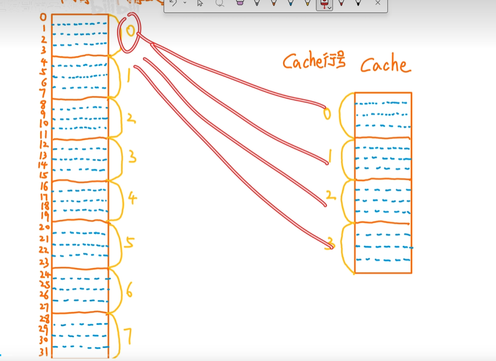

**优点**：冲突概率低，只要有空闲行就可以放进去，空间利用率高，命中率高

**缺点：**标记比较速度慢，实现成本高

| 标记 | 块内地址 |
| ---- | -------- |
|      |          |

当主存一个块进入后，cache的标记位复制主存的标记位

当找数据的时候需要遍历每一个块找标记是否相同，并且有效位为1

<table class="tg"><thead>
  <tr>
    <th class="tg-0pky">标记</th>
    <th class="tg-0pky">块内地址</th>
  </tr></thead>
<tbody>
  <tr>
    <td class="tg-c3ow" colspan="2">主存地址</td>
  </tr>
</tbody>
</table>

**公式：**$内存块号 / cache组号 = 标记 ... 组号$

~~~
1 / 2  = 0 ... 1
~~~

## [[组相联映射]]

先把cache分组，然后轮流挨着放

1.   cache分组
2.   每个主存块只能放到固定的组

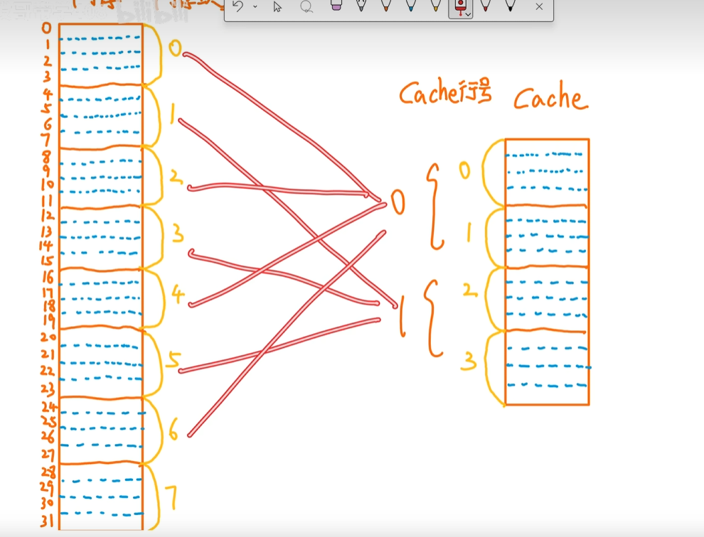

~~~
0 -- 0
1 -- 1
2 -- 0
3 -- 1
4 -- 0
5 -- 1
6 -- 0
7 -- 1

主存 mod 组个数
组内随便放
~~~

**公式：**主存块号 mod cache组数

| 标记 | 组号 | 块内地址 |
| ---- | ---- | -------- |
| 块   | 号   |          |

**2路组相联：一组两行cache**

~~~
n是物理地址， m是块大小
n / m = a .... b 
a 是内存块号，b是块内地址
p 是cache的行个数
a / p = c ... d
c 是标记 d是cache的组号
~~~

## [[比较器]]

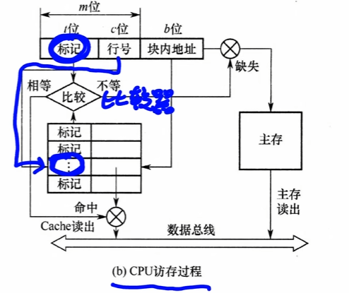

比较主存和cache内的标记

位数 = 标记长度

1.   直接映射：1个
2.   全相联：cache行个
     1.   4通常为每个Cache 行都设置一个比较器，
3.   组相联：
     1.   r路组相联，需要r个比较器

## [[cache中替换算法]]

1.   随机算法:随机选择一个
2.   先进先出FIFO
3.   最近最少未使用LRU
4.   最不经常使用LFU：累计访问次数最少的行

## [[cache的一致性]]

对cache进行写操作时，需要保持cache和主存的一致性

**写命中：cpu要写入的主存块在cache中**

反之为**写不命中**

### 写命中

1.   全写法

cpu要修改数据时，同时修改cache和主存，保持同步

实现简单，蛋每次操作都需要访问内存

2.   回写法（多一位）

只修改cache，当要cache这块要被替换掉时，需要把cache替换掉主存的块

**修改位（脏位）：**需要一个位来记录是否修改

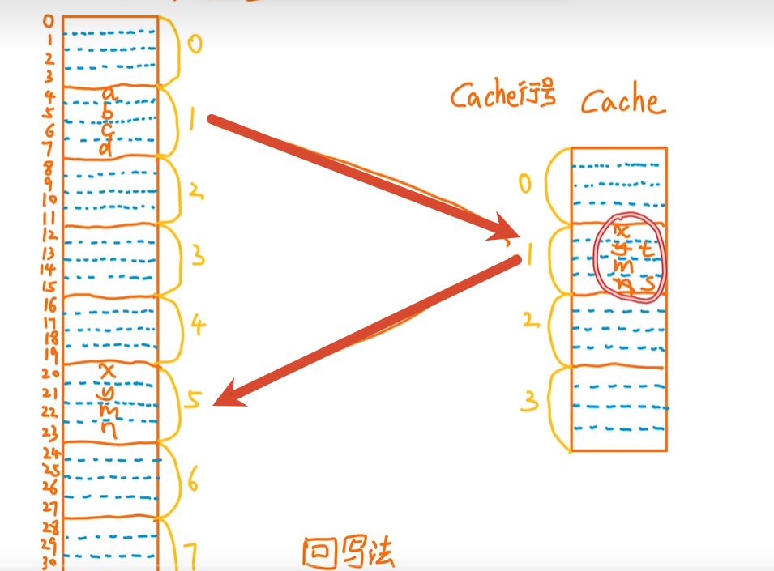

### 写不命中

1.   写分配法

先写到主存，再调入cache中的一个空闲块

2.   非写分配法

直接入主存，不调入cache

## [[cache容量]]

(每行标记位数+每行数据位数)×Cache总行数、

有些位是可以没有的，但是有效位和标记位必有

1.   主存
     1.   有效位(必有)
     2.   标记位(必有)
     3.   修改位（脏位）
     4.   LRU替换位（组内块数）

**地址结构和容量不同**

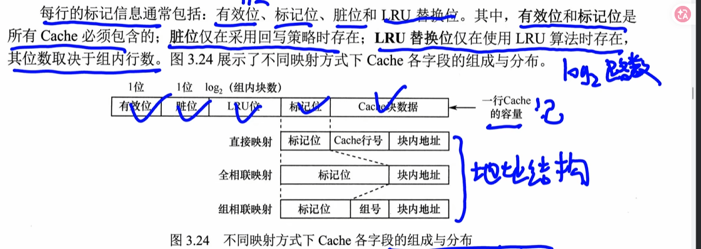

例

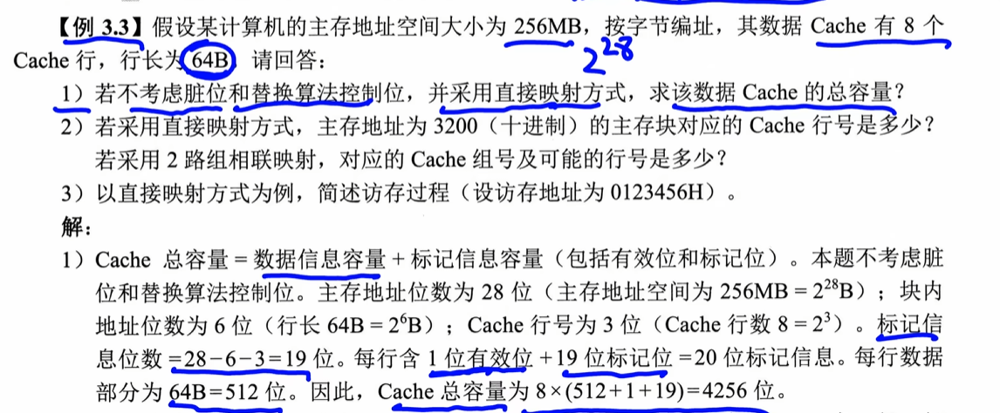

需要把64B换成位数

# [[cache例题]]

1.   组相联：

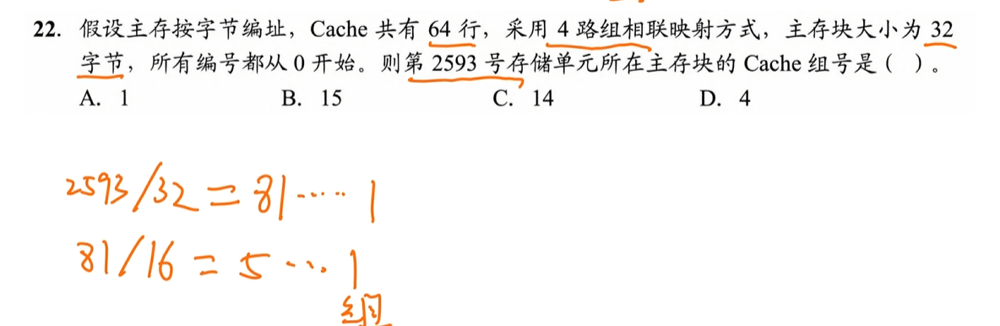

~~~
/主存块大小
81：块号 1 块内地址
/cache的组
5标记 1 cache的组号

.... 0000 1010 0010 0001
~~~

2.   全相联

3.   直接相连

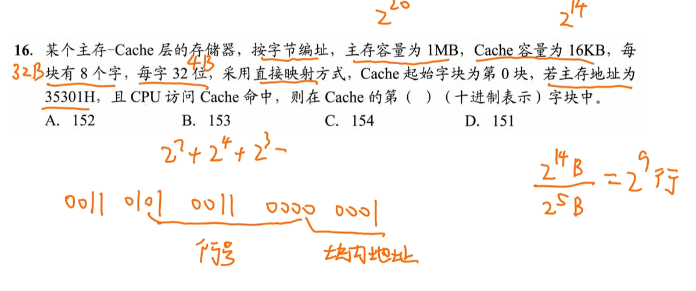

## [[编址问题]]

P120 31题

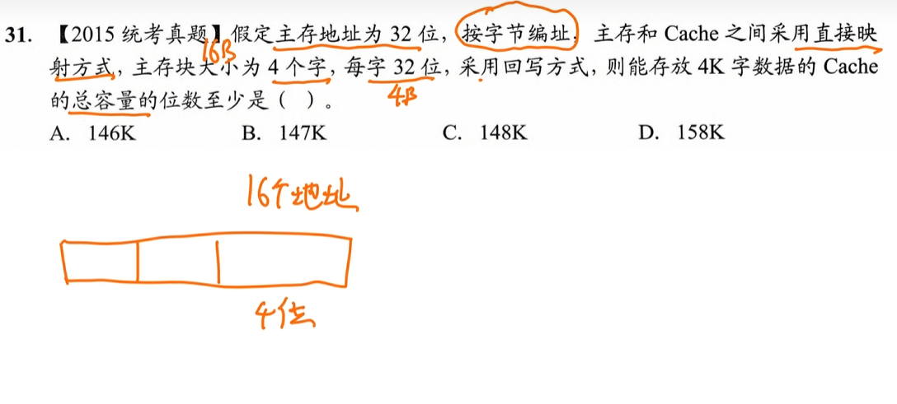

编址需要找到有多少个地址需要编号

如果是按字节编址，先算出块有多少字节，再按位表示

~~~
4 * 32 / 8 = 16 = 4位
~~~

cache行：

~~~
4k字/4 = 1k行 = 10位
~~~

容量

~~~
1k (16 * 8bit + 18 + 1 + 1 + 0) = 148k
~~~

P119 21

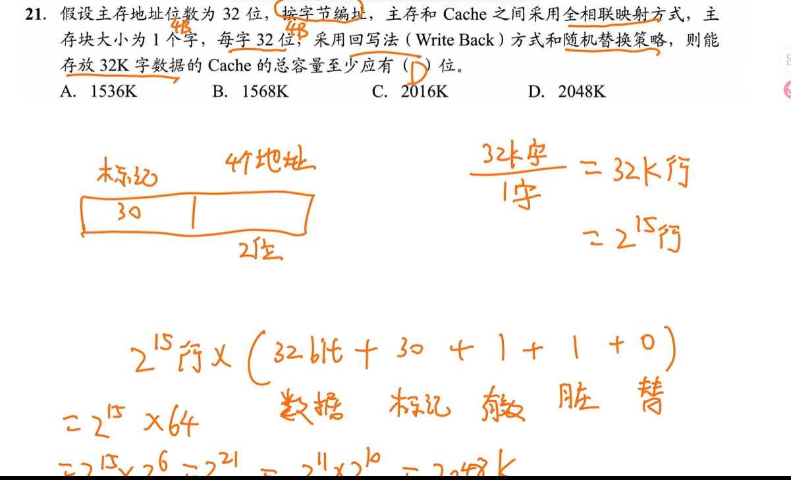

## [[块内偏移 cache的数据位]]

块内偏移：块多大，他的次方的数2^7 = 7

cache的数据位：实际的位数：2^7 * 8位*
