# [[3.5高速缓冲存储器]]

Cache由SRAM组成，集成在CPU内部

## 程序访问的局部性原理
[[程序访问的局部性原理]]

**时间局部性**：时间局部性是指如果某条指令或数据项当前被访问，则在不久的将来很可能再次被访问

程序中存在循环，重复调用的子程序，对统一数据的多次操作

**题：每个数组只用过一次就代表没有时间局部性**
数组按行访问有空间没时间，按列都没有
常量只有时间没有空间

**空间局部性**：存储单元被访问，则其**邻近**的存储单元在 不久的将来很可能也被访问。

指令常常是顺序存放顺序执行，数据是以连续快的形式存储

**全由硬件实现**

# [[cache的工作原理]]

cache和主存都被划为大小相等的块，

cpu需要取指令的时候，先访问cache，如果没有则取访问主存，将该地址所在的一个主存块整体调入cache，写入一个**块**（替换算法），给cpu用**字**传

**cache对程序员完全透明**

**在单条指令周期完成**

**完全由硬件实现**

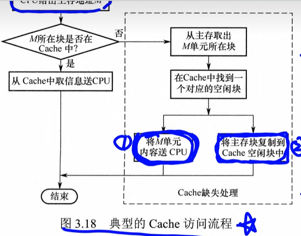

## 主存和cache

把主存和cache分块，以块为单位
### 主存分块

以字节编址，一个存储单元内有8位二进制，
根据主存地址的位数可以知道主存有2^8次方这么大
一个块是16B，那么就可以分成16个块
 
| 高位地址 | 低位地址 |
| ---- | ---- |
| 块号   | 块内地址 |

### cache分块

此时cache只有四个块，但是只有六位，

| 高位地址 | 低位地址 |
| ---- | ---- |
| 块号   | 块内地址 |
### CPU访问的过程
1. cache命中：现在cache中找不访问主存
2. cache未命中：访问完cache后发现没有，要去主存中找

**过程**
1. CPU给出主存地址AD
2. AD所在的块在cache中
	1. cache给CPU
	2. 结束
3. 不在：
	1. 从主存中找到块
	2. 从cache找一行
		1. 替换
		2. 发送AD给CPU
	3. **这里叫cache缺失**

## [[命中率]]

**Nc为cache命中次数，Nm为没命中的次数，H为命中率**

$H = \frac{Nc}{Nc + Nm}$

**CPU从cache中读取数据，耗时Tc，把内存的一个块调到cache的时间，耗时Tm**

Tm又叫缺失损失

**cache-主存平均访问时间Ta**

$Ta = HTc + (1 - H)(Tm + Tc) = Tc + (1 - H)Tm$

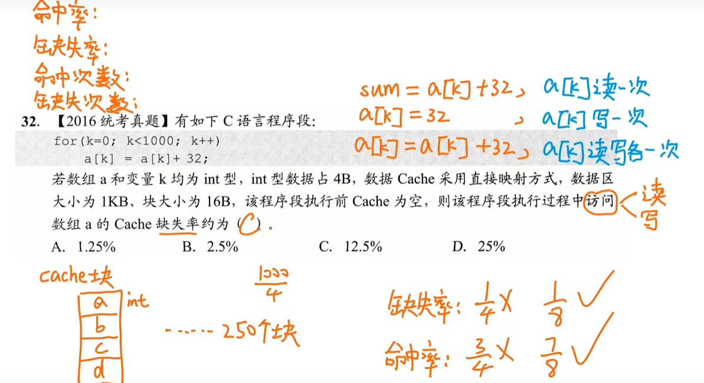

~~~
a[k] = a[k] + 32
需要先读出a[k]再写回a[k]
访问数据a包括“读”“写”
一次未命中则进入四个值进入cache
循环1000次 一共需要放250次
缺失率 1/8
命中率 7/8
缺失次数：250
命中次数 ：250 * 7
~~~

## 多级cache
距离CPU远近分为Cache1 Cache2 ...，距离CPU越来越远，容量越来越大，速度越来越慢
# [[cache的主存映射方式]]

地址映射是指将主存地址空间按一定规则映射到
Cache地址空间，即决定主存块如何装入Cache。常见的映射方式有三种，包括直接映射、组相联映射和全相联映射。

**把主存按规则放到cache中**

需要设置一个标记位--记录主存块号，一个有效位表示数据是否有效

**cache的结构**

| 有效位 | 脏位  | 替换控制位 | 标记位 | 数据  |
| --- | --- | ----- | --- | --- |
| 1b  | 1b  | nb    | nb  | nb  |

**有效位 (Valid Bit, 占 1 bit)**：

-   **作用**：标记这一行里的数据是否有效。
-   **原理**：电脑刚开机时，Cache 里全是垃圾数据，有效位全为 `0`。只有当主存块被调入该行后，有效位才置为 `1`。

**标记位 (Tag, 占若干 bit)**：

-   **作用**：用来核心比对的数据。
-   **原理**：主存太大了，多个不同的主存块都有可能映射到同一个 Cache 行。Tag 就是这个主存块的“身份证号前几位”，用来区分当前这一行里躺着的到底是哪一个主存块。

**脏位 (Dirty Bit / 修改位, 占 1 bit)**：

-   **触发条件**：只有当 Cache 写策略采用 **写回法 (Write-Back)** 时才需要。
-   **作用**：如果 CPU 修改了 Cache 中的数据，但还没写回主存，脏位就置 `1`。当这一行要被替换出去时，如果脏位是 `1`，就必须把数据写回主存，否则直接覆盖即可。

**替换算法控制位 (LRU / FIFO 位, 若干 bit)**：

-   **触发条件**：只有在 **组相联映射** 或 **全相联映射** 中才需要（直接映射每位置只能放一个块，不需要选择替换谁）。
-   **作用**：用来记录这一行多久没被访问了，以便在 Cache 满了的时候决定踢走谁（比如 2 路组相联需要 1 bit 记录谁最久没用）。

**数据块 (Data / Cache Block)**：

-   **作用**：真正存放从主存复制过来的数据的地方。

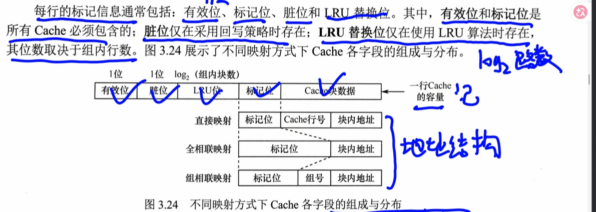

## [[直接映射]]

主存中的每一块只能装入Cache中的唯一指定位置。

 每一块放到指定位置，如果有内容（冲突）直接替换，无需替换算法

冲突概率最高，空间利用率最低

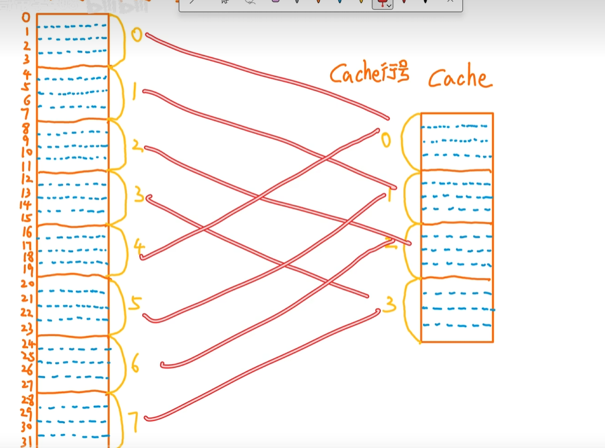

**0和4冲突，二选一，冲突时直接替换**

cache行号 = 主存块号 mod cache总行数

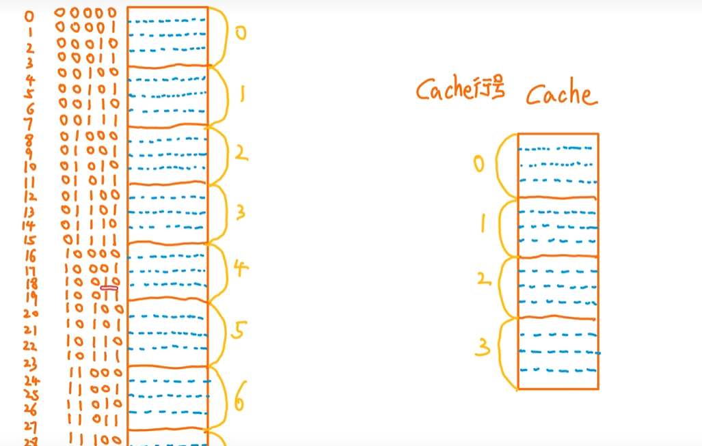

~~~
例如18
100 10
通过拆分，前两位就是块号，后几位是块内地址
4 mod 4 = 0

27
110 11
6 mod 4 = 2

~~~

直接映射还需要一个标记位

| 标记   | 行号  | 块内地址 |
| ---- | --- | ---- |
| 内存 + | 块号  |      |

~~~
23 / 4 = 5 ...3 （3是块内地址）
5 / 4  = 1 .. 1（1是块内地址）
前一个1是标记

0001 01 11
标记 行号 块内地址

n是物理地址， m是块大小
n / m = a .... b 
a 是内存块号，b是块内地址
p 是cache的行个数
a / p = c ... d
c 是标记 d是cache的行号
~~~

**标记的作用**

如果cache中存放的标记和你想访问的标记不同则说明不是这一块，需要调入
检查地址的时候要检查有效位和标记位

~~~
5 / 4 / 4 = 0 
23 /4 / 4 = 1

一开始放的5后来要访问23不一样
~~~

 

## [[全相联]]

随便放，想放到哪都行

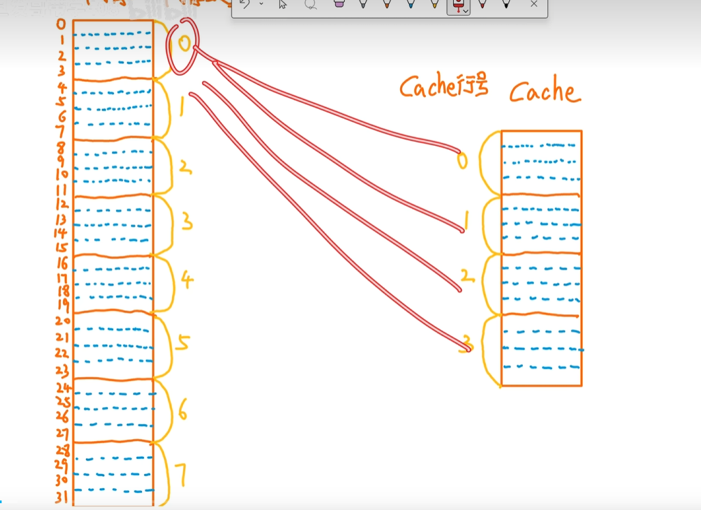

**优点**：冲突概率低，只要有空闲行就可以放进去，空间利用率高，命中率高

**缺点：**标记比较速度慢，实现成本高

| 标记  | 块内地址 |
| --- | ---- |
|     |      |

当主存一个块进入后，cache的标记位复制主存的标记位

当找数据的时候需要遍历每一个块找标记是否相同，并且有效位为1

| 标记          | 块内地址 |
| ----------- | ---- |
| \>\>\> 主存地址 |      |

**公式：**$内存块号 / cache组号 = 标记 ... 组号$

~~~
1 / 2  = 0 ... 1
~~~

## [[组相联映射]]

先把cache分组，然后轮流挨着放

1.   cache分组
2.   每个主存块只能放到固定的组

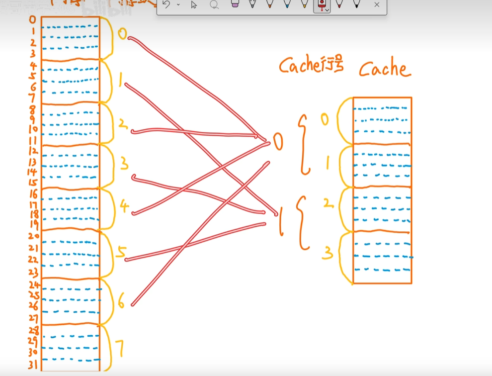

~~~
0 -- 0
1 -- 1
2 -- 0
3 -- 1
4 -- 0
5 -- 1
6 -- 0
7 -- 1

主存 mod 组个数
组内随便放
~~~

**公式：主存块号 mod cache组数

| 标记  | 组号  | 块内地址 |
| --- | --- | ---- |
| 块   | 号   |      |

**2路组相联：一组两行cache**

~~~
n是物理地址， m是块大小
n / m = a .... b 
a 是内存块号，b是块内地址
p 是cache的行个数
a / p = c ... d
c 是标记 d是cache的组号
~~~

## [[比较器]]

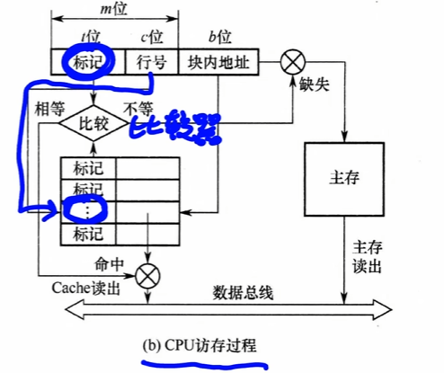

比较主存和cache内的标记

位数 = 标记长度

1.   直接映射：1个
2.   全相联：cache行个
     1.   4通常为每个Cache 行都设置一个比较器，
3.   组相联：
     1.   r路组相联，需要r个比较器

## [[cache中替换算法]]

1.   随机算法:随机选择一个
2.   先进先出FIFO
3.   最近最少未使用LRU
4.   最不经常使用LFU：累计访问次数最少的行

## [[cache的一致性]]

对cache进行写操作时，需要保持cache和主存的一致性

**写命中：cpu要写入的主存块在cache中**

反之为**写不命中**

## 写命中保证数据一致性

1.   全写法

cpu要修改数据时，同时修改cache和主存，保持同步

实现简单，但每次操作都需要访问内存

2.   回写法（多一位）

只修改cache，当要cache这块要被替换掉时，需要把cache替换掉主存的块

**修改位（脏位）：需要一个位来记录是否修改

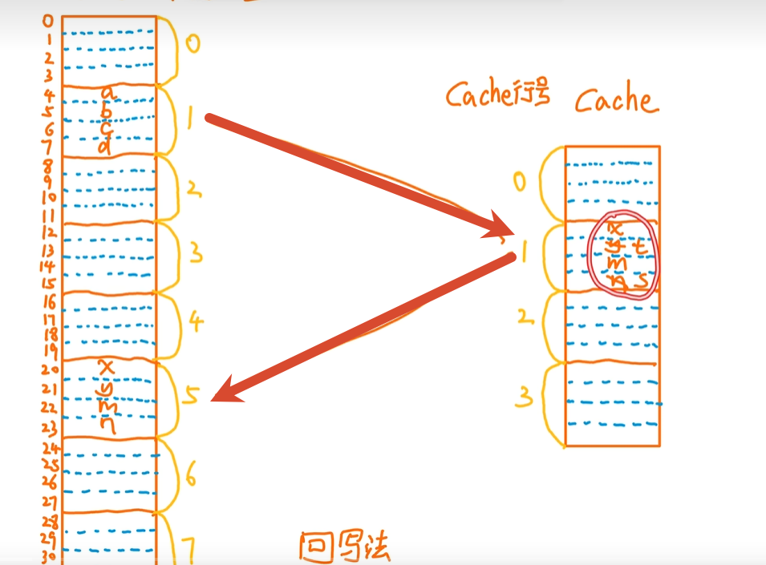

### 写不命中

1.   写分配法

先写到主存，再调入cache中的一个空闲块

2.   非写分配法

直接入主存，不调入cache

## [[cache容量]]

(每行标记位数+每行数据数)×Cache总行数、

有些位是可以没有的，但是有效位和标记位必有

1.   主存
     1.   有效位(必有)
     2.   标记位(必有)
     3.   修改位（脏位）
     4.   LRU替换位（log路数）

行数：1k
数据位：8\*32
脏位1
有效位1
tag17
1k（1+1+17+8\*32）

**地址结构和容量不同**

例

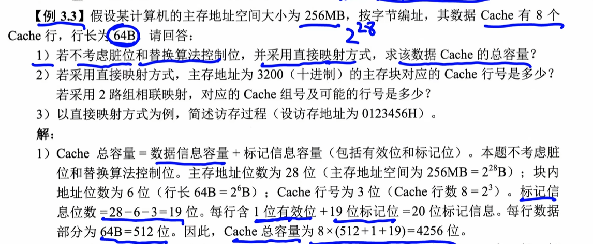

需要把64B换成位数

# [[cache例题]]

1.   组相联：

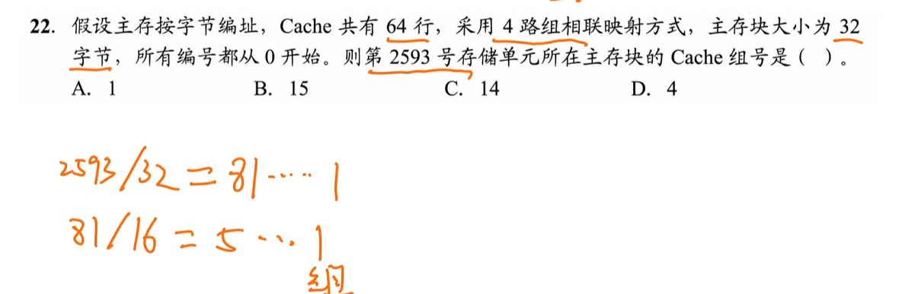

~~~
/主存块大小
81：块号 1 块内地址
/cache的组
5标记 1 cache的组号

.... 0000 1010 0010 0001
~~~

2.   全相联

3.   直接相连

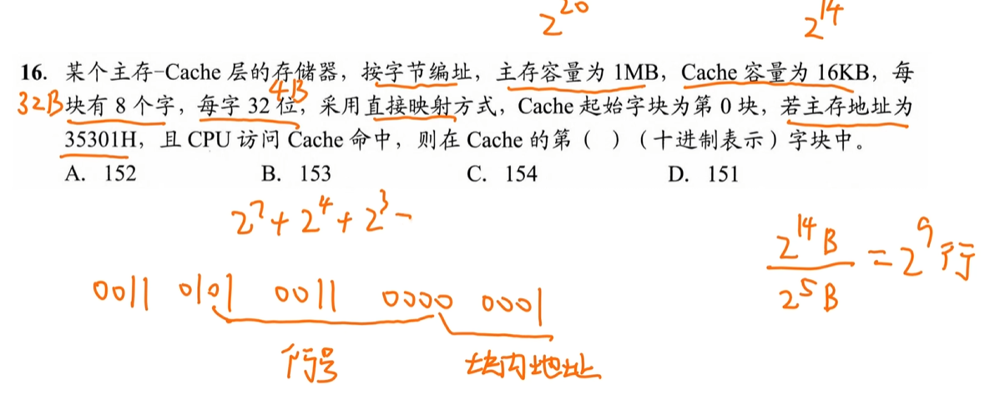

## [[编址问题]]

P120 31题

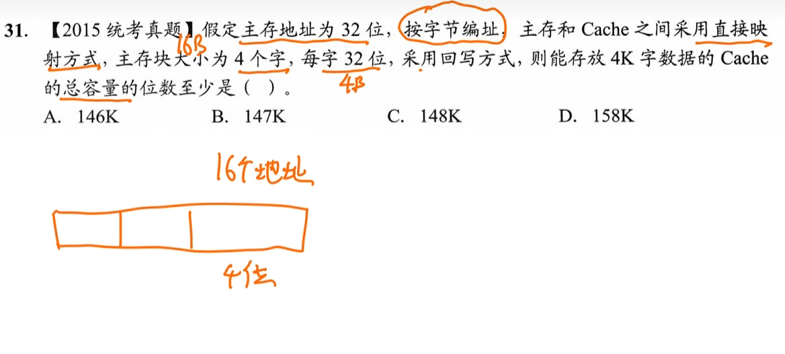

编址需要找到有多少个地址需要编号

如果是按字节编址，先算出块有多少字节，再按位表示

~~~
4 * 32 / 8 = 16 = 4位
~~~

cache行：

~~~
4k字/4 = 1k行 = 10位
~~~

容量

~~~
1k (16 * 8bit + 18 + 1 + 1 + 0) = 148k
~~~

P119 21

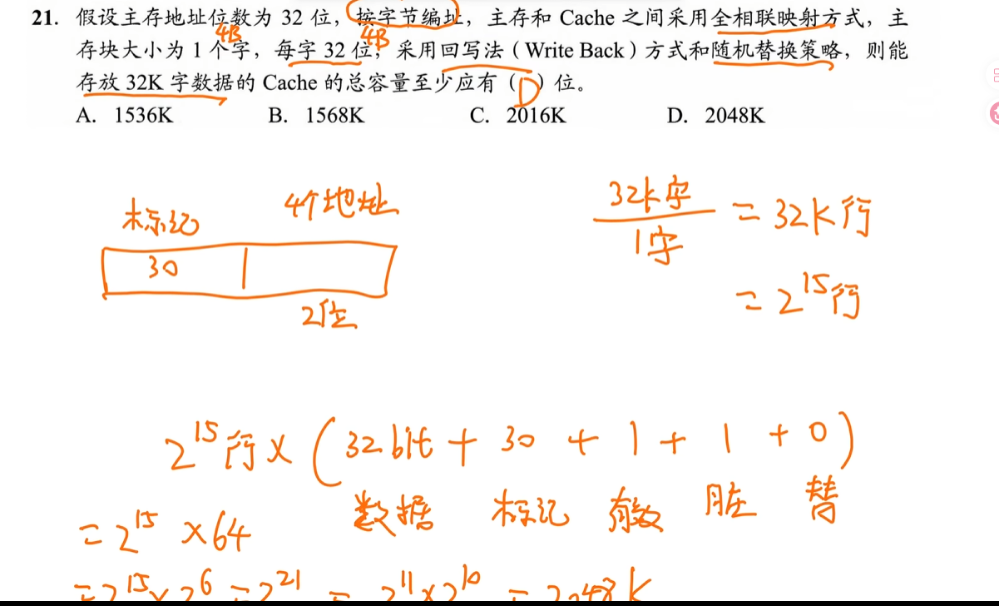

## [[块内偏移 cache的数据位]]

块内偏移：块多大，他的次方的数2^7 = 7

cache的数据位：实际的位数：2^7 * 8位*
