# [[3.2主存]]
## 半导体存储芯片
- 存储矩阵
- 译码驱动电路
- 读写电路
- 控制电路
1.存储矩阵是存储单元的集合，负责存储数据。
2.译码驱动电路与地址线相接，负责将CPU传来的地址信号翻译成对特定存储单元的选择信号，选定某个存储单元。
3.读写电路与数据线相接，负责将待写入的数据写入存储矩阵，或者从存储矩阵读出数据。
4.控制电路负责控制存储器进行读操作或者写操作。
5.**数据线是双向的**，负责传输待读出的数据或者待写入的数据。
6.**地址线是单向的**，负责将待访问的存储器地址传入译码器中。
7.读写控制线是单向的，负责传输CPU向存储器下达的读/写命令。
8.片选线是单向的，负责选定需要访问的存储器芯片。(这一点，我们后面再详细解释)

1.   存储体(**存储矩阵**).是存储单元的集合
2.   地址译码器，将输入地址转换为电平信号，驱动读写电路
     1.   单译码法
     2.   双译码法
3.   I/O电路：控制读写，由放大信号
4.   片选控制线：可以控制哪些芯片被选中
5.   读写控制线：根据CPU发出的读写命令，通过读写控制线选择单元执行相应操作

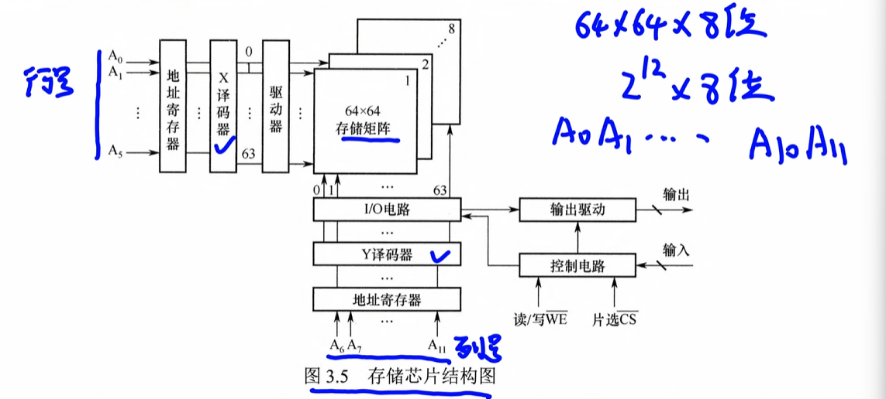

## 分类
**带宽**：$$\text{主存带宽} = \frac{\text{一次读写的数据量（字节）}}{\text{主存存取周期}}$$
若主存数据总线宽度为 64 bit（8 Byte），主存存取周期 $T_c = 10 \text{ ns}$：

$$\text{带宽} = \frac{8 \text{ Byte}}{10 \text{ ns}} = \frac{8 \text{ Byte}}{10 \times 10^{-9} \text{ s}} = 0.8 \times 10^9 \text{ B/s} = 800 \text{ MB/s}$$

RAM分为**静态SRAM和动态DRAM**，均为易失性存储器

主存采用DRAM

Cache采用SRAM

**SRAM**
双稳态触发器，六晶体管MOS
速度快，集成度低，功耗大，成本高

非破坏性，无需再生

**DRAM**

通过电容上的电荷存储信息，基本存储元仅由一个晶体管和一个电容构成，结构简单，集成度高

价格低，功耗小，容量大

速度慢，电荷会因为漏电而消失，必须定时刷新维持数据，**破坏性读出，读取后需要恢复**

刷新按**行**刷新，刷新时就是全读一遍

与cpu异步方式交换数据

**行缓冲器**：使用SRAM实现

作用:可以存储一行中所有存储单元的数据总量
## DRAM的刷新
把某一行的全体电容读取一次
一般电荷的周期位10~64ms，超过一般会丢失
每行的间隔一般不超过2ms
刷新周期：对同一行相邻两次刷新时间间隔
存储周期：刷新一行的时间
### 集中刷新
在一个刷新间隔内，前面用于读写或保持，后面用于刷新

**示例**：128行×128列，存取周期 tc=0.5μs，刷新间隔 2ms
- 一个刷新间隔内共有 2ms / 0.5μs = **4000 个存取周期**
- 前 4000 - 128 = **3872 个周期**用于正常读写/保持
- 后 **128 个周期**集中把所有行刷新一遍（每行一个周期）

**死区（刷新时间）**：集中刷新的这段时间内 CPU 无法访问主存
- 死区时间 = 128 × 0.5μs = **64μs**

**优缺点**：
- 优点：刷新速度快，控制简单，集中在短时间内一次完成
- 缺点：存在"死区"（刷新期间主存不可访问），行数越多死区越长，对实时性要求高的场景不利
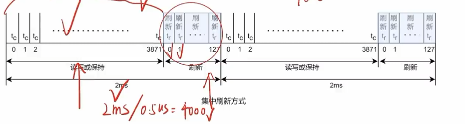
### 分散刷新
在每个存取周期后都安排一个刷新周期，把读写与刷新**均匀地分散**到整个刷新间隔内
（一直刷新）
**示例**：128行×128列，存取周期 tc=0.5μs，刷新一行时间 tr=0.5μs
- 系统工作周期 $tc' = tc + tr = 1\mu s$（前半段读写/保持，后半段刷新）
- 每 **128 个 tc'** 就能完成一次全阵列刷新
- 2ms 内可完成约 **15 次**完整刷新（2ms / 128μs ≈ 15）

**优点**：
- 没有"死区"，CPU 在每个 tc' 中都能访问主存，实时性好

**缺点**：
- 刷新频繁（每个存取周期后都要刷新），拖累系统整体速度
- 不适合高速存储器
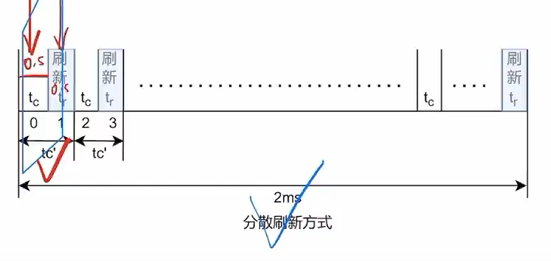
### 异步刷新
集中刷新与分散刷新的结合，把全部行的刷新操作**平均分摊**到整个刷新间隔内完成

**示例**：128行×128列，刷新间隔 2ms，存取周期 tc=0.5μs
- 单个刷新间隔 = 2ms / 128 = **15.625μs**，即每 15.625μs 刷新一行
- 每个间隔内，后 **0.5μs** 用于刷新当前行，前 **15.125μs** 可用于正常读写
- 刷新均匀散布，2ms 内全部 128 行各刷新一次

**优点**：
- 没有集中刷新的"死区"，CPU 等待时间均匀，系统吞吐量高
- 比分散刷新频率低，速度优于分散刷新，**最常用**

**注意**：
- 刷新按"行"为单位，逐行顺序恢复
- 减少存储矩阵行数、增加列数，可降低刷新频率需求
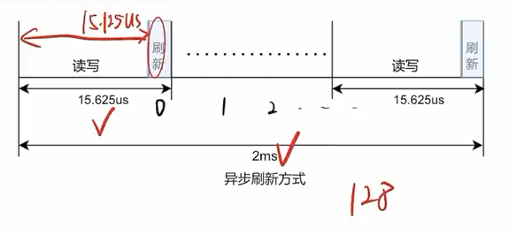
## 译码
把地址信号翻译成特定存储单元的选择信号
- 线选法（单译码法）
	- 容量小
	- 使用行列独立技术
- 重合法（双译码法）
	- 矩阵
	- 使用行列地址复用技术
		- 原理：行列传送有先后，

### 单译码法

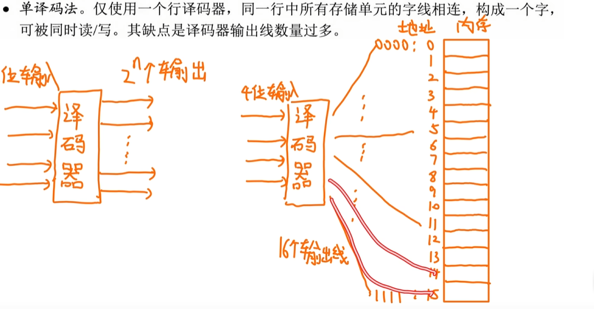

**n位输入 - 2^n个输出**

假设是4位

译码器把他翻译成0000 ...1111然后放到内存

缺点：译码器输出线太多了

### 双译码法

分为XY两部分，唯一确定一个存储单元

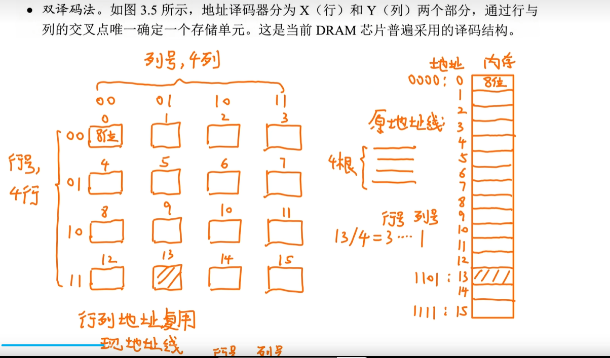

**行列地址复用**，只需要两条地址线

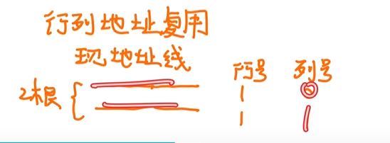

##### 地址复用

先传行号2位
再传列号2位
这样的话就又少了两条地址线
4M * 8位的DRAM采用复用问线的个数：
22 / 2 + 8

## [[5. 同步DRAM（SDRAM）]]
一样是DRAM的一种，需要定时刷新
行缓冲器使用SRAM实现
在传统的异步DRAM中，CPU发出地址和控制信号后，需要等待一段不确定的延迟时间，在这段时间，CPU不断轮询存储器的状态信号，不误执行其他任务

**同步DRAM预设了若干时钟后完成返回数据或写入数据，不需要CPU轮询等待，可以在这段时间执行其他指令**

1.   与CPU同步方式交换数据
2.   需要定期刷新
3.   由SRAM实现

## [[SRAM和DRAM比较]]

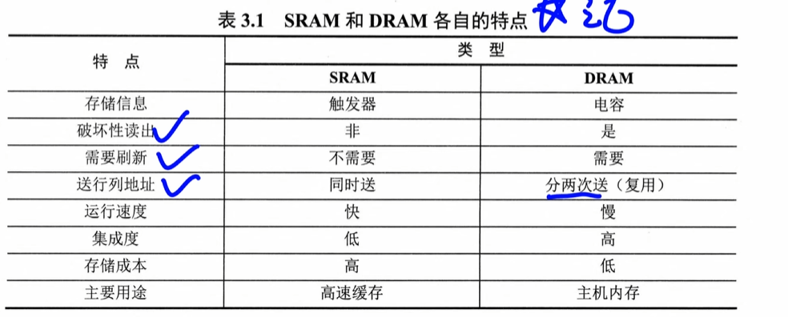

# [[非易失性存储器ROM]]

ROM

-   断电后数据不丢失
-   结构简单
- 采用随机存取

**ROM分类：**

1.   MROM 掩模式只读存储器不可编程
2.   PROM一次可编程 仅可编程一次
3.   EPROM可多次编程，但需要擦除紫外线
4. Flash存储器
5. 固态SSD

**Flash存储器(闪存)**

主板采用flash存储BIOS

兼具ROM和RAM部分优点

1.   断电后信息可以长期保存
2.   支持电擦除和在线重写
3.   读取速度接近RAM但写入很慢
4.   必须先擦除再写入
5.   电脑，手机，手表等内部存储

**固态硬盘SSD**

基于FLash存储构建

1.   非易失性
2.   无机械部件
3.   读取速度快
4.   速度快
5.   功耗低
6.   价格高

## [[3.2.3 多模块存储器]]

通过多个结构完全相同的存储模块并行工作来提高存储器吞吐率

**类型：连续编制和交叉编址**

n个存储模块需要编址（给他分配一个地址）

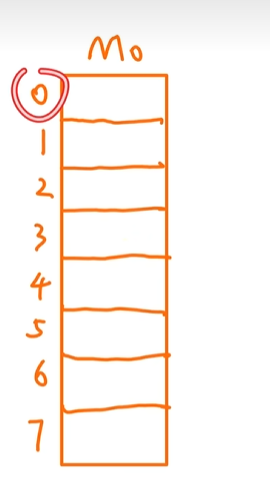

### 连续编址（高位）

**竖着编址**

4个模块，每个都是八个存储单元

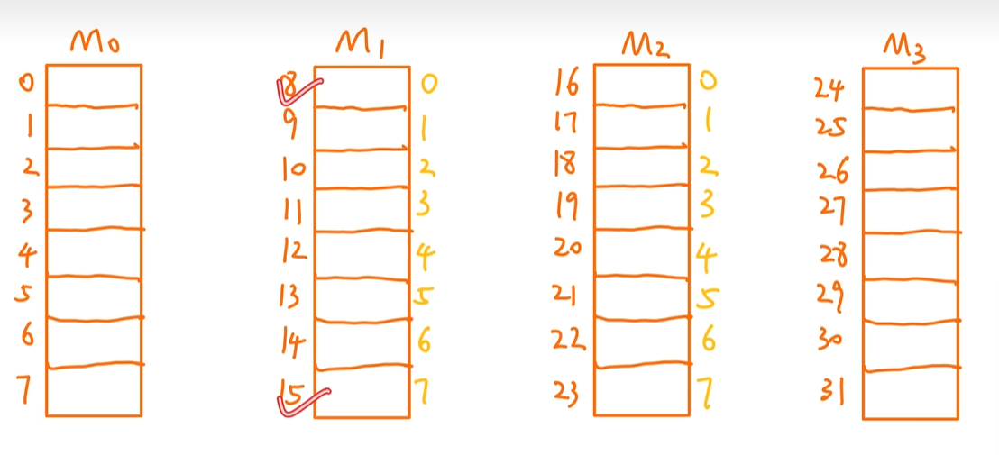

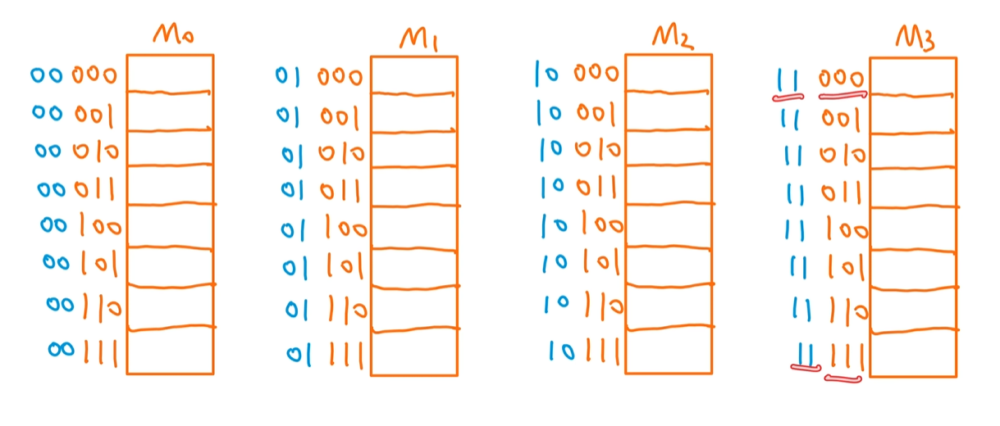

~~~
问11在哪个模块
11/8 = 1
11%8 = 3
01011 / 2^3 = 01   011

(1,3)
~~~

高位：模块号，体号

低位：相对地址，体内地址

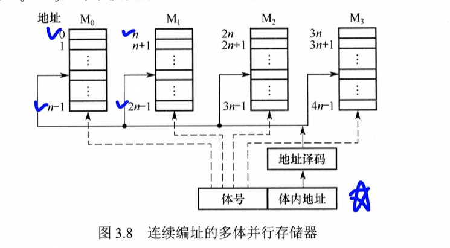

**译码的时候只看体内地址**

高位时体号，低位是体内地址

### 交叉编址（低位）

**横着编址**

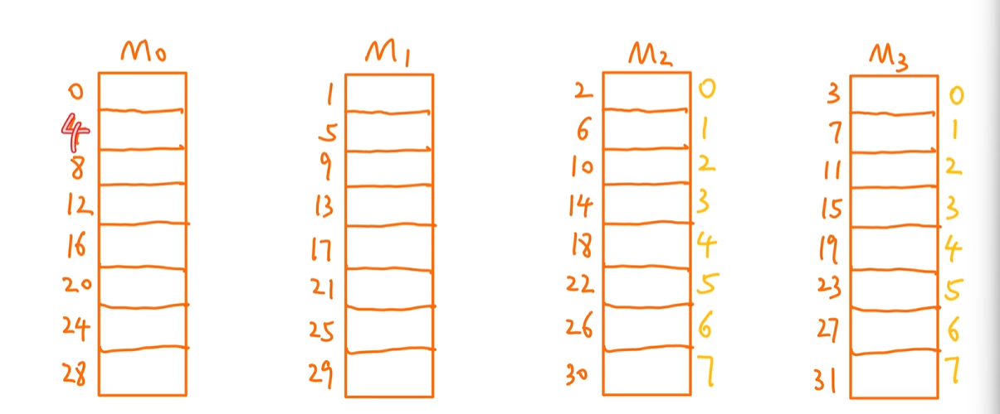

~~~
11
三号模块
2号位置

11 / 4 = 2
11 % 4 = 3

01011 / 2^2 = 010 .. 11
余数是模块号
商是相对位置
~~~

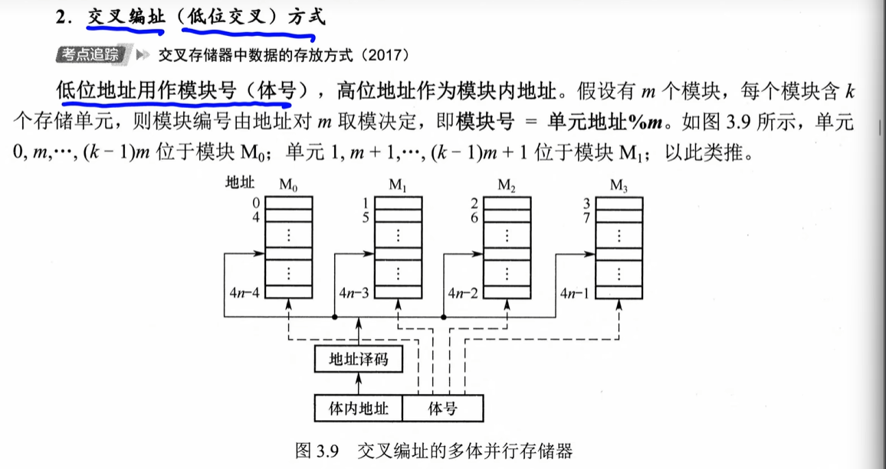

和上一个直接反过来的

**通过这种方式的存储器叫做交叉存储器**

### 同一个存储模块的数据不能在一个周期同时访问

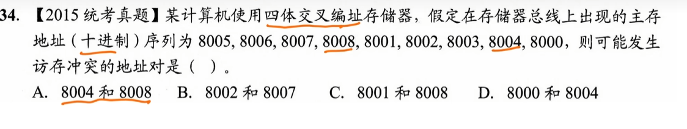

如果你想在一个周期内同时读取模块 0 里的“第 4 号字”和“第 8 号字”，CPU 就必须同时把地址 `4` 和地址 `8` 传给模块 0 的 MAR。 但一个寄存器在同一个瞬间**只能锁存一组二进制数据**，译码器也**只能稳定输出一根选通线**。地址冲突了，硬件根本无法识别你想读哪一个。

### 交叉存储器两种启动方式

取数据的方式

1.   #### **轮流启动**

**T：模块的存取周期****：指存储器进行**连续两次独立的存储器操作**（如连续两次读或两次写）之间所需的**最小时间间隔**。

​	数据从存储模块到数据总线叫存取时间

​	还需要一个回复时间

**r：总线周期**：总线把数据传送到MDR

**m：存储器模块数：>=T/r**

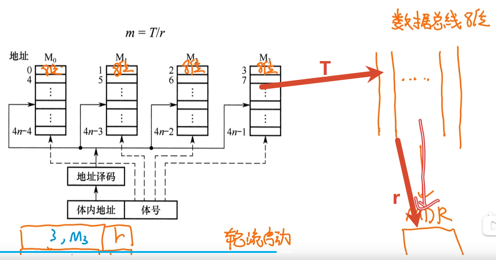

使用总线的时候必须分开传

模块启动可以同时进行，但是总线使用不能同时使用，所以使用轮流启动的方式

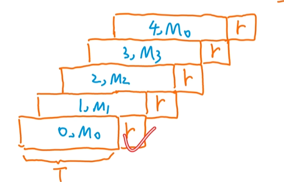

~~~
t = T + 5r
~~~

**访问同一个模块的间隔：一个存取周期**

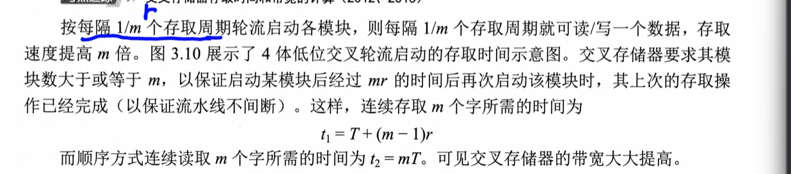

~~~
1/m = r
~~~

2.   #### 同时启动

当所有存储模块一次并行读/写的总位数恰好等于存储器数据总线宽度时，可采用同时启动方式

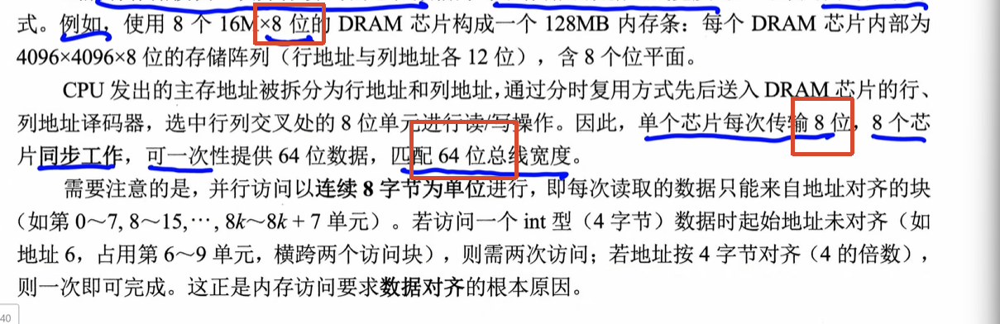

数据总线的宽度 == 所有存储器的位数

# [[交叉寻址的题]]

https://www.bilibili.com/video/BV1bsoaB1EN7?t=551.0&p=30

# [[主存储器与CPU的连接]]

由于单个存储芯片的容量有限，实际系统中需通过存储器扩展技术将多个芯片集成在内存条上

## [[主存的扩展]]

**nK × m位** 的含义就是：

-   **nK 个存储单元**（也叫 nK 个地址）
-   **每个存储单元能存 m 位** 数据

存储单元 = 一个“格子”（地址）

### 位扩展

CPU数据总线宽度大于单个芯片的数据位宽的情况，通过**并联**多个芯片，使总数据位宽与CPU总线匹配

增加存储字的长度

例：使用8片 8K*1位的RAM芯片扩展位8K\*8位的存储器

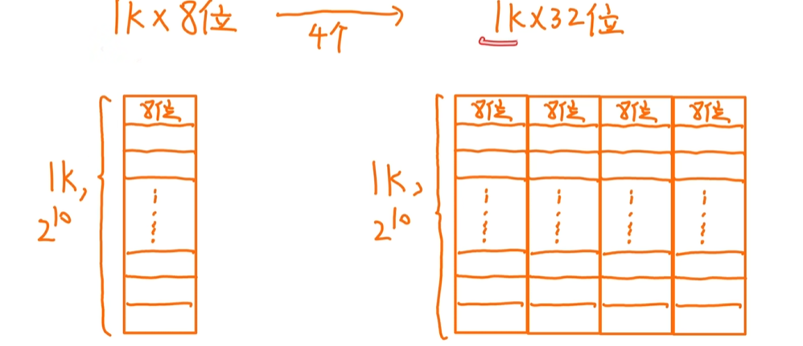

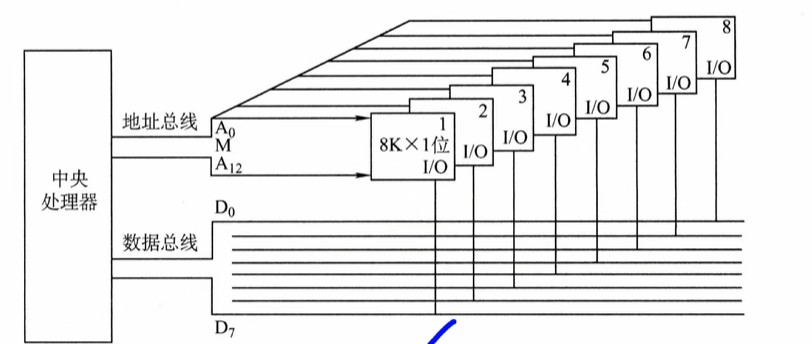

### 字扩展

字扩展用于增加存储单元的数量（扩大地址空间）

**例：用4片16K×8位的RAM芯片构成64K×8位的存储器。**

