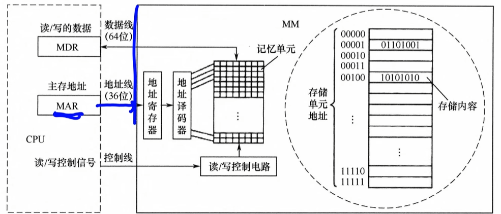
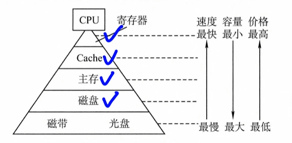
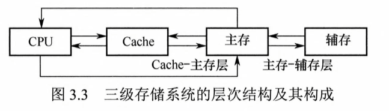
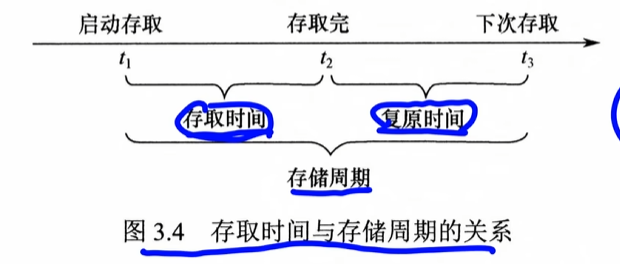

# [[存储器的分类]]

## [[ 存储元件]]

1.   半导体器件：半导体存储器DRAM，SRAM
2.   磁表面存储器：硬盘，磁带
3.   光存储器：光盘

## [[存取方式]]

1.   随机存取存储器RAM：**可以随机访问**，半导体存储器属于这类，常用于主存和cache
	1. 静态SRAM：双稳态
		1. cache ，tlb 
	2. 动态DRAM：MOS和电容
		1. 主存
2.   顺序存储存储器：**必须顺序存取**（链表），越靠前的数据访问时间越快，磁带属于这类，容量大，速度慢
	1. 磁带
3.   直接存取存储器：既可以随机访问，也可以按顺序读取数据，**属于12的集合体**，机械磁（硬）盘
	1. 磁盘 光盘
	2. 先通过随机访问，确定一个较小区域，再在小区域顺序查找
4.   相联存储器：按内容存取，查找速度块，且与存储位置无关，但是成本高。块表（TLB）
	1. 按内容访问的存储器，按照内容寻址

## [[按信息可更改性分类]]

1.   可读可写存储器RAM：
2.   只读存储器：ROM(通常不可修改)

两个都是随机存取的方式

## [[按信息可保存性分类]]

1.   易失性存储器：RAM，内存
2.   非易失性存储器：ROM，Flash存储器，磁盘，光盘

# [[主存储器的组成和基本操作]]

主存储器MM

 **作用：**存储二进制数0或1的记忆单元（存储元）

**编址单位：**具有相同地址的一组记忆单元，称为一个存储单元

## [[CPU访问一个地址]]

左边是CPU，右边是内存

[跳转到 MAR/MDR](特有名词.md)

1.   MAR通过地址线送到地址寄存器，和地址译码器，找到存储单元

2.   同时，CPU通过控制先向主存发送读写信号

     1.   写：将待写的数据送到MDR,经过数据线写入
     2.   读：将选中的单元内容哦经过数据线送到MDR

# [[存储器的层次化结构]]

1.   速度块，容量小，价格高

**三级存储系统的层次结构**

1.   CPU可以直接访问cache和主存(内存)，
2.   只有主存可以和辅存(外存)相互访问

3.   cache-主存层：主要用于缓解主存速度不匹配的问题
4.   主存-辅存层：解决容量不足的问题

## 概念

**存储周期：**存储器连续两次独立的读写操作所需时间最小间隔

**存储周期 = 存取时间 + 复原时间**

1.   存取时间≠存储周期

2.   每次读完还需要一定时间恢复（DRAM破坏性读出

     [破坏性读出](存储周期.md)）

## 存储器大小
32M * 8位 的DRAM芯片构成，问地址线和数据线
32M：代表有32M个独立的存储单元 = 2^25
	但是引脚复用技术 = max(13, 12) = 13
8：数据线代表每个存储单元可以同时存8位（一次并行传输传8bit数据）

13条地址线 8条数据线