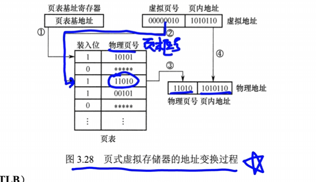
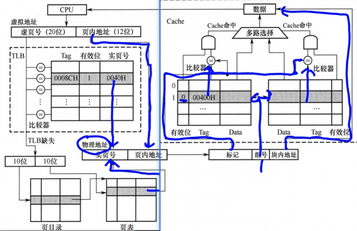

# 虚拟存储器
由软件和硬件共同实现的
利用主存和辅存构建巨大的地址空间
对程序员：是**透明的**

[3.2虚拟内存](3.2虚拟内存.md)
链接操作系统第三章虚拟存储
**虚地址，逻辑地址**：用户编程运行设计的地址，虚拟地址对应的存储空间：**虚拟空间，程序空间**
**实地址，物理地址**：实际主存单元地址，对应的存储空间：**实地址空间**
虚地址比实地址大很多

## 页式虚拟存储器
主存和虚拟地址空间的空间被分为大小相同的页
主存中的页叫**物理页，实页，页框**
虚拟地址空间叫**虚拟页，虚页**
页表记录了程序的虚页调入主存时的位置
页表长久的保存在内存中
### 页表
[页表机制](3.2虚拟内存.md#页表机制)
和操作系统一样
有效位：状态位
脏位：修改位
引用位：访问位
### 地址转换
1. CPU拿到一个虚拟地址需要转化为物理地址
	1. 虚拟地址：虚页号 + 页内偏移
	2. 物理地址：物理页号 + 页内偏移
	3. 两个页内偏移是相等的

### TLB快表
TLB独立于内存

经常访问的页对应的页表项放到快表中
在主存中的页表成为**慢表**

TLB使用**SRAM**实现，和cache相同
全相联， 组相联
## TLB和Cache 的映射方式

TLB 与 Cache 的映射方式本质相同，但地址字段命名有差异。

| 映射方式 | TLB 地址结构           | Cache 地址结构         |
| ---- | ------------------ | ------------------ |
| 直接映射 | [标记][**页号**][页内偏移] | [标记][**行号**][块内地址] |
| 全相联  | [标记][页内偏移]         | [标记][块内地址]         |
| 组相联  | [标记][**组号**][页内偏移] | [标记][**组号**][块内地址] |
|      | (虚页号) + 页内偏移       | 内存块号 + 块内地址        |

> **页内偏移量 = 块内地址**，底层逻辑相同，都是定位块/页内部的位置。TLB 中称"页内偏移"，Cache 中称"块内偏移"或"字偏移"。

**TLB 各映射方式**：

- **直接映射**：标记 + 页号 + 页内偏移。每个物理页框在 TLB 中有唯一位置（实际中较少用于 TLB）。
- **全相联**：标记 + 页内偏移。任意位置可存放任意页，只需标记匹配，搜索效率高但硬件成本高。
- **组相联**：标记 + 组号 + 页内偏移。将 TLB 分为若干组，页号拆分为"组号 + 组内索引"，标记用于组内匹配。

> TLB 通常采用**全相联**或**组相联**（SRAM 实现），需要快速查找页表项。

**Cache 各映射方式**：

- **直接映射**：标记 + 行号 + 块内地址。每个主存块只能映射到 Cache 的一个固定行。
- **全相联**：标记 + 块内地址。主存块可放入 Cache 任意位置，灵活性最高但比较器多。
- **组相联**：标记 + 组号 + 块内地址。Cache 分为若干组，每组 N 行（N 路组相联），主存块先定位组再组内匹配。

这里是双向箭头，是二路组相联
