# [[4指令系统]]

# [[4.1指令系统]]

机器指令：简称指令（2进制）

指令集体系结构（ISA） 

## [[ISA规定的内容]]

1.   指令格式，寻址方式，操作类型，操作数的个数，类型，寻址约束
2.   操作数的数据类型，按照大端还是小端的方式存放
3.   程序可访问的寄存器编号，数量和位数，存储空间的大小以及编址方式
4.   程序员可见的控制状态

## [[指令的基本格式]]

`操作码 + 地址码`

~~~
func(int a,int b)
~~~

**零地址**：

空操作，停机关中断

是可能有数据的

**一地址**

1.   含一个操作数
2.   两个操作数：累加器类型，两个操作数，隐含在acc

**二地址指令**

两个地址码

**三地址指令**

**定长操作码的指令格式**

一个n位操作码字段的指令系统，最多可以表示2^n条指令

**扩展操作码指令格式**

操作码的位数不固定

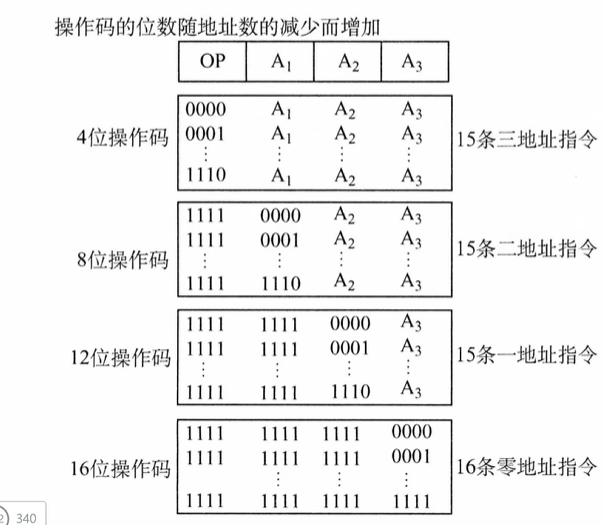

1.   操作码是4位：能表示16种，但是1111 留成了二地址

~~~
0000

...
1111给下一个用
~~~

2.   操作码是八位：也是15种

~~~
1111 0000
    
    ....
~~~

3.   操作码12位，15种
4.   操作码16位：16种

### 题：问零地址有多少条

假设是

~~~
0 0 A1 A2
0 1 A1 A2
1 0 A1 A2
1 1 A1 A2

二地址只用
0 0 
0 1 
一共两条

一地址只用
1 0 A2 4条
1 1 A2 2条(留两位给0地址)
一共六条

零地址
1 1 1 0  
1 1 1 1
八种
~~~

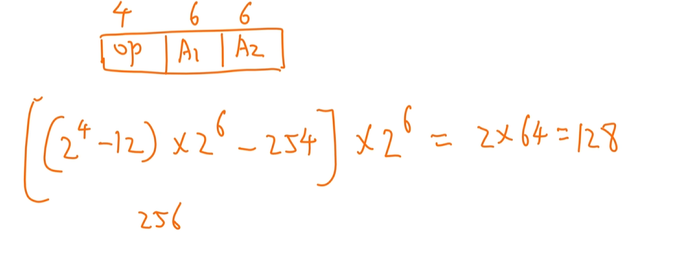

**剩的 * 2^把地址码变成操作码的位数的***

## [[指令类型（了解）]]

1.   数据传送
2.   算数与逻辑运算
3.   移位
4.   顺序控制
5.   IO
6.   CPU控制

## [[大小端存放]]

当一个数据大到需要占用 2 个或更多字节的内存空间时，计算机就面临一个选择：是先存数据的高位，还是先存数据的低位？

假设有一个 32 位的十六进制数：`12 34 56 78H`。 它由 4 个字节组成，从左到右分别是：

-   **MSB（最高有效字节 / 数据的头）**：`12`
-   **LSB（最低有效字节 / 数据的尾）**：`78`

#### 大端模式 (Big Endian)
[2数据的表示和运算](2数据的表示和运算.md)

-   **规则**：数据的**高字节**存放在**低地址**中，低字节存放在高地址中。
-   **口诀**：**“大端顺人类”** —— 存放顺序符合人类从左到右的书写习惯。

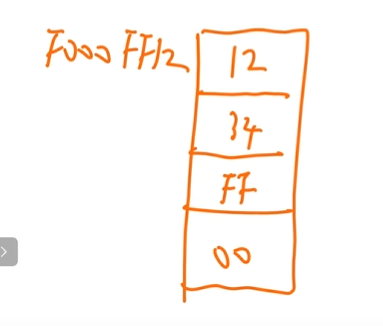

# [[寻址方式（很重要）]]

1.   指令寻址
2.   数据寻址（*）

## [[指令寻址]]

定义：确定**下一条**要执行的**指令地址**

分类：

1.   顺序寻址：通过程序计数器（PC）加上当前指令的字节长度，自动形成下一条指令地址。

**一条指令占几个地址PC就加几**

按字节编址，指令字长为16位，则PC自增为PC + 2

按字编址，指令字长为16位（且机器字长也是16位，即1字 = 16位），PC = PC + 1

2.   跳跃寻址

一般是转移类指令
**绝对转移**
**相对转移**

都是需要改PC（程序计数器）

## [[数据寻址]]

定于：确定本条**指令操作数地址**

[指令的结构](机器指令的结构.md)

**有效地址：就是要操作的数据**

**形式地址：据在【内存（主存）】里的真实门牌号。**

**寻址特征：用什么寻址方式去寻找数据，位数决定了可支持的寻址方式种类**

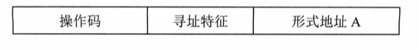

其中第二组给4位就知道是哪种寻址方式

**注意：**

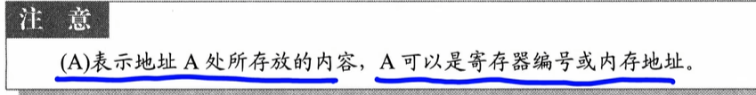

### 1.隐含寻址

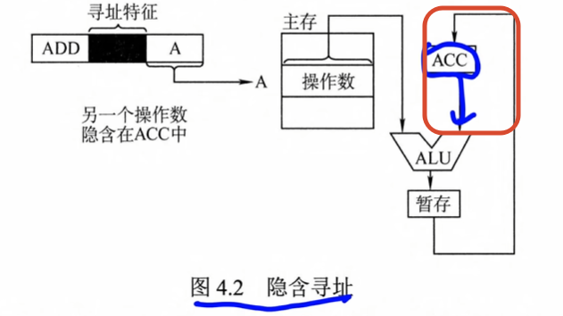

隐含：另一个数据ACC提供了

### 2.立即寻址

在立即寻址中，指令的形式地址字段并不表示操作数的地址，而是直接存放**操作数本身**

**操作数：**就是**指令要处理的数据**，或者说**被操作的对象**。

**执行速度最快**

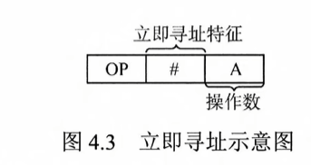

不访问内存

### 3.直接寻址

性质地址A，真实地址EA 

EA = A

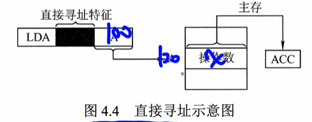

访问一次内存

### 4.间接寻址

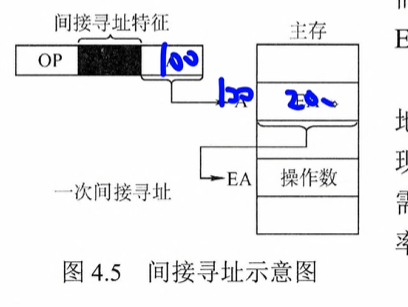

访问两次内存

100 先找到200

200再找一次地址（一次间接寻址）

### 5.寄存器寻址

 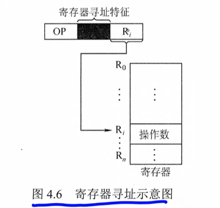

指令中放了一个寄存器编号4

无需访问内存，仅访问寄存器

### 6.寄存器间接寻址

EA = (Ri)

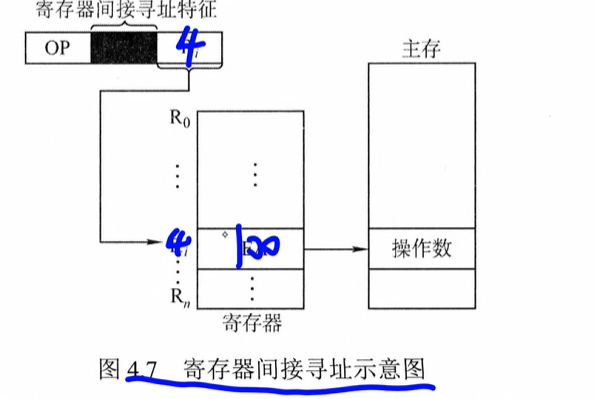

寄存器再找一次内存

### 7.相对寻址

相对寻址是指将程序计数器（PC）的内容与指令中的形式地址A相加，形成转移目标地址，

（PC + 1下一条） + A

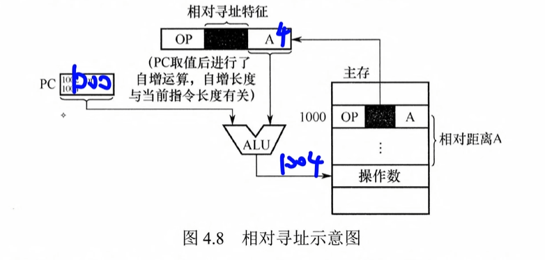

PC 为取指完成后自动更新的值，指向**下**一条指令的地址

可用于转移类指令

### 8.基址寻址

 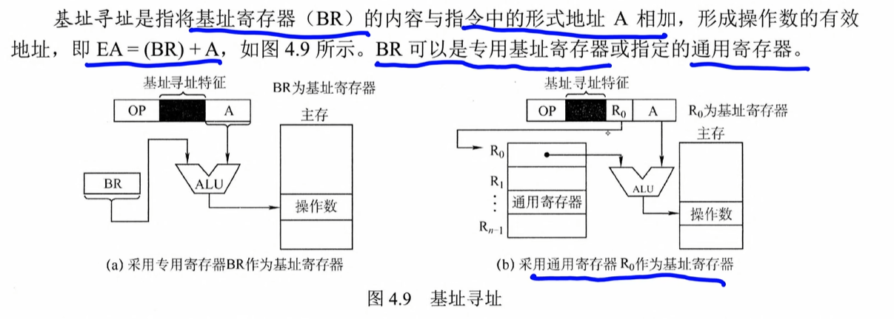

EA = BR + A

专用基址寄存器/指定的通用寄存器

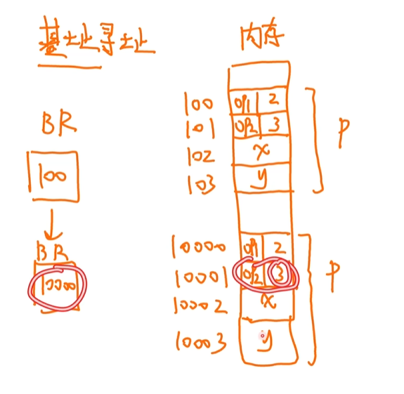

1.   操作码op1 + 2 （这里的2是要BR（100） + 2 = x的位置）

如果你想要移动位置，便可以直接移动，x，y的位置依旧是BR + 2和BR  + 3

**基地址是相同的，可以取到不同的形式地址**

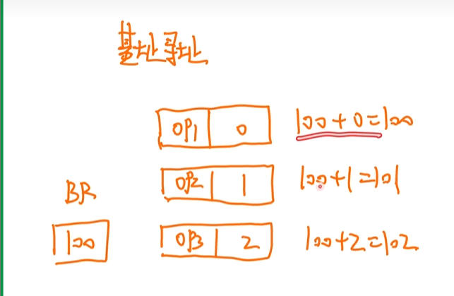

##### 题

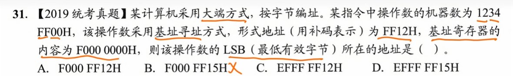

基址寄存器的内容为无符号数

形式地址（补码）有符号数

需要把位补齐才可以计算

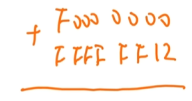

= EFFF FF12

因为是大端，把机器码放进去是这个

| **内存物理地址** | **存放的数据（字节）** | **含义**                       |
| ---------------- | ---------------------- | ------------------------------ |
| **`EFFF FF12H`** | `12`                   | MSB（最高有效字节 / 起始地址） |
| **`EFFF FF13H`** | `34`                   |                                |
| **`EFFF FF14H`** | `FF`                   |                                |
| **`EFFF FF15H`** | `00`                   | **LSB（最低有效字节）**        |

### 9.变址寻址(数组问题)

EA = IX*大小 + A（&a[0] + i * (sizeof(int))）和前两个一样

但是现在变成变址寄存器了

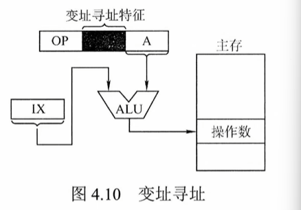

让变址寄存器改变

**形式地址不改变，变址寄存器改变**

### 10堆栈寻址（零地址指令）

### 总结

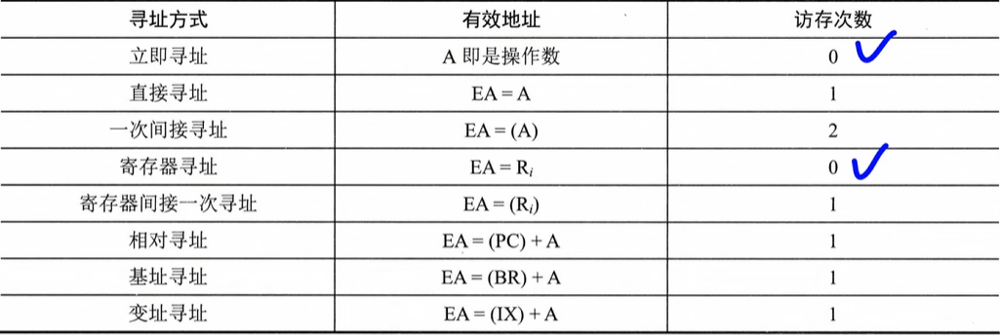

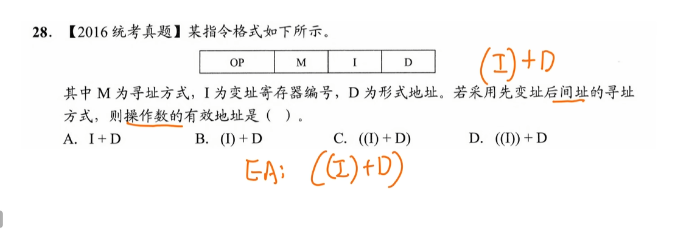

有效地址：EA

操作数：（EA）

  

# [[CISC和RISC的基本概念]]

复杂指令系统计算机（CISC）

精简指令系统计算机（RISC）

典型代表：

ARM 苹果

MIPS x86 英特尔

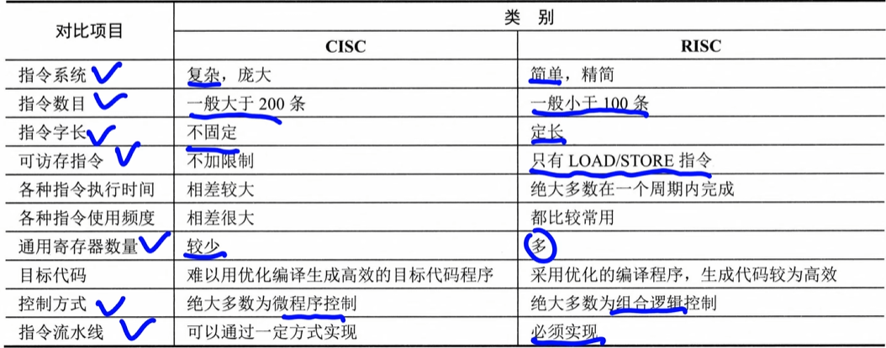

