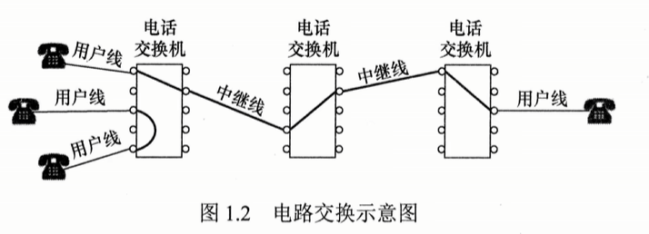
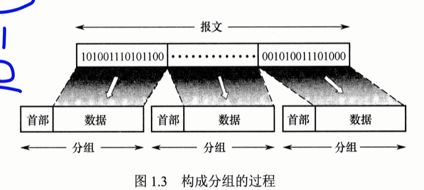
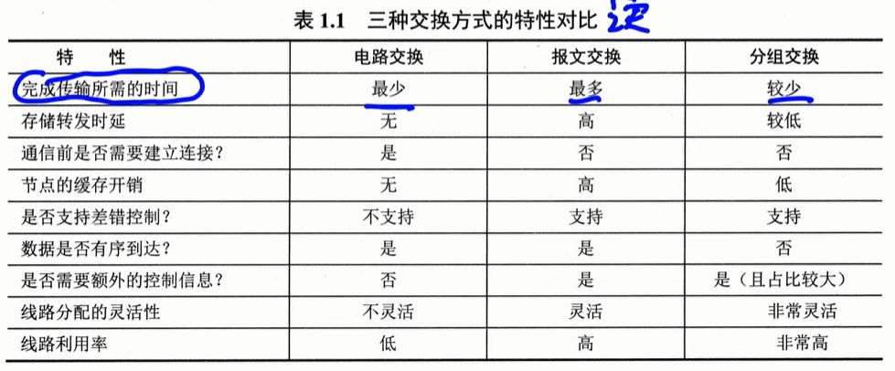
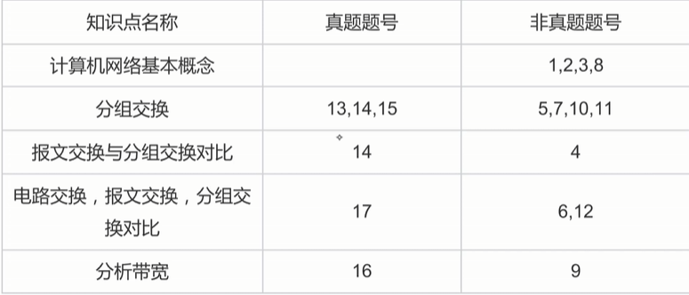
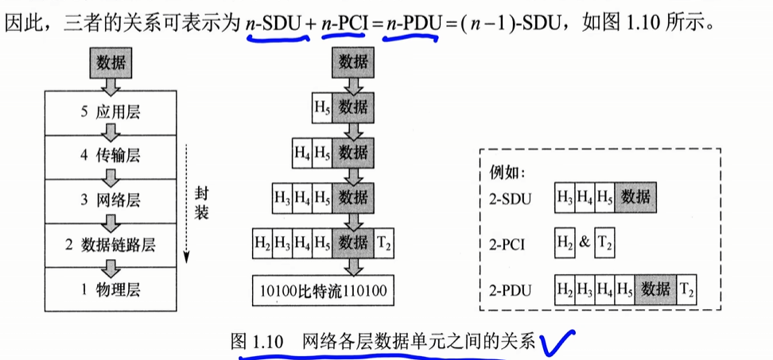
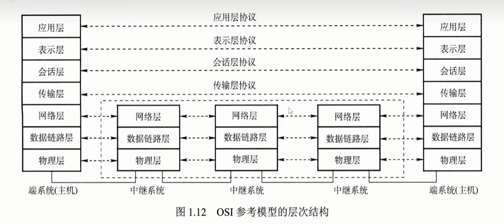
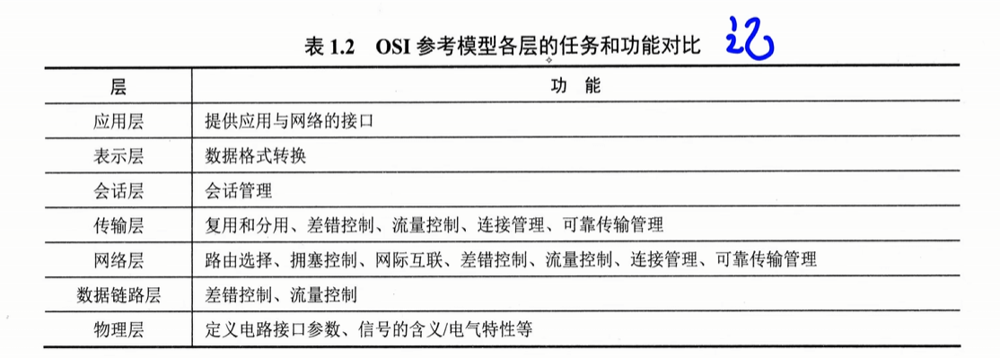
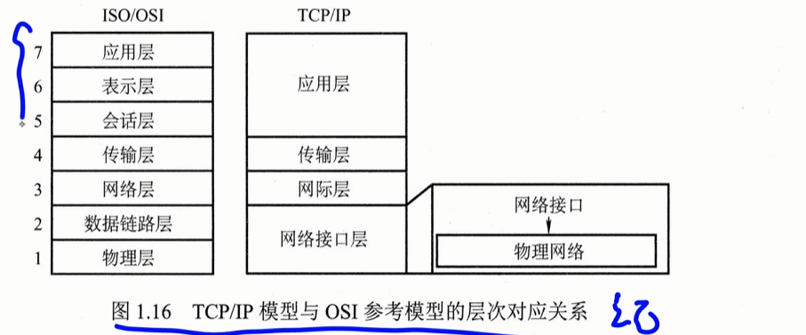
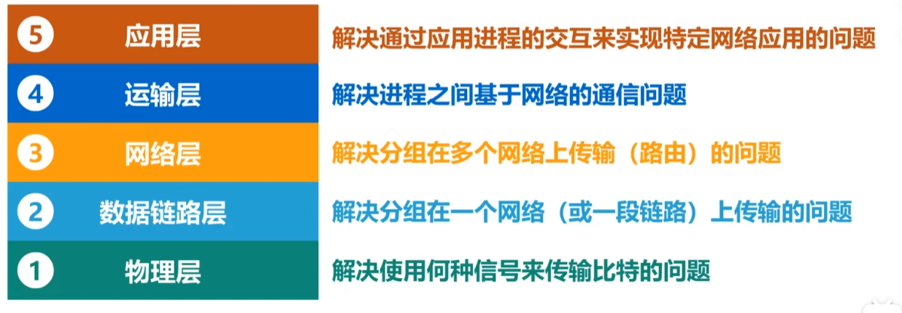

# 1.1.4 三种交换
## 电路交换
**阶段**：
1. 建立连接（占用通信资源）
2. 传输数据（持续占用通信资源）
3. 释放连接（归还通信资源）

在数据传输前，通信双方需要建立一条专用的端到端物理通路，**独占**

**优点**
1. 时延小：数据直达
2. 有序传输：按顺序发送，没有失序
3. 没有冲突
4. 实时性强

**缺点**
1. 建立时间长
2. 利用率低
3. 灵活差：中间故障需要重新建立连接
4. 难实现差错控制：中间节点不具备存储检错能力

## 报文交换
数据附加一个**源地址和目的地址**，封装到报文中
采用**存储转发**技术

**存储转发**：
先传送到相邻节点，整个下载接收好后，再转发到下一条

**优点**
1. 无需建立连接
2. 路线分配灵活：选择最优路径
3. 利用率高
4. 可以中间差错控制

**缺点**
1. 有时延
2. 缓存开销大
3. 错误处理低效

## 分组交换
**存储转发技术**，把数据拆成小份
每一个都要加控制信息（源地址，目的地址，分组编号）构成分组

**优点**
1. 便于存储管理，开销小
2. 传输效率高
3. 减低出错概率

**缺点**
1. 存储存储转发时延
2. 需要传输额外信息
3. 可能失序，丢失，重复

## 总结

# 1.1.5网络分类
**按照分布范围**
1. 广域网（WAN）
2. 城域网（MAN）
3. 局域网（LAN）
4. 个人趋于网（PAN）

**传播技术**
1. 广播技术：所有其他计算机都能“收听”到该分组，并通过检查目的地址决定是否接收
2. 点对点技术：每条物理线路连接一对计算机。

**拓扑结构**
1. 总线型
2. 星型
3. 环状网络
4. 网状网络

**传输介质**
1. 有线
2. 无线

# 1.1.6性能指标

## 速率
连接到网络上的节点在数字信道上发送数据的速率，也称数据传输速率、数据率或比特率。

**单位**：bit/s（比特/秒），有时也写作 bps

**常用单位**：
- kb/s（k = 10³）
- Mb/s（M = 10⁶）
- Gb/s（G = 10⁹）

## 数据量单位与速率单位前缀的区别
- **存储容量：数据量单位**：K、M、G 常用 2 的幂次表示，如 1Kb = 2¹⁰b
- **速率，频率单位**：k、M、G 常用 10 的幂次表示，如 1kb/s = 10³b/s
- 通常数据量使用前缀大写 K，速率使用前缀小写 k，但其他前缀均为大写

1kbps = 1000bit/s
- **k (kilo)：** 千（$10^3 = 1,000$）。
- **b (bit)：** 比特/位（数据的最小单位）。注：小写 **b** 代表 bit，大写 **B** 代表 Byte（字节）。
- **ps (per second)：** 每秒。
## 带宽
描述的最大传输能力
定义：理论上最高的传输速率
**通信领域定义**：带宽是指通信线路允许通过的**信号频率范围**，单位是赫兹 (Hz) 
**频率范围**：HZ
**网速**：b/s
## 吞吐量
单位时间内通过某个网络（或信道、接口）的实际数据量，常用于对实际网络进行测量，评估真实可达的数据传输能力。

## 时延 
数据（一个报文或分组）从网络（或链路）的一端传送到另一端所需的总时间，由四部分构成：
### 发送时延（传输时延）**数据量大小有关**
节点将分组的所有比特推入链路所需的时间，即从第一个比特开始发送到最后一个比特发送完毕。

**公式**：发送时延 = 分组长度 / 发送速率

### 传播时延  **物理世界距离长短**  **短**
电磁波在信道（传输介质）中传播一定距离所需的时间，即一个比特从链路一端传播到另一端的时间。

**公式**：传播时延 = 信道长度 / 电磁波在信道上的传播速率

> **区分**：发送时延取决于分组长度和发送速率；传播时延取决于链路距离和传输介质。

### 处理时延 
分组在交换节点为存储转发而进行必要处理所花费的时间，如解析分组首部、差错检验、查找路由等。

### 排队时延
分组在路由器的输入队列或输出队列中等待处理或转发所花费的时间。

### 时延带宽积 **信道中的数据大小**
发送端发送的第一个比特即将到达接收端时，发送端已发出的比特总数，即已发出但尚未到达接收端的最大比特数，也称以比特为单位的链路长度。

**公式**：时延带宽积 = 传播时延 × 信道带宽

**形象理解**：将链路想象为一条圆柱形管道——管道长度代表传播时延，横截面积代表链路带宽，则时延带宽积表示该管道可容纳的比特数量。

### 往返时延（RTT）
从发送端发出一个短分组，到收到接收端返回的确认信号所经历的总时间。

**组成**：
- 发送端与接收端之间的往返传播时延
- 接收端的处理时延
- 互联网环境中还包括各中间节点的处理时延和排队时延

> **注意**：往返时延不包括数据分组本身的发送时延。

# 1.2分层结构
物理层的PDU称为比特流，
数据链路层的PDU称为帧
网络层的PDU称为IP分组，
传输层的PDU称为TCP报文段或UDP数据报。
## 数据的组成
1. 协议数据单元PDU：对等层之间传送的数据单位，本层发送的数据
2. 服务数据单元SDU：层与层之间交换的数据单位，本层负责发送的数据
3. 协议控制信息PCI：本层协议附加的控制信息
nPDU = nSDU + nPCI = n-1 SDU
N层的PDU直接作为N-1层的SDU

## 网络协议，服务，接口

### **协议**
控制对等实体之间的通信规则集合，是**水平的**
不同结点对等实体之间
**实体**
各层实现该层的软件和硬件

**组成**
1. 语法 规定数据与控制信息的**格式**。
2. 语义 规定需要发出何种控制信息、完成何种动作以及做出何种应答。**含义**
3. 同步 执行先后顺序**时序**

### **接口**
**服务访问点**同一结点，相邻两层相邻两层交换信息的逻辑接口

### **服务**
下层为紧邻的上层提供的功能调用，**垂直的**
**分类**
**1. 面向连接服务和无连接服务**
- **面向连接服务**：通信双方需在传输前先建立连接并分配资源（如缓冲区），传输结束后释放连接与资源。全过程包括：连接建立 → 数据传输 → 连接释放。目的：保障通信可靠性。
- **无连接服务**：无须预先建立连接，发送方可直接发送包含目的地址的分组，由网络动态选择路径，各分组独立传输。通常称为"尽最大努力交付"，属于不可靠服务。

**2. 可靠服务和不可靠服务**
- **可靠服务**：网络具备检错、纠错和应答机制，能确保数据正确、完整、有序地送达目的地。
- **不可靠服务**：仅提供"尽最大努力交付"，不保证可靠性。数据可靠性需由高层保障，如接收方校验数据完整性，出错时通知发送方重传，通过高层机制将不可靠服务转化为可靠服务。

**3. 有应答服务和无应答服务**
- **有应答服务**：接收方在收到数据后，由传输系统自动向发送方返回应答（肯定或否定）。例如文件传输通常采用有应答服务，以确保数据完整。
- **无应答服务**：接收方不自动返回应答，若需确认须由高层协议或应用实现。例如 WWW 服务中，客户端收到网页后通常不向服务器发送应答。

# OSI参考模型
**提出机构**：国际标准化组织（ISO）

**全称**：开放系统互连参考模型（OSI/RM），简称 OSI 参考模型

共 **7 层**，自下而上：

| 层号  | 名称    |         |
| --- | ----- | ------- |
| 7   | 应用层   |         |
| 6   | 表示层   |         |
| 5   | 会话层   | 应用层报文   |
| 4   | 传输层   | UDP/TCP |
| 3   | 网络层   | 分组/数据报  |
| 2   | 数据链路层 | 帧       |
| 1   | 物理层   | B       |

## 物理层
传输单位 比特
**功能**：在物理介质上为数据端设备透明地传输原始比特流。

**规定**：规定了接口的机械特性和电气特性

## 数据链路层

交换机
传输单位 帧
**功能**
1. 将物理层提供的可能出错的物理连接，改造为逻辑上无差错的数据链路
2. 将网络层交来的组封装成帧
3. 可靠得到传送到**相邻节点**，实现差错控制，流量控制
**节点到结点通信MAC地址**

## 网络层
传输单位 数据报

网络和主机编址IP协议
**作用**
1. 把分组从源主机传送到目的主机
2. 点对点

**功能**
1. 路由选择
2. 拥塞控制
3. 差错控制
4. 流量控制
5. 网际互连

**主机到主机基于IP地址**
## 传输层
负责不同主机中进程之间的端到端通信

**实现端到端基于端口**
处理可靠性，流量控制，错误矫正
应用进程，
## 会话层
不同主机上进程之间的会话
建立 维护 终止会话连接
可从最近的检查点恢复会话，实现类似“断点续传”的可靠性。

## 表示层
数据压缩、加密与解密 编码

## 应用层
各种网络应用

## 总结

# TCP/IP模型
已成为事实上的国际标准，共 **4 层**，自下而上：

| 层号  | 名称    | 对应 OSI          |
| --- | ----- | --------------- |
| 4   | 应用层   | 会话层 + 表示层 + 应用层 |
| 3   | 传输层   | 传输层             |
| 2   | 网际层   | 网络层             |
| 1   | 网络接口层 | 物理层 + 数据链路层     |

## 网络接口层
- 类似于 OSI 的物理层和数据链路层
- 从主机或节点接收 IP 分组，并将其发送到指定的物理网络上
- TCP/IP 模型未规定该层的具体功能或协议细节，仅要求主机能通过某种底层协议接入网络以传送 IP 分组
- 实际使用的物理网络类型：各类局域网（以太网、无线局域网等）、电话网、广域网等

## 网际层
**主要协议**：IP（Internet Protocol）

**功能**：负责数据包的路由与转发，实现不同网络之间的互联

## 传输层
**主要协议**：TCP、UDP

**功能**：提供端到端的通信服务（TCP 可靠传输 / UDP 不可靠快速传输）

## 应用层
**主要协议**：HTTP、SMTP、DNS、RTP 等

**功能**：向用户提供网络服务接口（网页浏览、邮件传输、域名解析、实时传输等）

## 总结

## 数据报和虚电路
1. 数据报：分组转发的方式，每个数据报都作为独立的数据报会携带源地址，目标地址等信息
2. 虚电路：吧数据报和电路交换结合起来
### 虚电路
理论上的思想
在分组发送之前，要求在发送方和接收方建立一条逻辑上的虚电路，连接一旦建立，虚电路所对应的物理路径随之固定。
**阶段**
1. 建立连接
2. 发送分组
3. 拆除连接
不独占物理线路，是逻辑上的，也不需要预分配带宽
在传输过程中，只需要携带虚电路号VCID

### 表1.3 数据报与虚电路的对比

| 对比项       | 数据报服务                   | 虚电路服务                        |
| --------- | ----------------------- | ---------------------------- |
| 连接的建立     | 不需要                     | 必须有                          |
| 携带信息      | 每个分组在传输过程中都要携带源地址和目的地址  | 分组只需要携带虚电路号（VCID）            |
| 目的地址      | 每个分组都有完整的目的地址           | 仅在建立连接阶段使用，之后每个分组使用长度较短的虚电路号 |
| 路由选择      | 每个分组独立地进行路由选择和转发        | 属于同一条虚电路的分组按照同一路由转发          |
| 分组顺序      | 不保证分组的有序到达              | 保证分组的有序到达                    |
| 可靠性       | 不保证可靠通信，可靠性由用户主机保证      | 可靠性由网络保证                     |
| 对网络故障的适应性 | 出故障的节点丢失分组，其他分组可以绕路正常传输 | 所有经过故障节点的虚电路均不能正常工作          |
| 差错处理和流量控制 | 用户主机进行流量控制，不保证数据链路的可靠性  | 可由分组交换网负责，也可由用户主机负责          |