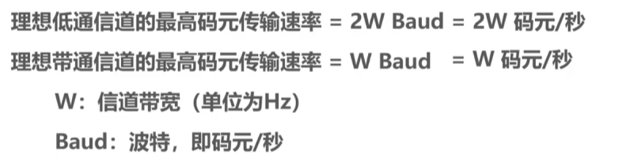
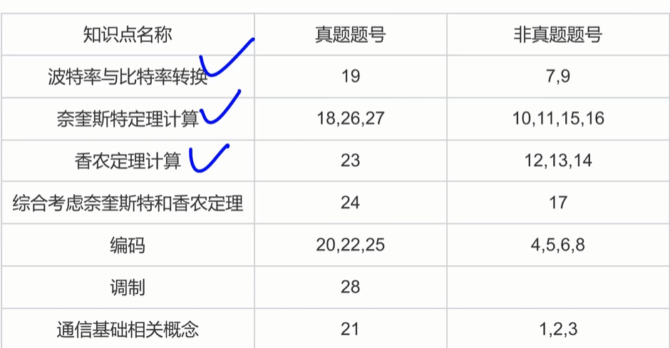
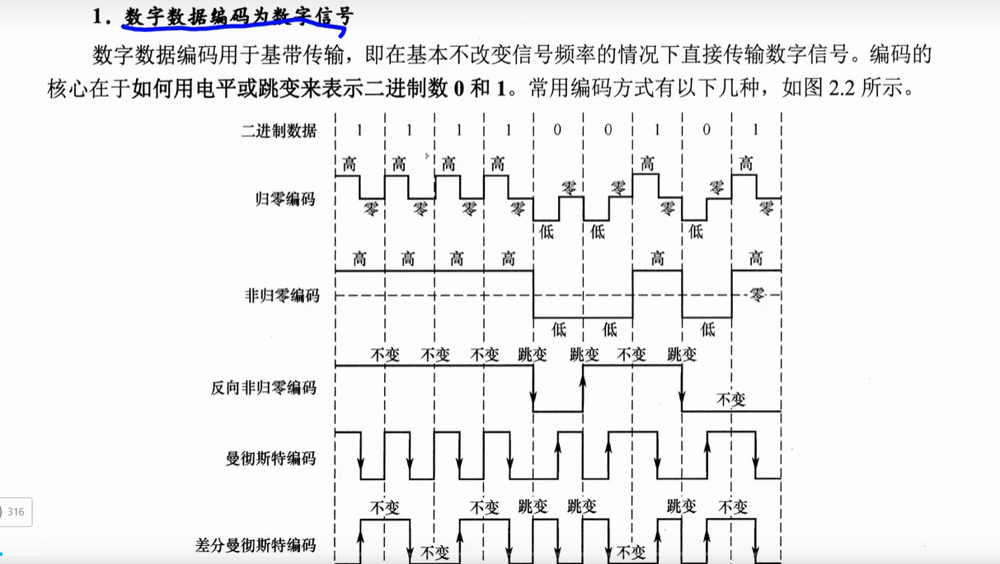
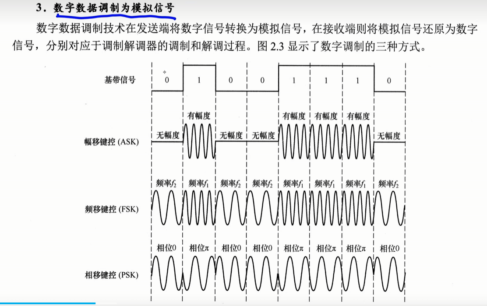
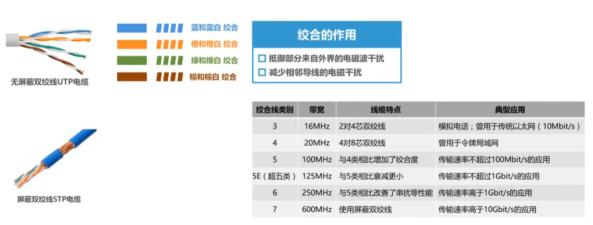

**物理层考虑的是怎样才能在连接各种计算机的传输媒体上传输数据比特流。**
物理层为数据链路层屏蔽了各种传输媒体的差异，使数据链路层只需要考虑如何完成本层的协议和服务，而不必考虑网络具体的传输媒体是什么。

# 通信基础

**.信号**
1. 模拟信号：连续的  电磁波
2. 数字信号：离散的  0 1 0 1 0 1

**码元**
使用时间域的波形表示数据信号时代代表不同离散值的基本波形
使用二进制时，只有两种码元。也就是说一个码元可以携带多个比特信息
1. 1
2. 0
如果有四种不同的码元，称四进制码元，每个码元携带两比特信息

**k进制符号**
固定时长的信号波形
这种波形成为码元（k进制码原）（k种波形）

**信源** 数据的源头
**信道** 传输介质
**信宿** 数据的终点

**通信方式**
1. 单向 ：只有一个方向的通信而没有反方向的交互，如无线电广播、电视广播等。
	1. 一个信道
2. 半双工：通信双方都可发送或接收信息，但任何一方都不能同时发送和接收。
	1. 
3. 全双工：通信双方可同时发送和接收信息。
	1. 两个独立信道

**速率，波特，带宽**
1. 码元传输速率（**波特率**）：每秒传输的码元数
2. 信息传输速率（**比特率**）每秒传输的比特数 b/s

若一个码元携带n比特的信息，波特率M = M\*n b/s

波特率 \*每个码元所含的比特数（logN） = 比特率
N是指码元波形的种类
信息量 = logN
**通信方式**
1. 单工：只有一个方向通信没有反方向交互：无线电广播
2. 半双工：双方都可以发，但是不能同时发送/接收
3. 全双工：双方可以同时发送和接收

# 模拟数字转化为数字信号
1. 采样
2. 量化
3. 编码
若要将模拟型号转化为数字信号传播，采样频率必须大于等于原采样率的两倍
## 奈奎斯特定理（奈氏准则）---采样用
没有把整个信号都记录下来，而是记录离散的

**背景**：信号高频分量在信道中衰减 → 波形边界模糊 → **码间串扰**

**定理**（理想低通信道，无噪声、带宽有限）：

- **极限码元传输速率** = 2W 波特（W = 信道带宽 Hz）
- **极限数据传输速率** = 2W·log₂V b/s（V = 每码元离散电平数，即码元种类数）

**要点**：

1. 码元速率有上限，超了就会码间串扰，接收端认不出码元
2. 带宽越宽，能传的码元越多
3. 奈氏准则只卡码元速率，不卡每个码元能塞多少比特 → 提高 V（用更多电平）就能提数据速率

## 香农定理

**背景**：实际信道有高斯白噪声。香农定理给出了有噪声时数据传输速率的上限。

**极限数据传输速率** = W·log₂(1 + S/N) b/s
（W = 带宽 Hz，S/N = 信噪比）

**信噪比**：
- 无单位：直接 S/N 比值，信号的平均功率和噪声的平均功率之比，并用分贝dB作为度量单位
- 分贝(dB)：10·log₁₀(S/N) dB（例：S/N=1000 → 30dB）
- 用香农公式时，S/N 要取无单位记法
**$\text{S/N (dB)} = 10 \log_{10}(\text{S/N})$

**要点**：
1. 带宽或信噪比越大，极限速率越高
2. 给定了带宽和信噪比，速率上限就确定了

同时给了码元和信噪比，是要两个定义一起决定的

# 编码和调制
**编码** 数据转化为数字信号
**调制** 数据转化为模拟信号

电平 -> 数字

1. 归零编码  RZ
2. 非归零编码  NRZ
3. 反向非归零编码  NRZI
4. 曼彻斯特编码(**以太网**)
	1. 前高后低表示1
	2. 否则为0
5. 差分曼彻斯特编码（**令牌环网**）
	1. 跳变则数字改变

数据 -> 模拟信号

1. **幅移键控（ASK）**：改振幅区分0和1（有载波=1，无载波=0），实现简单但抗干扰差
2. **频移键控（FSK）**：改频率区分0和1（f₁=1，f₂=0），易实现，抗干扰强
3. **相移键控（PSK）**：改相位区分0和1（0相位=1，π相位=0），属于绝对调相
QAM：正交振幅调制
设码元速率B，信号有m个相位，每个相位有n种振幅，则一个码元可以携带的比特数量：log（mn）
QAM数据传输速率Blog（MN）

# 传输介质

- **导引型**（有线）：同轴电缆、双绞线、光纤、电力线
- **非导引型**（无线）：无线电波、微波、红外线、可见光
## 同轴电缆

## 双绞线

## 光纤

**接口特性**
1. 机械特性:形状
2. 电气特性:电压范围
3. 功能特性:电平意义，每条线的功能
4. 过程特性:发生顺序

## 物理层设备
不具备存储能力
### 中继器

- **作用**：整形、放大并转发信号，消除长距离传输的衰减和失真 → 扩大传输距离
- **原理**：信号再生（不是简单放大衰减信号）
- **结构**：两个端口，一端入一端出
- **定位**：连接同一局域网的不同网段（非不同子网），所连仍是同一个局域网；出故障只影响相邻两网段
- **5-4-3 规则**（10Base-5 粗同轴以太网）：串联中继器 ≤ 4 个，5 段电缆中只有 3 段可挂主机，其余 2 段仅作扩展链路

### 集线器

- **本质**：多端口中继器
- **工作方式**：一个端口收到信号 → 整形放大再生 → 广播到其他所有工作端口（输入端口除外）
- **冲突**：多端口同时发信号会冲突
- **特点**：只放大转发、无定向传送能力 → 标准共享式设备
- **无缓存**，连接不同速率网段时整体按最低速率工作（如 10Mb/s + 10/100Mb/s → 全 10Mb/s）
- **拓扑**：物理上星形，逻辑上仍是总线形
- **模式**：只支持半双工

---
计算机内部数据传输使用并行传输
计算机和计算机的远距离传输使用串行传输

