---
**链路** 就是从一个结点到相邻结点的一段物理线路，而中间没有任何其他的交换结点。
**数据链路** 是指把实现通信协议的硬件和软件加到链路上，就构成了数据链路。
数据链路层以**帧**为单位传输和处理数据。

---

# 数据链路层的主要功能
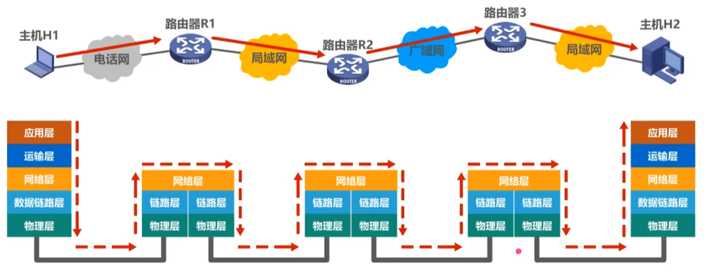
**封装成帧** （组帧）
1. 帧定界：如何让接收方确定帧的界限
2. 透明传输：让网络层感受不到将分组封装成帧的过程
在数据前后添加帧头帧尾

**透明传输**
不论所传的数据是什么样的比特组合，都能够按原样无差错地在这个数据链路上传输。
 处理误判为边界的问题，对上层透明

**流量控制**
 限制发送方发送速率，使小于接收方接收能力
在OSI体系中，控制相邻结点之间的流量
TCP/IP中，流量控制移动到了传输层，控制端到端之间的流量
**差错检测**
1. 位错
2. 帧丢失或帧重复或帧失序：确认 重传

发现帧内部一个位错
1. 接收方丢弃帧并发送重传帧（检错编码）
2. 接收方发现并纠正比特错误（）纠错编码 
检错传输发生的错误

**可靠传输**
发现并解决帧错
1. 帧丢失
2. 帧重复
3. 帧失序

**介质访问控制**
1. 广播信道需要实现此功能，多个结点争抢使用权
2. 点对点信道（通常不使用）

# 问题
### 以下是**点对点**会遇到的问题
#### 封装成帧
给网络层协议数据单元添加**帧头和帧尾**
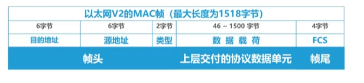
帧头和帧尾中包含有重要的控制信息。
帧头和帧尾的作用之一就是帧定界。

#### 差错检测
通过物理层传输可能被干扰变成乱码

通过**检错码**并封装为帧尾
通过检错码和帧码检查是否出错

#### 可靠传输
确保接收方接收到发送的数据

---
### **对于广播数据链路层**

#### 需要知道数据是否是转发给自己的
需要添加目的地址（MAC）
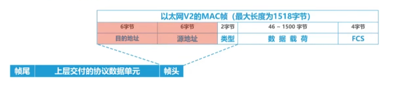

#### 帧碰撞
同时传输

使用**CSMA/CD**
后来使用交换式局域（**交换机**）

# 流量控制和可靠传输
流量控制是指由接收方控制发送方的发送速率
**方法**
1. 停止-等待协议
2. 滑动窗口

| 对比维度 | 数据链路层          | 传输层                             |
| ---- | -------------- | ------------------------------- |
| 控制范围 | 相邻节点之间         | 端到端                             |
| 控制手段 | 接收方无法接收时不返回确认帧 | 接收方在确认报文段中携带窗口字段值，动态调整发送方发送窗口大小 |
## 停止等待协议

最简单的流量控制方法。发送方每次只发一帧，收到接收方的确认帧后才发下一帧；未收到确认则一直等待。信道利用率低，传输效率不高。

## 滑动窗口

发送方维持**发送窗口**（允许发送的连续帧序号），窗口大小决定未确认时最多能发多少帧；
接收方维持**接收窗口**（允许接收的连续帧序号），超范围帧直接丢弃。

当收到确认时，窗口后移
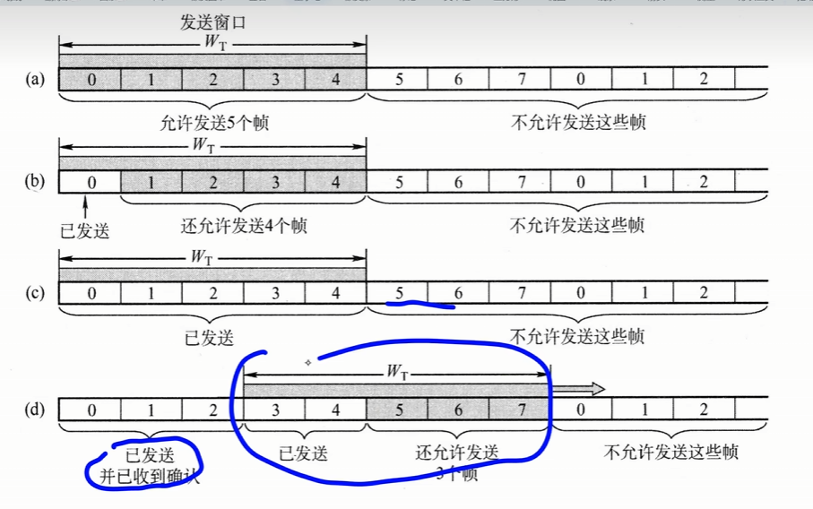

接收窗口 $n = 1$
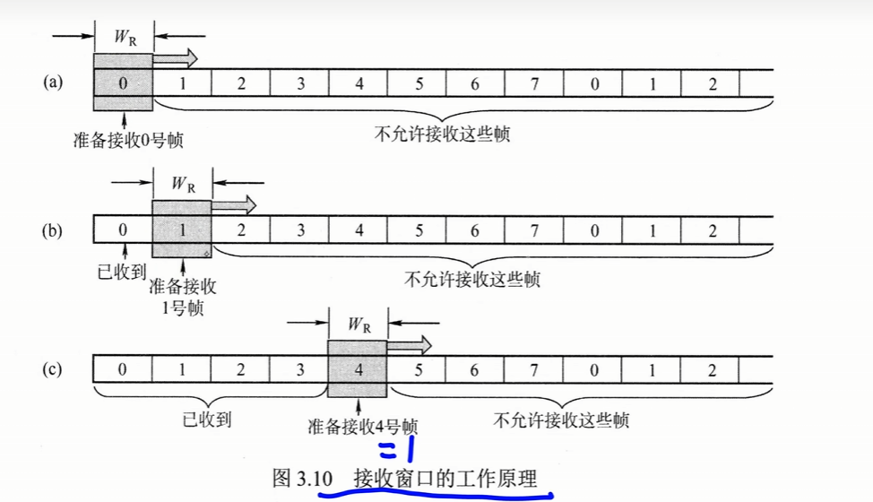

**核心要点**：
- 停止-等待：发送窗口 $W_T = 1$，接收窗口 $W_R = 1$
- 后退 N 帧：$W_T > 1$，$W_R = 1$
- 选择重传：$W_T > 1$，$W_R > 1$
- 若采用 $n$ ($n \geq 2$) 比特对帧编号，需满足 $W_T + W_R \leq 2^n$
- 接收窗口为 1 时保证帧有序接收
- 数据链路层滑动窗口大小在传输过程中固定（与传输层不同）

# 可靠传输机制
可靠传输是指发送方发出的数据能够被接收方正确且完整地接收，为实现这一目标，通常采用确认（ACK）和超时重传两种机制。

1. **确认**：接收方每成功接收到一个数据帧，就向发送方返回一个确认帧，表明该数据帧已被正确接收。
	1. 数据丢失
	2. 确认丢失
		1. 都会重新发数据
2. **超时重传**：启动计时器，在一定时间没收到确认就重传数据
## ARQ自动重传请求
结合确认和超时重传的可靠传输协议叫ARQ
用n比特给帧编号
$$W_r + W_s <= 2^n$$
**核心机制**：
- 重传由发送方自主触发，无需接收方显式请求
- 数据帧和确认帧均需编号以标识对应关系
**数据帧，确认帧，帧序号**
```
首 数据部分 尾 数据帧
首 __  尾 确认帧 
```
首尾一般加一些控制信息
1. 帧定界信息
2. 校验码
3. 帧类型（是数据帧还是确认帧）
4. 帧序号


**三种 ARQ 协议**（不仅适用数据链路层，也适用更高层）：
1. 停止-等待
2. 后退 N 帧
3. 选择重传

**实际应用**：
- 有线网络：误码率低，数据链路层一般不提供可靠传输，出错交由上层端到端处理
- 无线网络：误码率高，数据链路层必须向上层提供可靠传输

## 单帧滑动窗口与停止等待协议n1=n2=1（S-W）
1. 滑动窗口，T和R窗口大小均为1
2. 确认机制：接收方没有检查出错，回复一个确认帧
3. 超时重传：一直没收到确认帧，重传i帧（**发送方计时器**）
4. 仅需1bit给帧编号（可以用来判断重复帧）
**出错**
5. 数据帧出错或丢失
6. 确认帧出错或丢失
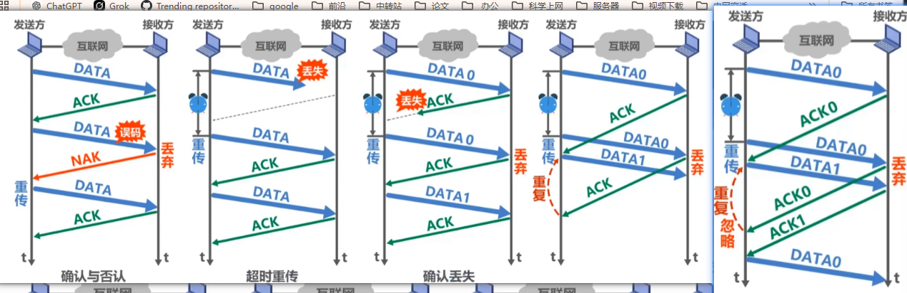
需要对数据和确认都编号0 1


## 多帧滑动窗口与后退N帧协议（GBN）
1. 滑动窗口：发送窗口 > 1，接收窗口小于1
2. 确认机制：接收方收到i号帧，且没有检测出差错，需要返回确认帧
	1. ACK_i代表i号帧以及之前的所有帧
3. 超时重传
	1. 若发送方超时尾收到ACK_i则重传i号帧，以及之前所有帧
4. 帧编号：需要nbit编号
5. **累计确认**，连续收到多个数据帧时，可以仅返回最后一个帧的ACK
在后退N帧协议中，发送方可在未收到确认帧的情况下，连续发送多个序号落在发送窗口内的数据帧。
后退N帧的含义是：如果出错，发送方需要重传该帧和其后所有已发送但未被确认的帧。
这一机制的前提是：接收方仅按序接收数据帧，**任何失序到达的帧都将被丢弃**。
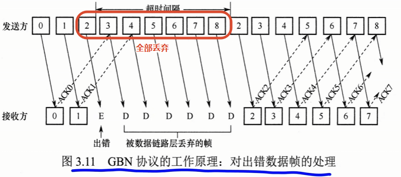
**累计确认**
接收方无须对每个正确接收的帧立即返回确认，而可在连续收到多个正确帧后，仅对其中序号最大的帧发送一个确认。
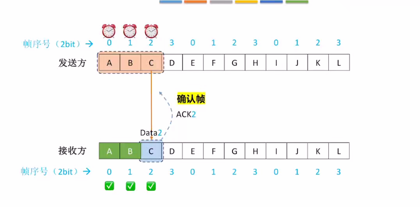
发送窗口 $1 < W_T <=2^n - 1$
接收窗口 $n == 1$
**丢失**
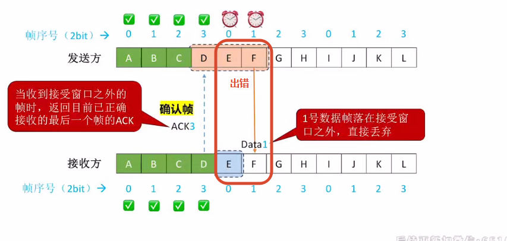
0号帧可能丢失，然后
把丢失的帧全重新发，而不是滑动窗口会退
**丢失确认帧**
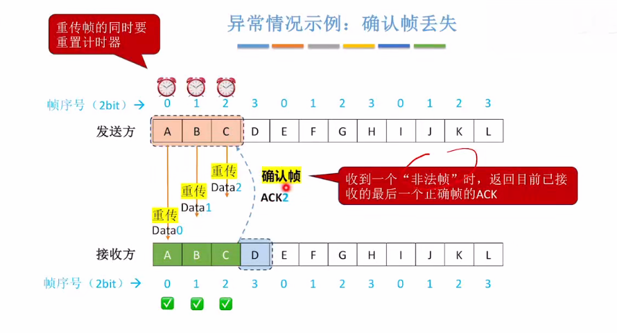
会给发送方发一个ACK2

## 多帧滑动窗口与选择重传协议（SR）
1. 滑动窗口：T > 1, R > 1
2. 确认帧
3. 不支持累计确认
4. 超时重传
5. 帧编号
6. 否认帧NAK_i：接收方收到i号帧，检测出有错，需要丢弃该帧，并给发送方返回否认帧
7. 请求重传：发送方收到NAK_i，需要重传i号帧
8. 接收窗口必须**小于等于**发送窗口
仅重传出错或超时的数据帧
接收方必须能够暂存失序但正确到达、且序号仍落在接收窗口内的数据帧

**不能使用累计确认**，需要对每个正确接收的数据帧逐一发送确认
- 接收方需设置足够大的帧缓冲区（其数量等于接收窗口大小），用于暂存正确的失序帧；
- 发送方为每个未确认的帧维护独立的计时器，当某帧的计时器超时时，仅重传该帧：
- 若接收方收到重复的数据帧（表示确认帧丢失），则丢弃该帧，并重传对应的确认帧。
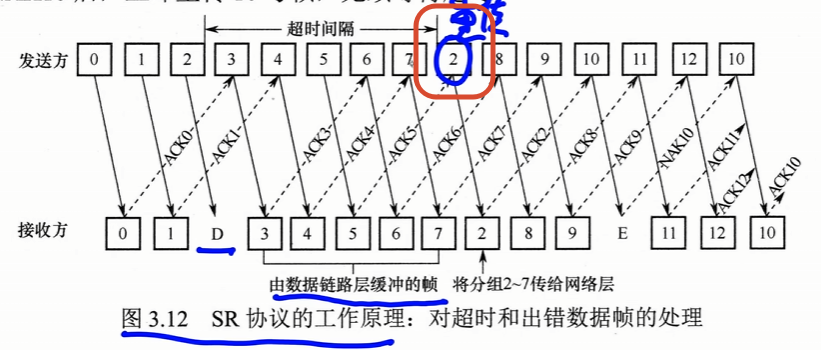

**窗口约束**（采用 n 比特对帧编号）：
- 条件①：$W_T + W_R \leq 2^n$（不满足则序号空间不足，确认帧丢失后发送方重传的旧帧序号可能与新帧重叠，接收方无法区分）
- 条件②：$W_R \leq W_T$（接收窗口大于发送窗口时，超出部分永远无法被填满，浪费资源）
- 由①②推导：$W_R \leq 2^{n-1}$
- 实践中常取 $W_R = W_T = 2^{n-1}$，充分利用序号空间

**数据丢失**
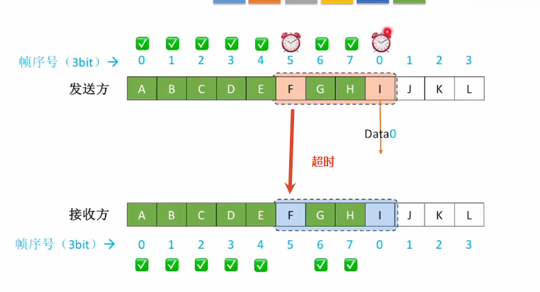


## 信道利用率与发送周期

**信道利用率公式**：
$$
U = \frac{k \cdot t_1}{t_1 + 2\tau + t_2}
$$
$$U = \frac{D - D_0}{D}$$
- **$D$（当前网络时延）：** 表示网络在**当前实际利用率 $U$** 条件下的**总时延**（或平均时延）。它包含了数据在节点排队等待处理和发送所消耗的时间（排队时延）。
    
- **$D_0$（网络空闲时的最小时延）：** 表示网络在**完全空闲、没有排队等待（即利用率 $U \approx 0$）**时的**网络时延最小值**。它仅由固定的发送时延和传播时延等固有物理属性决定。

**发送周期**：
$$
T = t_1 + 2\tau + t_2
$$

**参数**：
- $k$：发送窗口大小  
- $t_1$：发送帧传输时间
	- 帧长 / 传输速度
- $t_2$：确认帧传输时间
- $\tau$：单向传播时间

**特例**：
- $t_2 = 0$：忽略确认帧传输时间
- $t_1 = t_2$：发送帧与确认帧传输时间相等
- $t_1 \neq t_2$：发送帧与确认帧传输时间不等

**协议关系**：
- 停止-等待协议：$k = 1$
- 后退N帧协议：$k \leq 2^n - 1$
- 选择重传：k = 2^n

### 三种传输协议的信道利用
#### S-W停止等待协议
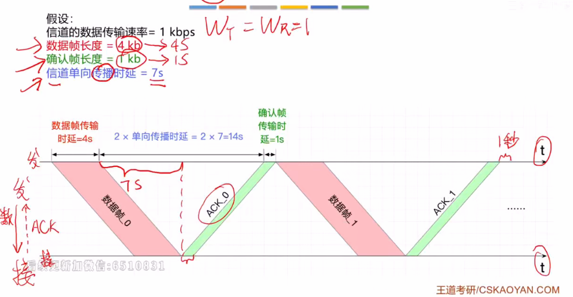

```
4/(4 + 2*7 + 1) = 21%
传输时间/(传输时间 + 传递*2 + 确认)

```
#### GBN和SR
其实主要是和发送窗口的大小有关
```

```
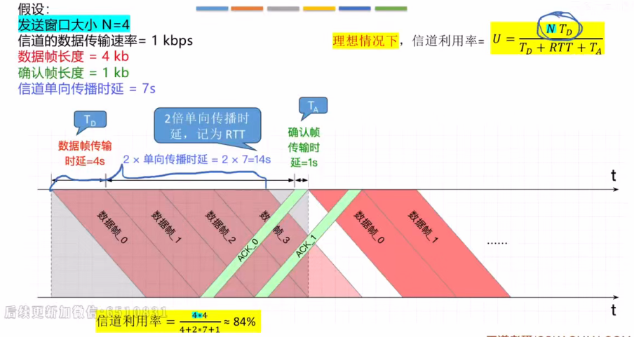

---

## 本章总结

### 一、数据链路层核心功能
1. **链路管理**：建立、维持、释放连接
2. **封装成帧**：添加帧头帧尾，实现帧定界
3. **透明传输**：处理边界误判，对上层透明
4. **流量控制**：限制发送速率，匹配接收能力
5. **差错检测**：检错码检测传输错误
6. **可靠传输**：确保数据正确完整接收

### 二、流量控制机制
**停止-等待协议**：
- 发送窗口 $W_T = 1$，接收窗口 $W_R = 1$
- 一发一等，信道利用率低

**滑动窗口协议**：
- 发送窗口 $W_T$：允许发送的连续帧序号
- 接收窗口 $W_R$：允许接收的连续帧序号
- 窗口后移机制，提高信道利用率

### 三、可靠传输与ARQ协议
**ARQ（自动重传请求）**：
- 发送方自主触发重传，无需接收方显式请求
- 数据帧和确认帧均需编号

**三种ARQ协议**：
1. **停止-等待**：$W_T = 1$，$W_R = 1$
2. **后退N帧**：$W_T > 1$，$W_R = 1$，累计确认
3. **选择重传**：$W_T > 1$，$W_R > 1$，逐帧确认

**窗口约束**（n比特编号）：
- $W_T + W_R \leq 2^n$（避免序号重叠）
- $W_R \leq W_T$（避免资源浪费）
- 推导：$W_R \leq 2^{n-1}$
- 实践：$W_R = W_T = 2^{n-1}$

### 四、信道利用率
**发送周期**：$T = t_1 + 2\tau + t_2$
**信道利用率**：$U = \frac{k \cdot t_1}{t_1 + 2\tau + t_2}$
- $k$：发送窗口大小
- $t_1$：发送帧传输时间
- $t_2$：确认帧传输时间
- $\tau$：单向传播时间

### 五、实际应用
- **有线网络**：误码率低，数据链路层一般不提供可靠传输
- **无线网络**：误码率高，数据链路层必须提供可靠传输

### 六、关键对比
| 对比维度 | 数据链路层 | 传输层 |
|----------|-----------|--------|
| 控制范围 | 相邻节点之间 | 端到端 |
| 控制手段 | 接收方无法接收时不返回确认帧 | 接收方在确认报文段中携带窗口字段值 |
| 窗口大小 | 传输过程中固定 | 动态调整 |

---


