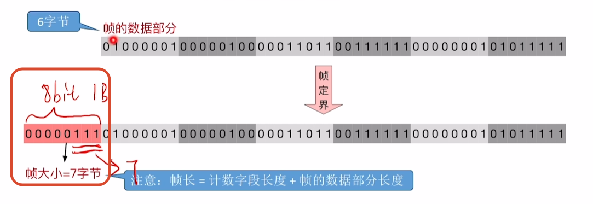
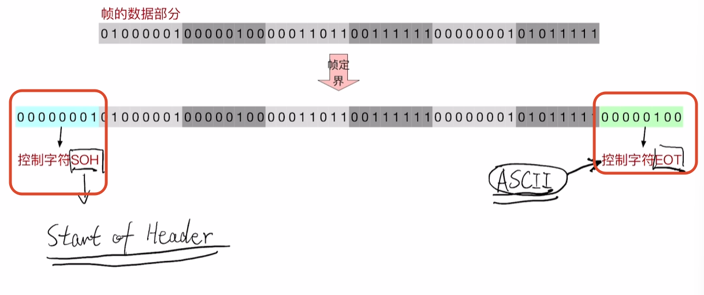
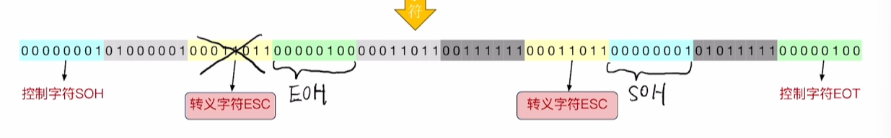
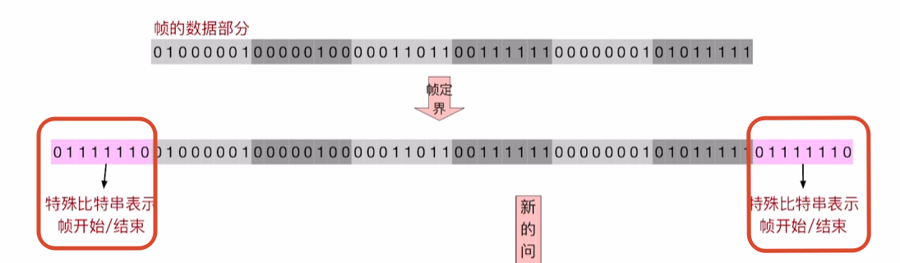
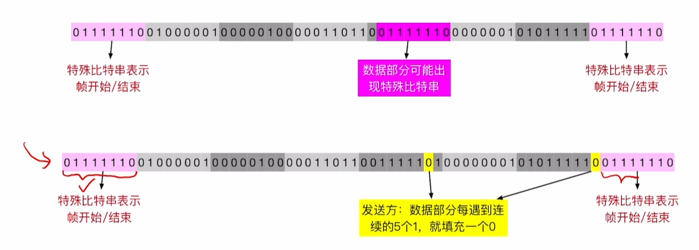
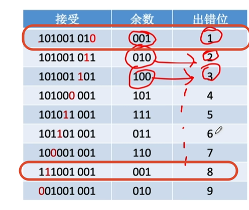
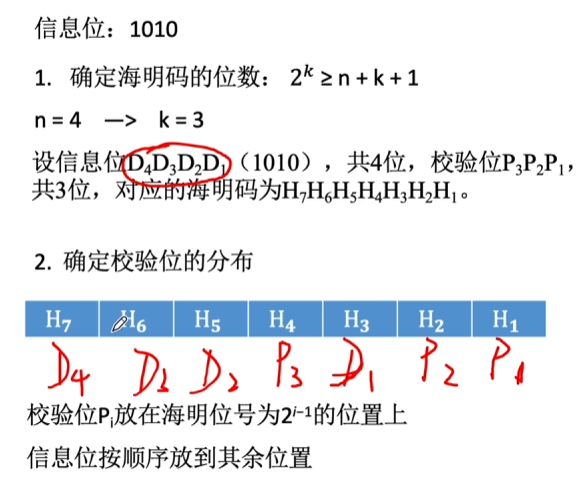
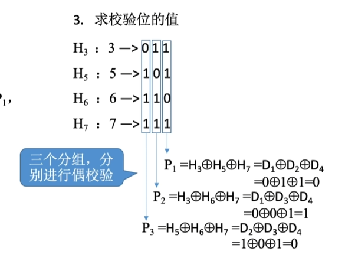
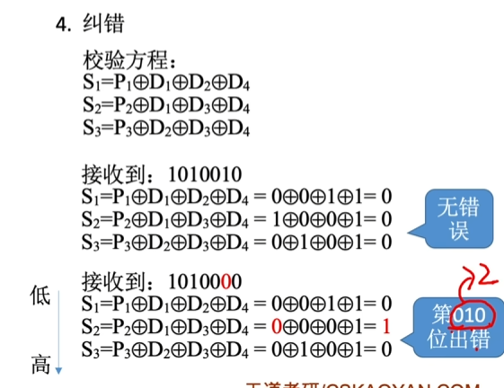

# 组帧
帧定界：确定帧的开始和结束
帧同步：接收方能成功识别出帧的开始二号结束
最大传送单元：所能传送帧的数据部分的长度上限

## 字符计数法
在每个帧开头，用一个定长计数字段表示帧长


帧长：计数字段长度 + 帧的数据部分长度
缺点：任何一个计数字段出错，都会导致后续所有帧无法定界


## 字节填充法
用SOH和EOT来表示开头和结尾
```
01H

04H
```

再加一个转义字符：
```
00011011
```
会表示EOH和SOH



## 零比特填充法
HDLC
PPP

以特殊的二进制串作为开始和结尾

发送方扫描数据
每当遇到五个1，就填充一个0

接收方逆处理
没遇到连续的5个1就删除后面的0


## 违规编码法
使用曼彻斯特编码传输二进制时
使用“违规信号”，表示帧的开头、结尾(这种方法需要物理层配合)
如:采用曼彻斯特编码时，使用“中间不跳变”作为“违规信号”，标记帧的开头、结尾


# 差错控制
发现并解决帧内部的位错
**解决**
1. 接收方发现比特出错，丢弃并让发送方重传--------检错编码
	1. 奇偶校验码
	2. CRC校验码
2. 接收方发现并纠错-------纠错编码
	1. 海明校验码

## 奇偶校验
添加一位
**奇校验码**：让整个位（奇偶校验码 + 有效信息位）的1是奇数个
```
_1001101
11001101


```
**偶校验码**：让整个位（奇偶校验码 + 有效信息位）的1是偶数个
```
_1001101
01001101
```
``
校验过程：
把所有位异或
偶校验需要等于0
奇校验需要等于1

## 循环冗余校验CRC
除数，被除数
```
设生成多项式为G(x)=x³+x²+1，信息码为101001，求对应的CRC码。
= 1101

r = 3 1101
补三位

被除数: 101001000
除数:   1101

过程是异或运算

余数 = 001
把001拼回去
CRC码101001001

余数为0则没有出错
```
CRC也是有纠错能力的
余数可以知道是哪一位出错，然后修改正确就可以
但是r的大小决定了可以看出是多少位出错，也不一定一定可以纠正

这里的1和8就是重复的无法判断哪个错了
所以一般不用来纠错

## 海明码
改变奇偶校验码（能知道出错但不知道是哪里出错）
多个校验码
把n个信息位分为k个分组
让k个校验位指令在哪里出错了
```
2^k中状态 >=n + k + 1
```

**规定**
所有校验位都放到2^{i-1}的位置


根据位置分组
有1的是组内的，没1的不是

依次异或
发现出错则2号位 
为了区分一位错还是两位错，需要添加全校验位，进行全体偶校验

**特点**
一位纠错
两位检错
## n比特检测问题
给$e$ 个比特错误，问编码的码距至少为
纠正 $t$ 个比特
1. 检测 >=e + 1
2. 纠错 >= 2t + 1
3. 检测 + 纠错 >= e + t + 1

# 流量控制和可靠传输
**滑动窗口**

[流量控制和可靠传输](3.1.0数据链路层功能.md#流量控制和可靠传输)
