结点和结点之间的通信经常使用CDMA（背后的原理是码分复用）

主要任务：协调共享同一信道的各节点传输行为，避免信号冲突

在广播中，若不控制可能会导致信号干扰通信失败
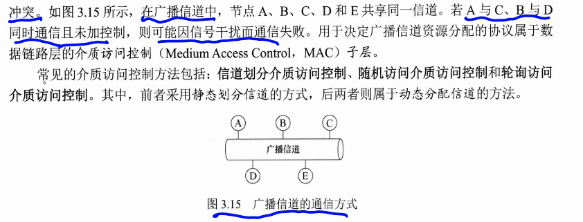
# 访问控制分类
## 信道划分介质访问控制
**静态划分**
通过**复用**，把同一传输介质上的多过分设备通信隔离开，划分时域和频域
**复用**：发送端把多个发送方信号组合到一条物理信道上传输，接收方通过复用信号分离交付
**信道划分**：把一个广播信道在逻辑上分化为互不相干扰的子信道，实现点对点
这种划分不会引起冲突

### 时分复用TDM

| 0~1s | 1~2s |     |
| ---- | ---- | --- |
| A-B  | C-D  | ... |
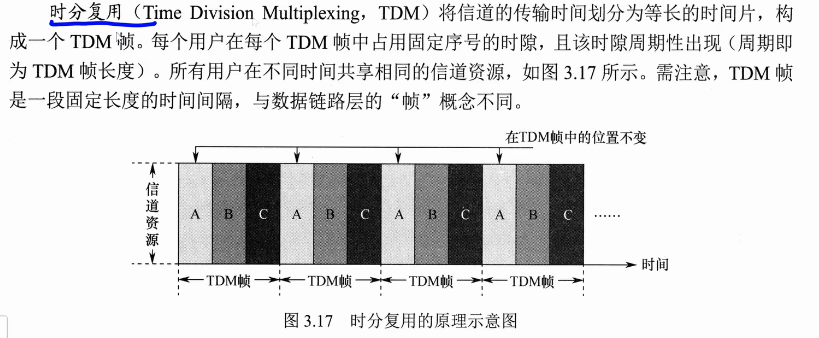
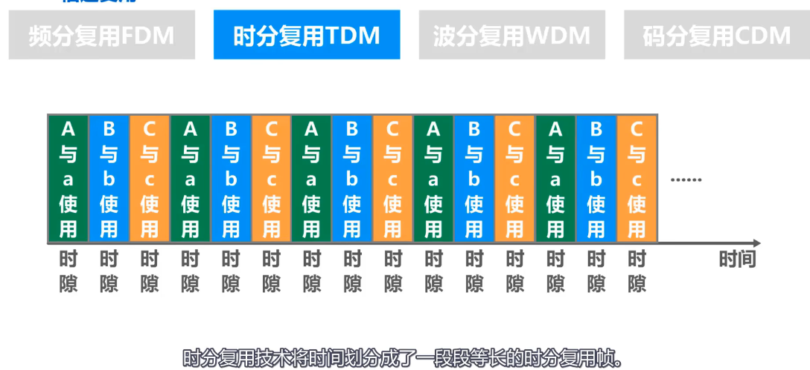

### 频分复用FDM
不同的频带

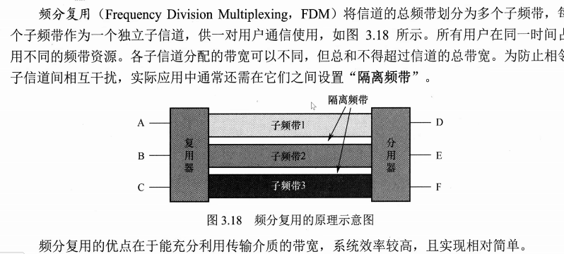

### 波分复用WDM
在一个光纤中传输不同**波长**的光信号
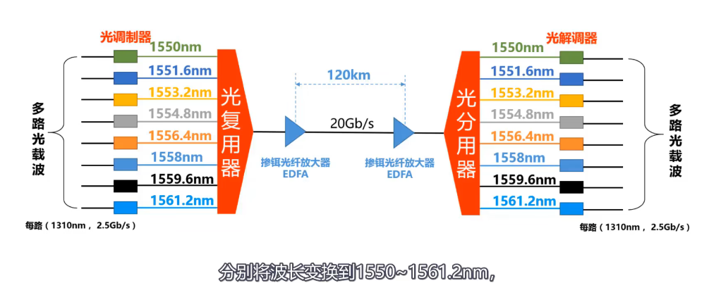

### 码分复用CDM
主要用于多址接入
又叫码分多址CDMA
1. 给各个结点分配专属的”码片序列
	1. 每个码片取1或-1
	2. 码片的作用：A如果要发1，那么就（1，1，1，1），如果发-1，那么（-1，-1，-1，-1）
	3. 相互通信的结点知道彼此的码片序列
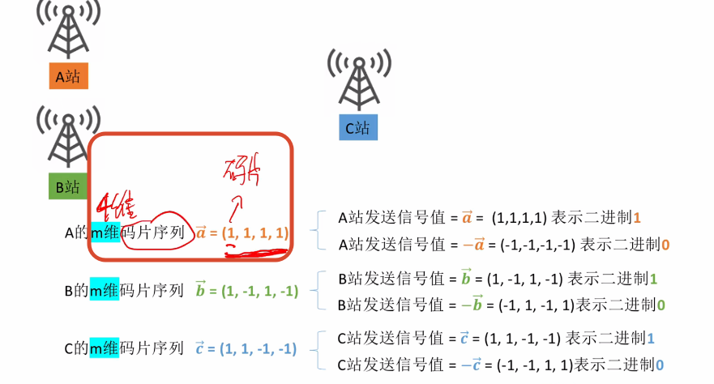
2.  发送方如何发送数据：
	1. 同时发送数据，会叠加
		1. 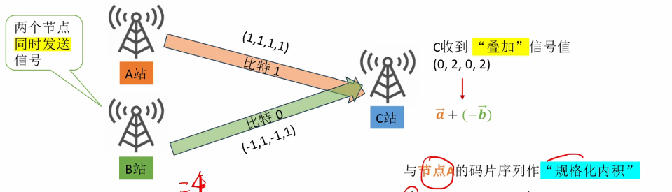
		2. 各个站点之间，相互正交
	2. 分离叠加的信号值
		1. 将收到的信号值，于码片序列做内积
			1. 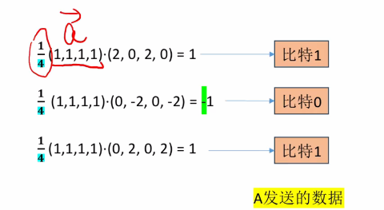

# 随机访问介质访问控制
允许结点随机选择时机发送数据的介质访问协议

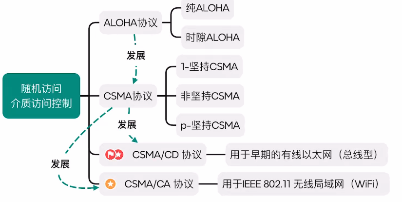
**动态划分**

### 纯ALOHA
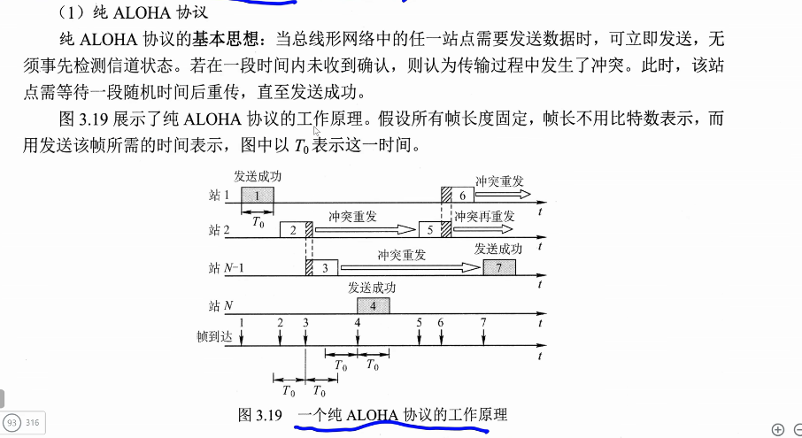
- 不听就发
	- 需要发送数据立即就发，不检测信道状态
	- 如果没有收到确认，就找一个随机时间重发
- 想发就发
- 未收到确认，随机事件重传
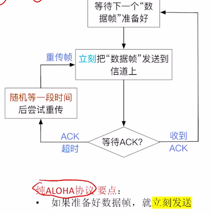
### 时隙ALOHA协议
时隙 ALOHA 协议将时间划分为等长的时隙（Slot），并要求所有站点同步时钟。
站点只能在每个时隙的起始时刻发送帧，且一帧的发送时间必须小于或等于一个时隙长度。
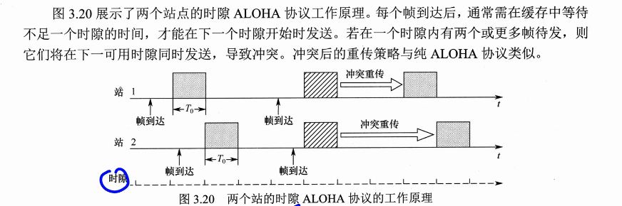
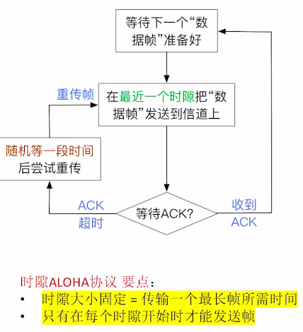

这两种冲突太高了
## CSMA协议
**载波监听多路访问协议**CSMA
**做法**：在发送数据前，先监听信道是否空闲，只有空闲时才会尝试发送
引入了载波监听机制
需要在网卡上安装载波监听装置
1. 1-坚持CSMA
	1. 信道闲，立即发
	2. 信道忙，一直听
	3. 大家都等然后空闲全发就冲突了
2. 非坚持
	1. 信道闲，立刻发
	2. 信道忙，等一个随机时间
	3. 增加了平均传输时延
3. p-坚持
	1. **时隙化**
	2. 信道忙等下一时隙再监听
	3. 空闲以p的概率发送概率
  
## CSMA/CD（检测）
早期的有限以太网
一个同轴电缆挂载多个结点（总线型）
也可以用集线器组成的有线局域网，（逻辑上其实也是总线型，每次发消息会广播）
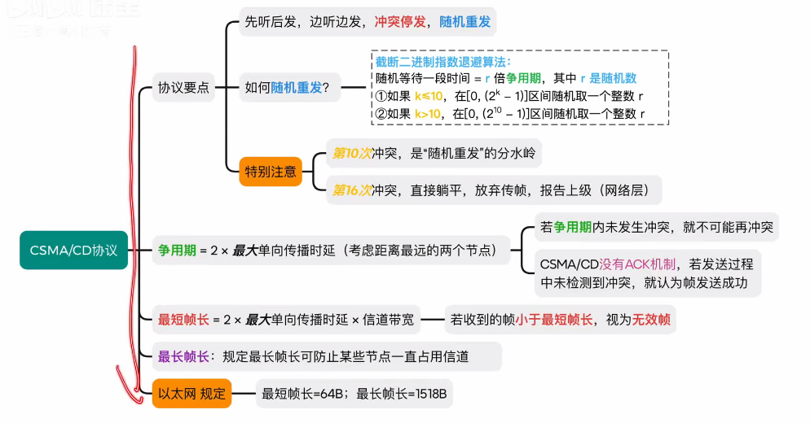
**特点**
1. 先听后发
2. 边听边发
	1. 发送时发现冲突，立即停发
3. 冲突停发
4. 随即重发

1-坚持，
- 信道空闲会立即发
- 信道忙会一直听

**退避算法（随即重发）**
（截断二进制指数**退避算法**）
	- 冲突后不立即重发，随机推迟一段时间再试，避免再次碰撞
	- 以 **争用期 2τ** 为基本退避单位
	- 第 k 次重传：从 $[0, 2^k - 1]$ 中随机取 r，推迟 r × 2τ
	- k = min(重传次数, 10)：前 10 次窗口指数增长，之后恒为 [0, 1023]
	- 思想：冲突越多 → 窗口越大 → 连撞概率越低
	- 连续 16 次全部失败 → 放弃该帧，向高层报错
> 载波监听多点接入/碰撞检测：边发边听，冲突后按**截断二进制指数退避算法**随机重传，连续 16 次失败则放弃。

**争用期**
$2*最大单向传播时延$
如果在争用期内未发生冲突，就不可能在冲突
CSMA/CD没有确认机制，发送过程如果未检测到冲突，就认为帧发送成功

A发B，在恰好还没到达的时候，B发送，等到A接收到是2t时间，成为最大单向传播时延

**最短帧长**
争用期 * 信道带宽
如果小于最小帧长，A会检测不到冲突，所有如果帧长不够，则需要用0填充
**最大帧长**
可以防止某些节点一直占用信道

**以太网规定：802.3**
最短帧长：64Bit
最长帧长：1518Bit
## CSMA/CA（避免）
IEEE802.11，WIFI无线局域网
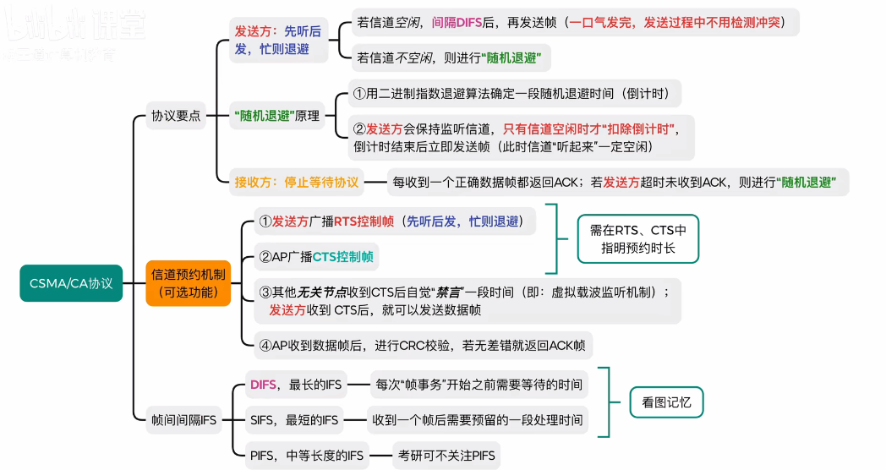
- 发送过程时不会检测冲突
- 发送前尽量避免冲突

**适用于**无线网络
**AP 接入点**：无线WIFI热点
家用路由器 = 路由器+交换机+AP
**漫游**：切换WIFI热点

**帧间间隔**
DIFS 最长的IFS，每次帧事务开始之前需要等待的时间
SIFS 最短的IFS，收到一个帧后需要预留的一段处理时间
PIFS 
**原理**
1. 先听后发，忙则退避
	1. 若信道空闲：间隔一定随机时间后，在发送帧
	2. 若信道不空闲：随机退避
2. 随即退避：
	1. 二进制指数退避算法，确定一段时间随机退避时间
	2. 发送方持续监听信道，只有**信道空闲**才扣除倒计时，计时结束立刻发
3. 接收方（停止等待协议）
	1. 每收到一个正确帧都返回ACK
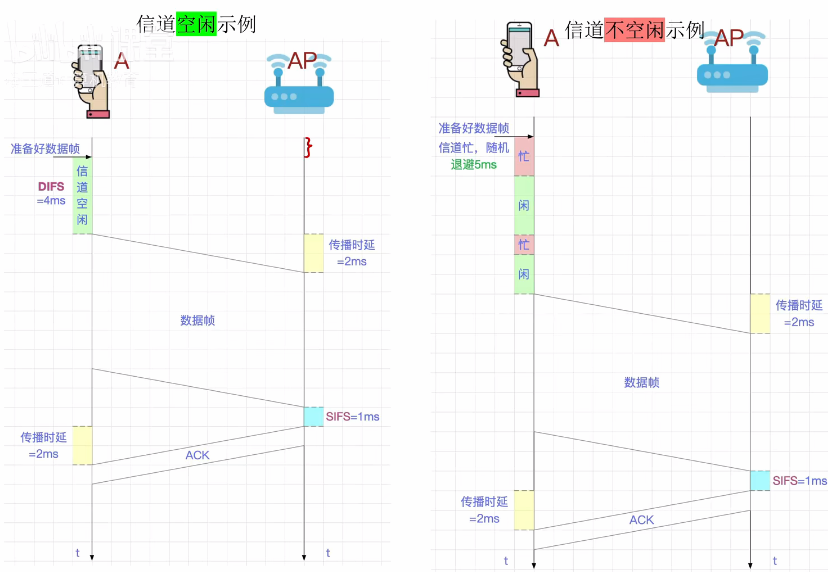

### 信道预约（解决隐蔽站）
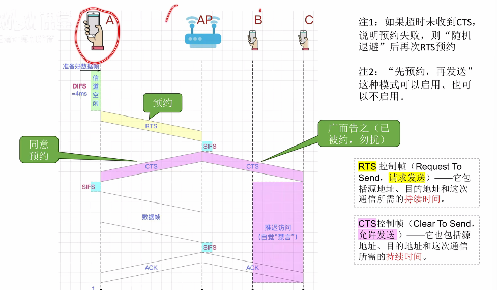
A结点无法检测到BC
1. DIFS
2. 发送RTS预约信道（控制帧包含源地址，目的地址，持续时间）
3. SIFS
4. CTS（广播，允许发送）
5. SIFS 
6. 数据帧
7. SIFS
8. ACK

## 轮询访问介质控制
**动态划分**
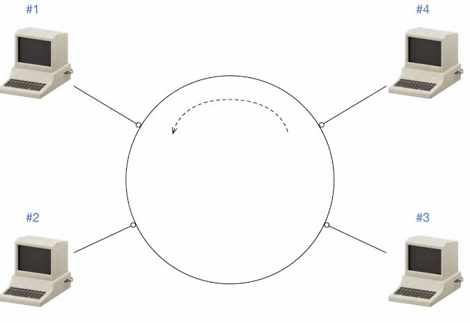
**令牌机制**
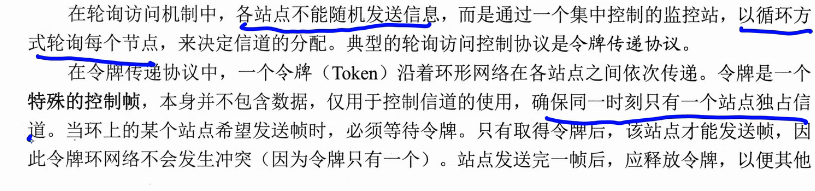
拿到令牌才能发送数据
发送完释放
每次传完会改变令牌号（生成一个新的令牌帧），每次只能传一个数据

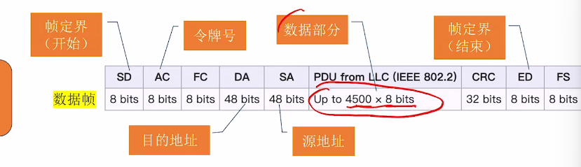
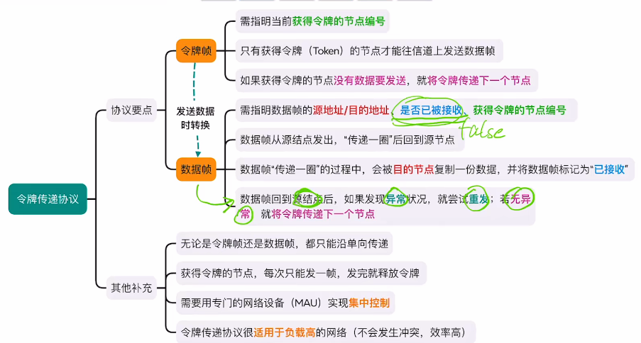

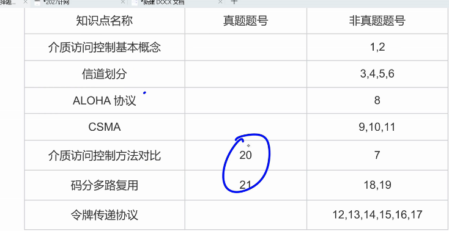

