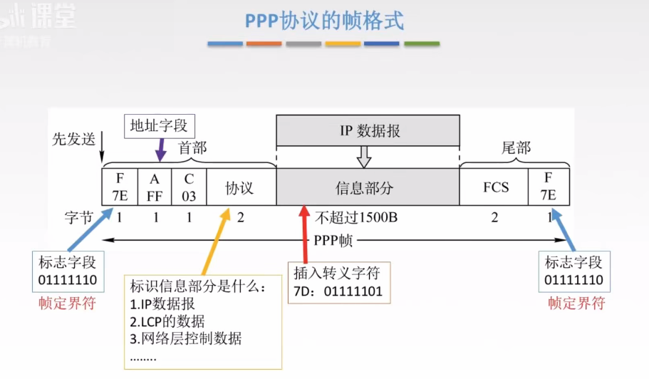

连接很大的物理范围,连接不同协议的
使用分组交换技术
## PPP协议
点对点协议
1. 拨号上网
2. 只支持全双工

**特点**

1. **简单**
> 对链路层帧**不纠错、不编号、不进行流量控制**，降低协议复杂度。

- 无需纠错、无需序号、无需流量控制
- 把复杂工作交给上层协议处理

2. **封装成帧**
> 定义帧的边界，通过**帧定界符**标识一帧的开始与结束。

- 核心机制：**帧定界符**标记帧边界
- 接收方据此从比特流中正确提取每一帧

3. **透明传输**
> 数据中若出现与帧定界符相同的比特组合，必须用特殊手段处理，确保数据**透明**地通过链路。

- **异步线路**：字节填充（字符填充）
- **同步线路**：比特填充（零比特填充）

4. **多种网络层协议**
> 封装的 IP 数据报可以采用**多种网络层协议**，PPP 不限定上层协议类型。

- 同一链路可同时承载 IPv4、IPv6 等多种协议数据报
- 通过协议字段区分上层协议

5. **多种类型链路**
> PPP 可运行于**串行/并行、同步/异步、电/光**等各类物理链路上。

- 不依赖特定物理介质，通用性强
- 支持铜缆、光纤、无线等多种传输介质

6. **差错检测**
> 检测到错误帧直接**丢弃**，不纠错、不重传。

- 只检错不纠错，出错即丢弃
- 可靠传输交由上层协议（如 TCP）保证

7. **检测连接状态**
> 定期探测链路是否**正常工作**，及时发现链路故障。

- 通过链路控制协议（LCP）检测链路状态
- 链路断开时及时通知上层

8. **最大传送单元**
> 数据部分的最大长度即 **MTU**，限制每帧承载的数据量。

- 默认为 **1500 字节**
- 超过 MTU 的数据报需分片

9. **网络层地址协商**
> 通信双方通过 PPP 获知彼此的**网络层地址**，以便后续通信。

- 双方协商并交换各自的 IP 地址
- 由网络控制协议（NCP）完成

## HDLC协议
高级数据链路控制协议

