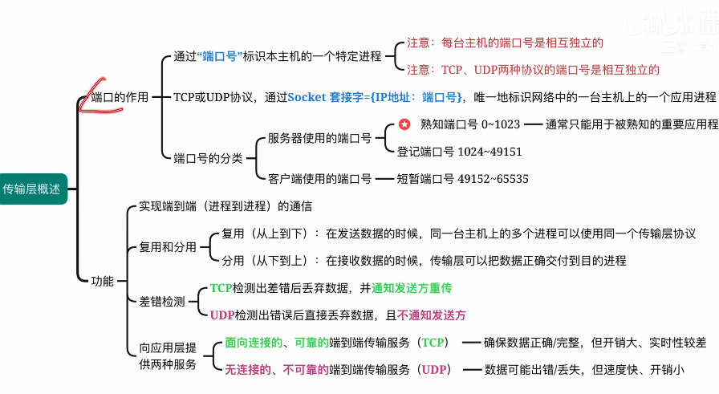

# 传输层提供的服务
## 传输层的功能
1. 实现不同主机上的进程之间的逻辑通信
2. 复用：
	1. 多个进程同时使用TCP/UDP协议
	2. 传输层向下走网络层的过程
3. 分用：
	1. 数据分配给对应的进程
	2. 传输层向上走应用层的过程
4. 差错检测
	1. TCP：丢弃，并通知重传
	2. UDP：丢弃
5. TCP：面向连接的，可靠的，端到端的
	1. 连接：需要先打招呼，建立连接。结束时需要告诉已结束
6. UDP：无连接的，不可靠的，端到端的
	1. 无连接：不打招呼直接把数据给对方

## 端口号
端到端的通信（进程到进程）一个进程绑定一个端口号，
- 每台主机的端口号是独立的
- TCP和UDP的端口号是独立的
	- TCP和UDP可以使用相同的端口号
### 端口号的分类
服务器端：（被动）
- 熟知端口0~1023
	- FTP21
	- SMTP25
	- DNS53
	- HTTP80
- 登记端口号1024~49151
客户端：（主动）
- 短暂端口号49152~65535
	
**套接字**
是一个数据结构
类似网络指针，指向要和本进程通信的进程
结果：<ip地址：端口号>

