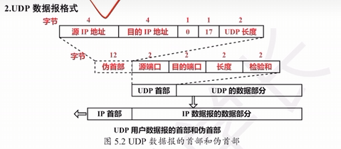
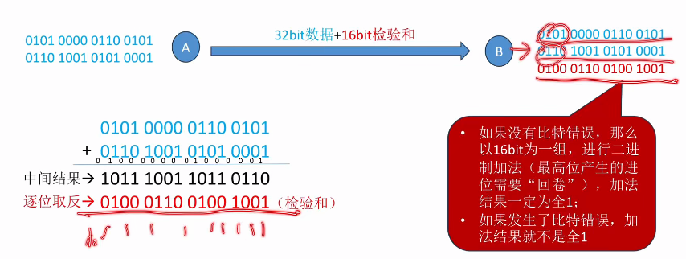

| 应用层 | 报文                         |
| --- | -------------------------- |
| UDP | UDP首部（8B） + 报文             |
| 网络层 | IPv4首部（20~60B）+ UDP首部 + 报文 |
- UDP首部很小，只占8B
- 每次传输一个完整报文，不支持拆分，重装
- 无连接，不可靠，不支持拥塞控制
	- 大报文直接拒绝
- 支持一对一（单播地址），一对多（封装到广播IP数据报）

UDP使用目的端口号标识目标进程
**使用UDP但又希望可靠**
可以使用应用层处理

## UDP数据报格式

| 16位源端口号  | 16位目的端口号  |
| -------- | --------- |
| 16位UDP长度 | 16位UDP校验和 |
| 数        | 据         |
首部长度固定8B
UDP数据报最大长度理论65535B

数据报长度字段包括首部+数据部分的长度

---
在UDP协议计算校验和之前，添加伪首部
12字节
伪首部：
- 源IP地址 4
- 目的IP地址 4
- 0 1
- 17 1
- UDP长度 2

这个是临时加的，只为了计算校验和，不上下传递
伪首部只在发送方计算校验和时临时构造，算完就丢弃

| 伪首部 | 源端口 | 目的端口 | 长度  | 校验和 |
| --- | --- | ---- | --- | --- |

## UDP校验
32 位数据 + 16位校验和

1. 把原始数据每16位作为一组
2. 然后相加，如果最高位产生进位需要在最低位加1（回卷）
3. 逐位取反

如果加回来结果错误就不是全1，否则就是全1

---
接收方进行UDP校验
收到一个UDP数据报 =  首部 + 数据

