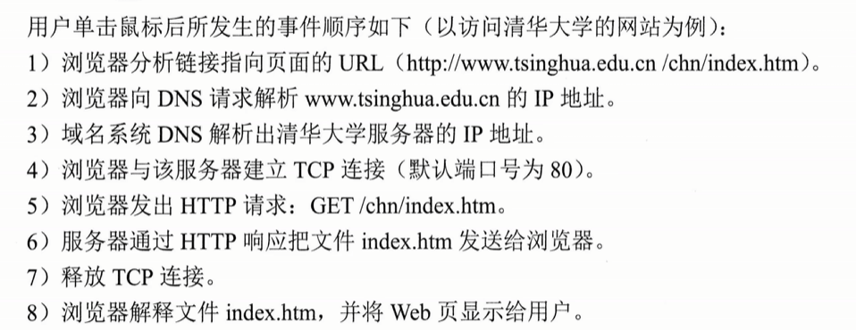

大规模的，联机的信息存储所，一个分布式应用

URL：统一资源定位符：表明任何资源的位置
<协议>://<主机>：<端口>/<路径>
HTTP：80
HTTPS：443
FTP:21

## HTTP
应用层协议
基于TCP

应用层无连接
无状态的，服务器不记得服务过

HTTP1.0非持续连接
	每个元素都需要单独建立连接（图片）
一个图建立一个TCP

并行

HTTP1.1持续链接

多个图建立一个TCP连接
	- 非流水线：必须收到一个才能发下一个
		- 
	- 流水线：可以连续发多个请求
		-  一个RTT
流水线：

非流水线

## 报文

方法
GET
POST
HEAD
OPTION
要获取什么网页的内容

Host：要获取什么主机上的内容

CLOSE：非持续
Keep-alive：持续
Cookie有值说明互相访问过

## 超文本传输协议
ip
连接tcp
发http
响应http
释放tcp

