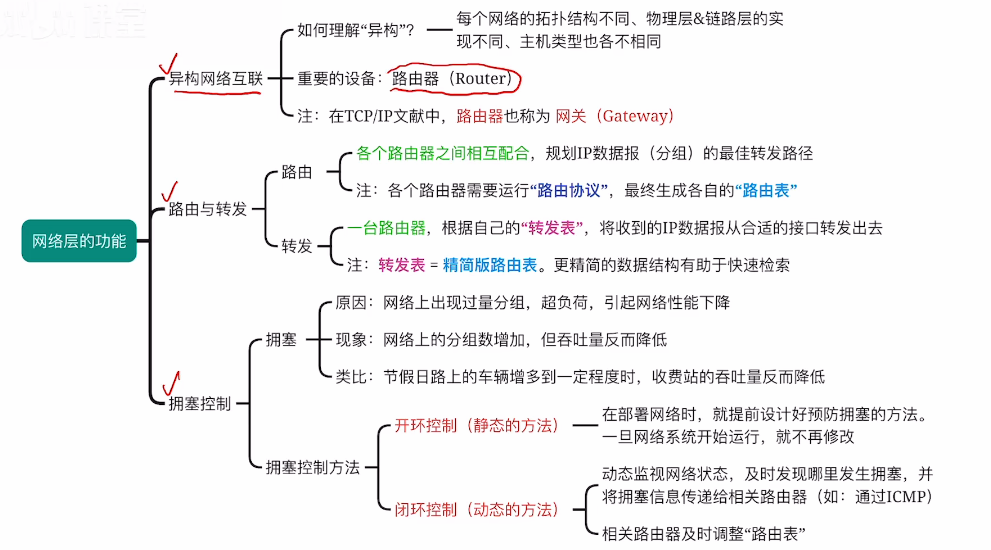
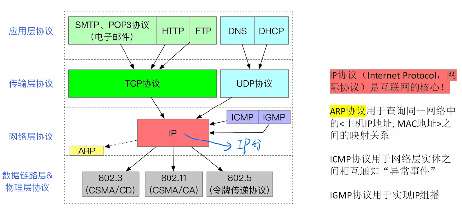

1. 异构网络互联
	1. 每个网络的拓扑不同，通信协议，硬件设备，性能特征（以太网 和局域网802.11）
	2. 路由器：网关
	3. 使用相同的网际协议IP，把参与的各级计算机网络当成一个通用的整体连接在一起
2. 路由与转发
	1. 路由：多台路由器
	2. 转发：一台路由器
3. 拥塞阻塞
	1. 静态：提前规定好拥塞会去哪里转发
	2. 动态：

## 中间设备
**物理层**
1. 中继器
2. 集线器

**数据链路层**
3. 网桥
4. 交换机

**网络层**
5. 三层交换器（有部分路由器功能）
6. 路由器

**网络层之上**
7. 网关

## 拥塞控制
出现过量的分组引起网络性能下降

是一个全局性的，涉及所有主机

## 流量控制
点对点之间的通信控制

## 两种服务
1. 虚电路
		[数据报和虚电路](1计算机网络概述.md#数据报和虚电路)
2. 数据报