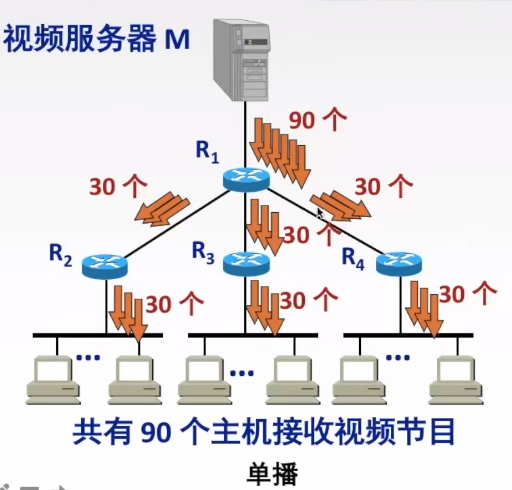
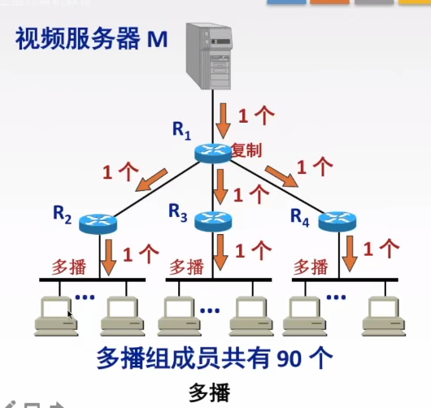

# IP多播
D类IP地址
把数据报发送到某个结点集合（组播组），源主机只需要发送一份数据，组播组中的所有接收者都可以收到同样的分组

## IGMP（Internet 组管理协议）
实现IP多播
>让连接在本地局域网上的多播路由器知道本局域网上是否由主机参加或推出了多播组 

> IGMP 让主机向本地组播路由器**声明加入/退出组播组**，路由器周期性探询以维持组成员关系，并借助组播路由协议将成员关系**传播到因特网其他组播路由器**。

- 运行在主机和组播路由器之间，仅在本网络有效
- IGMP报文的IP多播数据报，TTL = 1，避免被转发到其他网络 

- **加入组播组**：主机向组播组的组播地址发送 IGMP 报文，声明自己成为该组成员；本地组播路由器收到后，利用**组播路由选择协议**将成员关系发给因特网上的其他组播路由器
- **周期性探询**：本地组播路由器**周期性探询**本地局域网上的主机，确认主机是否仍为组播组成员
- **活跃判定**：只要有一个主机对某个组响应，组播路由器即认为该组**活跃**；若经过**多次探询**均无响应，则认为本网络不再有该组成员，**停止**向其他组播路由器传播该成员关系
- **成员关系粒度**：组播路由器只知道所连局域网中**有无**组播组成员，不知道具体有哪些主机 
### 报文
1. 成员报告报文：新成员 加入组播组
2. 成员查询报文：
3. 离开报文：

## IP组播组地址
组播发送IP数据报时，源地址为组播源的服务器IP地址，目的地址为IP组播地址
使用D类地址，前4位固定1110，后28位任意，代表组播组标识
 ```
 IP组播地址：1110 + 任意28位
 ```
### IP组播映射到MAC组播地址
IP组播数据包封装到MAC帧时的地址
MAC组播前24位用0 1 0 0 5 E标识，第25为设置为0，把IP组播地址后23位填入到MAC组播地址后23位中
```
0000 0001 0000 0000 0101 1110 0xxx xxxx xxxx xxxx xxxx xxxx
0    1    0    0    5    E    0 IP
```


# 网络层设备
> **冲突域**是物理层概念，指共享同一介质、存在介质争用的节点集合；**广播域**是数据链路层概念，指能接收同一广播帧的节点集合。

- **冲突域（Collision Domain，第1层-物理层）**
    - 连接到同一物理介质上、存在**介质争用**的所有节点的集合
    - **第1层设备**（集线器、中继器）：仅复制转发信号，**不能划分冲突域**，所有端口属于同一冲突域
    - **第2层设备**（网桥、交换机）：**可划分冲突域**，每个端口是独立的冲突域
    - **第3层设备**（路由器）：**可划分冲突域**，每个接口是独立的冲突域
    - 一根总线上的主机（是一个冲突域）
    - 交换机可以隔离
- **广播域（Broadcast Domain，第2层-数据链路层）**
    - 能接收同一广播帧的所有节点的集合
    - **第1层设备**（集线器）：信号放大广播到所有端口，**不能隔离广播域**
    - **第2层设备**（交换机）：默认转发广播帧，**通常不划分广播域**（除非配置 VLAN）
    - **第3层设备**（路由器）：**可划分广播域**，基于 IP 转发、默认不转发广播帧，每个接口属于不同广播域
- **局域网（LAN）逻辑上等同于一个广播域**，路由器是连接不同 LAN、分隔不同广播域的边界设备
- 只有路由器可以隔离广播域
# 三种数据传输方式

> **单播**为点对点传输，**广播**为子网内点对多点，**组播（多播）**为按需分发、靠近用户端才复制，三者核心区别在于**数据复制节点**的位置。

- **单播（Unicast）**：发送数据包到**单个目的地**，每份报文使用一个单播 IP 地址作为目的地址，属于**点对点**传输
	- 
- **广播（Broadcast）**：发送数据包到同一广播域或子网内的**所有设备**，属于**点对多点**传输
- **组播/多播（Multicast）**：发送者**仅发送一次**数据，借助组播路由协议建立**组播分发树**，数据到达距离用户端尽可能近的节点后才开始**复制和分发**，属于**点对多点**传输
	- 只有到最后才会变成多个数据报
	- 1110（224.0.0.0~239.255.255.255）
	- 


# 移动IP
移动设备能从一个网络到另一个网络，但IP不变
**归属地址**：永久的，老家地址
**转交地址**：临时的，会根据外地网络发生改变

**归属代理**：本地代理，连接在归属网络的路由器
**外地代理**：外界在外地的网络的路由器，负责接收归属代理的数据包并转交给移动主机


