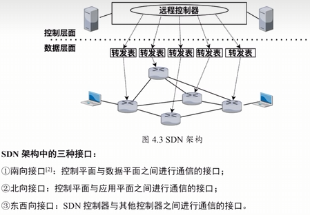

1. 路由选择
根据路由协议建立路由表，通过网络中其他路由器交换路由信息，分析到达目标网络的最优转发路径
2. 分组转发
路由器根据转发表将分组从合适的端口转发出去

路由器有两个表
1. 路由表
	1. 基于路由选择协议
2. 转发表：把路由表内的内容精简到转发表
	1. 根据路由表生成的

# SDN
是一种将控制平面和数据平面分离的新型网络架构
- 数据平面：负责数据包转发和处理
- 控制层面：包含一个逻辑上的SDN控制器
- 应用平面：实现各种借口

**接口**
1. 南向：控制与数据
2. 北向：控制和应用
3. 东西：控制器和其它控制器之间进行的通信接口

