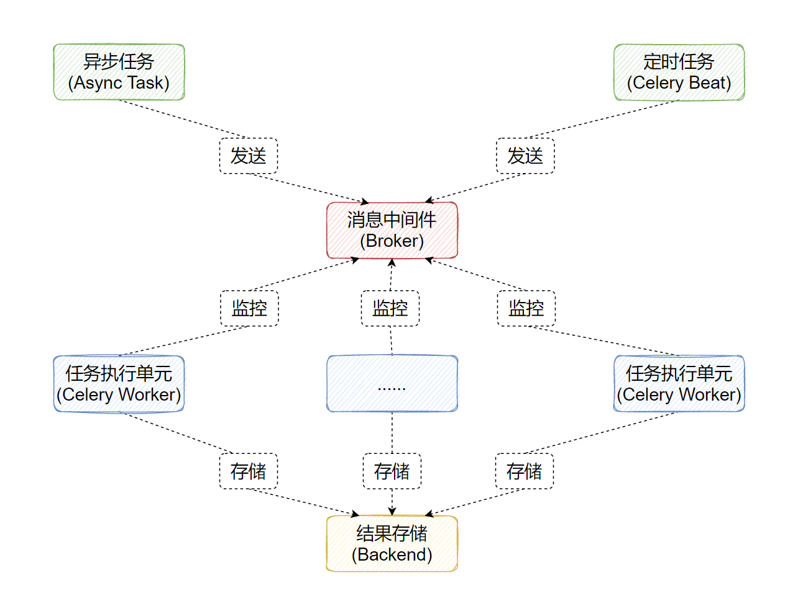

# Celery

# 组成

- 消息中间件(Broker)：官方提供了很多备选方案，支持RabbitMQ、Redis、Amazon SQS、MongoDB、Memcached 等，官方推荐RabbitMQ
- 任务执行单元(Worker)：任务执行单元，负责从消息队列中取出任务执行，它可以启动一个或者多个，也可以启动在不同的机器节点，这就是其实现分布式的核心
- 结果存储(Backend)：官方提供了诸多的存储方式支持：RabbitMQ、 Redis、Memcached,SQLAlchemy, Django ORM、Apache Cassandra、Elasticsearch等



~~~
pip install celery==5.2.7
pip install redis==4.3.4
~~~

# 安装redis

https://github.com/tporadowski/redis/releases

在redis.windows.conf下

```
绑定IP：如果需要远程访问，可以将此注释，或绑定一个真是IP
bind 127.0.0.1
端口：默认为6379
port 6379	
```

### 启动redis

```
redis-server redis.windows.conf
```

### 连接redis数据库

```
redis-cli
```

### 测试

```
检测 redis 服务是否启动
PING
设置键值对:
set uname baizhan
取出键值对:
get uname
删除键值对：
del uname
查看所有键值对：
keys *
删除所有的键值对
flushall
```

~~~
from celery import Celery
import time


app = Celery('tasks', broker='redis://127.0.0.1:6379/1', backend='redis://127.0.0.1:6379/2')


# 装饰器意思:这个函数是一个异步任务，扔到队列里面去
@app.task
def send_email(name):
  print(f'准备执行任务:{name}')
  print('执行任务中...')
  time.sleep(5)
  print(f'执行任务完成:{name}')
  return 'OK1!'


@app.task
def send_msg(name):
  print(f'准备执行任务:{name}')
  print('执行任务中...')
  time.sleep(5)
  print(f'执行任务完成:{name}')
  return 'OK2!'

~~~

## 启动work

~~~
celery -A 可执行的任务文件 worker --loglevel=INFO --concurrency=并发的数量
不要带后缀

 celery -A first worker --loglevel=INFO
~~~

### win版本

~~~
celery -A 可执行的任务文件 worker --loglevel=INFO --concurrency=并发的数量 -P eventlet
celery -A first worker --loglevel=INFO --concurrency=3 -P eventlet
~~~


### 异步任务

delay( )方法

~~~
from celery_task import *


def delay():
  rs = send_email.delay('baizhan')
  print(rs.id)


  rs2 = send_msg.delay('SXT')
  print(rs2.id)


~~~

#### 示例

~~~
from celery import Celery
import time

# 创建对象
#                                           任务中间件                       存储结果
app = Celery('tasks', broker='redis://127.0.0.1:6379/5', backend='redis://127.0.0.1:6379/6')


@app.task
# 建立任务
def send_email(name):
    print(f"准备执行{name}邮件")
    time.sleep(4)
    print(f"{name}发送成功")

@app.task
def send_tsk(name):
    print(f"准备执行{name}短信")
    time.sleep(4)
    print(f"{name}发送成功")

if __name__ == '__main__':
    for i in range(10):
        send_email('12')
~~~

~~~
from first import send_email,send_tsk


def delay_task():
    """
    发送异步任务
    :return:
    """
    re1 = send_email.delay('百战')
    re2 = send_tsk.delay('sxt')
    print(re1.id,re2.id)

if __name__ == '__main__':
    delay_task()
~~~

- 保证redis启动
- 保证celery启动`celery -A first worker --loglevel=INFO --concurrency=3 -P eventlet`


### 定时任务调用

apply_async( )方法

~~~
from celery_task import *
import datetime


def time_exec():
  # 获取当前时间
  c_time = datetime.datetime.now()
  # 获取当前时间的utc时间
  utc_time = datetime.datetime.utcfromtimestamp(c_time.timestamp())
  # 设置定时任务的执行时间
  s5 = datetime.timedelta(seconds=5)
  # 获取定时任务的执行时间
  exec_time = utc_time + s5


  rs = send_email.apply_async(args=['baizhan'],eta=exec_time)
  print(rs.id)
  rs2 = send_msg.apply_async(args=['SXT'],eta=exec_time)
  print(rs2.id)

~~~


## 获取任务结果

获取Celery的任务结果可以通过`celery.result.AsyncResult`对象获取，需要传递任务ID,与Celery对象

```
AsyncResult(id=任务ID, app=app)
```

对象有以下参数与方法：

- successful()

	判断任务执行是否成功

- get()

	获取任务执行的结果

- failed()

	判断任务执行是否失败

- status

	查看任务执行的状态

	- PENDING 任务等待中被执行
	- RETRY 任务异常后正在重试
	- STARTED 任务已经开始被执行

```
from celery.result import AsyncResult
from celery_task import app


async1 = AsyncResult(id="db514dcc-5db3-48e3-a065-399207d76ce9", app=app)


if async1.successful():
  result = async1.get()
  print(result)
  # result.forget() # 将结果删除
elif async1.failed():
  print('执行失败')
elif async1.status == 'PENDING':
  print('任务等待中被执行')
elif async1.status == 'RETRY':
  print('任务异常后正在重试')
elif async1.status == 'STARTED':
  print('任务已经开始被执行')
```


## Django结合Celery的使用

Django集成Celery步骤如下：

- 在settings.py文件增加Celery基本设置
- 在子应用下创建celery.py文件，设置Celery对象
- 在子应用包中`__init__.py`增加代码，加载Celery对象
- 在子应用增加task.py文件，定义要执行的任务
- 启动work


### 修改settings.py

```
# Broker配置，使用Redis作为消息中间件
BROKER_URL = 'redis://127.0.0.1:6379/0'
# BACKEND配置，这里使用redis
CELERY_RESULT_BACKEND = 'redis://127.0.0.1:6379/0'
# 结果序列化方案
CELERY_RESULT_SERIALIZER = 'json'
# 任务结果过期时间，秒
CELERY_TASK_RESULT_EXPIRES = 60 * 60 * 24
# 时区配置
CELERY_TIMEZONE='Asia/Shanghai'
```

更多配置: https://docs.celeryq.dev/en/latest/userguide/configuration.html

### 在子应用下创建celery.py文件

```
import os
import django
from celery import Celery
from django.conf import settings


# 设置系统环境变量，安装django，必须设置，否则在启动celery时会报错
# celery_study 是当前项目名
os.environ.setdefault('DJANGO_SETTINGS_MODULE', 'celery_study.settings')
django.setup()
#实例化一个celery类
celery_app = Celery('celery_study')
#指定配置文件的位置
celery_app.config_from_object('django.conf:settings')
#自动从settings的配置INSTALLED_APPS中的应用目录下加载 tasks.py
celery_app.autodiscover_tasks(lambda: settings.INSTALLED_APPS)
```

> **注意**
>
> 和settings.py文件同目录，一定不能建立在项目根目录，不然会引起 celery 这个模块名的命名冲突

### 在子应用包中`__init__.py`增加代码

在项目的`__init__.py`中

```
from .celery import celery_app


__all__ = ['celery_app']
```

### 在子应用增加task.py文件

```
from celery import celery_app


# 定义任务函数
@app.task    # 任务装饰器,将函数注册为celery任务
def send_email(name):
  print(f'准备发送{name}的邮件')
  time.sleep(5)
  print( f'{name}的邮件发送成功')
  return 'OK1'


@app.task
def send_sms(name):
  print(f'准备发送{name}的短信')
  time.sleep(5)
  print( f'{name}的短信发送成功')
  return 'OK2'
```

### 启动work

切换到项目目录中，执行命令

```
celery -A celeryappsum worker --loglevel=INFO --concurrency=3 -P eventlet
```

- django_celery12.celery 为主应用名.celery.py的名字

~~~
celery -A bz_edu_project.celery worker --loglevel=INFO --concurrency=3 -P eventlet
~~~

~~~
celery -A bz_edu_project beat --loglevel=info
~~~

~~~
celery -A djangoProject.celery worker --loglevel=INFO --concurrency=3 -P eventlet
~~~

~~~
celery -A djangoProject beat --loglevel=info
~~~


## 手动启动celery任务


~~~
python manage.py shell
~~~

~~~
from your_app.tasks import se_batch  # 替换为实际路径

# 方式1：同步执行（用于测试逻辑，不走 Celery）
result = se_batch()  # 直接调用函数
print(result)

# 方式2：异步提交任务（推荐，走 Celery 队列）
result = se_batch.delay()
print(f"任务已提交，任务ID: {result.id}")
~~~

