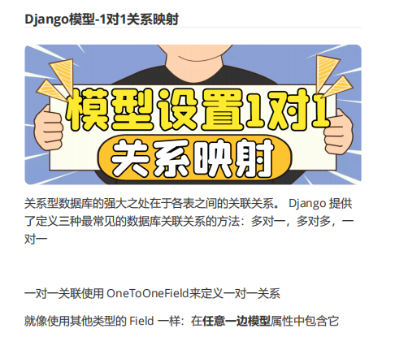
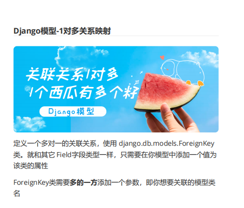
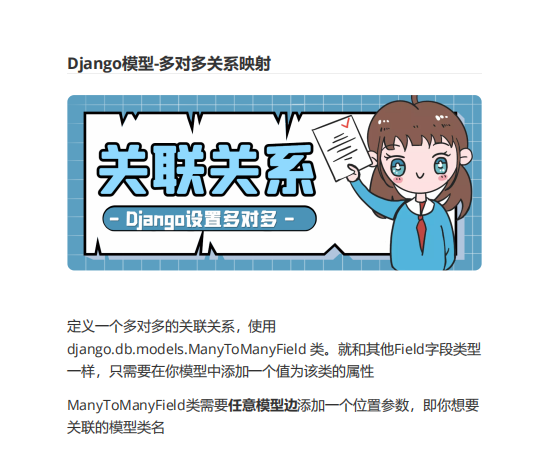

# django

## 创建启动

~~~
mkvirtualenv baizhan_env
pip install django==4.2.3
django-admin startproject edu_project
python manage.py runserver

~~~

## 改数据库

- /setting.py

~~~
DATABASES = {
    'default': {
        'ENGINE': 'django.db.backends.mysql',
        'NAME': 'edu_db',
        'USER':'root',
        'PASSWORD':'lin1234567',
        'HOST':'localhost',
        'POST':'3306',
    }
}
~~~

## 配置文件

- 库
- 数据库
- 时区
- 语言
- 模板
- 异步

~~~
"""
Django settings for bz_edu_project project.

Generated by 'django-admin startproject' using Django 4.2.3.

For more information on this file, see
https://docs.djangoproject.com/en/4.2/topics/settings/

For the full list of settings and their values, see
https://docs.djangoproject.com/en/4.2/ref/settings/
"""
import os
from pathlib import Path

# Build paths inside the project like this: BASE_DIR / 'subdir'.
BASE_DIR = Path(__file__).resolve().parent.parent

# Quick-start development settings - unsuitable for production
# See https://docs.djangoproject.com/en/4.2/howto/deployment/checklist/

# SECURITY WARNING: keep the secret key used in production secret!
SECRET_KEY = "***已隐藏***"

# SECURITY WARNING: don't run with debug turned on in production!
DEBUG = True

ALLOWED_HOSTS = ["*"]

# Application definition

INSTALLED_APPS = [
    "django.contrib.admin",
    "django.contrib.auth",
    "django.contrib.contenttypes",
    "django.contrib.sessions",
    "django.contrib.messages",
    "django.contrib.staticfiles",
    "user_app",  # 用户
    "course_app",  # 课程
    "rest_framework",
    "django_filters",
    "yoloapp",
    "dwrg",
    "tools",
    "TranslateApp",
    "clientapp",
    "WeatherApp",
    "celery_app",
]

MIDDLEWARE = [
    "django.middleware.security.SecurityMiddleware",
    "django.contrib.sessions.middleware.SessionMiddleware",
    "django.middleware.common.CommonMiddleware",
    "django.middleware.csrf.CsrfViewMiddleware",
    "django.contrib.auth.middleware.AuthenticationMiddleware",
    "django.contrib.messages.middleware.MessageMiddleware",
    "django.middleware.clickjacking.XFrameOptionsMiddleware",
]

ROOT_URLCONF = "bz_edu_project.urls"

TEMPLATES = [
    {
        "BACKEND": "django.template.backends.django.DjangoTemplates",
        "DIRS": [BASE_DIR / 'templates'],  # 添加这一行
        "APP_DIRS": True,
        "OPTIONS": {
            "context_processors": [
                "django.template.context_processors.debug",
                "django.template.context_processors.request",
                "django.contrib.auth.context_processors.auth",
                "django.contrib.messages.context_processors.messages",
            ],
        },
    },
]

# 部署
WSGI_APPLICATION = "bz_edu_project.wsgi.application"

# Database
# https://docs.djangoproject.com/en/4.2/ref/settings/#databases
# db
DATABASES = {
    "default": {
        "ENGINE": "django.db.backends.mysql",
        "NAME": "edu_project",
        "USER": "root",
        "PASSWORD": "123456",
        "HOST": "localhost",
        "PORT": 3306
    }
}

# Password validation
# https://docs.djangoproject.com/en/4.2/ref/settings/#auth-password-validators

AUTH_PASSWORD_VALIDATORS = [
    {
        "NAME": "django.contrib.auth.password_validation.UserAttributeSimilarityValidator",
    },
    {
        "NAME": "django.contrib.auth.password_validation.MinimumLengthValidator",
    },
    {
        "NAME": "django.contrib.auth.password_validation.CommonPasswordValidator",
    },
    {
        "NAME": "django.contrib.auth.password_validation.NumericPasswordValidator",
    },
]

# Internationalization
# https://docs.djangoproject.com/en/4.2/topics/i18n/

LANGUAGE_CODE = "en-us"  # zh-Hans 中文

TIME_ZONE = 'Asia/Shanghai'  # 时区 ASIA/Shanghai

USE_I18N = True

USE_TZ = True

# Static files (CSS, JavaScript, Images)
# https://docs.djangoproject.com/en/4.2/howto/static-files/

STATIC_URL = "static/"
RUNS_ROOT = os.path.join(BASE_DIR, 'runs')
RUNS_URL = '/runs/'  # 前端访问前缀
# 在文件末尾添加
STATICFILES_DIRS = [
    BASE_DIR / "static",
    BASE_DIR / "runs",

]

# Default primary key field type
# https://docs.djangoproject.com/en/4.2/ref/settings/#default-auto-field

DEFAULT_AUTO_FIELD = "django.db.models.BigAutoField"

# 配置REST_FRAMEWORK参数
REST_FRAMEWORK = {
    # 配置过滤器
    'DEFAULT_FILTER_BACKENDS': ['django_filters.rest_framework.DjangoFilterBackend'],
}
# 媒体文件配置
MEDIA_URL = '/media/'
MEDIA_ROOT = BASE_DIR / 'media'

# Celery settings
BROKER_URL = 'redis://127.0.0.1:6379/0'
CELERY_RESULT_BACKEND = 'redis://127.0.0.1:6379/0'
CELERY_RESULT_SERIALIZER = 'json'
CELERY_TASK_RESULT_EXPIRES = 60 * 60 * 24
CELERY_TIMEZONE = 'Asia/Shanghai'
CELERY_BROKER_URL = 'redis://127.0.0.1:6379/0'
~~~


## 用户创建

### 下载链接数据库的包

~~~
pip install pymysql
~~~

- __ init __.py

~~~
import pymysql

pymysql.install_as_MySQLdb()
~~~

~~~
python .\manage.py startapp user_app 
~~~

## 写model

- /user/models.py
- https://www.cnblogs.com/fmgao-technology/p/9989261.html#:~:text=2%E3%80%81models.CharField%20%2D%2D%2D%E5%AD%97%E7%AC%A6,%E5%85%81%E8%AE%B8%E7%9A%84%E6%9C%80%E5%A4%A7%E5%AD%97%E7%AC%A6%E6%95%B0%E3%80%82

~~~
import hashlib


from django.db import models


class User(models.Model):


  GENDER_CHOICES = (
     (0, '女'),
     (1, '男')
   )
  phone = models.CharField(null=True,max_length=11,verbose_name='手机号')
  _password = models.CharField(null=True,blank=True,max_length=100,verbose_name='真实密码')
  password = models.CharField(null=True,blank=True,max_length=100,verbose_name='密码',db_column=None)
  nickname= models.CharField(null=True,max_length=50,blank=True,verbose_name='昵称')
  gender = models.IntegerField(null=True,blank=True,verbose_name='性别',choices=GENDER_CHOICES,default=1)
  job_title = models.CharField(null=True,max_length=50,blank=True,verbose_name='职称')
  introduction = models.TextField(null=True,blank=True,verbose_name='简介')
  avatar = models.CharField(null=True,blank=True,max_length=50,verbose_name='头像')


  create_at = models.DateTimeField(auto_now_add=True,verbose_name='创建时间')
  update_at = models.DateTimeField(auto_now=True,verbose_name='更新时间')


  class Meta:
    db_table = 't_user'


  @property
  def password(self):
    return self._password


  @password.setter
  def password(self, pwd):
    # 数据密码数据加密
    self._password = hashlib.md5(pwd.encode()).hexdigest()


  def check_password(self, raw_password):
    encrypted = hashlib.md5(raw_password.encode()).hexdigest()
    return encrypted == self._password

~~~

## 迁移数据库

~~~
python .\manage.py makemigrations
python .\manage.py migrate
~~~

- 遇到数据库版本过低的报错可以

D:\python_venv\django_demo\Lib\site-packages\django\db\backends\base\base.py

~~~
    def init_connection_state(self):
        """Initialize the database connection settings."""
        global RAN_DB_VERSION_CHECK
        if self.alias not in RAN_DB_VERSION_CHECK:
           #  self.check_database_version_supported()   ------- 把这一行注释
            RAN_DB_VERSION_CHECK.add(self.alias)

~~~

## 编写接口

- 一般在**views.py**中

~~~
pip install djangorestframework==3.14.0
~~~

## objects函数

- 你可以执行查询、创建、更新和删除等操作

~~~
from myapp.models import User

# 获取所有用户
users = User.objects.all()

# 获取所有性别为男的用户
male_users = User.objects.filter(gender=1)

# 获取手机号为特定值的用户
user = User.objects.get(phone='12345678901')
# 按创建时间降序排列
users = User.objects.order_by('-create_at')

# 按昵称升序排列
users = User.objects.order_by('nickname')
# 获取前10个用户
top_10_users = User.objects.all()[:10]
~~~

- 创建逻辑

~~~
from rest_framework.views import APIView
from user_app.models import User
from rest_framework.response import Response
from rest_framework import status
# Create your views here.
class LoginView(APIView):
    def post(self,request):
        """
        登录
        """
        # 获取参数
        phone = request.data.get('phone')
        password = request.data.get('password')
        # 查找数据
        try:    
            user = User.objects.get(phone=phone)
        except User.DoesNotExist:
            return Response({'code':status.HTTP_404_NOT_FOUND,'msg':'用户不存在'})
        # 校验
        if user.check_password(password):
            return Response({
                'code':status.HTTP_200_OK,
                'msg':'登陆成功',
                'nickname':user.nickname,
                'user_id':user.id
            })
        return Response({'code':status.HTTP_400_BAD_REQUEST,'msg':'密码错误'})   
        # return 
~~~

## 创建路由

- 当前文件夹下创建url.py

~~~
from django.urls import path

from . import views

urlpatterns = {
    path('login/',views.LoginView.as_view()),
}
~~~

- 主应用下的urls.py

~~~
from django.urls import path,include

urlpatterns = [
    path('admin/', admin.site.urls),
    path('api/',include('user_app.url')),
]
~~~


## 注册

~~~
~~~

## 用户信息


## 报错

~~~
AssertionError: Expected view UserDetail to be called with a URL keyword argument named "pk". fix your URl
url地址上的参数没有定义成PK
序列化时没有在模型化定义
~~~

- 把路由改了

~~~
path('user/<int:pk>/',views.UserDetail.as_view()),
~~~


## serializers序列化

- 处理数据和复杂数据类型的转换工具，类似jango的表单类，将复杂的数据类型转化成本地的python类型方便呈现为json
- 帮我们验证数据，序列化数据，反序列化数据

~~~
from rest_framework import serializers
from .models import User


# 创建注册序列化器
class RegisterSerializer(serializers.ModelSerializer):
    phone = serializers.CharField(max_length=11, min_length=11, required=True)
    password = serializers.CharField(max_length=32, min_length=3, required=True)
    nickname = serializers.CharField(required=False)
    gender = serializers.IntegerField(required=False)
    job_title = serializers.CharField(required=False)
    introduction = serializers.CharField(required=False)
    avatar = serializers.CharField(required=False)

    # 验证手机号是否已经注册
    def validate_phone(self, value):
        try:
            User.objects.get(phone=value)
            raise serializers.ValidationError('手机号已经注册')
        except User.DoesNotExist:
            return value
        return value

    class Meta:# 元数据
        model = User 
        fields = '__all__' # 选择全部的数据去
~~~

### Serializer 处理嵌套对象

~~~py
class UserSerializer(serializers.Serializer):
    email = serializers.EmailField()
    username = serializers.CharField(max_length=100)

class CommentSerializer(serializers.Serializer):
    user = UserSerializer()
    content = serializers.CharField(max_length=200)
    created = serializers.DateTimeField()


~~~

如果嵌套表示可以接收 `None`值，则应该将 `required=False`标志传递给嵌套的序列化器。

类似的，如果嵌套的关联字段可以接收一个列表，那么应该将`many=True`标志传递给嵌套的序列化器。

~~~py
class UserSerializer(serializers.Serializer):
    email = serializers.EmailField()
    username = serializers.CharField(max_length=100)

class CommentSerializer(serializers.Serializer):
    user = UserSerializer(required=False)
    content = serializers.CharField(max_length=200)
    created = serializers.DateTimeField()

~~~

### 嵌套查询

~~~
from django.db import models


# Create your models here.
class Classes(models.Model):
  name = models.CharField(max_length=20, verbose_name='班级')
  
class Student(models.Model):


  SEX_CHOICES = ((1,'男')), (2, '女')


  name = models.CharField(max_length=20, verbose_name='姓名')
  age = models.IntegerField(null=True, blank=True, verbose_name='年龄')
  sex = models.IntegerField(choices=SEX_CHOICES, default=1, verbose_name='性别')
  classes = models.ForeignKey(Classes, on_delete=models.SET_NULL,null=True,verbose_name='班级')

~~~


~~~
class ClassSerializer(serializers.ModelSerializer):
  class Meta:
    model = Classes
    fields = ['id','name']
    
class StudentSerializer(serializers.ModelSerializer):

  classes = ClassesSerializer() # ← 这行依赖 ForeignKey！
  class Meta:
    model = Student
    fields = ['id', 'name', 'age', 'sex', 'classes']
自动识别这是一个关系字段
允许你用 ClassesSerializer 嵌套序列化


~~~

### 反向查找

- 通过班级查询所有学生

~~~
class Student(models.Model):
      SEX_CHOICES = ((1,'男')), (2, '女')
      name = models.CharField(max_length=20, verbose_name='姓名')
      age = models.IntegerField(null=True, blank=True, verbose_name='年龄')
      sex = models.IntegerField(choices=SEX_CHOICES, default=1, verbose_name='性别')
      # 必须增加属性 related_name='students'
      classes = models.ForeignKey(Classes, related_name='students', null=True, on_delete=models.SET_NULL, verbose_name='班级')
~~~

~~~
from rest_framework import serializers


from .models import Classes, Student


class StudentSerializer(serializers.ModelSerializer):
  class Meta:
    model = Student
    fields = ['id','name','age','sex']


class Class2Serializer(serializers.ModelSerializer):
  # 通过related_name反向查询的字段，创建序列化器对象
  students = StudentSerializer(many=True,read_only=True)
  class Meta:
    model = Classes
    fields = ['id','name','students']

~~~


## rest_framework

~~~
# RetrieveAPIView找单一的某一个数据区别
~~~


## ListAPIView和APIView的区别

 `generics.ListAPIView` 是 DRF 提供的 **高度封装的通用视图**，它已经内置了 `.get()` 方法的逻辑。

当你继承 `ListAPIView` 时：

- 它**自动实现了 `get` 请求**的处理逻辑。
- 它会自动使用你定义的 `queryset` 作为数据源。
- 自动使用 `serializer_class` 进行序列化。
- 自动应用 `pagination_class` 分页。
- 所以你**不需要自己写 `get()` 方法**。

> 🔹 相当于：你只负责"配置"，DRF 帮你"执行"。

| 属性名                | 作用             |
| ------------------ | -------------- |
| `queryset`         | 指定要列出的数据集      |
| `serializer_class` | 指定用哪个序列化器来返回数据 |
| `pagination_class` | 指定分页规则         |


因为 `APIView` 是 **最基础的视图类**，它不会自动帮你实现任何 HTTP 方法的逻辑。

- 它**不假设你要做什么**（是注册？登录？上传？）。
- 所以你必须**手动实现 `post()` 方法**来处理 POST 请求。
- 它也没有默认的 `queryset` 或 `serializer_class` 行为，除非你自己在方法中使用。

> 🔹 相当于：你负责"从零写逻辑"，DRF 只提供工具（如 Request、Response、认证等）。


## url调度器

~~~
from django.urls import path


urlpatterns = [
  path('user/',user),
  path('user/info/',user_info),
  path('user/<id>/',user_id),       # 当成参数传入到变量里
  path('user/<id>/<year>/',user_id_year),
  path('user/<int:id>/',user_int),
]

~~~

### 路径转换器

- str：匹配任何非空字符串，不包括路径分隔符'/'。如果转换器不包含在表达式中，这是默认值。
- int：匹配零或任何正整数。返回一个int。
- slug：匹配由ASCII字母或数字组成的字符串，以及横线和下划线字符。例如： building-your-1st-django_site可以匹配，django_@site是不可以匹配的。
- uuid：匹配格式化的UUID。为防止多个URL映射到同一页面，必须包含破折号，并且字母必须是小写。例如，075194d3-6885-417e-a8a8-6c931e272f00。返回一个 UUID实例。

~~~
path('articles/<uuid:uuid>/',views.article_uuid),
~~~


- path：匹配任何非空字符串，包括路径分隔符 '/'，可以匹配完整的URL路径，而不仅仅是URL路径的一部分str，使用时要谨慎，因为可能造成后续的所有url匹配都失效。


## 自定义url

- 一个regex类属性，作为一个re匹配字符串
- to_python(self, value)方法，它处理匹配的字符串转换成要传递到视图函数的类型
- to_url(self, value)方法，用于处理将Python类型转换为URL中使用的字符串

### 新建一个converters.py文件，在文件中定义一个FourDigitYearConverter类：

~~~
class FourDigitYearConverter(object):
  regex = '[0-9]{4}'


  def to_python(self, value):
    return int(value)


  def to_url(self, value):
    return '%04d' % value

~~~

### 使用register_converter()方法在URLs中注册自定义转换器类 ：

~~~
from django.urls import register_converter, path


from . import converters, views


register_converter(converters.FourDigitYearConverter, 'yyyy')


urlpatterns = [
  path('articles/2030/', views.special_case_2030),
  path('articles/<yyyy:year>/', views.year_archive)
]

~~~

## URL调度器-错误处理 自定义错误界面

### urls 中配置

~~~
# polls是子应用
handler404 = "polls.views.page_not_found"

~~~

### 再polls应用中views中添加函数

~~~
def page_not_found(request, exception):
  return HttpResponse('自定义的404错误页面')
~~~

### 自定义页面

~~~
def page_not_found(request, exception):
    print("enter")
    return render(request, 'user/a404.html', status=404)
~~~

### 设置首页

~~~
urlpatterns = [
    path("", index, name="index"),  # 添加首页路由
~~~

## 设置首页

~~~
在setting中加
# 添加静态文件根目录
STATICFILES_DIRS = [
    BASE_DIR / "static",
]


在views中设置首页视图
# 添加首页视图
def index(request):
    return render(request, 'home/index.html')
    
更新url
urlpatterns = [
    path("", index, name="index"),  # 添加首页路由
~~~


## 引入其他路由

#### include(str)

~~~
from django.urls import include, path


urlpatterns = [
  path('community/', include('aggregator.urls')),
  path('contact/', include('contact.urls')),
]

~~~


#### include(list/tuple)

~~~
from django.urls import include, path


from apps.main import views as main_views
from credit import views as credit_views


extra_patterns = [
  path('reports/', credit_views.report),
  path('reports/<int:id>/', credit_views.report),
  path('charge/', credit_views.charge),
]


urlpatterns = [
  path('', main_views.homepage),
  path('help/', include('apps.help.urls')),
  path('credit/', include(extra_patterns)),
]

~~~


优化

~~~
from django.urls import path
from . import views


urlpatterns = [
  path('<page_slug>-<page_id>/history/', views.history),
  path('<page_slug>-<page_id>/edit/', views.edit),
  path('<page_slug>-<page_id>/discuss/', views.discuss),
  path('<page_slug>-<page_id>/permissions/', views.permissions),
]


等价于
from django.urls import include, path
from . import views


urlpatterns = [
  path('<page_slug>-<page_id>/', include([
    path('history/', views.history),
    path('edit/', views.edit),
    path('discuss/', views.discuss),
    path('permissions/', views.permissions),
   ])),
]

~~~


## models

**ORM框架**

~~~
from django.db import models


class Person(models.Model):
  first_name = models.CharField(max_length=30)
  last_name = model
  s.CharField(max_length=30)

===
CREATE TABLE myapp_person (
  "id" bigint NOT NULL PRIMARY KEY GENERATED BY DEFAULT AS IDENTITY,
  "first_name" varchar(30) NOT NULL,
  "last_name" varchar(30) NOT NULL
);

~~~

**django会自己创建id的主键**

1. 模型类必须继承models.Model
2. 每个属性对应数据库表中的一个字段
3. 表名自动使用 应用_类名 的小写（如：polls_question），可以覆盖重写
4. 如果模型类中没有指定 primary_key ，那么会自动创建一个 id 字段，自增，主键


## 数据库设置

1. 创建项目model_study,及子应用model_app

	```
	#创建项目
	$ django-admin startproject model_study
	#进入项目目录创建子应用
	$ python manage.py startapp model_app
	```

2. 配置应用，将模型对应的应用程序添加到项目的settings中：

	```
	INSTALLED_APPS = [
	  'model_app'
	]
	```

3. 在settings.py中配置正确的数据库连接：

	```
	# mysql
	DATABASES = {
	  'default': {
	    'ENGINE': 'django.db.backends.mysql',
	    'NAME': 'model_study',
	    'USER': 'root',
	    'PASSWORD': 'root',
	    'HOST': '127.0.0.1',
	    'PORT': 3306,
	   }
	}
	```

~~~
pip install mysqlclient==2.1.1

pip install pymysql
~~~

## 逆向models

~~~
python manage.py inspectdb > model_app/models.py


~~~

### 字段

### 常见的字段

### 字段命名限制

- 字母，数字，下划线，首字母不能是数字
- 字段名称不能是Python保留字
- 由于Django查询查找语法的工作方式，字段名称不能在一行中包含多个下划线，譬如“abc__123”就是不允许的，一个下划线是可以的，如：'first_name'

官方文档：https://docs.djangoproject.com/zh-hans/4.1/ref/models/fields/#field-types

| 字段名            | 作用                                                         |
| ----------------- | ------------------------------------------------------------ |
| AutoField         | 自增一个IntegerField，根据可用的 ID 自动递增                 |
| BooleanField      | 该字段的默认表单部件是checkbox,默认值是 None                 |
| CharField         | 一个字符串字段                                               |
| DateField         | 一个日期，在 Python 中用一个 `datetime.date` 实例表示        |
| DateTimeField     | 一个日期和时间，在 Python 中用一个 `datetime.datetime` 实例表示 |
| FloatField        | 在 Python 中用一个 `float` 实例表示的浮点数                  |
| SmallIntegerField | 就是一个 IntegerField， `-32768` 到 `32767` 的值             |
| IntegerField      | 一个整数。从 `-2147483648` 到 `2147483647` 的值              |
| TextField         | 一个大的文本字段。该字段的默认表单部件是一个Textarea         |

### 常见的属性

- max_length：字段最大长度，用于字符串等，字符串类型CharField必须设置该值
- null：如果True，Django将在数据库中存储NULL空值。默认是False
- blank：如果True，该字段被允许为空白("")。默认是False。

- choices：

	示例：YEAR_IN_SCHOOL_CHOICES = (('FR', 'Freshman'),('SO', 'Sophomore'),('JR', 'Junior'),('SR', 'Senior'),('GR', 'Graduate')) ,

	中文示例：SEX_CHOICES=((1, '男'),(2, '女'))

	元组中的第一个元素是将存储在数据库中的值，第二个元素是将在页面中显示的值，最常见用于下拉选择框select

- default：字段的默认值

- help_text：用于显示额外的“帮助”文本

- primary_key：如果True，这个字段是模型的主键，默认是False

- unique：如果True，该字段在整个表格中必须是唯一的

- verbose_name：详细字段名，不指定则是属性名的小写，并且用 空格 替换 '_'



~~~
from django.db import models


class Place(models.Model):
  name = models.CharField(max_length=50)
  address = models.CharField(max_length=80)


  def __str__(self):
    return "%s the place" % self.name


class Restaurant(models.Model):
  place = models.OneToOneField(
    Place,
    on_delete=model  s.CASCADE,
    primary_key=True,
   )
  # BooleanField 在数据库使用 tinyint 类型
  serves_hot = models.BooleanField(default=False)
  serves_clod= models.BooleanField(default=False)


  def __str__(self):
    return "%s the restaurant" % self.place.name


~~~



~~~
from django.db import models


class Place(models.Model):
  name = models.CharField(max_length=50)
  address = models.CharField(max_length=80)


  def __str__(self):
    return "%s the place" % self.name


class Restaurant(models.Model):
  place = models.OneToOneField(
    Place,
    on_delete=models.CASCADE,
    primary_key=True,
   )
  # BooleanField 在数据库使用 tinyint 类型
  serves_hot_dogs = models.BooleanField(default=False)
  serves_pizza = models.BooleanField(default=False)


  def __str__(self):
    return "%s the restaurant" % self.place.name


class Waiter(models.Model):
  restaurant = models.ForeignKey(Restaurant, on_delete=models.CASCADE)
  name = models.CharField(max_length=50)


  def __str__(self):
    return "%s the waiter at %s" % (self.name, self.restaurant)


~~~



~~~
class SchoolClass(models.Model):
  name = models.CharField(max_length=20)


class Teacher(models.Model):
  name = models.CharField(max_length=10)
  school_class = models.ManyToManyField(SchoolClass)

~~~

## 外键的关联

在 Django 和关系型数据库中，一个外键要成功关联到另一个表的某个字段，必须满足：

1. **目标字段必须有唯一性约束**（`unique=True` 或是主键）。
2. **目标字段的数据类型要兼容**（比如都是整数或字符串）。

> 主键（Primary Key）天然具有唯一性，所以是最常见的外键关联目标。

~~~
class User(models.Model):
    user_id = models.AutoField(primary_key=True)
    username = models.CharField(max_length=32, unique=True)  # 唯一，但不是主键
    email = models.EmailField()

class Profile(models.Model):
    user = models.ForeignKey(
        User,
        to_field='username',           # 关联到 username 字段
        on_delete=models.CASCADE
    )
    bio = models.TextField()
~~~


- `to_field='username'`：明确指定外键关联 `User` 表的 `username` 字段。
- `username` 必须有 `unique=True`，否则会报错。

## 中间表


## Django模型-数据的查询介绍

### 查询方式

- `Model.objects.get( )` 返回一个匹配的对象
- `Model.objects.all( )`返回一个`QuerySet`,包含所有数据
- `Model.objects.filter( )`返回一个新的`QuerySet`，包含复合规则的
- `Model.objects.exclude( )` 返回一个新的`QuerySet`，不包含指定规则的 取反

| 情况                                       | 是否连表查询 | 说明                              |
| ------------------------------------------ | ------------ | --------------------------------- |
| `Model.objects.get()`                      | ❌ 否         | 只查本表                          |
| `Model.objects.select_related().get()`     | ✅ 是         | 主动 JOIN 关联表                  |
| 访问关联字段（如 `obj.foreign_key.field`） | ❌ 惰性加载   | 第一次用时才查，可能造成 N+1 问题 |

## Django模型-数据的条件查询

参考文档：https://docs.djangoproject.com/zh-hans/4.1/ref/models/querysets/#field-lookups

字段检索，是在**字段名**后加 '__' 双下划线，再加关键字，类似 SQL 语句中的 where 后面的部分， 如： 字段名\_\_关键字

- exact ：判断是否等于value，一般不使用，而直接使用 '='
- contains：是否包含,大小写敏感，如果需要不敏感的话，使用icontains
- startswith：以value开头,大小写敏感
- endwith：以value结尾,大小写敏感
- in：是否包含在范围内
- isnull：是否为null， 如：filter(name__isnull=Flase)
- gt：大于，如：filter(sage__gt=30) ， 年龄大于30
- gte：大于等于
- lt：小于
- lte：小于等于

~~~
# 获取ID等于6
Waiter.objects.filter(id__exact=6)
# 获取ID等于6
Waiter.objects.filter(id=6)
# 获取name名字包含"张"
Waiter.objects.filter(name__contains="张")
# 获取name名字包含"吕"
Waiter.objects.filter(name__contains="吕") 
# 获取name名字以"袁"开头的
Waiter.objects.filter(name__startswith="袁") 
# 获取name名字以"辽"结尾的
Waiter.objects.filter(name__endswith="辽")
# 获取name名字是"关羽和黄忠"的
Waiter.objects.filter(name__in=["关羽","黄忠"])
# 获取name名字为空的
Waiter.objects.filter(name__isnull=True) 
# 获取id大于5的
Waiter.objects.filter(id__gt=5)
# 获取id小于5的
Waiter.objects.filter(id__lt=5)
# 获取id小于等于5的
Waiter.objects.filter(id__lte=5) 
# 获取在id为1的餐厅工作的
Waiter.objects.filter(restaurant=1)
# 获取在id为1的餐厅工作的
Waiter.objects.filter(restaurant_id=1)
# 获取在name为肯德基的餐厅工作的
Waiter.objects.filter(restaurant__name="肯德基")
# 会报错，没有用俩个下划线！！！
Waiter.objects.filter(restaurant_name="肯德基") 

~~~

## 查询

### 一对一

~~~
# 通过 Place 查找 Restaurant
place = Place.objects.first()
restaurant = place.restaurant

# 通过 定义了 OneToOneField 的模型 Restaurant 查找 Place
restaurant = Restaurant.objects.first()
place = restaurant.place
~~~


### 一对多

~~~
from django.db import models

class Restaurant(models.Model):
  """
   餐厅
   """
  name = models.CharField(max_length=32,verbose_name='餐厅名')
  place = models.OneToOneField(Place,on_delete=models.CASCADE,verbose_name='所在位置',null=True)

  class Meta:
    db_table='t_restaurant'
  
class Waiter(models.Model):
  """
   服务员
   """
  name = models.CharField(max_length=32,verbose_name='人名')
  induction = models.DateTimeField(verbose_name='入职时间',null=True)
  restaurant = models.ForeignKey(Restaurant,on_delete=models.CASCADE,verbose_name='所在餐厅',null=True)
  def __str__(self):
    return f'{self.name} == {self.induction}'
  class Meta:
    db_table='t_waiter' 
    

一查多
# 通过 '多的模型小写名_set' 查找
restaurant = Restaurant.objects.first()
waiters = restaurant.waiter_set.all()

多查一
w1 = Waiter.onjects.first()
r1 = w1.restaurant
~~~

在一查多的时候

当没有规定反向名称时需要使用set和all(**这里其实就是查询到多个数据**)

``rest.waiters_set.all()``

当设置了反向名称

``restaurant = models.ForeignKey(Restaurant, on_delete=models.CASCADE, related_name='waiters')``

==``related_name='waiters'``==

那么就直接可以通过反向名称

``rest.waiters.all() ``

- 在drf中

~~~
from django.db import models


class Classes(models.Model):
    name = models.CharField(max_length=20, verbose_name='班级')

    class Meta:
        db_table = 't_class'


# Create your models here.
class Student(models.Model):
    SEX_CHOICES = ((1, '男'), (2, '女'))
    name = models.CharField(max_length=20, verbose_name='姓名')
    age = models.IntegerField(null=True, blank=True, verbose_name='年龄')
    sex = models.IntegerField(choices=SEX_CHOICES, default=1, verbose_name='性别')
    classes = models.ForeignKey(Classes, on_delete=models.SET_NULL, null=True, verbose_name='班级')

    class Meta:
        db_table = 't_student'

~~~

- **最主要的就是这里**
- ``classes = ClassSerializer()``

~~~
from rest_framework import serializers
from .models import Student,Classes


class ClassSerializer(serializers.ModelSerializer):
  class Meta:
    model = Classes
    fields = '__all__'
class StudentSerializer(serializers.ModelSerializer):
    classes = ClassSerializer()
    class Meta:
        model = Student
        fields = ['id', 'name', 'age','sex','classes']

~~~

- 查询

~~~
def index(request):
    stu = Student.objects.all()
    ser = StudentSerializer(stu,many=True)
    return JsonResponse(ser.data,safe=False)
~~~

#### 一查多

- 在models里需要有反向查询的字段

``classes = models.ForeignKey(Classes, on_delete=models.SET_NULL, null=True, verbose_name='班级',related_name='students')``

~~~
class Class2Serializer(serializers.ModelSerializer):
    # 通过related_name反向查询的字段，创建序列化器对象
    students = StudentSerializer(many=True, read_only=True)

    class Meta:
        model = Classes
        fields = ['id', 'name', 'students']
~~~


### 多对多

~~~
from django.db import models


class Restaurant(models.Model):
  """
   餐厅
   """
  name = models.CharField(max_length=32,verbose_name='餐厅名')
  place = models.OneToOneField(Place,on_delete=models.CASCADE,verbose_name='所在位置',null=True)


  class Meta:
    db_table='t_restaurant'
  
class Food(models.Model):
  """
   食物
   """
  name = models.CharField(max_length=32,verbose_name='菜名')
  is_main = models.BooleanField(default=True,verbose_name='是否是主食',null=True)
  restaurant = models.ManyToManyField(Restaurant,verbose_name='哪个餐厅有',null=True)
  class Meta:
    db_table='t_food'
  
# 从 没有写 ManyToManyField 的模型查找另一 写了 ManyToManyField 的模型
# 需要在 查询的模型名的小写后 加 _set
restaurant = Restaurant.objects.first()
foods = Restaurant.food_set.all()


# 从 写了 ManyToManyField 的模型查找另一个模型
food = Food.objects.first()
schoolClasses = food.restaurant.all()

~~~


### 执行原生sql

~~~
from django.db import connection


cursor = connection.cursor()
cursor.execute("UPDATE t_cook SET level = 1 WHERE id = %s", [1])
cursor.execute("SELECT * FROM t_cook WHERE id = %s", [1])
row = cursor.fetchone()

~~~

## Django视图-FBV和CBV

FBV 是基于函数的视图 （function base views）

CBV 是基于类的视图（class base views）

### FBV

就是在视图里使用函数处理请求

```
# urlconf 中
urlpatterns = [
    path('fbv/', views.current_datetime),
]


# views 中
from django.http import HttpResponse
import datetime


def current_datetime(request):
  now = datetime.datetime.now()
  html = "<html><body>It is now %s.</body></html>" % now
  return HttpResponse(html)
```

- 视图函数 current_datetime，每个视图函数都将一个HttpRequest 对象作为其第一个参数，该参数通常被命名request
- 视图函数的名称无关紧要，它不必以某种方式命名，以便Django能够识别它，但是函数命名一定要能够清晰的描述它的功能
- 视图函数返回一个HttpResponse响应的对象，每个视图函数负责返回一个HttpResponse对象（有例外，但我们在稍后讨论）


~~~
# urlconf 中
urlpatterns = [
  # 一定要使用 as_view() ，记住 小括号
    path('cbv/', views.MyView.as_view()),
]


# views中
from django.http import HttpResponse
from django.views import View
 
class MyView(View):


  def get(self, request):
    return HttpResponse('get OK')


  def post(self, request):
    return HttpResponse('post OK')

~~~

- CBV提供了一个as_view()静态方法（也就是类方法），调用这个方法，会创建一个类的实例，然后通过实例调用dispatch()方法，dispatch()方法会根据request的method的不同调用相应的方法来处理request（如get()，post()等）
- 提高了代码的复用性，可以使用面向对象的技术，比如Mixin（多继承）
- 可以用不同的函数针对不同的HTTP方法处理，而不是通过很多 if 判断，可以提高代码可读性


@login_required

必须登录才能访问装饰的视图函数，

用户未登录，则重定向到settings.LOGIN_URL，除非指定了login_url参数，例如：@login_required(login_url='/polls/login/')

~~~
@login_required
def my_view(request):
  # I can assume now that only GET or POST requests make it this far
  # ...
  pass
~~~


## Django视图-请求对象HttpRequest

每一个用户请求在到达视图函数的同时，Django 会创建一个HttpRequest对象并把这个对象当做第一个参数传给要调用的views方法。HttpRequest对象包含了请求的元数据,比如(本次请求所涉及的用户浏览器端数据、服务器端数据等)，在views里可以通过request对象来调用相应的属性

所有视图函数的第一个参数都是HttpRequest实例

官网：[https://docs.djangoproject.com/zh-hans/4.1/ref/request-response/#django.http.HttpReques](https://docs.djangoproject.com/zh-hans/4.1/ref/request-response/#django.http.HttpRequest)

- HttpRequest.scheme：

	表示请求使用的协议（http或https）

- HttpRequest.body：

	原始HTTP请求主体，类型是字节串。处理数据一些非html表单的数据类型很有用，譬如：二进制图像，XML等；

	- 取form表单数据，请使用 HttpRequest.POST
	- 取url中的参数，用HttpRequest.GET

- HttpRequest.path：

	表示请求页面的完整路径的字符串，不包括scheme和域名。

	例： "/music/bands/the_beatles/"

- HttpRequest.method：

	表示请求中使用的HTTP方法的字符串，是大写的。例如：

	```
	if request.method == 'GET':
	  do_something()
	elif request.method == 'POST':
	  do_something_else()
	```

- HttpRequest.encoding：

	表示当前编码的字符串，用于解码表单提交数据（或者None，表示使用该DEFAULT_CHARSET设置）。

	可以设置此属性来更改访问表单数据时使用的编码，修改后，后续的属性访问（例如读取GET或POST）将使用新encoding值。

- HttpRequest.content_type：

	表示请求的MIME类型的字符串，从CONTENT_TYPE解析 。

- HttpRequest.content_params：

	包含在CONTENT_TYPE 标题中的键/值参数字典。

- HttpRequest.GET：

	包含所有给定的HTTP GET参数的类似字典的对象。请参阅QueryDict下面的文档。

- HttpRequest.POST：

	包含所有给定HTTP POST参数的类似字典的对象，前提是请求包含表单数据。请参阅QueryDict文档。POST不包含文件信息，文件信息请见FILES。

- HttpRequest.COOKIES：

	包含所有Cookie的字典，键和值是字符串。

- HttpRequest.FILES：

	包含所有上传文件的类似字典的对象

- HttpRequest.META：

	包含所有可用HTTP meta的字典

中间件设置的属性：

Django的contrib应用程序中包含的一些中间件在请求中设置了属性。如果在请求中看不到该属性，请确保使用了相应的中间件类MIDDLEWARE

- HttpRequest.session：

	来自SessionMiddleware：代表当前会话的可读写字典对象。

- HttpRequest.site：

	来自CurrentSiteMiddleware： 代表当前网站的实例Site或 RequestSite返回get_current_site()

- HttpRequest.user：

	来自AuthenticationMiddleware：AUTH_USER_MODEL代表当前登录用户的实例

| 属性             | 说明                                                         |
| ---------------- | ------------------------------------------------------------ |
| `request.GET`    | URL 查询参数（如 `?name=alice&age=20`）                      |
| `request.POST`   | 表单数据（非文件字段，如文本输入）                           |
| `request.FILES`  | 上传的文件（如图片、文档）                                   |
| `request.body`   | 原始请求体内容（字节格式），比如 JSON 字符串或 XML           |
| `request.META`   | HTTP 请求头和其他元数据（如 `HTTP_USER_AGENT`, `REMOTE_ADDR`） |
| `request.method` | 请求方法（GET、POST、PUT 等）                                |
| `request.path`   | 请求的路径（如 `/upload/`）                                  |
| `request.user`   | 当前登录用户（如果已认证）                                   |

------

### ✅ 举个例子说明

假设你有一个表单：

html

深色版本

```
<form method="post" enctype="multipart/form-data">
  <input type="text" name="title" value="我的图片">
  <input type="file" name="image" />
  <button type="submit">上传</button>
</form>
```

当用户提交时：

- `request.POST['title']` → `"我的图片"`（表单文本）
- `request.FILES['image']` → 一个 `UploadedFile` 对象（上传的图片文件）
- `request.method` → `"POST"`
- `request.body` → 原始的 `multipart/form-data` 数据流（包含文本和文件的混合编码）

# 模板

作为一个Web框架，Django需要一种方便的方式来动态生成HTML。最常用的方法依赖于模板。模板包含**所需HTML输出的静态部分**以及描述如何插入**动态内容的特殊语法**

~~~
TEMPLATES = [
   {
    'BACKEND': 'django.template.backends.django.DjangoTemplates',
    "DIRS": [BASE_DIR / 'templates'],
    'APP_DIRS': True,
    'OPTIONS': {
      'context_processors': [
        'django.template.context_processors.debug',
        'django.template.context_processors.request',
        'django.contrib.auth.context_processors.auth',
        'django.contrib.messages.context_processors.messages',
       ],
     },
   },
]

~~~

- BACKEND：是实现Django模板后端API的模板引擎类的路径。内置是django.template.backends.django.DjangoTemplates和 django.template.backends.jinja2.Jinja2（使用这个需要额外安装jinja2库）
- DIRS ：按搜索顺序定义引擎应该查找模板源文件的目录列表
- APP_DIRS：是否去子应用寻找模板
- OPTIONS：包含后端特定的设置


## rest_framework

官网：https://www.django-rest-framework.org/

中文文档：https://q1mi.github.io/Django-REST-framework-documentation/

### settings配置

首先新建一个django项目

然后如果要启用REST framework，那么需要将其添加到

INSTALLED_APPS 中

```
INSTALLED_APPS = [
  ...
  'rest_framework'
]
```


### 序列化和反序列化

序列化：把一个对象（model）转换成json

反序列化：一组一组的数据 封装成objects

### 创建序列化类

在子应用的目录下，新建app_serializers.py 文件，在其中建立一个对应第一步建立的模型的序列化类：

```
from rest_framework import serializers
from rest_app.models import *

class StudentSerializer(serializers.ModelSerializer):
  class Meta: 
    model = Student#要继承哪个模型
    fields = ['id', 'name', 'age','sex'] # 相应字段
    # fields = '__all__'
    # 不序列化 exclude = ["id"]
```


### 序列化

~~~
# 得到一个模型实例
stu = Student.objects.get(pk=1)  # stu从数据库取一个
# 得到模型序列化类实例
stu_ser = StudentSerializer(stu) # stu是填充的
# 得到 模型的字典数据 {"id": 1, ......} 
data_dict = stu_ser.data 


# 转成bit类型
from rest_framework.renderers import JSONRenderer
data_json = JSONRenderer().render(data_dict)

~~~


- 序列化模型的查询集QuerySet
- many 传递了多个对象

```
# 必须指定 many=True 传递了多个对象
stu_ser = StudentSerializer(Student.objects.all(), many=True)
# 得到 字典数据列表 [OrderedDict([('id', 1),......)]
data_dict = stu_ser.data
```

## 反序列化

~~~
# 将 json格式的字节串 转换为字典
from rest_framework.parsers import JSONParser
import io
stream = io.BytesIO(b'{"name":"rose", "age":19, "sex":2}')
# 得到字典数据， {'id': 1,......}
data_dict = JSONParser().parse(stream)


# 将字典数据 反序列化
serializer = StudentSerializer(data=data_dict)
# 必须执行这一步验证， 返回True 执行 save等方法
serializer.is_valid()
# 保存到数据库中
serializer.save()

~~~


## APIView

原来：

~~~
from .models import Student
from .serializers import StudentSerializer
from django.http import JsonResponse,HttpResponse
from rest_framework.parsers import JSONParser
from django.views.decorators.csrf import csrf_exempt

'''
对学生执行 增删改查API：
   行为       请求方式   请求路径URL
   增加       POST     /students/
   删除       DELETE    /student/<int:id>/
   修改       PUT     /student/<int:id>/
   查询一个     GET     /student/<int:id>/
   查询所有     GET     /students/
'''

@csrf_exempt
def students(request):
    if request.method == 'GET':
        stus = Student.objects.all()
        ser = StudentSerializer(stus,many=True)
        return JsonResponse(ser.data,safe=False)

    elif request.method == 'POST':
        data = JSONParser().parse(request)
        ser = StudentSerializer(data = data)
        if ser.is_valid():
            ser.save()
            return JsonResponse(ser.data, safe=False)
        return JsonResponse(ser.errors, status=400)
@csrf_exempt
def student(request,id):
    try:
        stu = Student.objects.get(pk=id)
    except Student.DoesNotExist:
        return JsonResponse({'error': '学生不存在'}, status=404)
    if request.method == 'GET':
        ser = StudentSerializer(stu)
        return JsonResponse(ser.data)
    elif request.method == 'PUT':
        data = JSONParser().parse(request)
        ser = StudentSerializer(stu,data)
        if ser.is_valid():
            ser.save()
            return JsonResponse(ser.data, safe=False)
    elif request.method == 'DELETE':
        stu.delete()
        return HttpResponse(status=204)


~~~


优化

~~~
from django.http import JsonResponse
from rest_framework.views import APIView
from .models import Student
from .serializers import StudentSerializer
from rest_framework.response import Response


class StudentList(APIView):
    def get(self,request,format=None):
        stus = Student.objects.all()
        ser = StudentSerializer(stus,many=True)
        return Response(ser.data)

    def post(self,request,format=None):
        """
        增加直接传json
        :param request:
        :param format:
        :return:
        """
        ser = StudentSerializer(data = request.data)
        if ser.is_valid():
            ser.save()
            return Response(ser.data)
        else:
            return Response(ser.errors,status=400)


class StudentDetail(APIView):

    def get(self,request,pk,format=None):
        try:
            stu = Student.objects.get(pk=pk)
        except Student.DoesNotExist:
            return JsonResponse({'error': '学生不存在'}, status=404)
        ser = StudentSerializer(stu)
        return Response(ser.data,status=200)
    def put(self, request, pk, format=None):
        try:
            stu = Student.objects.get(pk=pk)
        except Student.DoesNotExist:
            return JsonResponse({'error': '学生不存在'}, status=404)
        ser = StudentSerializer(stu,data = request.data)
        if ser.is_valid():
            ser.save()
            return Response(ser.data,status=201)
    def delete(self, request, pk, format=None):
        try:
            stu = Student.objects.get(pk=pk)
        except Student.DoesNotExist:
            return JsonResponse({'error': '学生不存在'}, status=404)

        stu.delete()
        return Response({'msg': '删除成功'}, status=204)
~~~


## GenericAPIVIew

继承自APIVIew，主要增加了操作序列化器和数据库查询的方法，作用是为下面Mixin扩展类的执行提供方法支持。通常在使用时，可搭配一个或多个Mixin扩展类

### 属性

- serializer_class 指明视图使用的序列化器
- queryset 指明使用的数据查询集

### 方法

- get_serializer_class(self) 返回序列化器类
- get_serializer(self, args, *kwargs) 返回序列化器对象
- get_queryset(self) 返回视图使用的查询集
- get_object(self) 返回视图所需的模型类数据对象

你问：**为什么 `get(self, request, pk, ...)` 中接收了 `pk`，但在 `self.get_object()` 里却没有显式传入 `pk`，却还能正确获取对象？**

因为 `GenericAPIView` **会自动从 URL 中提取 `pk` 或 `slug`**，并用它去查询 `queryset`，所以你 **不需要手动传 `pk` 给 `get_object()`**。

Django 会把 `pk=3` 作为关键字参数传递给视图函数或类视图的 `dispatch` 方法，最终保存在：

```
self.kwargs['pk']  # 值为 3
```

而 `get_object()` 就是从 `self.kwargs['pk']` 拿到这个值的。

`get_object()` 已经封装好了这个逻辑，它会自动从 `self.kwargs` 中提取 `pk`。


~~~
class StudentDetail(GenericAPIView):
    queryset = Student.objects.all()
    serializer_class = StudentSerializer

    def get(self, request, pk, format=None):
        # 注意：虽然你写了 pk 参数，但 get_object() 会自动用它
        stu = self.get_object()  # ✅ 自动使用 self.kwargs['pk']
        ser = self.get_serializer(stu)
        return Response(ser.data)
~~~

## ✅ 总结

| 问题                                      | 回答                                                      |
| ----------------------------------------- | --------------------------------------------------------- |
| **为什么 `get_object()` 不需要传 `pk`？** | 因为 `GenericAPIView` 会自动从 `self.kwargs['pk']` 中读取 |
| **`pk` 从哪里来？**                       | 从 URL 路由 `<int:pk>` 传入，保存在 `self.kwargs`         |
| **`get_object()` 做了什么？**             | 自动用 `pk` 查询 `queryset`，找不到就返回 404             |
| **我需要手动传 `pk` 吗？**                | ❌ 不需要，`get_object()` 已经封装好了                     |

### 整体优化：

~~~
from django.http import JsonResponse
from rest_framework.views import APIView
from .models import Student
from .serializers import StudentSerializer
from rest_framework.response import Response
from rest_framework.generics import GenericAPIView


class StudentList(GenericAPIView):
    # 指定查询集
    queryset = Student.objects.all()
    # 指定序列化
    serializer_class = StudentSerializer

    def get(self, request, format=None):
        # 获取数据集
        stus = self.get_queryset()
        #序列化
        ser = self.get_serializer(stus, many=True)
        return Response(ser.data)

    def post(self, request, format=None):
        """
        增加直接传json
        """
        ser = self.get_serializer(data = request.data)
        if ser.is_valid():
            ser.save()
            return Response(ser.data)
        else:
            return Response(ser.errors, status=400)


class StudentDetail(GenericAPIView):
    queryset = Student.objects.all()
    serializer_class = StudentSerializer

    def get(self, request, pk, format=None):
        try:
            stu = self.get_object()
        except Student.DoesNotExist:
            return JsonResponse({'error': '学生不存在'}, status=404)
        ser = self.get_serializer(stu)
        return Response(ser.data, status=200)

    def put(self, request, pk, format=None):
        try:
            stu = self.get_object()
        except Student.DoesNotExist:
            return JsonResponse({'error': '学生不存在'}, status=404)
        ser = self.get_serializer(stu, data=request.data)
        if ser.is_valid():
            ser.save()
            return Response(ser.data, status=201)

    def delete(self, request, pk, format=None):
        try:
            stu = Student.objects.get(pk=pk)
        except Student.DoesNotExist:
            return JsonResponse({'error': '学生不存在'}, status=404)

        stu.delete()
        return Response({'msg': '删除成功'}, status=204)

~~~


# 上传文件

~~~
pip install pillow==9.3.0
~~~

~~~
class UploadFileImg(models.Model):
  file = models.FileField(upload_to='files/')
  img = models.ImageField(upload_to='imgs/')
  desc = models.CharField(max_length=100)
~~~

一般是把图片下载到服务器的文件夹里，在数据库中存放名字

上传的根路径在setting设置

~~~~
配置多媒体路径

# 设置获取的文件的路径
MEDIA_URL = '/media/'
# 设置文件要存储的路径
MEDIA_ROOT = BASE_DIR / 'media'
~~~~


# django报错

## CSRF verification failed.

`<h1>Forbidden <span>(403)</span></h1>`

`CSRF verification failed. Request aborted.`

csrf验证问题

在views中跳过验证


~~~
from django.views.decorators.csrf import csrf_exempt

@csrf_exempt
# Create your views here.
def students(request):
~~~

## 解析反序列化

~~~
data = JSONParser().parse(request)
ser = StudentSerializer(stu,data=data)
~~~

## ✅ 第一行：`data = JSONParser().parse(request)`

### 作用：

**把 HTTP 请求体（Request Body）里的 JSON 数据，解析成 Python 的字典（dict）对象。**

### 详细解释：

- 客户端（比如前端页面、Postman）发送的请求体是 **原始的 JSON 字符串**，例如：

	

	```
	{ "name": "Tom", "age": 20 }
	```

- 但 Python 后端不能直接操作字符串，需要把它转换成 Python 的 `dict` 类型：

	

	```
	{'name': 'Tom', 'age': 20}
	```

- `JSONParser().parse(request)` 就是做这个转换的：

	- 它读取 `request` 对象中的请求体内容。
	- 解析成 Python 字典。
	- 返回这个字典，赋值给变量 `data`。


## `ser = StudentSerializer(stu, data=data)`

### 作用：

**创建一个序列化器实例，准备用新的数据（data）去更新一个已存在的模型实例（stu）。**


| 参数        | 含义                                                         |
| ----------- | ------------------------------------------------------------ |
| `stu`       | 要更新的数据库对象（Student 模型实例），比如 id=3 的那个学生 |
| `data=data` | 客户端发来的新数据（Python 字典），表示“想改成什么样”        |

### 关键点：`data=data` 的作用

- 如果你 **不传 `data`**，序列化器只是用来“读取”数据（比如做序列化返回给前端）。
- 如果你 **传了 `data`**，表示你要进行 **反序列化（deserialization）** —— 把前端数据“填充”进序列化器，准备验证并保存到数据库。

## `JsonResponse` 和 `HttpResponse`

是 Django 中用于返回 HTTP 响应的两个重要类。它们都属于 `django.http` 模块，但用途和行为有所不同。

`HttpResponse` 是 Django 中最基本的响应类，用于返回任意内容的 HTTP 响应。

`JsonResponse` 是 `HttpResponse` 的子类，**专门用于返回 JSON 格式的响应**。


## JsonResponse(ser.data, safe=False)

| 参数                | 含义                                                      |
| ------------------- | --------------------------------------------------------- |
| `safe=True`（默认） | 只允许 **字典（dict）** 类型的数据                        |
| `safe=False`        | 允许 **任何可 JSON 序列化的类型**，如列表、字符串、数字等 |

## render

`render` 函数实际上做了三件事：

1. **加载模板**：找到你指定的 HTML 模板文件（如 `my_template.html`）
2. **渲染模板**：把 `context` 中的数据填充到模板的变量中（比如 `{{ name }}`）
3. **返回 HttpResponse**：生成一个包含渲染后 HTML 的响应对象

~~~
from django.shortcuts import render

def my_view(request):
    context = {
        'name': 'Tom',
        'age': 20
    }
    return render(request, 'my_template.html', context)
~~~

## ✅ 常见的 Concrete View Classes（具体视图类）

PATCH **部分更新**，只提交想修改的字段。

| 视图类                         | HTTP 方法                       | 功能             |
| ------------------------------ | ------------------------------- | ---------------- |
| `ListAPIView`                  | `GET`                           | 只查列表         |
| `CreateAPIView`                | `POST`                          | 只创建           |
| `RetrieveAPIView`              | `GET`                           | 只查单个         |
| `UpdateAPIView`                | `PUT`, `PATCH`                  | 只更新           |
| `DestroyAPIView`               | `DELETE`                        | 只删除           |
| `ListCreateAPIView`            | `GET`, `POST`                   | 查列表 + 创建    |
| `RetrieveUpdateAPIView`        | `GET`, `PUT`, `PATCH`           | 查 + 全/部分更新 |
| `RetrieveDestroyAPIView`       | `GET`, `DELETE`                 | 查 + 删除        |
| `RetrieveUpdateDestroyAPIView` | `GET`, `PUT`, `PATCH`, `DELETE` | 查 + 改 + 删     |

- 以下是对单个数据操作的接口 

**`RetrieveUpdateDestroyAPIView`**
 以及所有以 `Retrieve`、`Update`、`Destroy` 开头的 **单对象视图类**

### viewset

- list() 提供一组数据
- retrieve() 提供单个数据
- create() 创建数据
- update() 保存数据
- destory() 删除数据

与APIView的区别

- 视图中定义方法不在按照请求方式定义
- 路由匹配规则

# 身份验证与权限

### 全局配置

~~~
REST_FRAMEWORK = {
	# 设置权限信息
  'DEFAULT_PERMISSION_CLASSES': (
    'rest_framework.permissions.IsAuthenticated',
   )
}
REST_FRAMEWORK = {
	# 设置认证信息
  'DEFAULT_AUTHENTICATION_CLASSES': (
    'rest_framework.authentication.BasicAuthentication',  # 基本认证
    'rest_framework.authentication.SessionAuthentication', # session认证
   )
}

可修改

~~~

### 局部设置

~~~
from rest_framework.permissions import IsAuthenticated
from rest_framework.views import APIView


class ExampleView(APIView):
  	permission_classes = (IsAuthenticated,)
	authentication_classes = (SessionAuthentication, BasicAuthentication)
  ...

~~~

## 权限的分类 permission_classes

- AllowAny 允许所有用户
- IsAuthenticated **已通过身份验证的用户**（即已登录的用户）访问。拒绝匿名用户。
- IsAdminUser 仅管理员用户
- IsAuthenticatedOrReadOnly 认证的用户可以完全操作，否则只能get读取

### 自定义权限类

**必须实现 `has_permission` 或 `has_object_permission` 之一**

#### ：只使用 `has_permission`（视图级权限）

适用于不需要访问具体对象就能判断权限的场景。

~~~
from rest_framework.permissions import BasePermission

class IsOwnerOnly(BasePermission):
    """
    只允许用户访问和自己相关的数据（例如 /api/my-profile/）
    不需要具体对象，只需要看当前用户是谁。
    """
    def has_permission(self, request, view):
        # 只允许已认证用户，并且 URL 中的 user_id 必须等于当前用户 ID
        if not request.user.is_authenticated:
            return False
        
        # 假设 URL 是 /api/users/123/profile/，view.kwargs 包含 {'user_id': '123'}
        user_id = view.kwargs.get('user_id')
        return str(request.user.id) == str(user_id)

# 使用
class UserProfileView(APIView):
    permission_classes = [IsOwnerOnly]  # 只能查看自己的资料

    def get(self, request, user_id):
        # 注意：这里没有调用 get_object()，所以不会触发 has_object_permission
        if str(request.user.id) != str(user_id):
            return Response(status=403)
        # ...
~~~

#### ：使用 `has_object_permission`（对象级权限）

适用于需要检查用户是否有权操作**某个具体资源**的场景（最常见）

~~~
from rest_framework.permissions import BasePermission

class IsOwnerOrReadOnly(BasePermission):
    """
    允许所有者编辑，其他人只能读。
    需要访问具体对象（如 article.owner）来判断。
    """
    def has_object_permission(self, request, view, obj):
        # 安全方法（GET, HEAD, OPTIONS）总是允许
        if request.method in ['GET', 'HEAD', 'OPTIONS']:
            return True

        # 写操作：检查当前用户是否是对象的所有者
        return obj.owner == request.user

# 使用
class ArticleViewSet(viewsets.ModelViewSet):
    queryset = Article.objects.all()
    serializer_class = ArticleSerializer
    permission_classes = [IsOwnerOrReadOnly]

    # ModelViewSet 内部会调用 get_object()，从而触发 has_object_permission
~~~

-   你**必须**继承 `BasePermission` 或其子类。

-   你**至少要实现 `has_permission` 或 `has_object_permission` 中的一个**。

-   如果你只实现 `has_object_permission`，但视图中没有调用 `get_object()`（例如在 `list` 操作中），那么这个方法**不会被调用**！`list` 操作通常只调用 `has_permission`

### ✅ 什么情况下 `has_object_permission` 会被调用？

| 视图操作                                | 是否调用 `get_object()` | 是否触发 `has_object_permission` |
| :-------------------------------------- | :---------------------- | :------------------------------- |
| `list` (`GET /api/articles/`)           | ❌ 否                    | ❌ 不会                           |
| `retrieve` (`GET /api/articles/5/`)     | ✅ 是                    | ✅ 会                             |
| `update` (`PUT/PATCH /api/articles/5/`) | ✅ 是                    | ✅ 会                             |
| `destroy` (`DELETE /api/articles/5/`)   | ✅ 是                    | ✅ 会                             |
| `create` (`POST /api/articles/`)        | ❌ 否（还没有对象）      | ❌ 不会                           |


# request

| 类别         | 包含内容                                                |
| :----------- | :------------------------------------------------------ |
| **请求方式** | `method`                                                |
| **查询数据** | `GET`                                                   |
| **提交数据** | `POST`, `FILES`, `body`                                 |
| **用户身份** | `user`, `session`, `COOKIES`                            |
| **环境信息** | `META`, `headers`, `path`, `scheme（http' 或 'https'）` |
| **路由信息** | `resolver_match`                                        |


## 为什么这里不是查询一个数据需要传递pk为什么还是使用queryset = FarToolCategory.objects.all()

这是一个**非常关键且深刻的问题**！你问到了 Django REST framework（DRF）通用视图的核心设计机制。

我们来一步步解释：

---

### ❓ 问题回顾：

> 为什么在 `RetrieveUpdateDestroyAPIView` 这种 **只操作单个对象（需要 `pk`）** 的视图中，  
> 还要写 `queryset = FarToolCategory.objects.all()`？  
> 难道不应该只查一个吗？为什么不是 `.get(pk=pk)`？

---

### ✅ 答案一句话总结：

> **`queryset = FarToolCategory.objects.all()` 是用于定义“数据的来源集合”，  
> 而不是“立即执行查询”。DRF 会在这个集合上进一步过滤出 `pk` 对应的对象。**

---

### 🔍 详细解释

#### 1. `queryset` 的作用：定义“数据池”

```python
class FarToolCategoryNumView(generics.RetrieveUpdateDestroyAPIView):
    queryset = FarToolCategory.objects.all()  # ← 定义：我能操作哪些数据？
    serializer_class = FarToolCategorySerializer
```

这里的 `queryset` 不是“现在就查所有数据”，而是告诉 DRF：

> “这个视图允许操作的 **数据范围** 是 `FarToolCategory` 表中的所有记录。”

它是一个 **QuerySet 对象**，是“可进一步过滤的查询”，不是立即执行的 SQL。

---

#### 2. DRF 内部如何使用这个 `queryset` 来获取单个对象？

当你访问 `/categories/5/`（`pk=5`），DRF 会：

1. 拿到你定义的 `queryset`：`FarToolCategory.objects.all()`
2. 在这个基础上调用 `.get(pk=5)` 或 `.filter(pk=5).first()`（实际是通过 `get_object()` 方法）
3. 如果找到，返回对象；如果没找到，返回 `404 Not Found`

源码逻辑类似于：

```python
def get_object(self):
    queryset = self.filter_queryset(self.get_queryset())  # 获取你定义的 queryset
    pk = self.kwargs['pk']
    return get_object_or_404(queryset, pk=pk)
```

所以：

> ✅ `queryset` 是“底子”，DRF 在它基础上做 `pk` 过滤。

---

#### 3. 为什么不能直接写 `.get(pk=pk)`？

因为：

- `.get()` 是**立即执行**的，会直接去数据库查询。
- 视图类是**类定义**，不是请求处理逻辑。
- 类属性必须是**可复用的、延迟执行的 QuerySet**，不能是具体结果。

❌ 错误写法（语法错误）：

```python
# 这是错的！不能在类里写 .get() 因为 self.kwargs 还没有
queryset = FarToolCategory.objects.get(pk=self.kwargs['pk'])  # ❌
```

✅ 正确做法：

```python
queryset = FarToolCategory.objects.all()  # ✅ 延迟执行，可复用
```

---

#### 4. 更高级用法：你可以自定义 queryset（比如加过滤）

你甚至可以这样写：

```python
class FarToolCategoryNumView(generics.RetrieveUpdateDestroyAPIView):
    serializer_class = FarToolCategorySerializer

    def get_queryset(self):
        # 只允许操作当前用户相关的数据（比如有 user 字段）
        return FarToolCategory.objects.filter(user=self.request.user)
```

这样，即使别人传了 `pk`，但如果这个对象不属于当前用户，也会返回 `404`。

---

### 🧠 类比理解

想象一个图书馆系统：

- `queryset = Book.objects.all()`  
  → 相当于说：“我能管理的书是 **整个图书馆的藏书**。”

- 当你要借一本 `ISBN=123` 的书时：  
  → 系统会在“整个藏书”中查找 `ISBN=123` 的那本。

- 如果你改成了：  
  `queryset = Book.objects.filter(status='available')`  
  → 那么你只能操作“可借阅的书”，即使 `ISBN=123` 存在，但已借出，你也“看不见”。

---

### ✅ 总结

| 问题                                     | 回答                                                         |
| ---------------------------------------- | ------------------------------------------------------------ |
| 为什么用 `.all()` 而不是 `.get(pk=pk)`？ | 因为 `.get()` 立即执行，而 `queryset` 必须是延迟执行的查询集 |
| 为什么不是只查一个？                     | `queryset` 定义的是“数据来源”，不是“最终查询”                |
| DRF 怎么找到 `pk` 对应的对象？           | 在 `get_object()` 中，基于 `queryset` 再过滤 `pk`            |
| 可以自定义 `queryset` 吗？               | ✅ 可以！通过 `get_queryset()` 实现权限、过滤等               |

---

### 💡 最佳实践

```python
class FarToolCategoryNumView(generics.RetrieveUpdateDestroyAPIView):
    queryset = FarToolCategory.objects.all()  # 定义数据源
    serializer_class = FarToolCategorySerializer
```

这是标准、安全、可扩展的写法。DRF 会在背后帮你处理 `pk` 查询、404、权限等细节。


## 分页PageNumberPagination

https://www.django-rest-framework.org/api-guide/pagination/

Pagination is only performed automatically if you're using the generic views or viewsets. If you're using a regular `APIView`, you'll need to call into the pagination API yourself to ensure you return a paginated response. See the source code for the `mixins.ListModelMixin` and `generics.GenericAPIView` classes for an example.

~~~
# view.py
class LargeResultsSetPagiation(PageNumberPagination):
	#默认每页显示多少条数据
  	page_size = 2 
  	#前端在控制每页显示多少条时，最多不能超过5
  	max_page_size=5 
  	#前端在查询字符串的关键字 指定显示第几页的名字，不指定默认时page
  	page_query_param = 'page' 
  	#前端在查询字符串的关键字名字，是用来控制每页显示多少条的关键字
  	page_size_query_param='page_size' 


~~~

- 在views

~~~
#指定分页类
pagination_class = LargeResultsSetPagiation

~~~

- 普通的情况下

~~~
from django.from django.core.paginator import Paginator

def index_page(request):
  # 获取要页面码
  page = request.GET.get('page')
  # 获取数据
  student_list = Student.objects.all().order_by('age')
  # 初始化分页器
  # pageinator = Paginator(student_list,settings.PAGE_SIZE)
  pageinator = Paginator(student_list,10)
  # 获取指定页码的数据
  students_page = pageinator.get_page(page)
  # 返回数据
  return render(request,'student_page.html',{'student_list':students_page})
~~~


# django报错

## CSRF verification failed.

`<h1>Forbidden <span>(403)</span></h1>`

`CSRF verification failed. Request aborted.`

csrf验证问题

在views中跳过验证


~~~
from django.views.decorators.csrf import csrf_exempt

@csrf_exempt
# Create your views here.
def students(request):
~~~

## 解析反序列化

~~~
data = JSONParser().parse(request)
ser = StudentSerializer(stu,data=data)
~~~

## ✅ 第一行：`data = JSONParser().parse(request)`

### 作用：

**把 HTTP 请求体（Request Body）里的 JSON 数据，解析成 Python 的字典（dict）对象。**

### 详细解释：

- 客户端（比如前端页面、Postman）发送的请求体是 **原始的 JSON 字符串**，例如：

	

	```
	{ "name": "Tom", "age": 20 }
	```

- 但 Python 后端不能直接操作字符串，需要把它转换成 Python 的 `dict` 类型：

	

	```
	{'name': 'Tom', 'age': 20}
	```

- `JSONParser().parse(request)` 就是做这个转换的：

	- 它读取 `request` 对象中的请求体内容。
	- 解析成 Python 字典。
	- 返回这个字典，赋值给变量 `data`。


## `ser = StudentSerializer(stu, data=data)`

### 作用：

**创建一个序列化器实例，准备用新的数据（data）去更新一个已存在的模型实例（stu）。**


| 参数        | 含义                                                         |
| ----------- | ------------------------------------------------------------ |
| `stu`       | 要更新的数据库对象（Student 模型实例），比如 id=3 的那个学生 |
| `data=data` | 客户端发来的新数据（Python 字典），表示“想改成什么样”        |

### 关键点：`data=data` 的作用

- 如果你 **不传 `data`**，序列化器只是用来“读取”数据（比如做序列化返回给前端）。
- 如果你 **传了 `data`**，表示你要进行 **反序列化（deserialization）** —— 把前端数据“填充”进序列化器，准备验证并保存到数据库。

## `JsonResponse` 和 `HttpResponse`

是 Django 中用于返回 HTTP 响应的两个重要类。它们都属于 `django.http` 模块，但用途和行为有所不同。

`HttpResponse` 是 Django 中最基本的响应类，用于返回任意内容的 HTTP 响应。

`JsonResponse` 是 `HttpResponse` 的子类，**专门用于返回 JSON 格式的响应**。


## JsonResponse(ser.data, safe=False)

| 参数                | 含义                                                      |
| ------------------- | --------------------------------------------------------- |
| `safe=True`（默认） | 只允许 **字典（dict）** 类型的数据                        |
| `safe=False`        | 允许 **任何可 JSON 序列化的类型**，如列表、字符串、数字等 |


## django orm objects没有提示并且报黄色警告

https://blog.csdn.net/Z_Gleng/article/details/124066432

1. setting
2. Language & Framework
3. Django
4. Enable Django Support

## .data

**`.data` 是序列化器的属性，它包含了序列化后的 Python 数据（如字典、列表）**。
 **你必须使用 `ser.data` 才能获取可 JSON 序列化的数据**，否则 `JsonResponse` 拿到的是一个“序列化器对象”，无法序列化，会报错。

## ✅ 什么时候必须用 `.data`？

| 场景                   | 是否需要 `.data` | 说明                                                |
| ---------------------- | ---------------- | --------------------------------------------------- |
| 返回 `JsonResponse`    | ✅ 必须           | 否则无法序列化                                      |
| 返回 `Response`（DRF） | ✅ 必须           | `return Response(serializer.data)`                  |
| 打印序列化结果         | ✅ 必须           | `print(serializer.data)`                            |
| 访问字段               | ✅ 必须           | `serializer.data['name']`                           |
| 反序列化（保存数据）   | ❌ 不需要         | `serializer = StudentSerializer(data=request.data)` |

~~~
from rest_framework.decorators import api_view
from rest_framework.response import Response

@api_view(['GET'])
def index(request):
    stu = Student.objects.all()
    ser = StudentSerializer(stu, many=True)
    return Response(ser.data)  # ✅ DRF 自动处理序列化
~~~

## 🔁 什么时候不需要 `.data`？

### 场景 1：反序列化（接收前端数据）

```
def create_student(request):
    serializer = StudentSerializer(data=request.data)  # ❌ 不是 ser.data
    if serializer.is_valid():
        serializer.save()
        return JsonResponse({'status': 'success'})
```

这里 `data=request.data` 是传原始数据给序列化器，**不是取 `.data`**。

### 场景 2：只做验证，不返回数据

```
serializer = StudentSerializer(data=data)
if serializer.is_valid():
    print("数据合法")
    # 还没调用 .data
```
