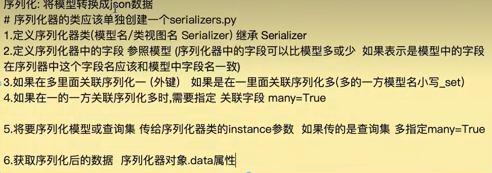
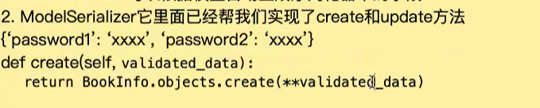

# serializers

## 写法

-   跟模型要写成一样名字的字段

~~~
from rest_framework import serializers

class BookInfoSerializers(serializers.Serializer):
    id = serializers.IntegerField(label='ID',read_only=True)
    btitle = serializers.CharField(max_length=20)
    bread = serializers.IntegerField(default=0)
    bcomment = serializers.IntegerField(default=0)
    is_delete = serializers.BooleanField(default=False)
    
~~~

## 参数

~~~
BookInfoSerializer(instance=None,data=empty)

传递给instance，形参表示要做序列化
返回一个serializer
拿数据
serializer.data 序列化后的数据

传递给data，形参表示要做反序列化
~~~

-   关联查询

直接添加他的序列化器

## 第三点

~~~
# models.py
class User(models.Model):
    username = models.CharField(max_length=50)

class Order(models.Model):
    user = models.ForeignKey(User, on_delete=models.CASCADE)
    amount = models.DecimalField(max_digits=10, decimal_places=2)
    

~~~

~~~
# serializers.py
class OrderSerializer(serializers.ModelSerializer):
    class Meta:
        model = Order
        fields = ['id', 'amount', 'user']  # 直接写 user 字段
        
order = Order.objects.first()
serializer = OrderSerializer(order)
print(serializer.data)
# 输出：
# {
#   "id": 1,
#   "amount": "100.00",
#   "user": {"id": 1, "username": "alice"}  # 自动嵌套了 User 的数据
# }
~~~

~~~
class UserSerializer(serializers.ModelSerializer):
    orders = serializers.SerializerMethodField()  # 或者直接用 order_set

    class Meta:
        model = User
        fields = ['id', 'username', 'orders']

    def get_orders(self, obj):
        return OrderSerializer(obj.order_set.all(), many=True).data
        
        
class UserSerializer(serializers.ModelSerializer):
    class Meta:
        model = User
        fields = ['id', 'username', 'order_set']  # 注意：这里叫 order_set
~~~

## 小技巧：自定义反向字段名

你可以通过 `related_name` 改变默认的 `_set` 名称：

~~~
class Order(models.Model):
    user = models.ForeignKey(User, on_delete=models.CASCADE, related_name='my_orders')
    
~~~

~~~
class UserSerializer(serializers.ModelSerializer):
    my_orders = serializers.SerializerMethodField()

    class Meta:
        model = User
        fields = ['id', 'username', 'my_orders']
~~~

-   ModelSerializers 可以根据模型给自动生成映射字段

~~~python
class Meta:
	model = model
	fields = "__all__"
~~~

-   ModelSerializer 实现了create和update

但是在例如注册这种逻辑不适合使用

把所有数据都存入数据库了，需要重写

`收到的数据会存到数据库，但是生成的字段存在模型不存在的字段就不要用`

## 校验validate_xx

~~~
    def validate_qq(self, value):
        """校验 QQ 是否已存在"""
        if User.objects.filter(username=value).exists():
            raise serializers.ValidationError("QQ号已注册")
        return value
~~~

## 创建create

~~~
    def create(self, validated_data):
        qq = validated_data['qq']
        password = validated_data['password']
        nickname = validated_data.get('nickname', '')

        # 创建 User
        user = User.objects.create_user(
            username=qq,
            password=password
        )
        # 创建 UserProfile
        UserProfile.objects.create(
            user=user,
            qq=qq,
            nickname=nickname
        )
        return user
~~~

## 更新uodate

~~~
    def update(self, instance, validated_data):
        """自定义更新方法，处理嵌套的 profile 字段"""
        # 提取 profile 相关数据
        profile_data = validated_data.pop('profile', {})
        
        # 更新 User 模型（如果有其他字段的话）
        for attr, value in validated_data.items():
            setattr(instance, attr, value)
        instance.save()
        
        # 更新 UserProfile 模型
        if profile_data:
            profile = instance.profile
            for attr, value in profile_data.items():
                setattr(profile, attr, value)
            profile.save()
        
        return instance
~~~

## 新加的字段直接写就可以

~~~
class pass(ModelSerializer):
	newfield = serializers.CharField()
	class Meta:
		fidels = '__all__'
~~~

## 修改选项参数

~~~
class pass(ModelSerializer):
	newfield = serializers.CharField()
	class Meta:
		fidels = '__all__'
		extra_kwargs = {
			''这里是字段前面加一个b
			'bread':{'min_value':0}
		}
~~~

# 示例

~~~
from rest_framework import serializers
from .models import MusicModels
from django.contrib.auth.models import User

class MusicSerializers(serializers.ModelSerializer):
    """音乐收藏序列化器"""
    username = serializers.CharField(source='user.username', read_only=True)  # 显示用户名
    
    class Meta:
        model = MusicModels
        fields = ['id', 'user', 'username', 'name', 'url', 'created_at']
        read_only_fields = ['id', 'created_at', 'username']
        extra_kwargs = {
            'user': {'write_only': True}  # 创建时需要user，但返回时不显示user的ID
        }

~~~

