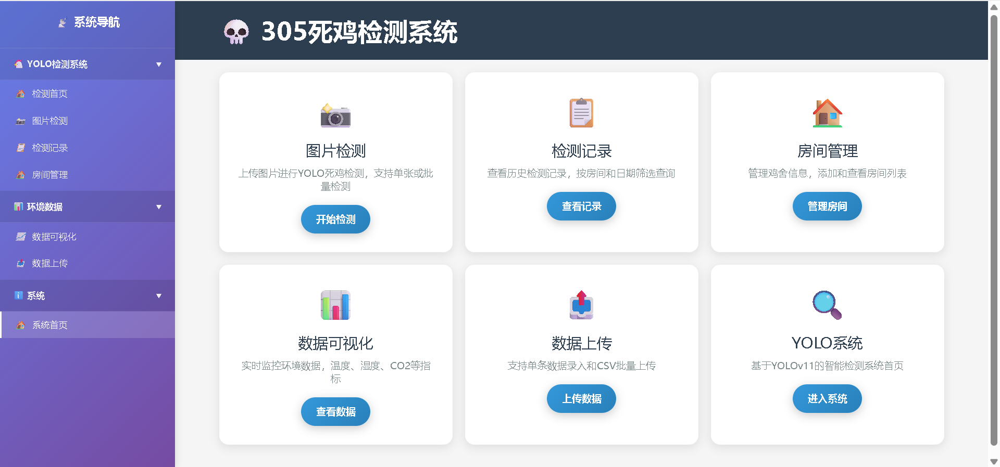
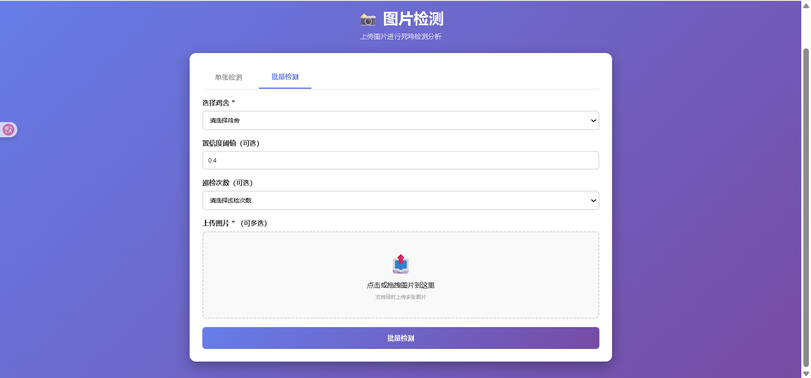
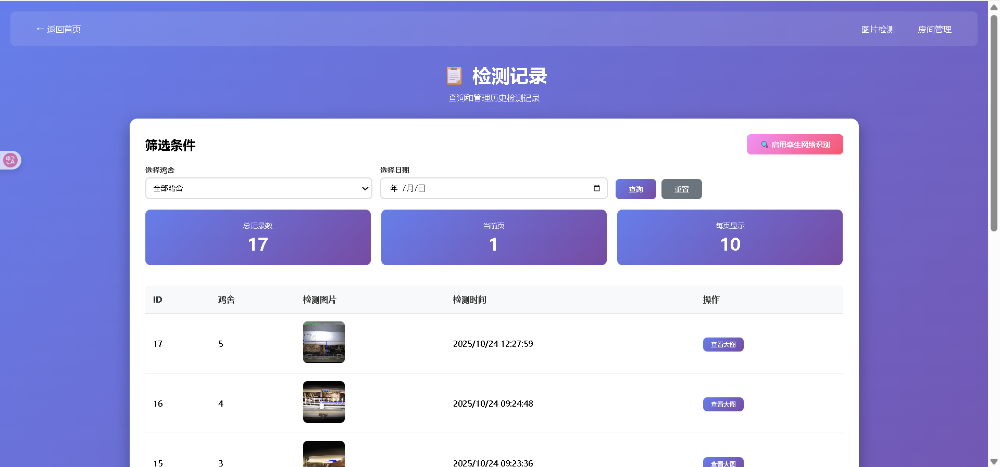
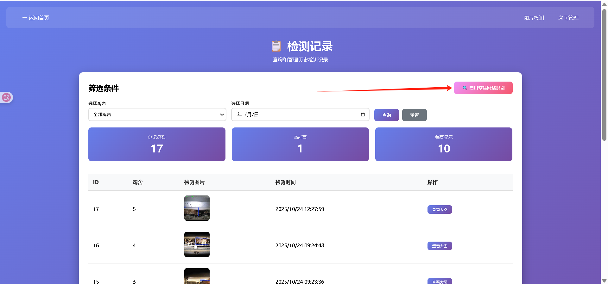
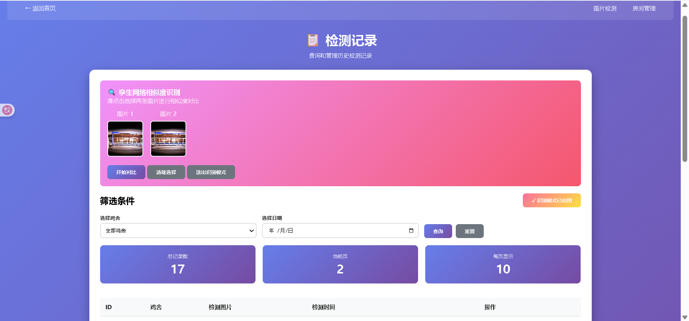
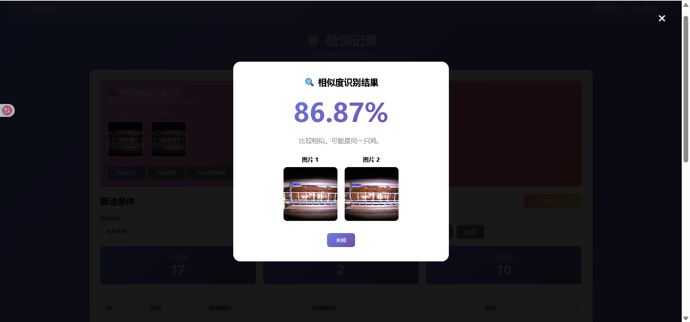
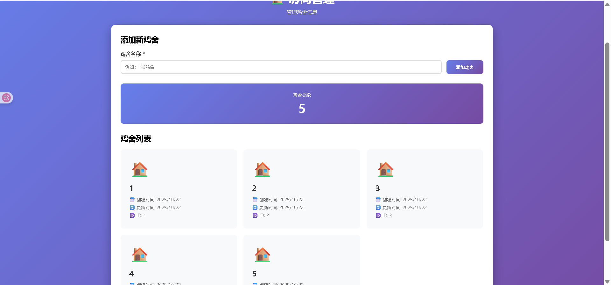
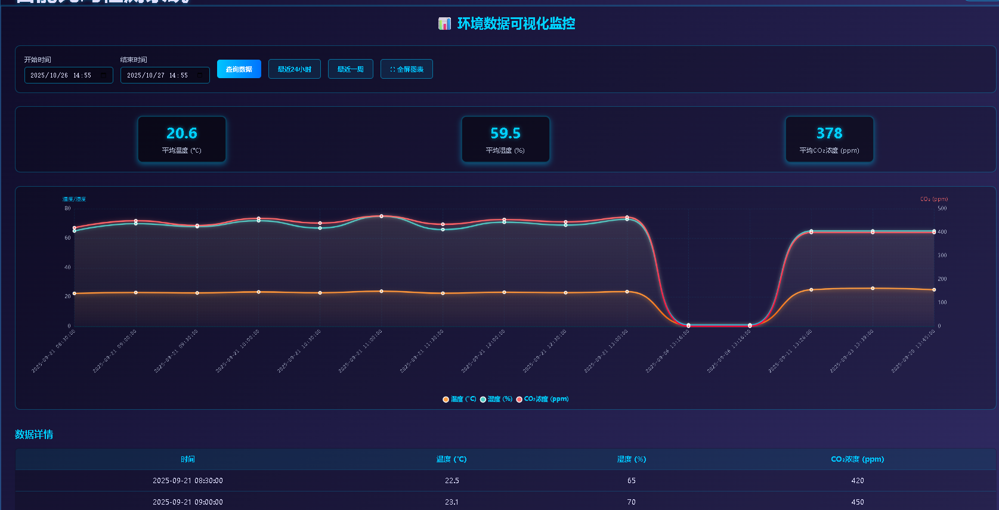
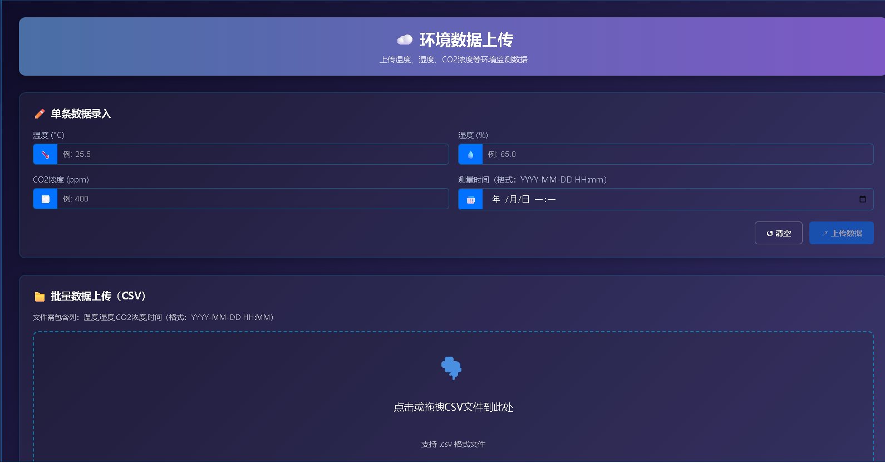

 ## 主界面

## 图片检测

-   点击开始检测
-   可选多张或单张由于暂时没有机器人直接传递的图像，所以目前使用批量检测替代一轮10张的图片拍摄流程和确定鸡笼数的逻辑

## 检测记录

-   选择鸡舍，时间，可以查看历史的检测记录，一页十张图片对应一次巡检中一个鸡笼的十张图片

## 孪生网络的对比

点击右上角启用孪生网络

点击想要的两张图片，点击开始对比，

检测完成

## 鸡舍的添加

目前逻辑使用手动添加

## 鸡舍环境监控

-   支持时间查询
-   支持温度、湿度、平均二氧化碳浓度查询

## 数据上传

-   支持单条数据导入
-   支持批量使用csv格式导入