# 北京工业
人工智能 22+机器学习 + 6
380
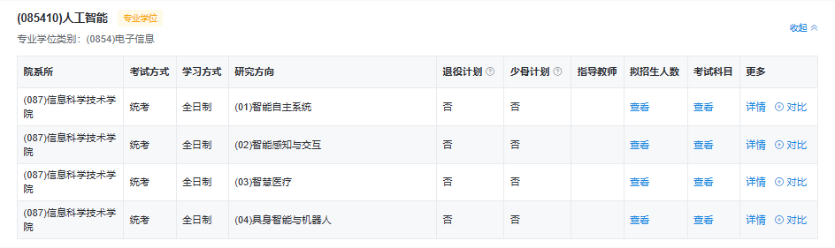
计算机22408  + 6
不用考虑
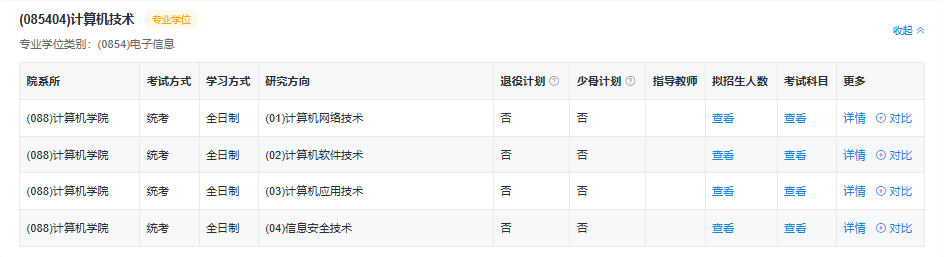

# 北方工业（非211）
人工智能22408 + 25
311
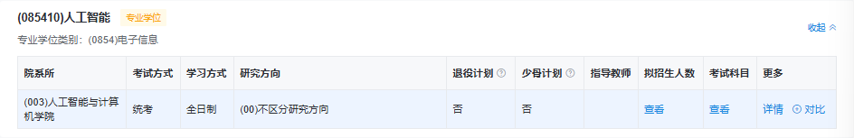
计算机 22408 + 86
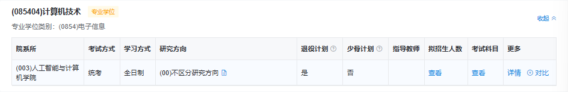
303
# 北京化工
计算机12408 + 15
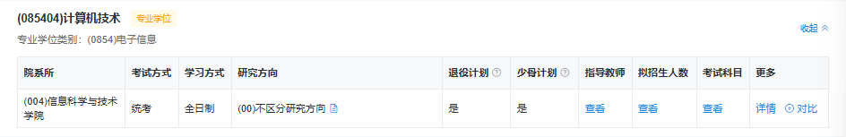

# 中国农业
计算机22408 + 29
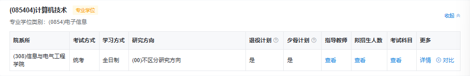

最低320，最高410
建议340
# 北京林业
22408 + 72*\3
360
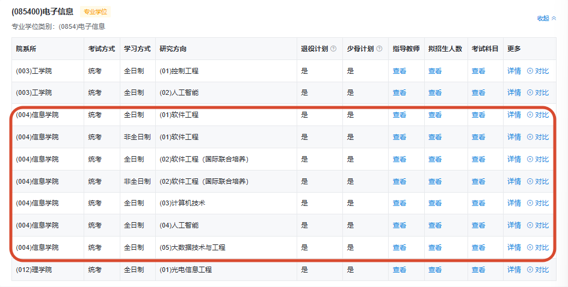

# 中石油
22408 + 18\*n
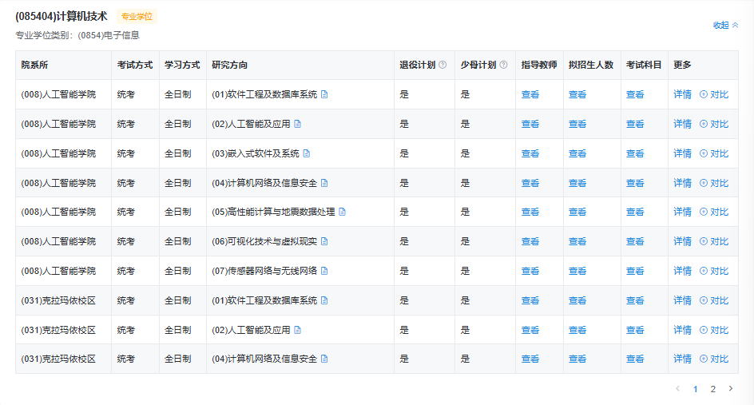
370

人工智能
22408 + 15\*n
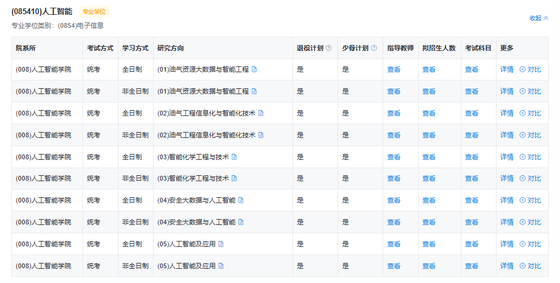
370

# 华北电力北京
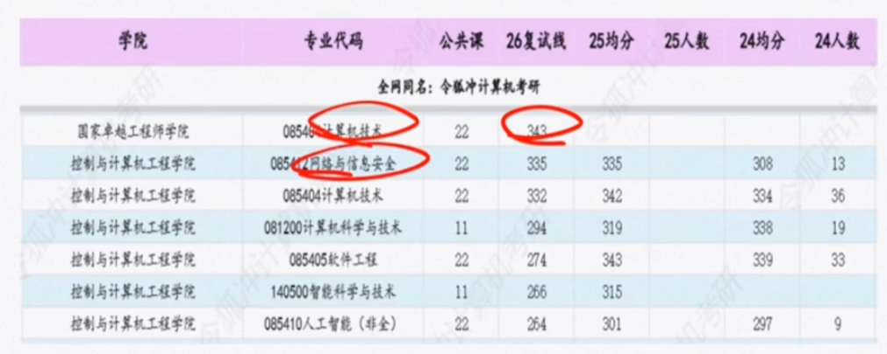

351
360
# 中国地质
22408 + 16
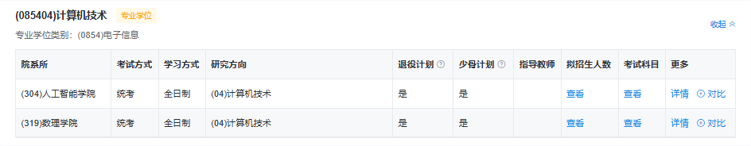
数理学院的计算机技术 323
人工智能学院计算机技术350
人工智能学院软件工程最高360，其他不到300

# 中科院
22408
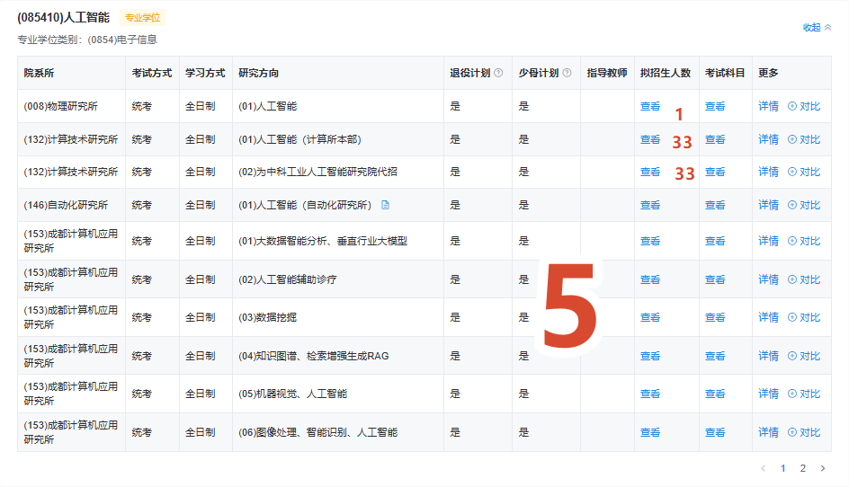

# 北京信息科技大学（非211）
人工智能22408（最后一个） + 8
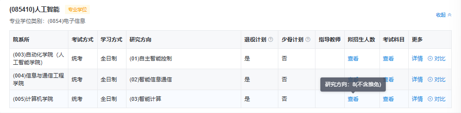
350
——
320

计算机
22408 + 87
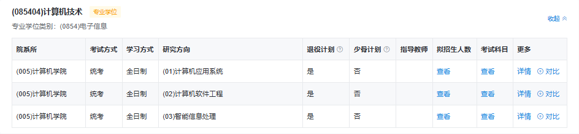
320

# 天津工业大学
22408 + 31
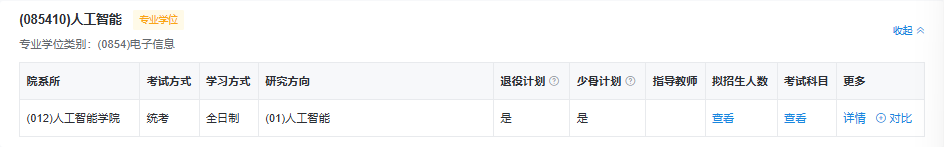
350

计算机
22408 + 76
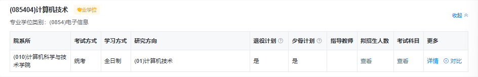
350

# 天津理工
22408 + 36
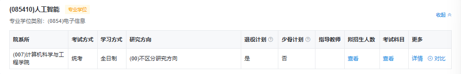
330

计算机
22408 + 96
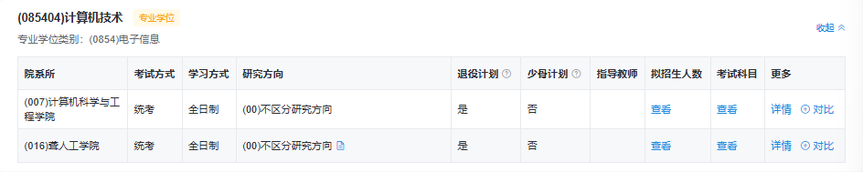
290
