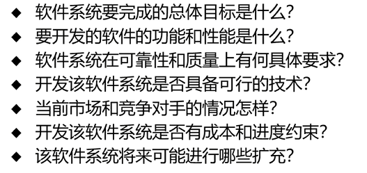

# 可行性分析
## 问题定义
软件定义的第一阶段
明确该软件开发项目要解决什么问题

# 需求分析
描述软件的功能和性能
确定约束和接口细节
**工作步骤**
1. 需求**获取**
2. 需求**分析**与建模
3. 编写需求规格**说明书**
4. 需求验证和**评审**

# 结构化分析模型
1. 数据字典（核心）
2. 功能模型：数据流图DFD  （数据在系统中如何被传送和变换）
3. 数据模型：实体联系图ERD（数据对象和数据对象之间的关系）
4. 行为模型：状态转换图STD （描述系统对外部事件响应）

**数据字典的作用**
描述了所有的在目标系统使用的生成的数据对象

**四大核心条目：**
- **数据项**：数据的最小单位，不能再分。（如：`学号`、`年龄`）
- **数据结构**：由多个数据项组合而成。（如：`学生信息 = 学号 + 姓名 + 年龄 + 专业`）
- **数据流**：数据在系统中的传输路径。
- **数据存储**：数据保存的地方（比如文件或数据库表）。

# 需求分析的成果
**需求规格说明书**
开发者和用户间事实上的技术合同书
开发者下一步设计和编码的基础
测试 验收目标系统的依据

**软件的生命周期的几个阶段**
1. 可行性研究：可行性研究报告
2. 需求分析：需求规格说明书
3. 概要设计：概要设计说明书
4. 详细设计：源代码
5. 编码和测试：测试计划 测试报告
6. 维护：维护文档