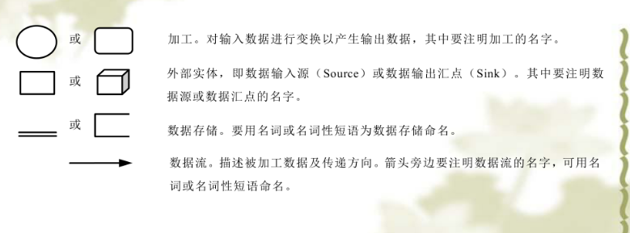
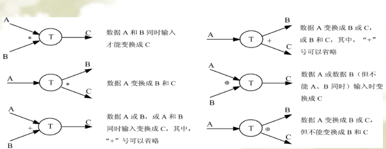
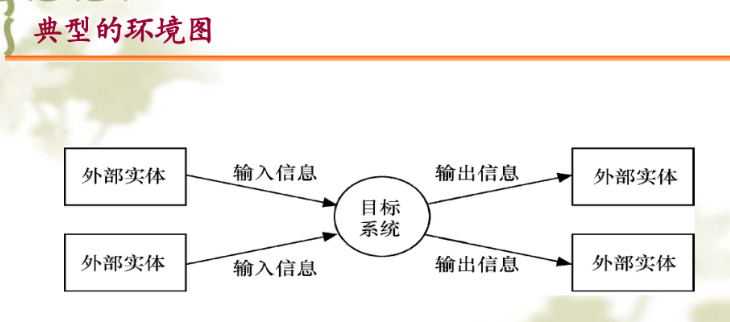
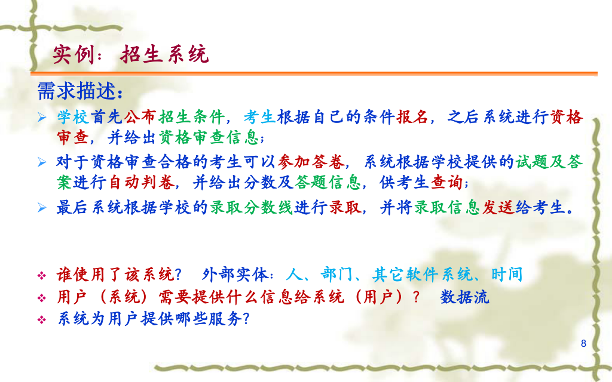
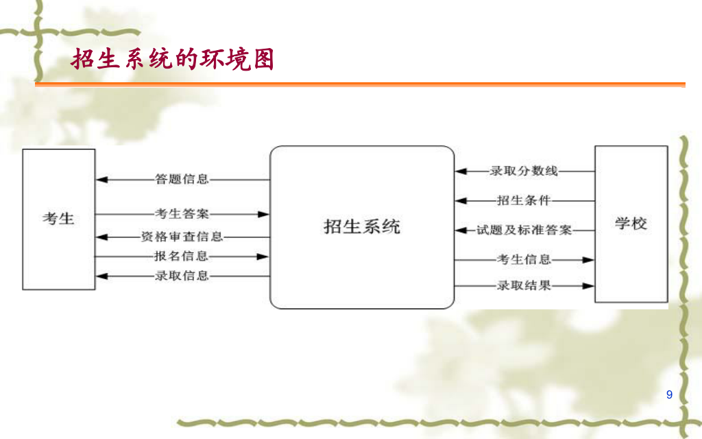

描述系统如何加工数据
描述数据如何流动
1. 实体 方块
2. 加工 圆圈
3. 数据流 ->
4. 数据存储文件 =

 ---
1. 实体到存储要有加工
2. 一个转换必须有流入和流出
3. 存储必须有数据流
4. 父子图数据流保持一致

# 环境图
顶层数据流图
0层数据流图

确定系统在环境中的位置，确定输入输出和外部实体的关系**确定其边界**

# 分层的数据流图
把大的系统拆分
几个功能就拆几个

1. 实体 $\rightarrow$ 实体 (❌ 绝对错误)
2. 实体 $\rightarrow$ 数据存储 (❌ 绝对错误)
3. 数据存储 $\rightarrow$ 实体 (❌ 绝对错误)
4. 数据存储 $\rightarrow$ 数据存储 (❌ 绝对错误)