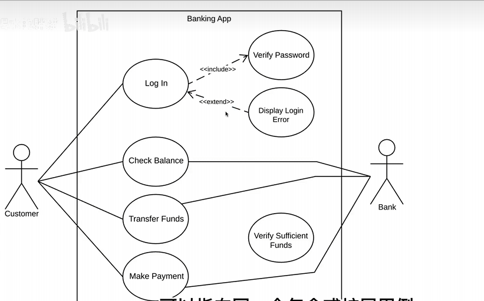
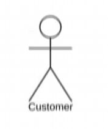
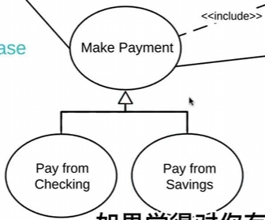
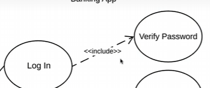
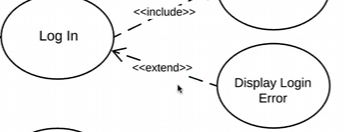

# 系统  
（矩形）
# 参与者
1. 主要参与者，画左边
2. 次要参与者，画右边
都是外围，不画在系统内部

# 用例
椭圆
发生在系统内部的动作
一个动词是一个动词

# 关系
每个参与者至少与一个用例有关
（连线）

1. 关联
2. 泛化
	1. （继承的形式）
	2. 有父用例的所有功能同时还有自己的新功能
	3. 
3. 包含（有箭头的虚线）
	1. 基本用例调用时包含用例也会执行
	2. **基本用例指向包含用例**
	3. 
4. 扩展
	1. 一个基本用例和一个扩展用例
	2. **扩展用例指向基本用例**
	3. 在调用基本用例时扩展用例有条件触发
	4. （输错密码）
	5. 
	6. 
