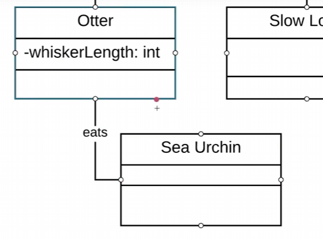
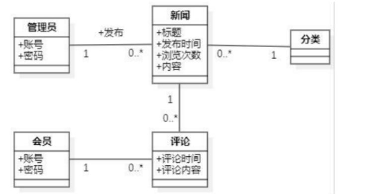

| 名字  | Animal                                |
| --- | ------------------------------------- |
| 字段  | -name:string  -id:int  -age:int |
| 方法  | -setName(var,var) -eat()           |
|     |                                       |
关联关系

**多重性**
一个 1
一个或多个 1..*
零多多 0..*

看远处的那个数字
一个管理员对应多个新闻
一个新闻对应一个管理员

