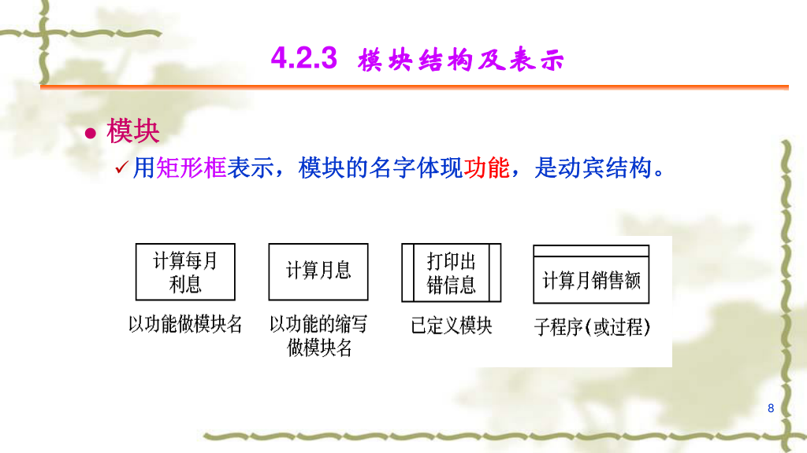
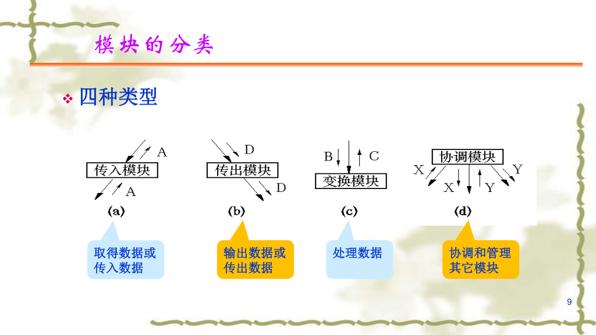
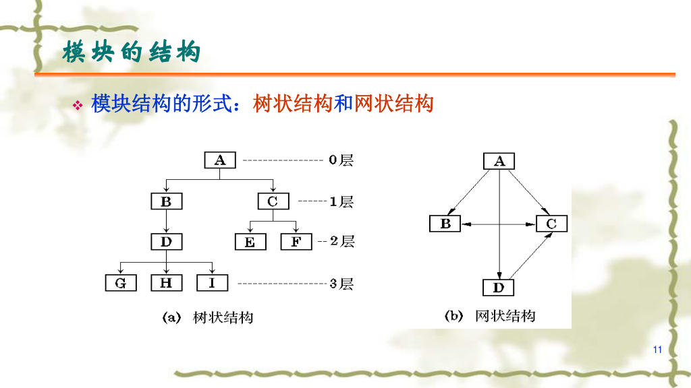
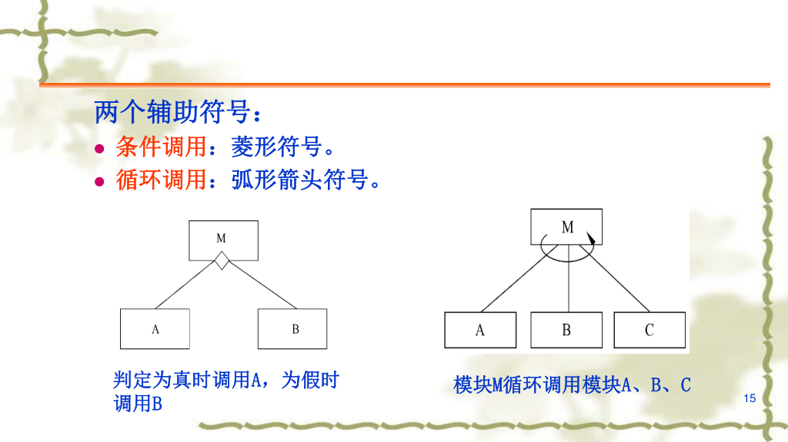
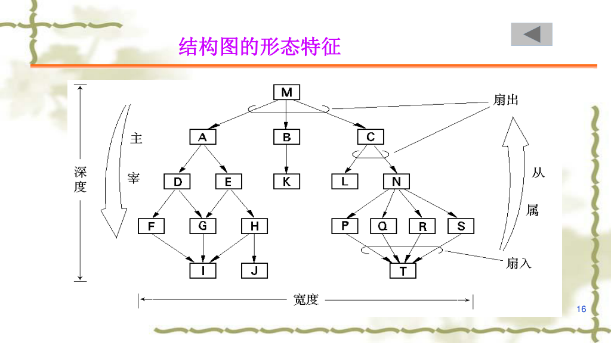

1. 模块  
2. 调用 -----
3. 数据信息的传送 
	1. 信息传送（空心）0---->
	2. 信息传送 + 控制(实心)   .----->

**数据流图转换为结构图**
最大的模块：...最大题干的系统名称
输入 + 处理 + 输出

- **DFD 是“业务视角”**：它关心的是“数据是怎么流动的”（像工厂的流水线），不管先后顺序，也不管谁指挥谁。
    
- **SC 是“代码/执行视角”**：它关心的是“程序模块是怎么组织的”、“谁调用谁”（像公司的组织架构），带有严格的控制逻辑。
所以，当我们把业务流水线转化为代码架构时，必然会有一些调整。下面帮你梳理一下，到底哪些东西“不见了”，以及它们变成了什么。
### 一、 DFD 中哪些东西在 SC 中“没有”了？

**1. 外部实体（方框）“消失”了**
- **原因**：外部实体（如用户、其他系统）属于你的软件边界**之外**的东西。SC 是用来指导程序员写代码的软件**内部**结构图。
- **变成了什么**：实体本身不画了，取而代之的是与该实体交互的**接口模块**。比如 DFD 里有一个“客户”输入数据，到了 SC 里，会变成一个叫“接收客户输入”的底层模块。
**2. 数据存储（双横线）“隐藏”了**
- **原因**：SC 中没有专门代表数据库或文件的图形。
- **变成了什么**：对数据的读写操作，变成了具体的**执行模块**。比如 DFD 里有一条流向“订单表”的箭头，到了 SC 里，会变成一个名为“保存订单记录”或“更新数据库”的方框模块。
**3. 数据流（箭头）“降级”了**
- **原因**：在 DFD 中，箭头是绝对的主角（数据流）。但在 SC 中，方框之间的长连线代表的是“模块调用关系”（上级命令下级干活）。
- **变成了什么**：原来的数据流，变成了 SC 调用连线旁边带**空心小圆圈的参数**。

### 二、 如何进行转换？（考试拿分核心）
把 DFD 映射为结构图，通常有两种经典套路。你只需要在 DFD 上找准“中心点”：
#### 套路 1：变换分析 (最常考)

这是最常见的情况，系统有明显的“输入 $\rightarrow$ 处理 $\rightarrow$ 输出”特征。

- **步骤 1：找边界**。在 DFD 上划两道虚线，把图切成三块：**物理输入流**（纯接收数据）、**变换中心**（系统的核心计算/逻辑处理部分）、**物理输出流**（纯展示/保存数据）。
    
- **步骤 2：建顶层**。画一个顶层的“主控模块”（比如叫“XX系统管理”）。
    
- **步骤 3：设高管**。在主控模块下，直接挂三个“部门经理”模块：“输入模块”、“变换处理模块”、“输出模块”。
    
- **步骤 4：分派基层**。把 DFD 两边的具体加工圆圈，顺藤摸瓜挂在对应的部门经理下面。
    

#### 套路 2：事务分析

这种情况类似代码里的 `switch-case`。系统接收一个输入，然后根据输入类型的不同，从多条路径中**选择一条**执行。比如 ATM 机，插卡后让你选“取款”、“存款”还是“查余额”。

- **转换方法**：画一个接收输入的模块，再画一个“事务调度模块”。调度模块下面并排挂接多个具体的“动作执行模块”。输入什么指令，调度模块就调用对应的底层动作。
    

很多时候，一道大题里会同时包含“变换型”和“事务型”（比如顶层是变换型，某个局部子模块是事务型）。

光看文字可能有点抽象，需要我直接拿一个具体的系统（比如“考生成绩统计系统”或者“银行提款操作”）的例子，带你从画 DFD 开始，一步步划线、切分，最后画出对应的结构图吗？

# 形态特征

扇入：入度
扇出：出度

