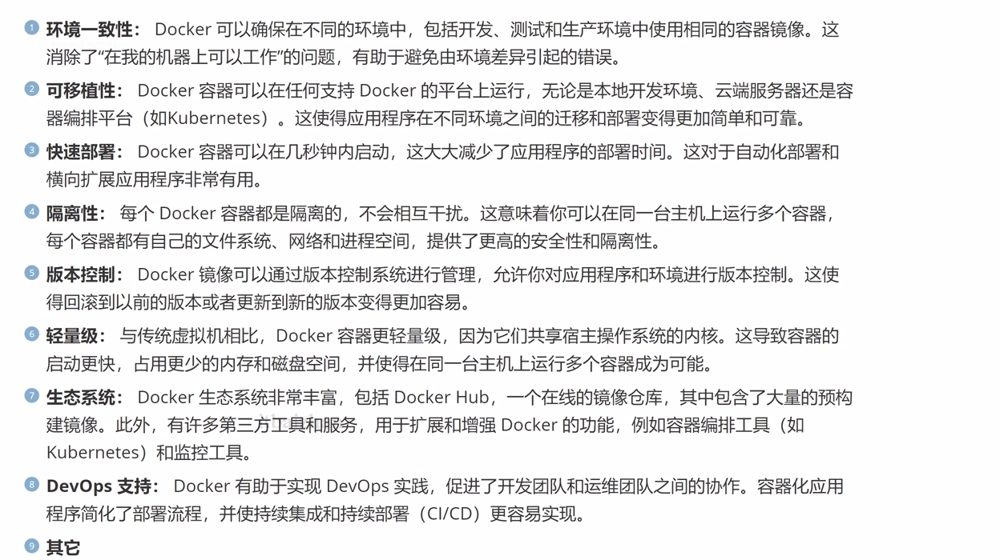

# 容器

- 构建：把需要的软件安装好配置好，打包到一个容器
- 运输：上传到制定服务器，需要的时候下载
- 运行：下载好惊喜那个文件，创建容器运行就可以了

**像一个外卖盒**

- 可以打包 运行环境，程序，软件

**优点**

- 环境一致性
- 可移植
- 快速部署
- 隔离
- 版本控制
- 轻量级
- 生态系统

# docker 镜像

- 一个软件包
- 来源
	- 阿里
	- docker file 自己创建

# 换源

- 搜阿里云镜像站
- 容器ACR
- 管理控制台
- 镜像工具
- 镜像加速器

~~~
vim /etc/docker/daemon.json
输入
复制内容
~~~

# 命令

~~~
docker
所有命令
docker image
~~~

 ## 镜像搜索

~~~
docker search 名字
~~~

## 镜像下载

~~~
docker pull 名字
~~~

## 查看镜像

~~~
docker image ls
docker image
~~~

## 重命名

~~~
docker tag [旧镜像名]:[旧版本号] [新镜像名]:[新版本号]
docker tag nginx:latest sxt-nginx:v1.0

~~~

## 导出

~~~
docker save -o mysql.tar mysql:8.0
	  保存  输出名称           版本
在当前ls
出现一个.tar
~~~

## 导入

~~~
docker load -i mysql.tar
~~~

## 删除

~~~
docker image rm mysql
docker rmi mysql
docker rmi 写他的IMAGE ID
~~~

## 查看容器

~~~
docker container ls
docker container ls --all
等价
docker ps 
docker ps -a
~~~

## 创建容器

~~~
docker create -i -t centos
			input
				伪终端

~~~

## 启动

~~~
docker start （name / id（写前四位就行））
>>>38e9
docker ps
开启了
~~~

## 创建+启动

~~~
docker run -it centos /bin/bash 
					以控制台交互
~~~

# 实例

- centos实例，创建小虚拟机

~~~
docker pull centos
docker images
docker -it centos /bin/bash
此时发现左边的换名字了，进入docker contain了
cd /opt
ls

exit 退出
~~~

## 三种创建方式

~~~
单单创建
docker create it 创建
docker container ls --all
docker start (ID)

创建+运行
docker run -it centos /bin/bash

创建守护模式，不会运行
docker run -itd centos /bin/bash
~~~

## 查看容器

~~~
docker ps
~~~

## 直接开启

~~~
docker start (ID)
~~~

## 停止

~~~
docker stop (ID)
~~~

## 进入到指定容器

~~~
docker exec -it (ID) /bin/bash
~~~

~~~
lucid_brattain
~~~

# 查看内存

~~~
df -h
~~~

