**WSL（Windows Subsystem for Linux）** 是微软开发的一项功能，允许你在 **Windows 系统上直接运行 Linux 环境**（包括命令行工具、实用程序和应用程序），而**无需使用传统虚拟机或双系统**。
#### 打开clash
[安装WSL2和Ubuntu教程](https://blog.csdn.net/Natsuago/article/details/145594631?spm=1001.2014.3001.5501)
#### 安装 WSL2
1. 以管理员身份启动PowerShell
2. 启用 Windows 子系统（WSL 1）功能（前端）
- WSL 2 依赖 WSL 1 的“基础架构”
```powershell
dism.exe /online /enable-feature /featurename:Microsoft-Windows-Subsystem-Linux /all /norestart
```
- **`dism.exe`**：Windows 的“部署映像服务和管理工具”，用于启用/禁用系统功能。
- **`/online`**：表示操作当前正在运行的 Windows 系统（而不是一个离线镜像）。
- **`/enable-feature`**：启用某个可选系统功能。
- **`/featurename:Microsoft-Windows-Subsystem-Linux`**：这是 WSL 1 的系统组件名称。
- **`/all`**：同时启用该功能的所有子功能（如果有）。
- **`/norestart`**：不自动重启电脑。
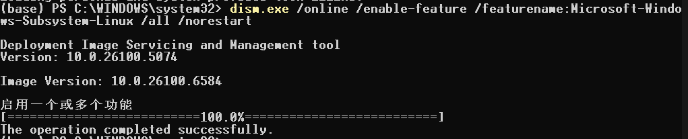
3. 启用虚拟机平台功能（后端）
- “虚拟机平台”是 WSL 2 正常运行所必需的核心组件之一。
- 虽然名字里有“虚拟机”，但它**不是 Hyper-V**，而是 Windows 提供的一个轻量级虚拟化底层接口（基于 **Hyper-V 技术**，但不需要开启完整的 Hyper-V 角色）。
```powershell
dism.exe /online /enable-feature /featurename:VirtualMachinePlatform /all /norestart
```
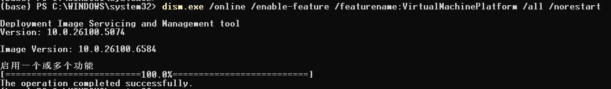
4. 将 WSL 默认版本设置为 WSL2（自动安装WSL 2）
```powershell
wsl --set-default-version 2
```
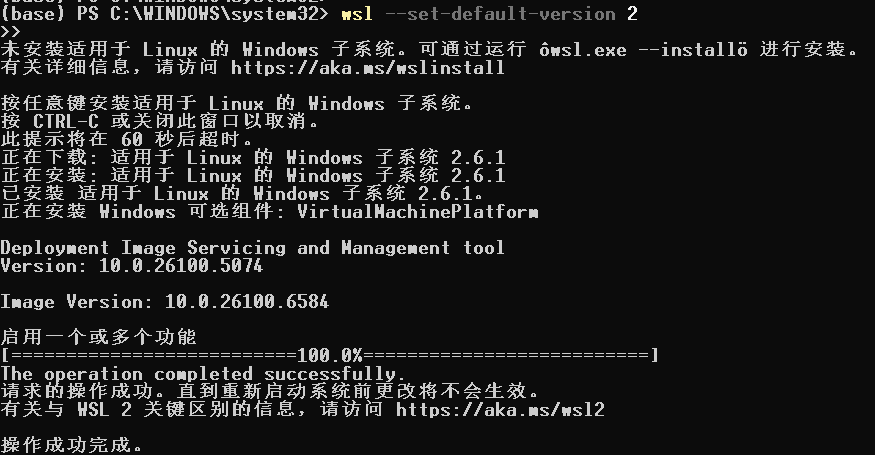
5. 重启电脑

appwiz.cpl
#### 安装Ubuntu
1. 启动PowerShell(可以不用管理员)
2. 查看可用的 WSL 发行版。
```powershell
wsl --list --online
```
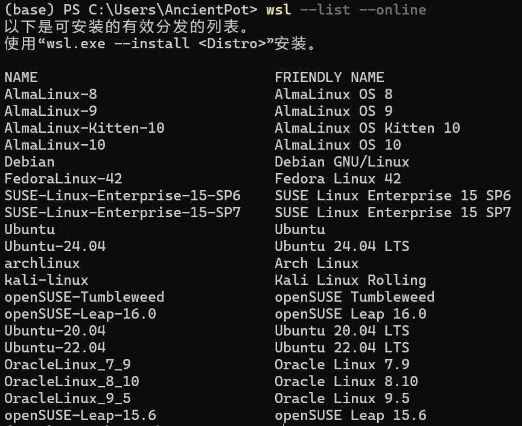
2. D盘创建文件夹存放Ubuntu
- 我的路径是`WSL/Ubuntu-24.04`。
3. 先安装Ubuntu-24.04到C盘。
```powershell
wsl --install -d Ubuntu-24.04
```
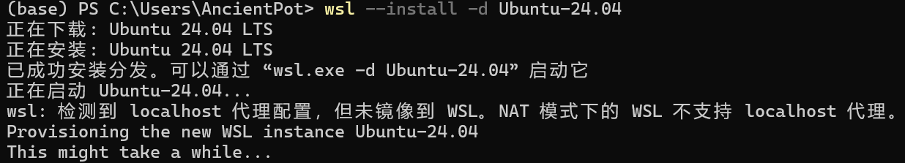
- 不用管这个警告，开clash导致的，没影响
```text
wsl: 检测到 localhost 代理配置，但未镜像到 WSL。NAT 模式下的 WSL 不支持 localhost 代理。
```
4. 按照提示输入用户名和密码即可
- 密码输入不会显示在命令行上。
- 显示下面画面按 `Ctrl + D` 退出即可。
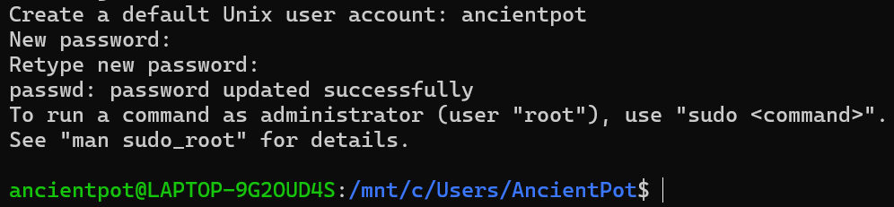
4. 将C盘的Ubuntu-24.04导出为tar文件放到D盘你创建的文件夹内。
```powershell
wsl --export Ubuntu-24.04 D:\WSL\Ubuntu-24.04\Ubuntu-24.04.tar
```
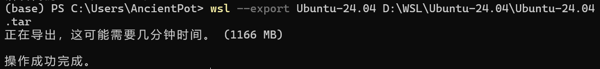
5. 删除C盘安装的Ubuntu-24.04。
```powershell
wsl --unregister Ubuntu-24.04
```
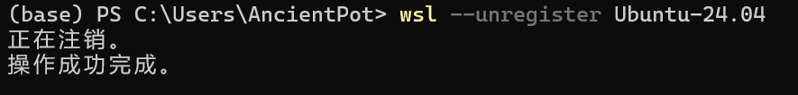
6. 从 tar 文件导入 Ubuntu-24.04 到 D 盘指定位置。
```powershell
wsl --import Ubuntu-24.04 D:\WSL\Ubuntu-24.04 D:\WSL\Ubuntu-24.04\Ubuntu-24.04.tar --version 2
```
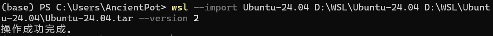
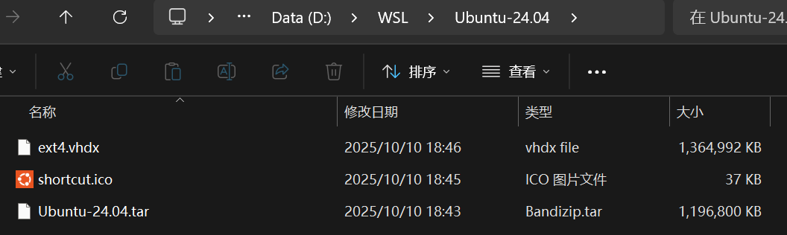
7. 用WSL2启动 Ubuntu-24.04
```powershell
wsl -d Ubuntu-24.04
```
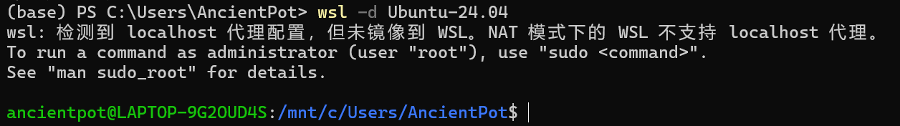
- 如果按照博客中方法二的手动下载 `.appx` 安装Ubuntu，则此时默认用户为root，需要自己手动创建新用户，赋予新用户 `sudo` 权限，修改默认登录用户为普通用户。（我用的方法一）
#### 安装Docker Desktop
[官网链接](https://www.docker.com/products/docker-desktop/)
[安装Docker教程(含汉化)](https://blog.csdn.net/Natsuago/article/details/145588600)
1. 官网下安装包
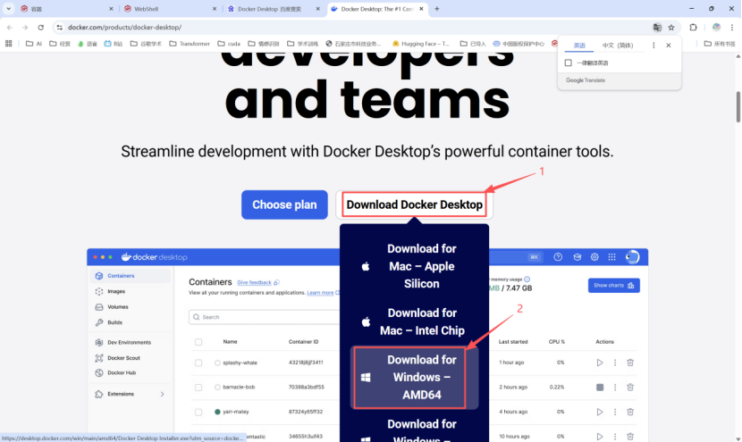
2. 在指定路径安装docker
```powershell
Start-Process 'D:\Docker\Docker_Desktop_Installer.exe' -Wait -ArgumentList 'install', '--installation-dir=D:\Docker\Docker'
```
3. 开始安装
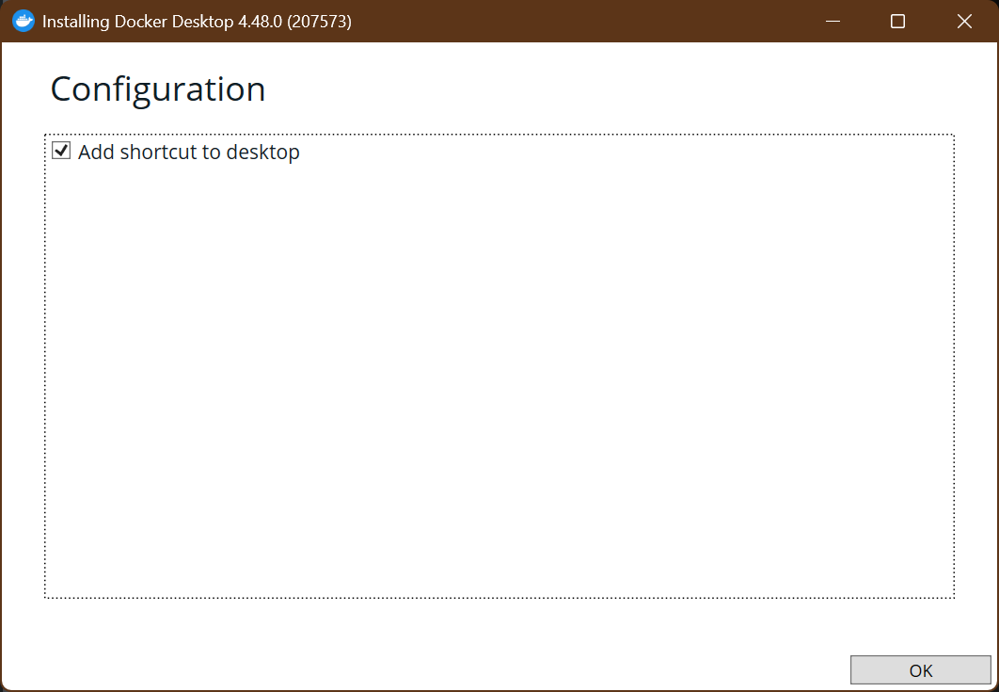
4. 完成安装，会注销重登一下
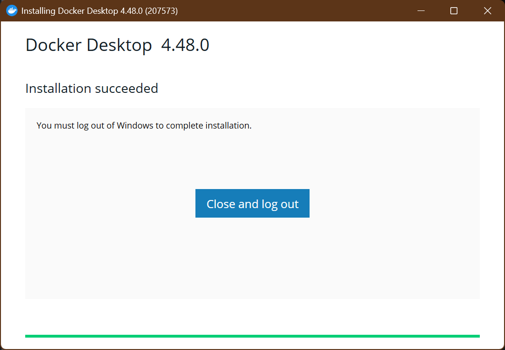
5. 启动docker，同意协议
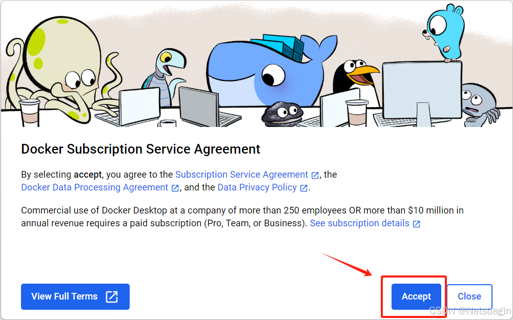
6. 登录github或google账号
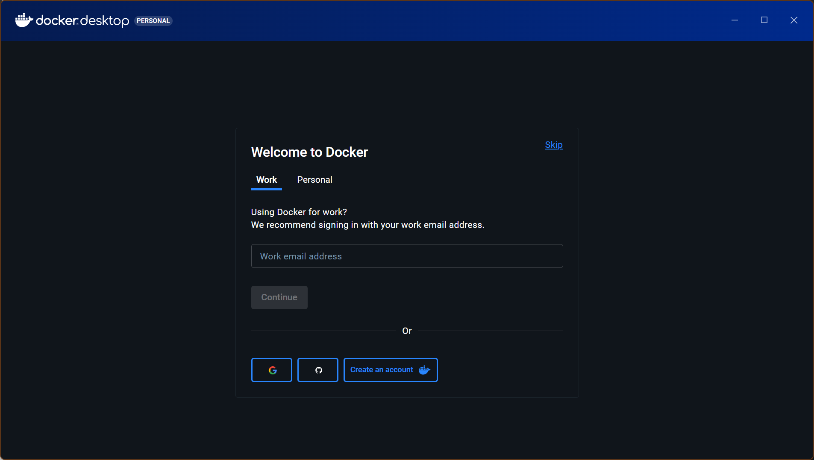
7. 完成安装
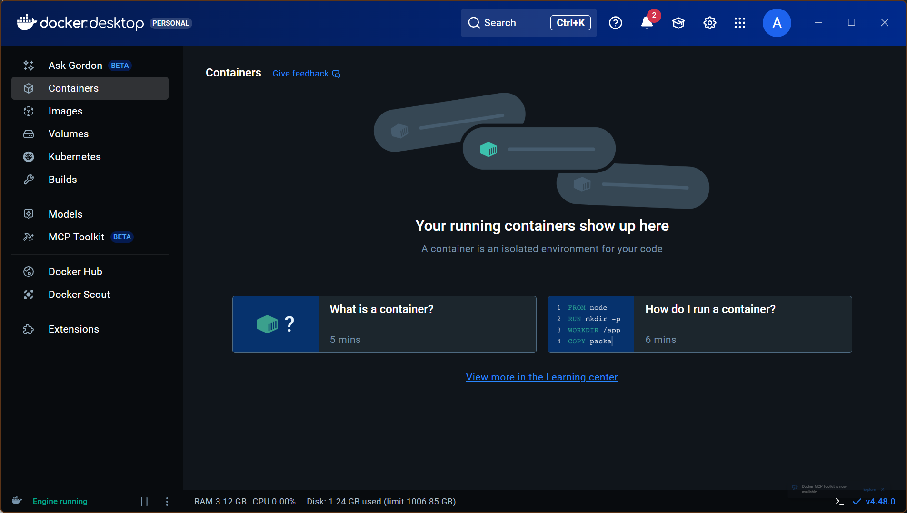
8. 设置拉取镜像的位置
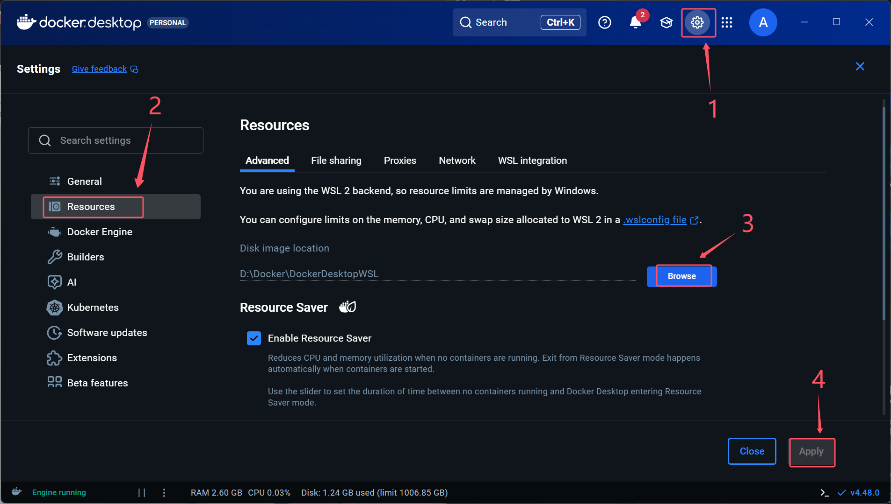
9. 我安装的版本太新了没汉化（悲）
[汉化DockerDesktop-CN](https://github.com/asxez/DockerDesktop-CN)
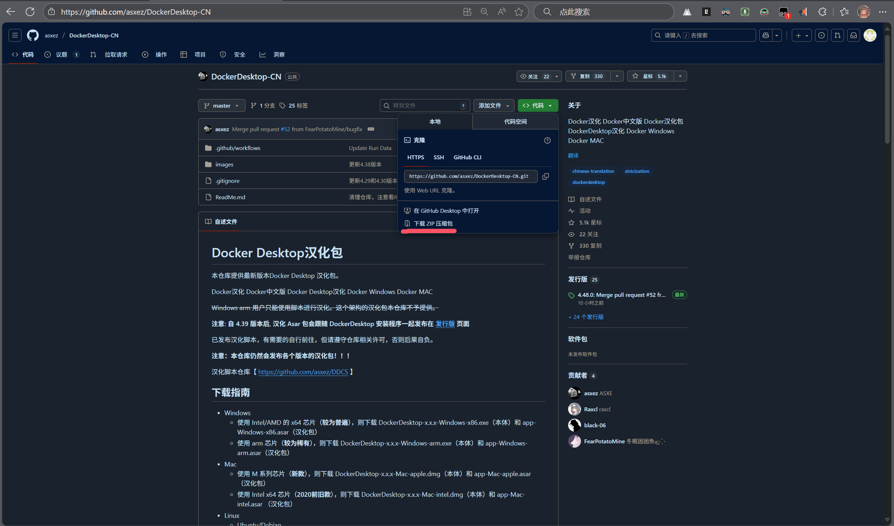


