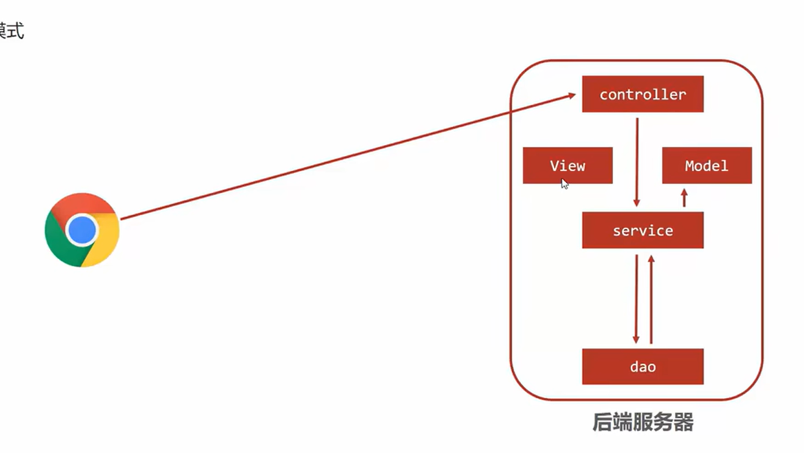
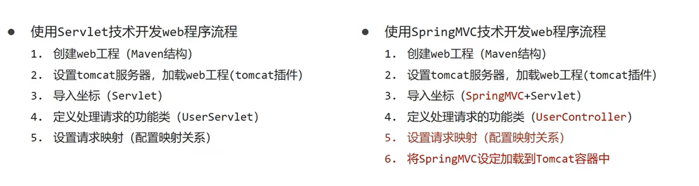
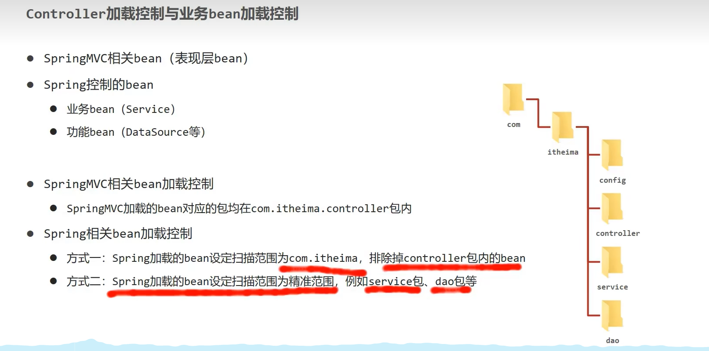

# SpringMVC

## 三层架构

- servlet （处理请求，但是不能进行数据处理）
	- web  页面数据的收集
	- service 业务处理
	- dao 数据持久化
	

**但是一个servlet只能处理一个请求** 

**那么就出现了MVC**

变成了

- controller
- view 
- model

可以在数据页面进行交互的形式 json

## mapping

- 映射 能被哪个路径访问到

~~~
<servlet>
    <servlet-name>demo1</servlet-name>
    <servlet-class>src.main.java.com.wawu.servlet.AopServlet.java</servlet-class>
  </servlet>
  
  <servlet-mapping>
    <servlet-name>demo1</servlet-name>
    <url-pattern>/demo1</url-pattern>
  </servlet-mapping>
~~~

## Controller 加载控制欲业务bean加载控制

