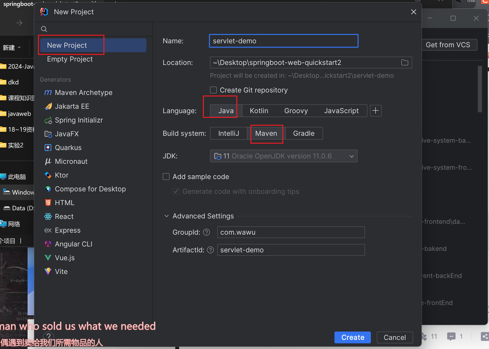
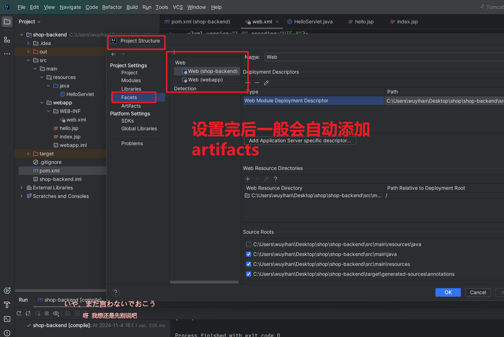
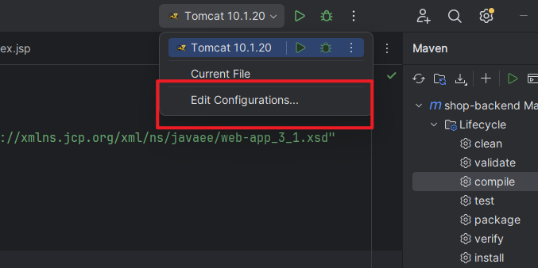
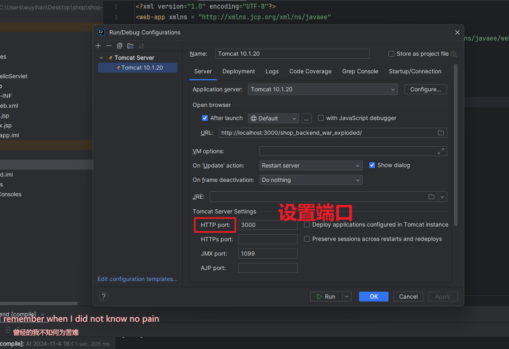
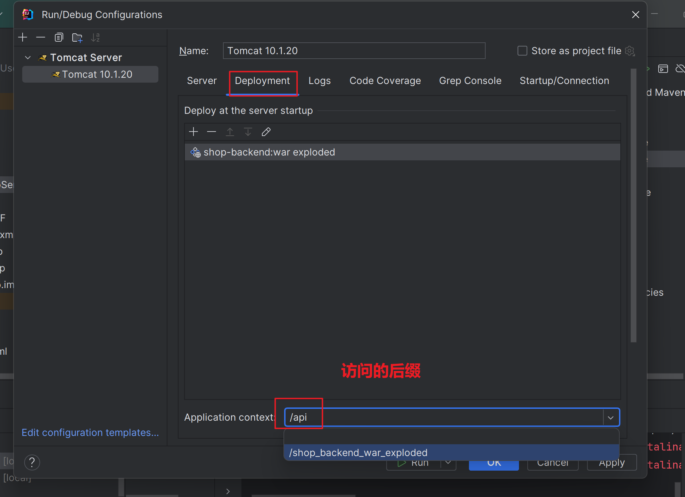
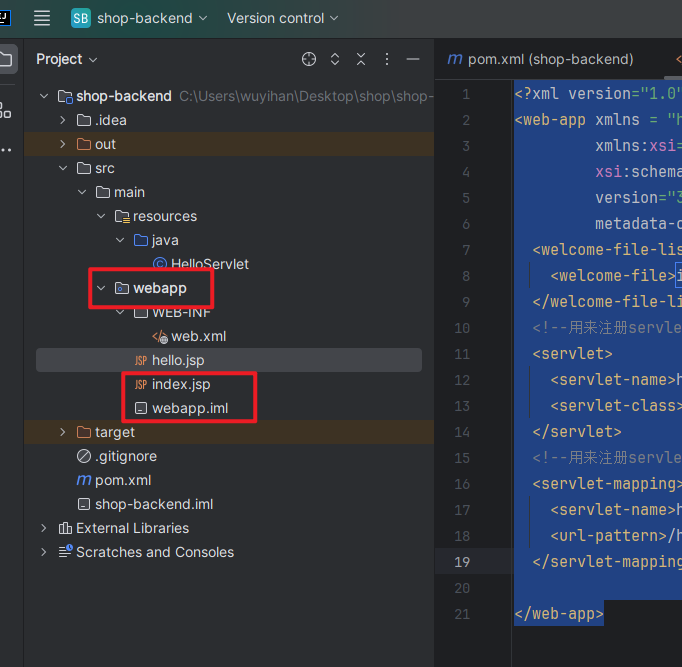
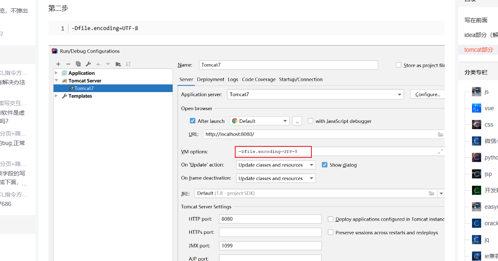
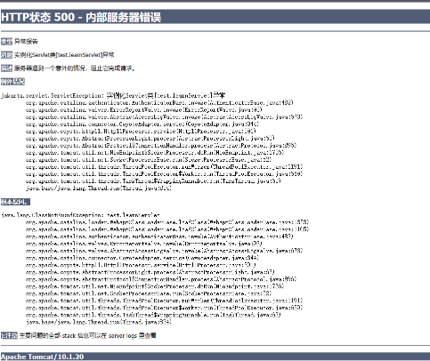
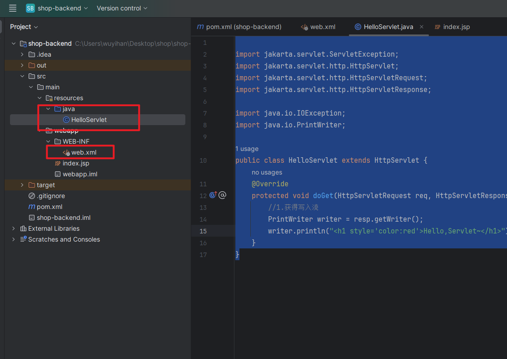
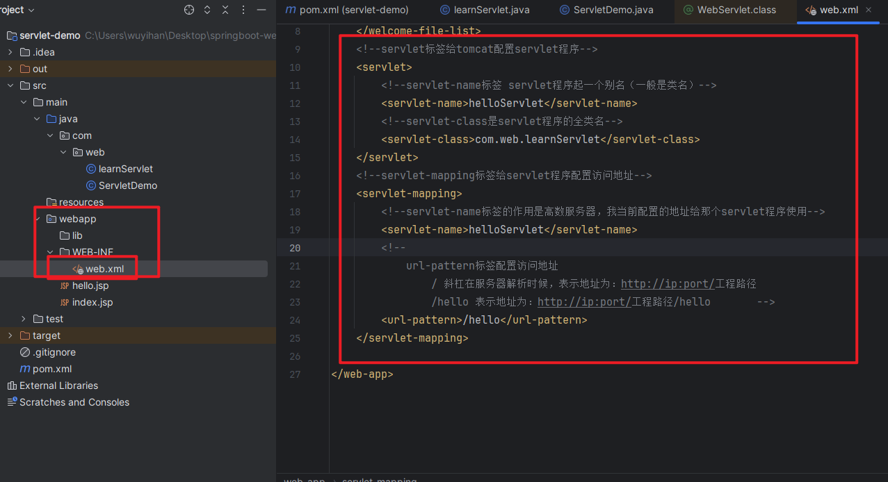

# 学习

> 入门：[8. Servlet入门 - 使用Maven创建javaweb工程、使用web.xml配置路径、使用注解方式配置路径-腾讯云开发者社区-腾讯云 (tencent.com)](https://cloud.tencent.com/developer/article/1934637)
>
> 这个有点看不懂，没看完：[JavaWeb——Servlet（全网最详细教程包括Servlet源码分析）-CSDN博客](https://blog.csdn.net/qq_19782019/article/details/80292110)
>
> 后面看看这个：[Servlet 实例 | 菜鸟教程 (runoob.com)](https://www.runoob.com/servlet/servlet-first-example.html)

# 初始化servlet项目

## 方法1：插件引入

> 主要参考这个：[8. Servlet入门 - 使用Maven创建javaweb工程、使用web.xml配置路径、使用注解方式配置路径-腾讯云开发者社区-腾讯云 (tencent.com)](https://cloud.tencent.com/developer/article/1934637)
>
> 好好看看这个写得挺好得
>
> > **注意下依赖问题**

新建java项目:



## 方法2：maven直接构建

> 

[在IDEA中完整实现一个servlet项目，并使用两种运行方式运行Servlet项目，超详细步骤一_idea怎么运行servlet-CSDN博客](https://blog.csdn.net/weixin_49100631/article/details/126430949)

> **这个感觉方便点，参照这里来**
>
> 但是就是有一点，idea中有自带的tomcat，用那个就行
>
> 注意下面的bug

下面步骤没有验证不确定，影不影响

> - 还是依赖的问题：
>
>   ```xml
>   <dependencies>
>       <dependency>
>         <groupId>junit</groupId>
>         <artifactId>junit</artifactId>
>         <version>3.8.1</version>
>         <scope>test</scope>
>       </dependency>
>       <!--不引入这个依赖会有冲突-->
>       <dependency>
>         <groupId>jakarta.servlet</groupId>
>         <artifactId>jakarta.servlet-api</artifactId>
>         <version>5.0.0</version>
>         <scope>provided</scope>
>       </dependency>
>       <dependency>
>         <groupId>jakarta.servlet.jsp</groupId>
>         <artifactId>jakarta.servlet.jsp-api</artifactId>
>         <version>3.0.0</version>
>       </dependency>
>     </dependencies>
>   ```
>
>   > 不要用javax
>
> - 还有一个就是utf-8的问题，看下面


### ==自己来==

> 最下面有项目结构图

> 这里大部分先按着方法2来的

1. idea设置

   

2. tomcat设置：

   > 没有的话，添加就行

   

   

   > 下面这个可能也是要加的

   

3. maven的pom文件注意引入下

   > 这里将版本锁定在java11

   ```xml
   <project xmlns="http://maven.apache.org/POM/4.0.0" xmlns:xsi="http://www.w3.org/2001/XMLSchema-instance"
     xsi:schemaLocation="http://maven.apache.org/POM/4.0.0 http://maven.apache.org/maven-v4_0_0.xsd">
     <modelVersion>4.0.0</modelVersion>
     <groupId>com.ruanxie</groupId>
     <artifactId>shop-backend</artifactId>
     <packaging>war</packaging>
     <version>1.0-SNAPSHOT</version>
     <name>shop-backend Maven Webapp</name>
     <url>http://maven.apache.org</url>
     <dependencies>
       <dependency>
         <groupId>junit</groupId>
         <artifactId>junit</artifactId>
         <version>3.8.1</version>
         <scope>test</scope>
       </dependency>
       <!--不引入这个依赖会有冲突-->
       <dependency>
         <groupId>jakarta.servlet</groupId>
         <artifactId>jakarta.servlet-api</artifactId>
         <version>5.0.0</version>
         <scope>provided</scope>
       </dependency>
       <dependency>
         <groupId>jakarta.servlet.jsp</groupId>
         <artifactId>jakarta.servlet.jsp-api</artifactId>
         <version>3.0.0</version>
       </dependency>
     </dependencies>
     <build>
       <finalName>shop-backend</finalName>
       <plugins>
         <plugin>
           <groupId>org.apache.maven.plugins</groupId>
           <artifactId>maven-compiler-plugin</artifactId>
           <version>3.8.1</version> <!-- 确保版本支持 Java 11 -->
           <configuration>
             <source>11</source>
             <target>11</target>
           </configuration>
         </plugin>
       </plugins>
     </build>
   </project>
   
   ```

4. web.xml配置

   ```xml
   <?xml version="1.0" encoding="UTF-8"?>
   <web-app xmlns = "http://xmlns.jcp.org/xml/ns/javaee"
            xmlns:xsi="http://www.w3.org/2001/XMLSchema-instance"
            xsi:schemaLocation="http://xmlns.jcp.org/xml/ns/javaee http://xmlns.jcp.org/xml/ns/javaee/web-app_3_1.xsd"
            version="3.1"
            metadata-complete="false">
     <welcome-file-list>
       <welcome-file>index.jsp</welcome-file>
     </welcome-file-list>
     <!--用来注册servlet接口的实现类的-->
     <servlet>
       <servlet-name>hello</servlet-name>
       <servlet-class>HelloServlet</servlet-class>
     </servlet>
     <!--用来注册servlet的接口-->
     <servlet-mapping>
       <servlet-name>hello</servlet-name>
       <url-pattern>/hello</url-pattern>
     </servlet-mapping>
   
   </web-app>
   ```

   > **注意下需要扫描注解**

   > 这段代码是一个标准的 `web.xml` 文件，它用于在 Java Web 项目中配置和定义一些重要的 Web 应用程序参数。`web.xml` 是部署描述符文件，它位于 `WEB-INF` 目录下，用于定义和配置 Web 应用的各种组件，比如 servlets、filters 和 listeners。下面是对各部分的详细解析。
   >
   > ### XML Header
   >
   > ```xml
   > <?xml version="1.0" encoding="UTF-8"?>
   > ```
   > - 定义了 XML 文件的版本（1.0）和字符编码格式（UTF-8）。
   >
   > ### 根元素 `<web-app>`
   > ```xml
   > <web-app xmlns="http://xmlns.jcp.org/xml/ns/javaee"
   > 	xmlns:xsi="http://www.w3.org/2001/XMLSchema-instance"
   > 	xsi:schemaLocation="http://xmlns.jcp.org/xml/ns/javaee http://xmlns.jcp.org/xml/ns/javaee/web-app_4_0.xsd"
   > 	version="4.0">
   > ```
   > - **`xmlns`**：命名空间定义，用于标识 Java EE 应用程序所用的 XML 元素的格式。
   > - **`xsi:schemaLocation`**：定义了 XML Schema 文件的路径，用于验证 XML 文件的结构，确保 XML 文件符合 Java EE 规范。
   > - **`version="4.0"`**：声明该 `web.xml` 文件遵循 Servlet 4.0 规范，这是 Java EE 8 的一部分。
   >
   > ### `<welcome-file-list>`
   > ```xml
   > <welcome-file-list>
   > 	<welcome-file>hello.jsp</welcome-file>
   > </welcome-file-list>
   > ```
   > - 用于指定应用程序的欢迎页面，即当用户访问应用程序的根路径时将自动显示的页面。
   > - **`<welcome-file>`** 指定了欢迎页面的文件名，这里是 `hello.jsp`，因此访问应用根路径（如 `http://localhost:8080/yourapp`）时，将默认加载 `hello.jsp`。
   >
   > ### `<servlet>`
   > ```xml
   > <servlet>
   > 	<servlet-name>helloServlet</servlet-name>
   > 	<servlet-class>com.web.learnServlet</servlet-class>
   > </servlet>
   > ```
   > - **`<servlet>`** 标签定义了一个 Servlet，Servlet 是 Java Web 应用中处理客户端请求的 Java 类。
   > - **`<servlet-name>`**：为该 Servlet 设置一个名称，这里是 `helloServlet`。这是为了在 `<servlet-mapping>` 中引用。
   > - **`<servlet-class>`**：指定了 Servlet 的完整类名，即类的包路径。此类需要实现 `javax.servlet.Servlet` 接口或扩展 `HttpServlet` 类。这里的类是 `com.web.learnServlet`，表示在 `com.web` 包下有一个名为 `learnServlet` 的类。
   >
   > ### `<servlet-mapping>`
   > ```xml
   > <servlet-mapping>
   > 	<servlet-name>helloServlet</servlet-name>
   > 	<url-pattern>/hello</url-pattern>
   > </servlet-mapping>
   > ```
   > - **`<servlet-mapping>`**：定义了该 Servlet 的访问路径（URL 映射），用于指定用户通过何种 URL 访问该 Servlet。
   > - **`<servlet-name>`**：与上面定义的 `<servlet-name>` 一致，用于关联这个 URL 映射和 Servlet 类。
   > - **`<url-pattern>`**：定义该 Servlet 的访问路径，指定用户通过何种路径访问该 Servlet。在这里是 `/hello`，表示用户可以通过 `http://localhost:8080/yourapp/hello` 访问 `helloServlet`。

5. 随便接口：

   > 这是使用配置文件的方法设置了接口的访问路径了

   ```java
   
   import jakarta.servlet.ServletException;
   import jakarta.servlet.http.HttpServlet;
   import jakarta.servlet.http.HttpServletRequest;
   import jakarta.servlet.http.HttpServletResponse;
   
   import java.io.IOException;
   import java.io.PrintWriter;
   
   public class HelloServlet extends HttpServlet {
       @Override
       protected void doGet(HttpServletRequest req, HttpServletResponse resp) throws ServletException, IOException {
           //1.获得写入流
           PrintWriter writer = resp.getWriter();
           writer.println("<h1 style='color:red'>Hello,Servlet~</h1>");
       }
   }
   ```

6. 搞个欢迎界面：
   
   > index.jsp
   
   ```
   <html>
   <body>
   <h2>welcom to shop-backend</h2>
   </body>
   </html>
   
   ```




最终大概是这个样子


###### 注意看下设置上下文

## bug

### idea爆出Can‘t find catalina.jar

[idea报错Can‘t find catalina.jar解决方法_can't find catalina.jar-CSDN博客](https://blog.csdn.net/weixin_43896829/article/details/115522619)


### 控制台出现乱码

[idea tomcat的server输出乱码以及控制台输出乱码，log乱码。终于解决了！_econding=utf-8-CSDN博客](https://blog.csdn.net/qq_38188047/article/details/111031987)




```
-Dfile.encoding=UTF-8
```


### 访问时：`jakarta.servlet.ServletException: 实例化Servlet类[test.learnServlet]异常`

> 哇靠，服啦这个搞了巨久，这个是依赖的问题



[Tomcat 10 调用Servlet提示 500 实例化Servlet类异常 - 理想还很年轻 - 博客园 (cnblogs.com)](https://www.cnblogs.com/Oysen/p/17005626.html)


### java版本锁定（maven中）

```xml
<project xmlns="http://maven.apache.org/POM/4.0.0" xmlns:xsi="http://www.w3.org/2001/XMLSchema-instance"
  xsi:schemaLocation="http://maven.apache.org/POM/4.0.0 http://maven.apache.org/maven-v4_0_0.xsd">
  <modelVersion>4.0.0</modelVersion>
  <groupId>com.ruanxie</groupId>
  <artifactId>shop-backend</artifactId>
  <packaging>war</packaging>
  <version>1.0-SNAPSHOT</version>
  <name>shop-backend Maven Webapp</name>
  <url>http://maven.apache.org</url>
  <dependencies>
    <dependency>
      <groupId>junit</groupId>
      <artifactId>junit</artifactId>
      <version>3.8.1</version>
      <scope>test</scope>
    </dependency>
    <!--不引入这个依赖会有冲突-->
    <dependency>
      <groupId>jakarta.servlet</groupId>
      <artifactId>jakarta.servlet-api</artifactId>
      <version>5.0.0</version>
      <scope>provided</scope>
    </dependency>
    <dependency>
      <groupId>jakarta.servlet.jsp</groupId>
      <artifactId>jakarta.servlet.jsp-api</artifactId>
      <version>3.0.0</version>
    </dependency>
  </dependencies>
  <build>
    <finalName>shop-backend</finalName>
    <plugins>
      <plugin>
        <groupId>org.apache.maven.plugins</groupId>
        <artifactId>maven-compiler-plugin</artifactId>
        <version>3.8.1</version> <!-- 确保版本支持 Java 11 -->
        <configuration>
          <source>11</source>
          <target>11</target>
        </configuration>
      </plugin>
    </plugins>
  </build>
</project>

```

> gpt:
> 要将 Maven 项目锁定为 Java 11，可以在 `pom.xml` 文件中添加 `maven-compiler-plugin` 插件，并将 `source` 和 `target` 设置为 `11`。在 `<build>` 部分中更新如下：
>
> ```xml
> <build>
> <finalName>shop-backend</finalName>
> <plugins>
>  <plugin>
>    <groupId>org.apache.maven.plugins</groupId>
>    <artifactId>maven-compiler-plugin</artifactId>
>    <version>3.8.1</version> <!-- 确保版本支持 Java 11 -->
>    <configuration>
>      <source>11</source>
>      <target>11</target>
>    </configuration>
>  </plugin>
> </plugins>
> </build>
> ```
>
> 这样配置后，Maven 会在编译时使用 Java 11，确保与 Java 11 的兼容性。


## 日志爆红

控制台爆出：

```
SLF4J: Failed to load class "org.slf4j.impl.StaticLoggerBinder".
SLF4J: Defaulting to no-operation (NOP) logger implementation
SLF4J: See http://www.slf4j.org/codes.html#StaticLoggerBinder for further details.
```


原因：

这个信息来自 SLF4J 日志框架，表明没有找到日志实现库，导致使用了默认的“无操作” (`NOP`) 日志实现。这意味着尽管你的代码可能使用了 SLF4J，但实际运行时不会有任何日志输出。

SLF4J 作为一个抽象日志框架需要具体的日志实现库来实际记录日志，例如：

- Logback
- Log4j
- Log4j2
- java.util.logging

如果没有这些库，SLF4J 就会回退为 `NOP`，即不输出任何日志。


> GPT解决：
>
> Log4j2 的配置文件 `log4j2.xml` 控制日志的输出格式、级别和目标。在你的配置文件中，配置了一个简单的控制台输出。以下是对各部分的解释：
>
> ```xml
> <?xml version="1.0" encoding="UTF-8"?>
> <Configuration status="INFO">
>     <!-- 定义日志输出的位置 -->
>     <Appenders>
>         <!-- 定义一个控制台输出的 Appender -->
>         <Console name="Console" target="SYSTEM_OUT">
>             <!-- PatternLayout 格式化日志输出样式 -->
>             <PatternLayout pattern="%d{HH:mm:ss.SSS} [%t] %-5level %logger{36} - %msg%n"/>
>         </Console>
>     </Appenders>
>     
>     <!-- 定义日志记录器 -->
>     <Loggers>
>         <!-- 定义根日志记录器，输出到控制台，日志级别为 info -->
>         <Root level="info">
>             <AppenderRef ref="Console"/>
>         </Root>
>     </Loggers>
> </Configuration>
> ```
>
> #### 各个部分详解
>
> 1. **`<Configuration>` 元素**  
>    - `status="INFO"`：配置 Log4j2 本身的内部日志级别。如果 Log4j2 在启动过程中遇到问题，可以使用 `DEBUG` 或 `ERROR` 来输出更详细的日志信息。通常用于调试配置问题，生产环境中不需要关注。
>
> 2. **`<Appenders>` 元素**  
>    Appender 定义日志的输出位置。可以是控制台、文件、数据库等。这里定义了一个 `Console` Appender，将日志输出到控制台。
>    
>    - **`<Console name="Console" target="SYSTEM_OUT">`**  
>      这是一个控制台输出的 Appender。
>      - `name="Console"`：给这个 Appender 一个名称，可以用于在其他地方引用。
>      - `target="SYSTEM_OUT"`：指定将日志输出到 `System.out`（即标准输出流）。你也可以使用 `SYSTEM_ERR`，将日志输出到标准错误流。
>    
>    - **`<PatternLayout>`**  
>      定义日志的输出格式。`PatternLayout` 支持高度自定义的日志格式，这里用了一些通用的格式化符号：
>      - `%d{HH:mm:ss.SSS}`：表示日志输出的时间，格式为小时、分钟、秒和毫秒。
>      - `[%t]`：当前线程的名称，便于区分多线程环境下的日志。
>      - `%-5level`：日志级别，例如 `INFO`、`ERROR`，占5个字符的宽度，左对齐。
>      - `%logger{36}`：日志记录器的名称，最多显示 36 个字符。通常为当前类的全限定名（如 `com.example.MyApp`）。
>      - `%msg`：日志的消息内容。
>      - `%n`：换行符。
>
>    示例输出样式如下：
>    ```
>    12:34:56.789 [main] INFO  com.example.MyApp - This is an info message
>    ```
>
> 3. **`<Loggers>` 元素**  
>    定义日志记录器 (Logger)，可以指定输出的日志级别和关联的 Appender。
>    
>    - **`<Root>`**  
>      根日志记录器。所有的日志都会经过根日志记录器处理。可以为其设置默认的日志级别，影响所有 Logger 的默认行为。
>      - `level="info"`：将根日志记录器的级别设置为 `INFO`，表示低于 `INFO` 级别的日志（如 `DEBUG`）将被忽略。
>      - `<AppenderRef ref="Console"/>`：将根日志记录器的输出指向 `Console` Appender，也就是控制台输出。
>
> #### 日志级别说明
> - Log4j2 中常用的日志级别包括 `TRACE`、`DEBUG`、`INFO`、`WARN`、`ERROR`、`FATAL`。级别由低到高，低级别会输出更多详细信息，较高级别主要用于记录错误和严重事件。

# 快速上手servlet

> 这里我肯定是要仿照了springMVC那一套了


## 处理请求

> [ServletRequest 和 HttpServletRequest 接口详解-CSDN博客](https://blog.csdn.net/swadian2008/article/details/122863987)
>
> > 大概看看就行，找需要的方法

### 通过配置文件：



- 在这里配置访问的地址



```xml
<?xml version="1.0" encoding="UTF-8"?>
<web-app xmlns="http://xmlns.jcp.org/xml/ns/javaee"
	xmlns:xsi="http://www.w3.org/2001/XMLSchema-instance"
	xsi:schemaLocation="http://xmlns.jcp.org/xml/ns/javaee http://xmlns.jcp.org/xml/ns/javaee/web-app_4_0.xsd"
	version="4.0">
	<welcome-file-list>
		<welcome-file>hello.jsp</welcome-file>
	</welcome-file-list>
	<!--servlet标签给tomcat配置servlet程序-->
	<servlet>
		<!--servlet-name标签 servlet程序起一个别名（一般是类名）-->
		<servlet-name>helloServlet</servlet-name>
		<!--servlet-class是servlet程序的全类名-->
		<servlet-class>com.web.learnServlet</servlet-class>
	</servlet>
	<!--servlet-mapping标签给servlet程序配置访问地址-->
	<servlet-mapping>
		<!--servlet-name标签的作用是高数服务器，我当前配置的地址给那个servlet程序使用-->
		<servlet-name>helloServlet</servlet-name>
		<!--
			url-pattern标签配置访问地址
				/ 斜杠在服务器解析时候，表示地址为：http://ip:port/工程路径
				/hello 表示地址为：http://ip:port/工程路径/hello		-->
		<url-pattern>/hello</url-pattern>
	</servlet-mapping>

</web-app>
```

- 实现下这个类

  > 覆盖父类就行

  ```java
  
  import jakarta.servlet.ServletException;
  import jakarta.servlet.http.HttpServlet;
  import jakarta.servlet.http.HttpServletRequest;
  import jakarta.servlet.http.HttpServletResponse;
  
  import java.io.IOException;
  import java.io.PrintWriter;
  
  public class HelloServlet extends HttpServlet {
      @Override
      protected void doGet(HttpServletRequest req, HttpServletResponse resp) throws ServletException, IOException {
          //1.获得写入流
          PrintWriter writer = resp.getWriter();
          writer.println("<h1 style='color:red'>Hello,Servlet~</h1>");
      }
  }
  ```

  > 这里能够覆盖各种请求方式，包括delete、put

  

### 注解配置（==用这个==）

  

  

  > gpt:
  >
  > 在只使用 Servlet 而不使用 Spring 的情况下，无法使用 Spring MVC 提供的注解映射方式，但可以手动实现类似的注解映射功能。这需要你编写一些额外的代码来处理请求映射并模拟 Spring MVC 的行为。
  >
  > 不过，如果目标只是减少在 `web.xml` 中的配置，Servlet 3.0 开始也支持注解配置。例如，Servlet 提供了 `@WebServlet` 注解来简化映射配置。
  >
  > ### 使用 `@WebServlet` 注解来配置 Servlet
  > 在 Servlet 3.0 环境中，可以使用 `@WebServlet` 注解代替 `web.xml` 中的 `<servlet>` 和 `<servlet-mapping>` 标签来指定 URL 路径和 Servlet 类。
  >
  > #### 示例
  > 以下是一个简单的例子，展示了如何用 `@WebServlet` 注解直接在 Servlet 类中配置 URL 映射：
  >
  > ```java
  > import javax.servlet.ServletException;
  > import javax.servlet.annotation.WebServlet;
  > import javax.servlet.http.HttpServlet;
  > import javax.servlet.http.HttpServletRequest;
  > import javax.servlet.http.HttpServletResponse;
  > import java.io.IOException;
  > 
  > @WebServlet("/hello") // 配置映射路径为 /hello
  > public class HelloServlet extends HttpServlet {
  > 
  >     @Override
  >     protected void doGet(HttpServletRequest request, HttpServletResponse response) 
  >             throws ServletException, IOException {
  >         response.setContentType("text/html");
  >         response.getWriter().println("<h1>Hello, Servlet!</h1>");
  >     }
  > }
  > ```
  >
  > #### 说明
  > - `@WebServlet("/hello")`：指定该 Servlet 的 URL 映射路径为 `/hello`，相当于在 `web.xml` 中配置 `<servlet-mapping>`。
  > - `doGet()` 方法：在接收到 GET 请求时触发，用于处理请求并返回响应。
  >
  > ### 注意事项
  > - **自动扫描**：Tomcat 等支持 Servlet 3.0 的容器会自动扫描带有 `@WebServlet` 注解的类并注册它们。
  > - **避免重复配置**：使用注解时，不需要再在 `web.xml` 中进行配置，否则可能导致冲突。
  >
  > ### 扩展
  > 如果你的项目需要处理多个路径，可以在 `@WebServlet` 中指定多个 URL 模式：
  >
  > ```java
  > @WebServlet(urlPatterns = {"/hello", "/greet"})
  > ```
  >
  > 这种方式可以让 Servlet 更简洁地处理多个请求，而无需使用 Spring MVC 的完整框架。

  

  > gpt:发送请求响应（json格式）
  >
  > 可以通过标准的 Servlet 编程实现请求和响应的处理（类似 Spring 的 Controller）。Servlet 本身支持处理请求和返回响应数据，因此可以手动构建请求处理逻辑并生成 JSON 响应。
  >
  > 以下是如何使用 Servlet 实现简单的请求响应：
  >
  > 1. **配置 Servlet 接收请求**：通过 `@WebServlet` 配置 URL 路径。
  > 2. **读取请求参数**：在 `doGet()` 或 `doPost()` 方法中读取 `HttpServletRequest` 中的参数。
  > 3. **构建 JSON 响应**：通过 `HttpServletResponse` 返回 JSON 格式数据。
  >
  > ### 示例代码
  > 以下代码展示了一个使用 Servlet 的简单请求响应实现，处理传入的参数并返回 JSON 格式的响应：
  >
  > ```java
  > import javax.servlet.ServletException;
  > import javax.servlet.annotation.WebServlet;
  > import javax.servlet.http.HttpServlet;
  > import javax.servlet.http.HttpServletRequest;
  > import javax.servlet.http.HttpServletResponse;
  > import java.io.IOException;
  > import java.io.PrintWriter;
  > import org.json.JSONObject;
  > 
  > @WebServlet("/api/hello") // 配置请求路径
  > public class HelloServlet extends HttpServlet {
  > 
  >     @Override
  >     protected void doGet(HttpServletRequest request, HttpServletResponse response) 
  >             throws ServletException, IOException {
  >         // 设置响应内容类型为JSON
  >         response.setContentType("application/json");
  >         response.setCharacterEncoding("UTF-8");
  > 
  >         // 获取请求参数
  >         String name = request.getParameter("name");
  > 
  >         // 构建 JSON 响应
  >         JSONObject jsonResponse = new JSONObject();
  >         if (name != null && !name.isEmpty()) {
  >             jsonResponse.put("message", "Hello, " + name + "!");
  >         } else {
  >             jsonResponse.put("message", "Hello, World!");
  >         }
  > 
  >         // 写入响应
  >         PrintWriter out = response.getWriter();
  >         out.print(jsonResponse.toString());
  >         out.flush();
  >     }
  > 
  >     @Override
  >     protected void doPost(HttpServletRequest request, HttpServletResponse response) 
  >             throws ServletException, IOException {
  >         // 处理POST请求，逻辑与GET类似
  >         doGet(request, response);
  >     }
  > }
  > ```
  >
  > ### 说明
  > - **请求参数**：通过 `request.getParameter("name")` 获取 URL 中的 `name` 参数，类似于 `?name=Tom`。
  > - **JSON 响应**：使用 `org.json.JSONObject` 构建 JSON 对象，并通过 `toString()` 转换为 JSON 字符串。
  > - **响应内容类型**：设置 `response.setContentType("application/json")` 表示返回 JSON 数据。
  >
  > ### 部署和测试
  > 启动服务器后，通过浏览器或 Postman 测试请求：
  >
  > - GET 请求：`http://localhost:8080/api/hello?name=Tom`，应返回 `{ "message": "Hello, Tom!" }`
  > - 无参数请求：`http://localhost:8080/api/hello`，应返回 `{ "message": "Hello, World!" }`
  >
  > ### 使用场景
  > 这种方式在不使用 Spring MVC 的情况下可以实现基础的 API 接口，适合用于小型项目或学习 Servlet 基础。
  >
  > > 换成fastjson:[FASTJSON 2.0介绍 | fastjson2](https://alibaba.github.io/fastjson2/)
  > >
  > > - 配置文件中加一下
  > >
  > > - 加下这一句：
  > >
  > >   ```
  > >   // 构建 JSON 响应
  > >           JSONObject jsonResponse=new JSONObject();
  > >           if (name != null && !name.isEmpty()) {
  > >               jsonResponse.put("message", "Hello, " + name + "!");
  > >           } else {
  > >               jsonResponse.put("message", "Hello, World!");
  > >           }
  > >   ```

#### bug:

##### 出现404


  [@WebServlet注解无效访问servlet报404_注解servlet不能访问-CSDN博客](https://blog.csdn.net/ko0491/article/details/106939166)


  

-   版本3.0以上
- metadata-complete是否为false:才会扫描注解


#### 尝试类似springMVC

> [(3 封私信) Servlet和spring boot 有关系吗？ - 知乎](https://www.zhihu.com/question/481830573)

> 就是这个你会发现就是一个路径只能对应一个类，这样搞处理类真的会特别多

> 好像都挺麻烦的，还是一个路径对应一个类吧

> gpt:(但是感觉还是不太行)
>
> 在传统的 Servlet 开发中，如果你觉得使用 `HttpServlet` 和路径处理的方式有些冗余，你可以考虑使用一些设计模式来优化你的代码结构，增加可读性和可维护性。以下是几种可以应用的设计模式和思路：
>
> ### 1. **策略模式**
>
> 你可以使用策略模式将不同的请求处理逻辑分离到不同的类中。创建一个请求处理器接口和多个实现类，每个实现类负责处理特定的请求路径。
>
> #### 示例代码
>
> ```
> java复制代码package test;
> 
> import com.alibaba.fastjson.JSONObject;
> import jakarta.servlet.ServletException;
> import jakarta.servlet.annotation.WebServlet;
> import jakarta.servlet.http.HttpServlet;
> import jakarta.servlet.http.HttpServletRequest;
> import jakarta.servlet.http.HttpServletResponse;
> 
> import java.io.IOException;
> import java.io.PrintWriter;
> import java.util.HashMap;
> import java.util.Map;
> 
> @WebServlet("/api/*")
> public class TestWebServlet extends HttpServlet {
> 
>     private final Map<String, RequestHandler> handlers = new HashMap<>();
> 
>     @Override
>     public void init() throws ServletException {
>         // 注册不同的请求处理器
>         handlers.put("/hello", new HelloHandler());
>         handlers.put("/goodbye", new GoodbyeHandler());
>     }
> 
>     @Override
>     protected void doGet(HttpServletRequest request, HttpServletResponse response) throws ServletException, IOException {
>         // 设置响应内容类型为JSON
>         response.setContentType("application/json");
>         response.setCharacterEncoding("UTF-8");
> 
>         String pathInfo = request.getPathInfo();
>         RequestHandler handler = handlers.get(pathInfo);
>         
>         JSONObject jsonResponse = new JSONObject();
>         
>         if (handler != null) {
>             jsonResponse = handler.handle(request);
>         } else {
>             jsonResponse.put("error", "Invalid path");
>         }
> 
>         // 写入响应
>         PrintWriter out = response.getWriter();
>         out.print(jsonResponse.toString());
>         out.flush();
>     }
> }
> 
> // 请求处理器接口
> interface RequestHandler {
>     JSONObject handle(HttpServletRequest request);
> }
> 
> // 处理 hello 请求
> class HelloHandler implements RequestHandler {
>     @Override
>     public JSONObject handle(HttpServletRequest request) {
>         JSONObject jsonResponse = new JSONObject();
>         String name = request.getParameter("name");
>         jsonResponse.put("message", name != null ? "Hello, " + name + "!" : "Hello, World!");
>         return jsonResponse;
>     }
> }
> 
> // 处理 goodbye 请求
> class GoodbyeHandler implements RequestHandler {
>     @Override
>     public JSONObject handle(HttpServletRequest request) {
>         JSONObject jsonResponse = new JSONObject();
>         jsonResponse.put("message", "Goodbye!");
>         return jsonResponse;
>     }
> }
> ```
>
> ### 2. **工厂模式**
>
> 如果你的处理逻辑比较复杂，可以使用工厂模式来创建请求处理器。这种方式使得请求处理器的创建和管理更为集中。
>
> #### 示例代码
>
> ```java
> java复制代码// 请求处理器工厂
> class RequestHandlerFactory {
>     public static RequestHandler createHandler(String pathInfo) {
>         switch (pathInfo) {
>             case "/hello":
>                 return new HelloHandler();
>             case "/goodbye":
>                 return new GoodbyeHandler();
>             default:
>                 return null;
>         }
>     }
> }
> 
> // 在 doGet 方法中使用工厂创建处理器
> @Override
> protected void doGet(HttpServletRequest request, HttpServletResponse response) throws ServletException, IOException {
>     // 设置响应内容类型为JSON
>     response.setContentType("application/json");
>     response.setCharacterEncoding("UTF-8");
> 
>     String pathInfo = request.getPathInfo();
>     RequestHandler handler = RequestHandlerFactory.createHandler(pathInfo);
>     
>     JSONObject jsonResponse = new JSONObject();
>     
>     if (handler != null) {
>         jsonResponse = handler.handle(request);
>     } else {
>         jsonResponse.put("error", "Invalid path");
>     }
> 
>     // 写入响应
>     PrintWriter out = response.getWriter();
>     out.print(jsonResponse.toString());
>     out.flush();
> }
> ```
>
> ### 3. **责任链模式**
>
> 如果有多个处理器需要依次处理请求，可以使用责任链模式，将请求传递给下一个处理器，直到一个处理器能够处理该请求为止。
>
> ### 选择设计模式的考虑
>
> - **复杂性**：如果应用简单，可能不需要引入过多设计模式；如果业务逻辑复杂，使用设计模式可以提高代码的可读性和可维护性。
> - **团队习惯**：选择合适的设计模式应考虑团队的熟悉程度，确保大家能够理解和维护代码。
>
> 使用设计模式可以帮助你组织代码，减少冗余，使应用更为灵活和可扩展。


# 数据库操作

## 快速上手

> GPT:
>
> 好的，下面是一个使用 Apache Commons DBUtils 进行 MySQL 数据库操作的简单示例，帮助你快速入门。
>
> ### 1. 添加依赖
>
> 确保你的项目中包含了 Apache Commons DBUtils 和 MySQL 的 JDBC 驱动。你可以在 `pom.xml` 中添加如下依赖（如果你使用 Maven）：
>
> ```xml
> <dependency>
>     <groupId>commons-dbutils</groupId>
>     <artifactId>commons-dbutils</artifactId>
>     <version>1.7</version>
> </dependency>
> <dependency>
>     <groupId>mysql</groupId>
>     <artifactId>mysql-connector-java</artifactId>
>     <version>8.0.27</version>
> </dependency>
> ```
>
> ### 2. 数据库连接工具类
>
> 创建一个数据库连接工具类，用于获取数据库连接：
>
> ```java
> import java.sql.Connection;
> import java.sql.DriverManager;
> import java.sql.SQLException;
> 
> public class DatabaseUtils {
>     private static final String URL = "jdbc:mysql://localhost:3306/your_database_name";
>     private static final String USER = "your_username";
>     private static final String PASSWORD = "your_password";
> 
>     public static Connection getConnection() throws SQLException {
>         return DriverManager.getConnection(URL, USER, PASSWORD);
>     }
> }
> ```
>
> ### 3. 使用 DBUtils 进行查询
>
> 下面是一个示例，展示如何使用 DBUtils 查询数据：
>
> ```java
> import org.apache.commons.dbutils.QueryRunner;
> import org.apache.commons.dbutils.handlers.BeanListHandler;
> 
> import java.sql.Connection;
> import java.sql.SQLException;
> import java.util.List;
> 
> public class UserDao {
>     public List<User> getAllUsers() {
>         QueryRunner queryRunner = new QueryRunner();
>         String sql = "SELECT * FROM users"; // 替换为你的表名
>         try (Connection connection = DatabaseUtils.getConnection()) {
>             return queryRunner.query(connection, sql, new BeanListHandler<>(User.class));
>         } catch (SQLException e) {
>             e.printStackTrace();
>             return null;
>         }
>     }
> }
> ```
>
> ### 4. 定义数据模型
>
> 确保你有一个与数据库表结构相匹配的 Java 类，比如：
>
> ```java
> public class User {
>     private int id;
>     private String name;
>     private String email;
> 
>     // getters and setters
> }
> ```
>
> ### 5. 在 Servlet 中使用
>
> 你可以在 Servlet 中调用 `UserDao` 来获取用户数据：
>
> ```java
> import javax.servlet.ServletException;
> import javax.servlet.annotation.WebServlet;
> import javax.servlet.http.HttpServlet;
> import javax.servlet.http.HttpServletRequest;
> import javax.servlet.http.HttpServletResponse;
> import java.io.IOException;
> import java.util.List;
> 
> @WebServlet("/users")
> public class UserServlet extends HttpServlet {
>     protected void doGet(HttpServletRequest request, HttpServletResponse response) throws ServletException, IOException {
>         UserDao userDao = new UserDao();
>         List<User> users = userDao.getAllUsers();
>         request.setAttribute("users", users);
>         request.getRequestDispatcher("/userList.jsp").forward(request, response);
>     }
> }
> ```
>
> ### 小结
>
> 这只是一个基础示例，你可以根据自己的需求进行扩展。如果你有具体的问题或者需要实现的功能，请告诉我！


小例子：

```java
package test.testDB;

import org.apache.commons.dbutils.QueryRunner;
import org.apache.commons.dbutils.handlers.BeanListHandler;

import java.sql.Connection;
import java.sql.DriverManager;
import java.sql.SQLException;
import java.util.List;

class DatabaseUtils {
    private static final String URL = "jdbc:mysql://localhost:3306/mall";
    private static final String USER = "root";
    private static final String PASSWORD = "123456";

    public static Connection getConnection() throws SQLException {
        return DriverManager.getConnection(URL, USER, PASSWORD);
    }
}


public class testDButils {
    public static void main(String[] args) {
        QueryRunner queryRunner = new QueryRunner();
        String sql = "SELECT * FROM users"; // 替换为你的表名
        try (Connection connection = DatabaseUtils.getConnection()) {
            List<User> users = queryRunner.query(connection, sql, new BeanListHandler<>(User.class));
            System.out.println(users.toString());
        } catch (SQLException e) {
            e.printStackTrace();
        }
    }
}

```


```java
package test.testDB;

public class User {
    public long id; // 使用 public 修饰符
    public String nickname; // 使用 public 修饰符

    @Override
    public String toString() {
        return "User{" +
                "id=" + id +
                ", nickname='" + nickname + '\'' +
                '}';
    }

    public long getId() {
        return id;
    }

    public void setId(long id) {
        this.id = id;
    }

    public String getNickname() {
        return nickname;
    }

    public void setNickname(String nickname) {
        this.nickname = nickname;
    }
}

```


**注意：**

- 这里不能是内部类
- 需要get,set方法，否则用不了


后续想要换成连接池，稍微方便点：

> GPT:
>
> 使用阿里巴巴的 Druid 连接池也是一个很好的选择。Druid 提供了丰富的功能和监控，适合在生产环境中使用。下面是如何在你的项目中集成 Druid 连接池的步骤。
>
> ### 1. 添加依赖
>
> 在 `pom.xml` 中添加 Druid 和 MySQL 驱动的依赖：
>
> ```xml
> <dependency>
>     <groupId>com.alibaba</groupId>
>     <artifactId>druid</artifactId>
>     <version>1.2.9</version>
> </dependency>
> <dependency>
>     <groupId>mysql</groupId>
>     <artifactId>mysql-connector-java</artifactId>
>     <version>8.0.27</version>
> </dependency>
> ```
>
> ### 2. 创建 Druid 数据库连接池工具类
>
> 创建一个工具类来管理 Druid 连接池：
>
> ```java
> import com.alibaba.druid.pool.DruidDataSource;
> 
> import java.sql.Connection;
> import java.sql.SQLException;
> 
> public class DatabaseUtils {
>     private static DruidDataSource dataSource;
> 
>     static {
>         dataSource = new DruidDataSource();
>         dataSource.setUrl("jdbc:mysql://localhost:3306/mall");
>         dataSource.setUsername("root");
>         dataSource.setPassword("123456");
>         dataSource.setDriverClassName("com.mysql.cj.jdbc.Driver");
>         dataSource.setInitialSize(5); // 初始化连接数
>         dataSource.setMinIdle(5); // 最小空闲连接数
>         dataSource.setMaxActive(20); // 最大活动连接数
>         dataSource.setMaxWait(60000); // 最大等待时间
>         dataSource.setValidationQuery("SELECT 1"); // 连接校验查询
>     }
> 
>     public static Connection getConnection() throws SQLException {
>         return dataSource.getConnection();
>     }
> }
> ```
>
> ### 3. 更新 DAO 类
>
> 你的 DAO 类将继续使用 `DatabaseUtils`，但是它将从 Druid 连接池中获取连接：
>
> ```java
> import org.apache.commons.dbutils.QueryRunner;
> import org.apache.commons.dbutils.handlers.BeanListHandler;
> 
> import java.sql.Connection;
> import java.sql.SQLException;
> import java.util.List;
> 
> public class UserDao {
>     public List<User> getAllUsers() {
>         QueryRunner queryRunner = new QueryRunner();
>         String sql = "SELECT * FROM users"; // 查询所有用户
>         try (Connection connection = DatabaseUtils.getConnection()) {
>             return queryRunner.query(connection, sql, new BeanListHandler<>(User.class));
>         } catch (SQLException e) {
>             e.printStackTrace();
>             return null;
>         }
>     }
> }
> ```
>
> ### 4. 完整示例代码
>
> 结合上面的修改，确保你的完整代码如下所示：
>
> ```java
> package test;
> 
> import com.alibaba.druid.pool.DruidDataSource;
> import org.apache.commons.dbutils.QueryRunner;
> import org.apache.commons.dbutils.handlers.BeanListHandler;
> import lombok.Data;
> 
> import java.sql.Connection;
> import java.sql.SQLException;
> import java.util.List;
> 
> class DatabaseUtils {
>     private static DruidDataSource dataSource;
> 
>     static {
>         dataSource = new DruidDataSource();
>         dataSource.setUrl("jdbc:mysql://localhost:3306/mall");
>         dataSource.setUsername("root");
>         dataSource.setPassword("123456");
>         dataSource.setDriverClassName("com.mysql.cj.jdbc.Driver");
>         dataSource.setInitialSize(5);
>         dataSource.setMinIdle(5);
>         dataSource.setMaxActive(20);
>         dataSource.setMaxWait(60000);
>         dataSource.setValidationQuery("SELECT 1");
>     }
> 
>     public static Connection getConnection() throws SQLException {
>         return dataSource.getConnection();
>     }
> }
> 
> @Data
> public class User {
>     private long id;
>     private String nickname;
> }
> 
> public class testDButils {
>     public static void main(String[] args) {
>         QueryRunner queryRunner = new QueryRunner();
>         String sql = "SELECT * FROM users"; // 替换为你的表名
>         try (Connection connection = DatabaseUtils.getConnection()) {
>             List<User> users = queryRunner.query(connection, sql, new BeanListHandler<>(User.class));
>             System.out.println(users);
>         } catch (SQLException e) {
>             e.printStackTrace();
>         }
>     }
> }
> ```
>
> ### 小结
>
> 通过使用 Druid 连接池，你可以高效地管理数据库连接，并享受 Druid 提供的丰富功能和监控能力。如果你还有其他问题或需要进一步的帮助，请告诉我！


> GPT:查询当个对象：
>
> 如果数据库查询结果不是一个数组，例如查询只返回一条记录（单个对象）或没有记录，你可以使用 `BeanHandler` 来处理这种情况。以下是如何修改代码以适应这种情况的示例。
>
> ### 1. 使用 `BeanHandler`
>
> 假设你只想获取单个用户的信息，可以使用 `BeanHandler` 进行查询：
>
> ```java
> import org.apache.commons.dbutils.QueryRunner;
> import org.apache.commons.dbutils.handlers.BeanHandler;
> 
> public class UserDao {
>     public User getUserById(long userId) {
>         QueryRunner queryRunner = new QueryRunner();
>         String sql = "SELECT * FROM users WHERE id = ?"; // 根据 ID 查询用户
>         try (Connection connection = DatabaseUtils.getConnection()) {
>             return queryRunner.query(connection, sql, new BeanHandler<>(User.class), userId);
>         } catch (SQLException e) {
>             e.printStackTrace();
>             return null;
>         }
>     }
> }
> ```
>
> ### 2. 处理查询结果
>
> 在调用 `getUserById` 方法时，你可以这样处理结果：
>
> ```java
> public class testDButils {
>     public static void main(String[] args) {
>         UserDao userDao = new UserDao();
>         User user = userDao.getUserById(1); // 查询 ID 为 1 的用户
>         if (user != null) {
>             System.out.println(user);
>         } else {
>             System.out.println("User not found.");
>         }
>     }
> }
> ```
>
> ### 3. 其他查询情况
>
> - **无记录**：如果查询没有找到对应的记录，`BeanHandler` 会返回 `null`。
> - **多个记录**：如果你需要查询多个记录，则可以继续使用 `BeanListHandler`。
>
> ### 示例代码总结
>
> 完整的 `UserDao` 类示例如下：
>
> ```java
> import org.apache.commons.dbutils.QueryRunner;
> import org.apache.commons.dbutils.handlers.BeanHandler;
> 
> import java.sql.Connection;
> import java.sql.SQLException;
> 
> public class UserDao {
>     public User getUserById(long userId) {
>         QueryRunner queryRunner = new QueryRunner();
>         String sql = "SELECT * FROM users WHERE id = ?"; // 根据 ID 查询用户
>         try (Connection connection = DatabaseUtils.getConnection()) {
>             return queryRunner.query(connection, sql, new BeanHandler<>(User.class), userId);
>         } catch (SQLException e) {
>             e.printStackTrace();
>             return null;
>         }
>     }
> }
> ```
>
> ### 小结
>
> 通过使用 `BeanHandler`，你可以方便地处理单个对象的查询。根据需要，你可以选择适合的处理器来满足你的查询结果类型。如果还有其他问题，请告诉我！


## 设计：

> gpt:
>
> 为了支持 `LIKE` 查询和其他扩展，可以在条件处理逻辑中判断操作符，如 `=`、`LIKE`、`<`、`>` 等。可以扩展 `DynamicQueryHelper`，让条件不仅包含列名和参数，还包括操作符。这样，查询时可以灵活地选择条件类型。
>
> 以下是实现这个扩展的思路：
>
> ### 1. 定义查询条件类 `QueryCondition`
>
> 创建一个 `QueryCondition` 类，用来存储字段名称、操作符（如 `=` 或 `LIKE`）和查询值。这样，查询方法可以接受包含多个 `QueryCondition` 的列表来动态生成 SQL。
>
> ```java
> public class QueryCondition {
>     private String fieldName;    // 列名称
>     private String operator;     // 操作符，如 "=", "LIKE"
>     private Object value;        // 查询的值
> 
>     public QueryCondition(String fieldName, String operator, Object value) {
>         this.fieldName = fieldName;
>         this.operator = operator;
>         this.value = value;
>     }
> 
>     public String getFieldName() {
>         return fieldName;
>     }
> 
>     public String getOperator() {
>         return operator;
>     }
> 
>     public Object getValue() {
>         return value;
>     }
> }
> ```
>
> ### 2. 修改 `DynamicQueryHelper` 支持复杂条件
>
> 让 `query` 方法接收一个 `List<QueryCondition>`，以支持 `LIKE` 和其他条件。
>
> ```java
> import org.apache.commons.dbutils.QueryRunner;
> import org.apache.commons.dbutils.handlers.BeanListHandler;
> 
> import java.sql.Connection;
> import java.sql.SQLException;
> import java.util.ArrayList;
> import java.util.List;
> 
> public class DynamicQueryHelper {
> 
>     /**
>      * 通用的动态查询方法
>      *
>      * @param tableName 表名
>      * @param conditions 查询条件列表
>      * @param resultType 返回结果类型的类
>      * @param <T> 返回结果的类型
>      * @return 查询结果列表
>      */
>     public static <T> List<T> query(String tableName, List<QueryCondition> conditions, Class<T> resultType) {
>         QueryRunner queryRunner = new QueryRunner();
>         StringBuilder sql = new StringBuilder("SELECT * FROM " + tableName + " WHERE 1=1");
>         List<Object> params = new ArrayList<>();
> 
>         // 动态构建SQL条件
>         for (QueryCondition condition : conditions) {
>             sql.append(" AND ").append(condition.getFieldName()).append(" ").append(condition.getOperator()).append(" ?");
>             // LIKE 查询的值需要拼接通配符
>             if ("LIKE".equalsIgnoreCase(condition.getOperator())) {
>                 params.add("%" + condition.getValue() + "%");
>             } else {
>                 params.add(condition.getValue());
>             }
>         }
> 
>         try (Connection connection = DatabaseUtils.getConnection()) {
>             return queryRunner.query(connection, sql.toString(), new BeanListHandler<>(resultType), params.toArray());
>         } catch (SQLException e) {
>             e.printStackTrace();
>             return null;
>         }
>     }
> }
> ```
>
> ### 3. 使用示例
>
> 以下是如何使用这个通用查询方法的示例。假设要在 `users` 表中查询 `nickname` 包含特定关键字的用户，或 `email` 精确匹配的用户。
>
> ```java
> import java.util.ArrayList;
> import java.util.List;
> 
> public class TestDBUtils {
>     public static void main(String[] args) {
>         List<QueryCondition> conditions = new ArrayList<>();
>         conditions.add(new QueryCondition("nickname", "LIKE", "wa")); // 使用 LIKE 查询
>         conditions.add(new QueryCondition("email", "=", "2790440179")); // 使用精确匹配查询
> 
>         List<User> users = DynamicQueryHelper.query("users", conditions, User.class);
>         System.out.println("Queried users: " + users);
>     }
> }
> ```
>
> ### 4. 其他扩展
>
> 为了让这个工具更灵活，还可以加入：
>
> - **排序**：可以在 `query` 方法中加入排序参数（如 `ORDER BY` 子句）。
> - **分页**：加入分页参数，如 `LIMIT` 和 `OFFSET`。
> - **逻辑操作**：可以在 `QueryCondition` 中添加逻辑操作（如 `AND`、`OR`），进一步增强条件组合的灵活性。
>
> ### 小结
>
> 通过这种方式，你可以在 DBUtils 上轻松实现 `LIKE` 查询以及多种条件组合的扩展查询。这个方法灵活性强、可重用性高。


> gpt:加入排序：
>
> 为了加入动态排序，可以在 `DynamicQueryHelper` 的 `query` 方法中增加排序参数。通过传入排序字段和排序方向（如 `ASC` 或 `DESC`），可以灵活地构建带有排序的 SQL 查询。
>
> ### 1. 修改 `DynamicQueryHelper` 支持动态排序
>
> 首先，可以在 `query` 方法中添加两个新的参数：
> - `sortField`：用于指定排序的字段。
> - `sortOrder`：用于指定排序的方向，如 `ASC`（升序）或 `DESC`（降序）。
>
> 这样一来，调用者可以根据需要动态传入排序信息。
>
> ```java
> public class DynamicQueryHelper {
> 
>     /**
>      * 通用的动态查询方法，支持排序
>      *
>      * @param tableName 表名
>      * @param conditions 查询条件列表
>      * @param resultType 返回结果类型的类
>      * @param sortField 排序字段
>      * @param sortOrder 排序方向（"ASC" 或 "DESC"）
>      * @param <T> 返回结果的类型
>      * @return 查询结果列表
>      */
>     public static <T> List<T> query(String tableName, List<QueryCondition> conditions, Class<T> resultType, String sortField, String sortOrder) {
>         QueryRunner queryRunner = new QueryRunner();
>         StringBuilder sql = new StringBuilder("SELECT * FROM " + tableName + " WHERE 1=1");
>         List<Object> params = new ArrayList<>();
> 
>         // 动态构建SQL条件
>         for (QueryCondition condition : conditions) {
>             sql.append(" AND ").append(condition.getFieldName()).append(" ").append(condition.getOperator()).append(" ?");
>             if ("LIKE".equalsIgnoreCase(condition.getOperator())) {
>                 params.add("%" + condition.getValue() + "%");
>             } else {
>                 params.add(condition.getValue());
>             }
>         }
> 
>         // 动态加入排序
>         if (sortField != null && !sortField.isEmpty() && (sortOrder.equalsIgnoreCase("ASC") || sortOrder.equalsIgnoreCase("DESC"))) {
>             sql.append(" ORDER BY ").append(sortField).append(" ").append(sortOrder);
>         }
> 
>         try (Connection connection = DatabaseUtils.getConnection()) {
>             return queryRunner.query(connection, sql.toString(), new BeanListHandler<>(resultType), params.toArray());
>         } catch (SQLException e) {
>             e.printStackTrace();
>             return null;
>         }
>     }
> }
> ```
>
> ### 2. 使用示例
>
> 在调用 `DynamicQueryHelper.query` 时，可以根据需要传入排序字段和排序顺序。如果不需要排序，可以传入 `null` 或空字符串。
>
> ```java
> import java.util.ArrayList;
> import java.util.List;
> 
> public class TestDBUtils {
>     public static void main(String[] args) {
>         List<QueryCondition> conditions = new ArrayList<>();
>         conditions.add(new QueryCondition("nickname", "LIKE", "wa")); // LIKE 查询条件
>         conditions.add(new QueryCondition("email", "=", "2790440179")); // 精确匹配查询条件
> 
>         // 使用排序参数
>         List<User> users = DynamicQueryHelper.query("users", conditions, User.class, "nickname", "ASC");
>         System.out.println("Queried users: " + users);
>     }
> }
> ```
>
> ### 3. 注意事项
>
> - **SQL 注入保护**：排序字段和排序方向在 SQL 中要进行校验，确保字段名是合法的数据库列名，避免 SQL 注入。
> - **默认排序**：如果排序字段和顺序未指定，可以设置一个默认排序规则（例如 `ID` 升序），避免数据无序返回。
>
> 这样，你的查询方法将支持动态条件、`LIKE` 查询和排序，大大增强了查询的灵活性和可扩展性。


> sql语句的构建和执行分离：GPT:
>
> 分开生成 SQL 和执行 SQL 是个很好的优化思路，这样不仅可以更灵活地控制 SQL 的生成逻辑，还可以复用生成的 SQL 语句用于不同的执行场景。
>
> 以下是实现方案，将 SQL 生成和执行过程拆分为两部分：
>
> 1. **SQL 生成部分**：将查询条件、排序等信息组装成完整的 SQL 语句，并生成相应的参数列表。
> 2. **SQL 执行部分**：利用生成的 SQL 和参数执行查询，并将结果映射为对象列表。
>
> ### 优化后的结构
>
> 我们将 `DynamicQueryHelper` 拆分为两个类：
> - `SQLBuilder`：负责生成 SQL 语句和参数。
> - `SQLExecutor`：负责执行生成的 SQL 查询。
>
> ### 1. `SQLBuilder` 类：用于构建 SQL 语句和参数
>
> `SQLBuilder` 类负责接收表名、查询条件、排序信息等，生成最终的 SQL 语句和参数数组。可以支持链式调用。
>
> ```java
> import java.util.ArrayList;
> import java.util.List;
> 
> public class SQLBuilder {
>     private StringBuilder sql;
>     private List<Object> params;
>     
>     public SQLBuilder(String tableName) {
>         sql = new StringBuilder("SELECT * FROM ").append(tableName).append(" WHERE 1=1");
>         params = new ArrayList<>();
>     }
> 
>     // 添加条件
>     public SQLBuilder addCondition(String fieldName, String operator, Object value) {
>         sql.append(" AND ").append(fieldName).append(" ").append(operator).append(" ?");
>         if ("LIKE".equalsIgnoreCase(operator)) {
>             params.add("%" + value + "%");
>         } else {
>             params.add(value);
>         }
>         return this;
>     }
> 
>     // 添加排序
>     public SQLBuilder addOrderBy(String sortField, String sortOrder) {
>         if (sortField != null && !sortField.isEmpty()) {
>             sql.append(" ORDER BY ").append(sortField).append(" ").append(sortOrder);
>         }
>         return this;
>     }
> 
>     // 返回生成的 SQL 语句
>     public String getSQL() {
>         return sql.toString();
>     }
> 
>     // 返回参数列表
>     public Object[] getParams() {
>         return params.toArray();
>     }
> }
> ```
>
> ### 2. `SQLExecutor` 类：用于执行 SQL 查询
>
> `SQLExecutor` 使用 `SQLBuilder` 生成的 SQL 和参数执行查询，并将结果映射为指定类型的对象列表。
>
> ```java
> import org.apache.commons.dbutils.QueryRunner;
> import org.apache.commons.dbutils.handlers.BeanListHandler;
> 
> import java.sql.Connection;
> import java.sql.SQLException;
> import java.util.List;
> 
> public class SQLExecutor {
> 
>     // 执行查询并返回结果
>     public static <T> List<T> executeQuery(SQLBuilder builder, Class<T> resultType) {
>         QueryRunner queryRunner = new QueryRunner();
>         String sql = builder.getSQL();
>         Object[] params = builder.getParams();
>         
>         try (Connection connection = DatabaseUtils.getConnection()) {
>             return queryRunner.query(connection, sql, new BeanListHandler<>(resultType), params);
>         } catch (SQLException e) {
>             e.printStackTrace();
>             return null;
>         }
>     }
> }
> ```
>
> ### 3. 使用示例
>
> 现在，我们可以使用 `SQLBuilder` 生成 SQL 语句，然后通过 `SQLExecutor` 来执行查询。这样既清晰地分离了 SQL 生成逻辑，也能在需要时复用生成的 SQL。
>
> ```java
> import java.util.List;
> 
> public class TestDBUtils {
>     public static void main(String[] args) {
>         // 使用 SQLBuilder 构建查询
>         SQLBuilder builder = new SQLBuilder("users")
>                 .addCondition("nickname", "LIKE", "wa")
>                 .addCondition("email", "=", "2790440179")
>                 .addOrderBy("nickname", "ASC");
> 
>         // 使用 SQLExecutor 执行查询
>         List<User> users = SQLExecutor.executeQuery(builder, User.class);
>         System.out.println("Queried users: " + users);
>     }
> }
> ```
>
> ### 优化的好处
>
> 1. **代码更清晰**：查询的构建和执行分离，清晰定义了每部分的职责。
> 2. **易于维护**：`SQLBuilder` 专注于构建 SQL，修改查询逻辑时无需影响执行部分。
> 3. **便于调试**：可以在执行前打印或调试生成的 SQL 和参数。
> 4. **灵活扩展**：在 `SQLBuilder` 中加入更多查询条件、分页、分组等功能而不影响 `SQLExecutor`。
>
> 这样设计的结构更加灵活和可读，更适合复杂的查询条件和排序需求。


==TODO==：需要加个**判空**，当值为空的时候不要当条件


# ==控制层设计：==

> 主要想做这个，但是这个很有难度

## 需求：

要实现基于 Servlet 和 Fastjson 的类似 SpringMVC 控制层的注解方式，并通过中心代理统一处理请求和响应，可以按照以下步骤进行设计：

1. **定义自定义注解**：模拟 SpringMVC 中的 `@RestController`、`@RequestMapping`、`@GetMapping`、`@PostMapping` 等注解。
2. **创建控制层类**：控制器类将通过自定义注解定义路由和方法。
3. **创建中心代理类**：该类负责处理请求、解析注解、反射调用控制器方法，并处理响应。
4. **参数绑定**：使用反射解析请求参数，并通过注解 `@RequestBody` 将请求体映射到方法参数。
5. **返回值处理**：方法返回的对象会被 Fastjson 转换为 JSON 格式并返回给客户端。


> GPT:估摸着应该不行：先放这里：（主要在于扫描类那边）
>
> 要实现基于 Servlet 和 Fastjson 的类似 SpringMVC 控制层的注解方式，并通过中心代理统一处理请求和响应，可以按照以下步骤进行设计：
>
> 1. **定义自定义注解**：模拟 SpringMVC 中的 `@RestController`、`@GetMapping`、`@PostMapping` 等注解。
> 2. **创建控制层类**：控制器类将通过自定义注解定义路由和方法。
> 3. **创建中心代理类**：该类负责处理请求、解析注解、反射调用控制器方法，并处理响应。
> 4. **参数绑定**：使用反射解析请求参数，并通过注解 `@RequestBody` 将请求体映射到方法参数。
> 5. **返回值处理**：方法返回的对象会被 Fastjson 转换为 JSON 格式并返回给客户端。
>
> ### 1. 自定义注解
> 首先，我们需要定义自定义的注解，用于标记控制器类和方法。
>
> ```java
> import java.lang.annotation.ElementType;
> import java.lang.annotation.Retention;
> import java.lang.annotation.RetentionPolicy;
> import java.lang.annotation.Target;
> 
> @Target(ElementType.TYPE)
> @Retention(RetentionPolicy.RUNTIME)
> public @interface RestController {
>     String value() default "";  // 用于指定类的路径
> }
> 
> @Target(ElementType.METHOD)
> @Retention(RetentionPolicy.RUNTIME)
> public @interface GetMapping {
>     String value() default "";  // 用于指定方法的路径
> }
> 
> @Target(ElementType.METHOD)
> @Retention(RetentionPolicy.RUNTIME)
> public @interface PostMapping {
>     String value() default "";  // 用于指定方法的路径
> }
> 
> @Target(ElementType.PARAMETER)
> @Retention(RetentionPolicy.RUNTIME)
> public @interface RequestBody {
> }
> ```
>
> ### 2. 控制器类
>
> 在控制器类中，我们使用这些注解来定义路由和方法。
>
> ```java
> import jakarta.servlet.http.HttpServletRequest;
> import jakarta.servlet.http.HttpServletResponse;
> 
> @RestController("/api")
> public class TestController {
>     
>     @GetMapping("/hello")
>     public String hello(HttpServletRequest request, HttpServletResponse response) {
>         return "Hello, World!";
>     }
> 
>     @PostMapping("/data")
>     public String postData(@RequestBody MyData data) {
>         return "Data posted: " + data.getName();
>     }
> }
> 
> class MyData {
>     private String name;
> 
>     // Getter and Setter
>     public String getName() {
>         return name;
>     }
> 
>     public void setName(String name) {
>         this.name = name;
>     }
> }
> ```
>
> ### 3. 中心代理类
>
> 中心代理类的作用是负责处理 HTTP 请求，使用反射获取对应的控制器方法，并进行参数绑定和结果处理。
>
> ```java
> import jakarta.servlet.ServletException;
> import jakarta.servlet.http.HttpServlet;
> import jakarta.servlet.http.HttpServletRequest;
> import jakarta.servlet.http.HttpServletResponse;
> import com.alibaba.fastjson.JSONObject;
> 
> import java.io.BufferedReader;
> import java.io.IOException;
> import java.io.PrintWriter;
> import java.lang.reflect.Method;
> import java.lang.reflect.Parameter;
> 
> public class DispatcherServlet extends HttpServlet {
>     
>     @Override
>     protected void doGet(HttpServletRequest request, HttpServletResponse response) throws ServletException, IOException {
>         handleRequest(request, response, "GET");
>     }
> 
>     @Override
>     protected void doPost(HttpServletRequest request, HttpServletResponse response) throws ServletException, IOException {
>         handleRequest(request, response, "POST");
>     }
> 
>     private void handleRequest(HttpServletRequest request, HttpServletResponse response, String methodType) throws IOException {
>         String uri = request.getRequestURI();
>         String servletPath = request.getServletPath();
> 
>         // 查找匹配的控制器类
>         for (Class<?> controllerClass : getControllerClasses()) {
>             RestController restController = controllerClass.getAnnotation(RestController.class);
>             if (restController != null) {
>                 String basePath = restController.value();
>                 if (uri.startsWith(basePath)) {
>                     // 处理控制器中的方法
>                     for (Method method : controllerClass.getMethods()) {
>                         if ((method.isAnnotationPresent(GetMapping.class) && methodType.equals("GET")) || 
>                             (method.isAnnotationPresent(PostMapping.class) && methodType.equals("POST"))) {
>                             
>                             String mapping = getMappingAnnotationValue(method, methodType);
>                             if (uri.endsWith(mapping)) {
>                                 // 执行方法
>                                 Object controllerInstance = controllerClass.getDeclaredConstructor().newInstance();
>                                 Object result = invokeMethod(method, controllerInstance, request, response);
>                                 
>                                 // 返回响应
>                                 response.setContentType("application/json");
>                                 response.setCharacterEncoding("UTF-8");
>                                 PrintWriter out = response.getWriter();
>                                 out.print(JSONObject.toJSONString(result));
>                                 out.flush();
>                                 return;
>                             }
>                         }
>                     }
>                 }
>             }
>         }
>     }
> 
>     private String getMappingAnnotationValue(Method method, String methodType) {
>         if (methodType.equals("GET") && method.isAnnotationPresent(GetMapping.class)) {
>             return method.getAnnotation(GetMapping.class).value();
>         } else if (methodType.equals("POST") && method.isAnnotationPresent(PostMapping.class)) {
>             return method.getAnnotation(PostMapping.class).value();
>         }
>         return "";
>     }
> 
>     private Object invokeMethod(Method method, Object controllerInstance, HttpServletRequest request, HttpServletResponse response) throws Exception {
>         Parameter[] parameters = method.getParameters();
>         Object[] args = new Object[parameters.length];
>         
>         // 处理参数绑定
>         for (int i = 0; i < parameters.length; i++) {
>             Parameter parameter = parameters[i];
>             if (parameter.isAnnotationPresent(RequestBody.class)) {
>                 // 从请求体中解析数据
>                 BufferedReader reader = request.getReader();
>                 StringBuilder sb = new StringBuilder();
>                 String line;
>                 while ((line = reader.readLine()) != null) {
>                     sb.append(line);
>                 }
>                 String json = sb.toString();
>                 args[i] = JSONObject.parseObject(json, parameter.getType());
>             } else {
>                 // 处理其他参数类型（可以从请求参数中获取）
>                 args[i] = request.getParameter(parameter.getName());
>             }
>         }
> 
>         return method.invoke(controllerInstance, args);
>     }
> 
>     // 模拟扫描控制器类，实际上可以通过 ClassLoader 或其他方式动态加载类
>     private Class<?>[] getControllerClasses() {
>         return new Class<?>[]{TestController.class};
>     }
> }
> ```
>
> ### 4. 解释：
>
> - **自定义注解**：`@RestController`、`@GetMapping`、`@PostMapping` 用于标记控制器类和方法，`@RequestBody` 用于标记请求体参数。
> - **中心代理类**：`DispatcherServlet` 类模拟了 SpringMVC 的工作方式，拦截请求，匹配控制器和方法，并通过反射来调用相应的方法。
> - **参数绑定**：通过反射判断方法的参数类型，并根据注解 `@RequestBody` 或普通的请求参数来绑定方法参数。
> - **返回 JSON 格式**：返回值通过 Fastjson (`JSONObject.toJSONString(result)`) 转换为 JSON 格式返回给客户端。
>
> ### 5. 优化和扩展：
> - 可以添加更多的 HTTP 请求方法支持（如 `PUT`、`DELETE`）。
> - 控制器类可以通过配置或注解动态加载。
> - 支持请求参数类型的转换，增强注解功能（如 `@RequestParam`）。
>
> 这样就基本实现了一个模仿 SpringMVC 的控制层结构，可以继续根据需求进行优化和扩展。


## debug

### 不知道为什么会扫描到HttpServlet对象

### 上下文环境为空时


## 优化

### 注解的结构

> 优化，模仿springmvc注解的项目结构

- 支持多路径、多请求方式

  > ==TODO== 有点麻烦且不是很有必要呀

- `@RequestMapping`和`@请求方式Mapping`组合，用前者标注后者的请求方式

  > 统一封装都父类，会简单很多


### 请求接受参数

#### springmvc参照

> 接下来我想要继续优化，给控制层方法加个参数，如果用@RequestBody接受请求体中json格式的参数，如果没有修饰，通过参数名字进行映射，映射参数名相同的


> 在 SpringMVC 中，控制层的方法参数可以通过各种注解绑定 HTTP 请求的不同部分，便于开发者灵活处理请求数据。以下是常用的控制层参数注解：
>
> ### 1. `@RequestParam`
>
> - **作用**：用于绑定请求参数到方法参数。
> - **用法**：`@RequestParam("name")` 绑定 URL 查询参数或表单数据，如 `GET /hello?name=John`。
> - **属性**：
>   - `value`：参数名称。
>   - `required`：是否为必需参数，默认为 `true`。设置为 `false` 则为可选参数。
>   - `defaultValue`：提供参数默认值。
> - **示例**：
>   ```java
>   @GetMapping("/greet")
>   public String greet(@RequestParam(value = "name", required = false, defaultValue = "Guest") String name) {
>       return "Hello, " + name;
>   }
>   ```
>
> ### 2. `@PathVariable`
> - **作用**：绑定 URL 路径中的占位符到方法参数。
> - **用法**：用于 RESTful API 路径，如 `GET /users/{id}` 中的 `{id}` 可以绑定到方法参数。
> - **属性**：
>   - `value`：路径变量名称。可以省略，若省略则默认匹配参数名。
>   - `required`：默认为 `true`。
> - **示例**：
>   ```java
>   @GetMapping("/users/{id}")
>   public User getUserById(@PathVariable("id") Long userId) {
>       return userService.getUserById(userId);
>   }
>   ```
>
> ### 3. `@RequestBody`
>
> - **作用**：用于将请求体内容转换为方法参数所需的 Java 对象，一般用于处理 JSON、XML 格式的数据。
> - **用法**：常用于 `POST` 和 `PUT` 请求，将 JSON 数据绑定到 Java 对象。
> - **属性**：
>   - `required`：默认为 `true`，设为 `false` 时请求体可以为空。
> - **示例**：
>   ```java
>   @PostMapping("/users")
>   public User createUser(@RequestBody User user) {
>       return userService.saveUser(user);
>   }
>   ```
>
> ### 4. `@RequestHeader`
> - **作用**：将 HTTP 请求头中的值绑定到方法参数。
> - **用法**：用于获取请求头信息，如 `User-Agent` 或 `Authorization`。
> - **属性**：
>   - `value`：请求头名称。
>   - `required`：默认为 `true`。
>   - `defaultValue`：提供默认值。
> - **示例**：
>   ```java
>   @GetMapping("/info")
>   public String getUserInfo(@RequestHeader("User-Agent") String userAgent) {
>       return "Your user-agent is: " + userAgent;
>   }
>   ```
>
> ### 5. `@CookieValue`
> - **作用**：绑定请求中的 Cookie 值到方法参数。
> - **用法**：通过 `@CookieValue` 直接获取指定名称的 Cookie 值。
> - **属性**：
>   - `value`：Cookie 名称。
>   - `required`：是否必须。
>   - `defaultValue`：提供默认值。
> - **示例**：
>   ```java
>   @GetMapping("/welcome")
>   public String welcomeUser(@CookieValue(value = "userId", defaultValue = "guest") String userId) {
>       return "Welcome, " + userId;
>   }
>   ```
>
> ### 6. `@ModelAttribute`
> - **作用**：用于绑定请求参数到复杂对象（如表单数据）或在控制器方法中预填充模型数据。
> - **用法**：在请求中提取数据，并将其封装到 Java 对象中。
> - **属性**：
>   - `value`：属性名称。
> - **示例**：
>   
>   ```java
>   @PostMapping("/register")
>   public String registerUser(@ModelAttribute User user) {
>       return "User " + user.getName() + " registered successfully";
>   }
>   ```
>
> ### 7. `@SessionAttribute`
> - **作用**：用于访问 session 中的属性。
> - **用法**：获取 session 中的某些值，用于控制方法中。
> - **属性**：
>   - `value`：session 属性名称。
>   - `required`：默认为 `true`。
> - **示例**：
>   ```java
>   @GetMapping("/profile")
>   public String getProfile(@SessionAttribute("user") User user) {
>       return "Profile of " + user.getName();
>   }
>   ```
>
> ### 8. `@RequestPart`
> - **作用**：用于处理表单中包含的文件上传数据。
> - **用法**：支持 `multipart/form-data` 请求，专门处理文件。
> - **属性**：
>   - `value`：文件名称。
>   - `required`：默认为 `true`。
> - **示例**：
>   ```java
>   @PostMapping("/upload")
>   public String uploadFile(@RequestPart("file") MultipartFile file) {
>       return "Uploaded file: " + file.getOriginalFilename();
>   }
>   ```
>
> ### 9. `@RequestAttribute`
> - **作用**：将请求属性值绑定到方法参数，主要用于在不同组件间传递数据。
> - **用法**：用在请求的各个生命周期阶段传递数据。
> - **属性**：
>   - `value`：请求属性的名称。
>   - `required`：默认为 `true`。
> - **示例**：
>   ```java
>   @GetMapping("/process")
>   public String processRequest(@RequestAttribute("startTime") long startTime) {
>       return "Request started at: " + startTime;
>   }
>   ```
>
> 这些注解提供了丰富的参数绑定方式，让控制层代码能够灵活适应各种 HTTP 请求和数据格式，提升代码的可读性和维护性。


> 在 SpringMVC 中，如果控制层方法参数没有任何注解标识，Spring 会尝试自动匹配参数，主要依赖如下默认规则：
>
> 1. **路径变量或查询参数**：Spring 会默认查找与参数名相同的查询参数或路径变量进行绑定。如果请求中有匹配的参数名，就会自动注入到方法参数中。
>    - 例如，如果方法参数为 `String name`，而 URL 中有 `?name=John`，Spring 会自动将 `name=John` 注入该参数。
>
>    ```java
>    @GetMapping("/hello")
>    public String hello(String name) {  // 自动匹配查询参数 name
>        return "Hello, " + name;
>    }
>    ```
>    - 如果方法路径为 `/hello/{name}`，Spring 也会自动将路径变量 `{name}` 匹配到 `String name` 参数上。
>
> 2. **HTTP 请求体数据**：对于复杂对象参数，Spring 会尝试解析 JSON、XML 格式的请求体，将其直接映射到方法的参数对象中。前提是请求体与对象字段名一致，且对象具备无参构造函数。
>    - 例如，在 POST 请求中发送 JSON 数据 `{"name": "Alice", "age": 30}`，Spring 会将其映射到 `User user` 参数中，假设 `User` 类定义了 `name` 和 `age` 字段。
>    
>    ```java
>    @PostMapping("/user")
>    public String createUser(User user) {  // 自动将 JSON 映射到 User 对象
>        return "User created: " + user.getName();
>    }
>    ```
>
> 3. **Servlet 原生对象**：对于 `HttpServletRequest`、`HttpServletResponse`、`HttpSession` 等 Servlet 原生对象，Spring 也会自动注入，无需任何注解标识。
>    
>    ```java
>    @GetMapping("/session")
>    public String getSessionInfo(HttpServletRequest request, HttpSession session) {
>        String sessionId = session.getId();
>        return "Session ID: " + sessionId;
>    }
>    ```
>
> ### 主要特点
> - **简单数据类型**（如 `String`、`int`）：Spring 尝试匹配 URL 中的查询参数或路径变量。
> - **复杂对象**（如 Java Bean）：Spring 会解析请求体，并自动注入 JSON 数据到对象中，前提是请求体数据结构与对象字段匹配。
> - **原生对象**（如 `HttpServletRequest`）：默认注入，无需额外配置。
>
> ### 使用建议
> 虽然 Spring 有这些默认规则，但在实际项目中，显式使用注解如 `@RequestParam`、`@RequestBody` 等能提高代码的可读性，减少歧义，尤其是在多人合作或大规模项目中。


#### 简化后的需求：

> 实现`@RequestBody`,`@RequestParam`即可，其他就不管了


> 要实现 `@RequestBody` 和 `@RequestParam` 的功能，以下是一个简化的思路和实现示例：
>
> 1. **`@RequestBody`**：用于接受 JSON 请求体，将其转换为方法参数对象。
> 2. **`@RequestParam`**：用于从请求参数（URL 查询参数或表单参数）中获取特定的值并注入到方法参数中。
> 3. **默认参数映射**：若没有指定注解，则按参数名匹配请求参数，类似 `@RequestParam` 的功能。
>
> ### 具体实现
>
> 首先定义 `@RequestBody` 和 `@RequestParam` 注解。
>
> ```java
> package annotation;
> 
> import java.lang.annotation.ElementType;
> import java.lang.annotation.Retention;
> import java.lang.annotation.RetentionPolicy;
> import java.lang.annotation.Target;
> 
> @Target(ElementType.PARAMETER)
> @Retention(RetentionPolicy.RUNTIME)
> public @interface RequestBody {}
> 
> @Target(ElementType.PARAMETER)
> @Retention(RetentionPolicy.RUNTIME)
> public @interface RequestParam {
>     String value();
> }
> ```
>
> ### 参数解析逻辑
>
> 在 `AopRequestHandler` 的 `handleRequest` 方法中，添加参数解析功能。
>
> ```java
> import java.lang.reflect.Parameter;
> import com.alibaba.fastjson2.JSON;
> import com.alibaba.fastjson2.JSONObject;
> 
> // 示例 handleRequest 方法中添加的解析逻辑
> public static void handleRequest(HttpServletRequest request, HttpServletResponse response) throws IOException {
>     String httpMethod = request.getMethod();
>     String relativePath = request.getRequestURI().substring(TomcatProperty.CONTEXT_PATH.length());
>     Method handlerMethod = routes.get(httpMethod + relativePath);
> 
>     if (handlerMethod != null) {
>         try {
>             handlerMethod.setAccessible(true);
>             Object[] args = resolveMethodParameters(handlerMethod, request);
> 
>             Object result = handlerMethod.invoke(handlerMethod.getDeclaringClass().newInstance(), args);
> 
>             String jsonResponse = JSONObject.toJSONString(result);
>             response.setContentType("application/json");
>             response.setCharacterEncoding("UTF-8");
>             response.getWriter().write(jsonResponse);
>         } catch (Exception e) {
>             e.printStackTrace();
>             response.sendError(HttpServletResponse.SC_INTERNAL_SERVER_ERROR, "Error processing request");
>         }
>     } else {
>         response.sendError(HttpServletResponse.SC_NOT_FOUND, "Route not found");
>     }
> }
> 
> // 辅助方法：解析方法参数
> private static Object[] resolveMethodParameters(Method method, HttpServletRequest request) throws IOException {
>     Parameter[] parameters = method.getParameters();
>     Object[] args = new Object[parameters.length];
>     
>     String requestBody = null;
>     if ("POST".equalsIgnoreCase(request.getMethod()) || "PUT".equalsIgnoreCase(request.getMethod())) {
>         requestBody = request.getReader().lines().reduce("", String::concat);
>     }
> 
>     for (int i = 0; i < parameters.length; i++) {
>         Parameter parameter = parameters[i];
>         if (parameter.isAnnotationPresent(RequestBody.class)) {
>             args[i] = JSON.parseObject(requestBody, parameter.getType());
>         } else if (parameter.isAnnotationPresent(RequestParam.class)) {
>             String paramName = parameter.getAnnotation(RequestParam.class).value();
>             String paramValue = request.getParameter(paramName);
>             args[i] = convertToType(paramValue, parameter.getType());
>         } else {
>             String paramValue = request.getParameter(parameter.getName());
>             args[i] = convertToType(paramValue, parameter.getType());
>         }
>     }
>     return args;
> }
> 
> // 辅助方法：类型转换
> private static Object convertToType(String value, Class<?> type) {
>     if (value == null) return null;
>     if (type == Integer.class || type == int.class) {
>         return Integer.parseInt(value);
>     } else if (type == Double.class || type == double.class) {
>         return Double.parseDouble(value);
>     }
>     return value;
> }
> ```
>
> ### 说明
>
> - **解析逻辑**：`resolveMethodParameters` 负责判断方法参数是否带有 `@RequestBody` 或 `@RequestParam`，并根据请求内容填充参数。
> - **默认参数映射**：如果没有注解，就直接按参数名从 `request` 中获取参数并映射。
> - **类型转换**：`convertToType` 辅助方法处理基础数据类型（例如 `int`、`double`）的转换。 
>
> 这样，通过 `@RequestBody`、`@RequestParam` 和默认按参数名映射的方法，就可以简化对请求参数的处理。


# IOC容器实现

- 完成`@Component`及其相关注解
- 完成`@Autowired`

规则：

- 需要注册为`@Component`的类，他的属性才能够被依赖注入
- 只扫描同包及其子包下的类


> 在 Spring 中，**IOC（Inversion of Control，控制反转）容器**是一个管理对象生命周期和依赖关系的核心组件。IOC 容器的核心思想是将对象的创建和依赖的管理交给 Spring 框架来处理，从而实现了**控制反转**和**依赖注入**（Dependency Injection，DI）。这有助于应用程序的解耦性和扩展性。
>
> ### 1. **IOC 的概念**
>    - **控制反转**：传统上，对象由调用者自己创建并管理依赖关系，而 IOC 则将这种控制权“反转”给框架，使得框架负责对象的创建和管理。
>    - **依赖注入**：IOC 容器通过构造器、setter 方法、或字段注入将所需依赖注入到对象中。
>
> ### 2. **IOC 容器的核心组件**
>
>    在 Spring 框架中，IOC 容器的主要实现是 `ApplicationContext` 接口。它提供了完整的框架支持，包括 AOP 和事件监听等功能。IOC 容器的两个主要实现是：
>
>    - **BeanFactory**：最基本的 IOC 容器，负责 Bean 的创建和依赖注入，但不支持高级功能。
>    - **ApplicationContext**：在 `BeanFactory` 基础上扩展，支持国际化、事件传播、AOP、注解等，通常被更广泛使用。
>
> ### 3. **IOC 容器的工作原理**
>
>    IOC 容器主要负责以下几个方面：
>
>    - **Bean 的定义**：在 Spring 中，每个 Bean 都有一个唯一的标识，并且可以通过 XML 配置文件或注解的方式进行定义。容器会读取这些定义并将它们保存到一个 Bean 定义注册表中。
>    
>    - **Bean 的创建**：容器会根据 Bean 的定义，决定在合适的时机创建 Bean。通常，`ApplicationContext` 会在启动时创建所有单例 Bean。
>    
>    - **依赖注入**：容器在创建 Bean 时会检查它的依赖项，并注入其他所需的 Bean。
>    
>    - **Bean 的生命周期管理**：IOC 容器管理 Bean 的生命周期，包括初始化、销毁等过程，用户可以通过配置自定义的生命周期回调方法。
>
> ### 4. **依赖注入的方式**
>
>    在 Spring 中，常见的依赖注入方式有以下几种：
>
>    - **构造器注入**：通过构造函数注入依赖项。适合于强制依赖，即对象在创建时就必须依赖其他对象。
>    - **Setter 方法注入**：通过 setter 方法注入依赖项，适合于可选依赖。
>    - **字段注入**：使用注解（如 `@Autowired`）直接在字段上注入依赖，简单直接，但会降低代码的可测试性和重构性。
>
> ### 5. **IOC 容器的优势**
>
>    - **解耦**：通过依赖注入模式，组件间依赖关系在配置文件或注解中指定，而不是在代码中硬编码，提高了系统的灵活性和可维护性。
>    - **易于测试**：由于组件的依赖可以从外部注入，便于在单元测试中使用 mock 对象。
>    - **灵活性和可扩展性**：通过配置文件或注解可以轻松改变依赖关系，而无需修改代码。
>
> ### 6. **IOC 容器的使用示例**
>
>    - **XML 配置**：
>
>      ```xml
>      <bean id="myService" class="com.example.MyService"/>
>      <bean id="myRepository" class="com.example.MyRepository"/>
>      ```
>
>    - **注解配置**：
>
>      ```java
>      @Service
>      public class MyService {
>          private final MyRepository myRepository;
>
>          @Autowired
>          public MyService(MyRepository myRepository) {
>              this.myRepository = myRepository;
>          }
>      }
>
>      @Repository
>      public class MyRepository {
>          // ...
>      }
>      ```
>
>    - **在 Spring 启动时**，容器会根据配置解析、创建并注入 `MyRepository` 到 `MyService` 中。
>
> ### 7. **总结**
>
>    Spring 的 IOC 容器通过依赖注入的方式管理对象和它们的依赖关系，极大地减少了代码耦合度，并增强了组件的可复用性、可测试性和扩展性。在实际应用中，IOC 容器的灵活性和便利性使其成为企业级 Java 应用开发的核心工具。


## 相关知识


### 相关注解知识：

[面试官：Spring 的 @Bean 和 @Component 有什么区别？-腾讯云开发者社区-腾讯云](https://cloud.tencent.com/developer/article/1984063)

[SpringBoot中 @Bean 和 @Component的联系区别_springboot bean 名称 componet-CSDN博客](https://blog.csdn.net/weixin_42366358/article/details/105133128)

[Spring 中的 @Component 注解 - spring 中文网](https://springdoc.cn/spring-component-annotation/)

> 这个重点看


### `@Component`是单例还是多例

[Controller 默认的是单例还是多例_controller单例多例-CSDN博客](https://blog.csdn.net/Dream_xun/article/details/119384778)

> gpt:
>
> 在 Spring 中，`@Component` 及其派生注解（如 `@Service`, `@Controller`, `@Repository`）标注的类默认是单例的。在 Spring 容器中，使用这些注解创建的 Bean 会被默认作为单例对象（`singleton` scope）进行管理。也就是说，无论在应用中注入多少次该 Bean，都指向同一个实例。
>
> 不过，Spring 允许我们将这些组件声明为多例（`prototype` scope），但需要显式指定。可以通过 `@Scope("prototype")` 注解将 `@Component` 类配置为多例：
>
> ```java
> @Component
> @Scope("prototype")  // 将该 Bean 设置为多例
> public class MyComponent {
>  // ...
> }
> ```
>
> 在这种情况下，每次请求该组件时，Spring 容器都会创建一个新的实例。因此，默认情况下是单例模式，除非我们显式声明为多例。


[探究SpringMVC的controller是单例的吗？-CSDN博客](https://blog.csdn.net/shang_0122/article/details/109347891?sharetype=blog&shareId=109347891&sharerefer=APP&sharesource=qwioiwp&sharefrom=qq)

> 这个最好也看看

### 反射判断`Clazz<?>`是否为一个普通类

> 在 Java 中，判断一个 `Class<?>` 类型的对象是否是一个类（而非接口、枚举或其他类型）可以通过 `Class` 类的方法来实现。具体来说，你可以使用以下方法：
>
> ### 1. **使用 `Class.isInterface()` 判断是否是接口**
>
> `Class` 类提供了 `isInterface()` 方法来判断一个 `Class` 对象是否表示接口。
>
> ```java
> Class<?> clazz = SomeClass.class;
> if (clazz.isInterface()) {
>     System.out.println(clazz.getName() + " 是一个接口");
> } else {
>     System.out.println(clazz.getName() + " 不是一个接口");
> }
> ```
>
> ### 2. **使用 `Class.isEnum()` 判断是否是枚举类**
>
> 同样，`Class` 类提供了 `isEnum()` 方法判断一个类是否是枚举类型：
>
> ```java
> Class<?> clazz = SomeEnum.class;
> if (clazz.isEnum()) {
>     System.out.println(clazz.getName() + " 是一个枚举类");
> } else {
>     System.out.println(clazz.getName() + " 不是一个枚举类");
> }
> ```
>
> ### 3. **使用 `Class.isPrimitive()` 判断是否是原始类型**
>
> `isPrimitive()` 用于判断该类是否是原始数据类型（如 `int`、`char` 等）：
>
> ```java
> Class<?> clazz = int.class;  // 这是原始类型
> if (clazz.isPrimitive()) {
>     System.out.println(clazz.getName() + " 是一个原始类型");
> } else {
>     System.out.println(clazz.getName() + " 不是一个原始类型");
> }
> ```
>
> ### 4. **判断是否是普通类**
>
> 要判断一个 `Class<?>` 对象是否表示一个普通的类（即它既不是接口、枚举、原始类型，也不是数组等其他类型），可以结合上述方法来实现：
>
> ```java
> Class<?> clazz = SomeClass.class;  // 你的目标 Class 对象
> 
> if (!clazz.isInterface() && !clazz.isEnum() && !clazz.isPrimitive() && !clazz.isArray()) {
>     System.out.println(clazz.getName() + " 是一个普通类");
> } else {
>     System.out.println(clazz.getName() + " 不是一个普通类");
> }
> ```
>
> ### 5. **代码解释**
> - `clazz.isInterface()`：判断该类是否是接口。
> - `clazz.isEnum()`：判断该类是否是枚举类型。
> - `clazz.isPrimitive()`：判断该类是否是原始数据类型。
> - `clazz.isArray()`：判断该类是否是数组。
>
> 通过这些方法的组合，你可以判断一个 `Class<?>` 对象是否是一个普通类（即它不是接口、枚举、原始类型、数组等）。
>
> ### 6. **总结**
> 通常你可以通过以下方式来判断是否是一个普通类：
>
> ```java
> if (!clazz.isInterface() && !clazz.isEnum() && !clazz.isPrimitive() && !clazz.isArray()) {
>     // 这是一个普通类
> }
> ```


### `Reflections`反射框架

> 下面这两个写的都不错:
>
> [java 非常好用的反射框架Reflections_java reflections 用法-CSDN博客](https://blog.csdn.net/chenwiehuang/article/details/83114641?ops_request_misc=%7B%22request%5Fid%22%3A%22BA146C51-1C5A-42DC-BC81-4CD4AF2F5AD9%22%2C%22scm%22%3A%2220140713.130102334..%22%7D&request_id=BA146C51-1C5A-42DC-BC81-4CD4AF2F5AD9&biz_id=0&utm_medium=distribute.pc_search_result.none-task-blog-2~all~top_positive~default-1-83114641-null-null.142^v100^pc_search_result_base9&utm_term=Reflections&spm=1018.2226.3001.4187)
>
> [反射框架Reflections | 西魏陶渊明](https://java.springlearn.cn/learn/tools/reflections/)

> GPT:
>
> 好的，`Reflections` 是一个用于 Java 中扫描类路径的框架，主要用来查找类、方法、字段上的注解，或者查找类的继承关系。这个框架常用来扫描某个包下的类及其注解、接口实现、子类等，可以有效减少手动编写大量反射代码的繁琐。
>
> ### `Reflections`的核心功能
>
> `Reflections` 提供了几种主要的功能，支持通过反射扫描指定包及其子包中的类信息：
>
> 1. **查找带有特定注解的类**：比如 `getTypesAnnotatedWith(MyAnnotation.class)`，查找指定注解的所有类。
> 2. **查找继承关系**：比如 `getSubTypesOf(BaseClass.class)`，查找所有 `BaseClass` 的子类。
> 3. **查找接口的实现类**：如 `getSubTypesOf(MyInterface.class)`，查找接口的所有实现类。
> 4. **查找方法或字段上的注解**：可以通过 `getMethodsAnnotatedWith` 或 `getFieldsAnnotatedWith` 查找带有特定注解的方法或字段。
>
> ### 常见的使用场景
>
> 1. **自动化注册服务**：在某个包下查找所有带有特定注解的类或接口实现类，实现自动注册。
> 2. **框架开发**：一些框架使用 `Reflections` 来扫描所有带注解的类和方法，自动注入和管理依赖。
> 3. **测试框架**：如自动查找所有测试类、测试方法等。
>
> ### 安装
>
> `Reflections` 可以通过 Maven 或 Gradle 进行安装。Maven 依赖如下：
>
> ```xml
> <dependency>
>     <groupId>org.reflections</groupId>
>     <artifactId>reflections</artifactId>
>     <version>0.10</version>
> </dependency>
> ```
>
> ### 基本用法
>
> 以下是 `Reflections` 的一些基本方法和用法：
>
> #### 1. 查找特定注解的类
>
> ```java
> Reflections reflections = new Reflections("com.yourpackage");
> Set<Class<?>> annotatedClasses = reflections.getTypesAnnotatedWith(MyAnnotation.class);
> for (Class<?> clazz : annotatedClasses) {
>     System.out.println("Class with MyAnnotation: " + clazz.getName());
> }
> ```
>
> #### 2. 查找父类的所有子类
>
> ```java
> Set<Class<? extends MyClass>> subTypes = reflections.getSubTypesOf(MyClass.class);
> for (Class<?> clazz : subTypes) {
>     System.out.println("Subclass of MyClass: " + clazz.getName());
> }
> ```
>
> #### 3. 查找接口的实现类
>
> ```java
> Set<Class<? extends MyInterface>> implementations = reflections.getSubTypesOf(MyInterface.class);
> for (Class<?> impl : implementations) {
>     System.out.println("Implementation of MyInterface: " + impl.getName());
> }
> ```
>
> #### 4. 查找带有特定注解的方法
>
> ```java
> Set<Method> methods = reflections.getMethodsAnnotatedWith(MyAnnotation.class);
> for (Method method : methods) {
>     System.out.println("Method with MyAnnotation: " + method.getName());
> }
> ```
>
> #### 5. 查找带有特定注解的字段
>
> ```java
> Set<Field> fields = reflections.getFieldsAnnotatedWith(MyAnnotation.class);
> for (Field field : fields) {
>     System.out.println("Field with MyAnnotation: " + field.getName());
> }
> ```
>
> ### 解决找不到类的问题
>
> 如果 `Reflections` 无法正确找到类，可能的原因包括：
>
> 1. **类路径未正确配置**：确保你指定的包路径存在且没有拼写错误。
> 2. **未指定正确的扫描路径**：`Reflections` 默认只扫描主程序的 `classpath`。如果有多个模块，可能需要分别初始化 `Reflections` 实例。
> 3. **缺少依赖库**：`Reflections` 需要依赖 `org.reflections` 和 `javassist` 库来进行字节码扫描。
>
> ### 完整示例
>
> 以下是一个通过 `Reflections` 查找包下所有类并遍历每个类上注解的示例代码：
>
> ```java
> import org.reflections.Reflections;
> import java.lang.annotation.Annotation;
> import java.util.Set;
> 
> public class AnnotationScanner {
>     public static void main(String[] args) {
>         // 替换为你想要扫描的包名
>         Reflections reflections = new Reflections("com.yourpackage");
> 
>         // 获取所有类
>         Set<Class<?>> allClasses = reflections.getSubTypesOf(Object.class);
>         for (Class<?> clazz : allClasses) {
>             System.out.println("Class: " + clazz.getName());
> 
>             // 获取类上的所有注解
>             Annotation[] annotations = clazz.getDeclaredAnnotations();
>             for (Annotation annotation : annotations) {
>                 System.out.println("  Annotation on class: " + annotation);
>             }
>         }
>     }
> }
> ```
>
> ### 注意事项
>
> `Reflections` 依赖 `classpath` 结构，因此可能无法发现某些类，特别是在运行环境（例如 JAR 包）较为复杂时。如果遇到问题，可以尝试调整项目的结构或使用其他方式加载类。
>
> 希望这些介绍和示例能帮助你更好地使用 `Reflections` 框架。

## GPT草稿

###  不太成熟版

> 这个还不太成熟，还没调研完，但是也能看看
>
> GPT:
>
> 通过反射和自定义注解来实现依赖注入，可以实现类似于 Spring 的自动装配效果。下面是一个简化的实现方法：
>
> ### 1. 创建自定义注解
>
> 首先，我们需要定义两个注解：
> - `@Service` 用于标识 Service 层的实现类
> - `@Autowired` 用于标识需要注入的依赖
>
> ```java
> import java.lang.annotation.Retention;
> import java.lang.annotation.RetentionPolicy;
> 
> // 用于标识 Service 类
> @Retention(RetentionPolicy.RUNTIME)
> public @interface Service {
> }
> 
> // 用于标识需要注入的依赖
> @Retention(RetentionPolicy.RUNTIME)
> public @interface Autowired {
> }
> ```
>
> ### 2. 为 Service 类添加注解
>
> 在具体的 `Service` 实现类上使用 `@Service` 注解标识它为服务类，在需要注入的字段上添加 `@Autowired` 注解。
>
> ```java
> @Service
> public class UserServiceImpl implements UserService {
>     @Autowired
>     private UserDao userDao;
> 
>     @Override
>     public void someServiceMethod() {
>         // 实现业务逻辑
>     }
> }
> ```
>
> ### 3. 编写依赖注入管理类
>
> 创建一个依赖注入管理类 `ApplicationContext`，扫描指定包中的类，找到带有 `@Service` 注解的类并实例化，找到带有 `@Autowired` 注解的字段并进行注入。
>
> ```java
> import java.lang.reflect.Field;
> import java.util.HashMap;
> import java.util.Map;
> 
> public class ApplicationContext {
>     private Map<Class<?>, Object> beanMap = new HashMap<>();
> 
>     public ApplicationContext(String basePackage) {
>         try {
>             // 1. 扫描包路径，查找所有带有 @Service 注解的类
>             for (Class<?> clazz : ClassScanner.getClasses(basePackage)) {
>                 if (clazz.isAnnotationPresent(Service.class)) {
>                     Object instance = clazz.getDeclaredConstructor().newInstance();
>                     beanMap.put(clazz, instance);
>                 }
>             }
> 
>             // 2. 遍历所有实例，查找带有 @Autowired 注解的字段，并注入依赖
>             for (Object bean : beanMap.values()) {
>                 for (Field field : bean.getClass().getDeclaredFields()) {
>                     if (field.isAnnotationPresent(Autowired.class)) {
>                         field.setAccessible(true);
>                         // 根据字段类型找到需要注入的依赖
>                         Object dependency = beanMap.get(field.getType());
>                         if (dependency != null) {
>                             field.set(bean, dependency);
>                         }
>                     }
>                 }
>             }
>         } catch (Exception e) {
>             e.printStackTrace();
>             throw new RuntimeException("Failed to initialize ApplicationContext", e);
>         }
>     }
> 
>     public <T> T getBean(Class<T> clazz) {
>         return clazz.cast(beanMap.get(clazz));
>     }
> }
> ```
>
> ### 4. 创建包扫描工具
>
> `ApplicationContext` 依赖于一个类扫描器 `ClassScanner`，用于扫描包内的所有类。这里使用自定义类扫描逻辑来获取包路径下的所有类。
>
> ```java
> import java.io.File;
> import java.util.ArrayList;
> import java.util.List;
> 
> public class ClassScanner {
>     public static List<Class<?>> getClasses(String packageName) throws ClassNotFoundException {
>         String path = packageName.replace('.', '/');
>         File directory = new File("src/main/java/" + path);
>         List<Class<?>> classes = new ArrayList<>();
>         if (directory.exists()) {
>             for (String file : directory.list()) {
>                 if (file.endsWith(".java")) {
>                     String className = packageName + '.' + file.substring(0, file.length() - 5);
>                     classes.add(Class.forName(className));
>                 }
>             }
>         }
>         return classes;
>     }
> }
> ```
>
> ### 5. 在 Servlet 中使用依赖注入
>
> 现在可以在 `Servlet` 中通过 `ApplicationContext` 获取需要的 `Service` 实例，`ApplicationContext` 会自动注入依赖。
>
> ```java
> @WebServlet("/user")
> public class UserServlet extends HttpServlet {
>     private UserService userService;
> 
>     @Override
>     public void init() throws ServletException {
>         ApplicationContext context = new ApplicationContext("your.package.name");
>         userService = context.getBean(UserServiceImpl.class); // 获取注入了依赖的 UserService 实例
>     }
> 
>     @Override
>     protected void doGet(HttpServletRequest request, HttpServletResponse response) throws ServletException, IOException {
>         // 使用 userService 完成业务逻辑
>     }
> }
> ```
>
> ### 总结
>
> 通过这种方式，你可以实现基本的注解依赖注入：
> 1. **`@Service`**：用于标识服务类。
> 2. **`@Autowired`**：用于标识需要注入的依赖字段。
> 3. **`ApplicationContext`**：负责扫描包、实例化服务类和注入依赖。
> 4. **`ClassScanner`**：扫描指定包路径下的类。 
>
> 这样可以有效地实现依赖注入功能，减少手动管理依赖的复杂度。


### 有点雏形版


> GPT:稍微成熟了一点：
>
> 在模仿 `@Component` 和 `@Autowired` 实现依赖注入的场景下，你可以采取以下步骤，以便实现基本的依赖注入功能：
>
> ### 1. 定义基础注解结构
> 首先定义 `@Component` 和衍生注解 `@Service`、`@Controller` 和 `@Repository`。这些注解可以用来标注需要自动注入的类。
>
> ```java
> import java.lang.annotation.ElementType;
> import java.lang.annotation.Retention;
> import java.lang.annotation.RetentionPolicy;
> import java.lang.annotation.Target;
> 
> @Target(ElementType.TYPE)
> @Retention(RetentionPolicy.RUNTIME)
> public @interface Component {
> }
> 
> @Target(ElementType.TYPE)
> @Retention(RetentionPolicy.RUNTIME)
> @Component
> public @interface Service {
> }
> 
> @Target(ElementType.TYPE)
> @Retention(RetentionPolicy.RUNTIME)
> @Component
> public @interface Controller {
> }
> 
> @Target(ElementType.TYPE)
> @Retention(RetentionPolicy.RUNTIME)
> @Component
> public @interface Repository {
> }
> ```
>
> ### 2. 定义 `@Autowired` 注解
> `@Autowired` 用于标注在字段上，表示该字段需要自动注入：
>
> ```java
> import java.lang.annotation.ElementType;
> import java.lang.annotation.Retention;
> import java.lang.annotation.RetentionPolicy;
> import java.lang.annotation.Target;
> 
> @Target(ElementType.FIELD)
> @Retention(RetentionPolicy.RUNTIME)
> public @interface Autowired {
> }
> ```
>
> ### 3. 实现容器类
> 你可以实现一个简单的容器类 `ApplicationContext` 来扫描和管理带有 `@Component` 注解的类实例：
>
> ```java
> import java.lang.reflect.Field;
> import java.util.HashMap;
> import java.util.Map;
> 
> public class ApplicationContext {
>     private Map<Class<?>, Object> componentMap = new HashMap<>();
> 
>     // 构造方法，扫描和初始化标注了 @Component 的类
>     public ApplicationContext(String basePackage) {
>         scanComponents(basePackage);
>         injectDependencies();
>     }
> 
>     private void scanComponents(String basePackage) {
>         // 使用类似 Reflections 的工具，扫描 basePackage 中所有带 @Component 的类
>         for (Class<?> clazz : getClassesInPackage(basePackage)) {
>             if (clazz.isAnnotationPresent(Component.class)) {
>                 try {
>                     componentMap.put(clazz, clazz.getDeclaredConstructor().newInstance());
>                 } catch (Exception e) {
>                     e.printStackTrace();
>                 }
>             }
>         }
>     }
> 
>     private void injectDependencies() {
>         // 遍历所有组件，检查并注入标注了 @Autowired 的字段
>         for (Object component : componentMap.values()) {
>             for (Field field : component.getClass().getDeclaredFields()) {
>                 if (field.isAnnotationPresent(Autowired.class)) {
>                     Class<?> fieldType = field.getType();
>                     Object dependency = componentMap.get(fieldType);
>                     if (dependency != null) {
>                         try {
>                             field.setAccessible(true);
>                             field.set(component, dependency);
>                         } catch (IllegalAccessException e) {
>                             e.printStackTrace();
>                         }
>                     }
>                 }
>             }
>         }
>     }
> 
>     public <T> T getBean(Class<T> clazz) {
>         return clazz.cast(componentMap.get(clazz));
>     }
> 
>     // 方法模拟 getClassesInPackage，扫描 basePackage 包中所有的类（可以使用 Reflections）
>     private Set<Class<?>> getClassesInPackage(String packageName) {
>         // 实现包扫描的逻辑，或使用 Reflections 库
>     }
> }
> ```
>
> ### 4. 使用示例
> 假设有以下服务类和控制器类：
>
> ```java
> @Service
> public class UserService {
>     public String getUserInfo() {
>         return "User Information";
>     }
> }
> 
> @Controller
> public class UserController {
>     @Autowired
>     private UserService userService;
> 
>     public void showUserInfo() {
>         System.out.println(userService.getUserInfo());
>     }
> }
> ```
>
> 使用 `ApplicationContext` 来初始化和注入依赖：
>
> ```java
> public class MainApp {
>     public static void main(String[] args) {
>         ApplicationContext context = new ApplicationContext("your.base.package");
> 
>         UserController userController = context.getBean(UserController.class);
>         userController.showUserInfo();
>     }
> }
> ```
>
> ### 说明
> 1. `ApplicationContext` 扫描 `basePackage` 包下的类，自动实例化带 `@Component` 的类。
> 2. `injectDependencies` 方法检查字段上是否有 `@Autowired`，如果有则自动注入匹配的实例。
> 3. 在示例中，通过 `@Autowired` 成功将 `UserService` 注入到 `UserController` 中，实现依赖注入的效果。 
>
> 这种实现简单高效，适合初步的依赖注入系统。


### 存在缺陷的初版


> 问题 ：这里我能不能模仿设置一个启动类，可以不启动，就是当tomcat启动后，自动扫描同包及其子包的类
>
> GPT:(有点缺陷，比如并不是扫描及其同包；以及没法处理注解中的注解;而且应该是跑不起来的)
>
> 可以的，你可以通过在项目的初始化时定义一个“启动类”来进行包扫描和依赖注入。通过在 `ServletContextListener` 中定义的初始化方法，能够确保在 Tomcat 启动时自动触发包扫描和组件初始化。以下是具体的实现思路。
>
> ### 1. 定义一个==启动类==
>
> 可以将 `ApplicationContext` 包装到一个启动类 `AppInitializer` 中，并实现 `ServletContextListener` 接口，以确保 Tomcat 启动时执行。
>
> ```java
> import jakarta.servlet.ServletContextEvent;
> import jakarta.servlet.ServletContextListener;
> 
> public class AppInitializer implements ServletContextListener {
> 
>  private static ApplicationContext applicationContext;
> 
>  @Override
>  public void contextInitialized(ServletContextEvent sce) {
>      // 扫描指定包，初始化上下文
>      applicationContext = new ApplicationContext("your.base.package");
>      System.out.println("ApplicationContext initialized with components.");
>  }
> 
>  @Override
>  public void contextDestroyed(ServletContextEvent sce) {
>      // 清理资源等操作
>      System.out.println("ApplicationContext destroyed.");
>  }
> 
>  public static ApplicationContext getApplicationContext() {
>      return applicationContext;
>  }
> }
> ```
>
> ### 2. 配置 `web.xml` 中的监听器
> 为了确保 Tomcat 启动时自动调用 `AppInitializer` 的 `contextInitialized` 方法，可以在 `web.xml` 文件中添加以下配置：
>
> ```xml
> <listener>
>  <listener-class>your.package.AppInitializer</listener-class>
> </listener>
> ```
>
> ### 3. 优化 `ApplicationContext` 实现
> 在 `ApplicationContext` 中，设置包扫描逻辑，自动加载所有标注了 `@Component` 的类，并完成依赖注入。
>
> ```java
> import java.lang.reflect.Field;
> import java.util.HashMap;
> import java.util.Map;
> 
> public class ApplicationContext {
>  private Map<Class<?>, Object> componentMap = new HashMap<>();
> 
>  public ApplicationContext(String basePackage) {
>      scanComponents(basePackage);
>      injectDependencies();
>  }
> 
>  private void scanComponents(String basePackage) {
>      for (Class<?> clazz : getClassesInPackage(basePackage)) {
>          if (clazz.isAnnotationPresent(Component.class)) {
>              try {
>                  componentMap.put(clazz, clazz.getDeclaredConstructor().newInstance());
>              } catch (Exception e) {
>                  e.printStackTrace();
>              }
>          }
>      }
>  }
> 
>  private void injectDependencies() {
>      for (Object component : componentMap.values()) {
>          for (Field field : component.getClass().getDeclaredFields()) {
>              if (field.isAnnotationPresent(Autowired.class)) {
>                  Class<?> fieldType = field.getType();
>                  Object dependency = componentMap.get(fieldType);
>                  if (dependency != null) {
>                      try {
>                          field.setAccessible(true);
>                          field.set(component, dependency);
>                      } catch (IllegalAccessException e) {
>                          e.printStackTrace();
>                      }
>                  }
>              }
>          }
>      }
>  }
> 
>  public <T> T getBean(Class<T> clazz) {
>      return clazz.cast(componentMap.get(clazz));
>  }
> 
>  private Set<Class<?>> getClassesInPackage(String packageName) {
>      // 实现包扫描的逻辑，或使用 Reflections 库
>  }
> }
> ```
>
> ### 4. 在其他地方获取 `ApplicationContext`
> 可以在需要使用的地方通过 `AppInitializer.getApplicationContext()` 获取 `ApplicationContext`，从而使用 `getBean` 获取依赖的组件：
>
> ```java
> public class SomeService {
>  public void execute() {
>      UserController userController = AppInitializer.getApplicationContext().getBean(UserController.class);
>      userController.showUserInfo();
>  }
> }
> ```
>
> ### 5. 测试启动和依赖注入
> 启动 Tomcat 后，`AppInitializer` 将会自动初始化 `ApplicationContext` 并进行包扫描和依赖注入，你可以在 `UserController` 等控制器中使用 `@Autowired` 实现自动注入。


#### ServletContext

> 需要了解下这个，大概概看看就行

> 老师javaweb ppt中特别详细，还有其他相关就是难懂了点

> 关键点：`ServletContext` 对象会在 Tomcat 启动时自动创建，且生命周期贯穿整个应用程序的运行期。

> GPT:
>
> 是的，`ServletContext` 对象会在 Tomcat 启动时自动创建，且生命周期贯穿整个应用程序的运行期。每个 Web 应用程序在容器（如 Tomcat）中启动时都会创建一个与之对应的 `ServletContext` 实例。这个对象在应用程序的整个生命周期内都是唯一的，并且在应用停止或服务器关闭时会销毁。
>
> ### `ServletContext` 的特点：
>
> 1. **全局唯一**：一个 Web 应用程序只有一个 `ServletContext` 实例，且它可以在应用内的任意地方共享数据。
> 2. **生命周期**：在应用启动时创建，并在应用停止或服务器关闭时销毁。
> 3. **全局作用域**：`ServletContext` 提供的功能和信息可以被应用中的所有 Servlet、JSP 页面等共享。
> 4. **配置和管理**：通过 `ServletContext`，可以访问应用的初始化参数、服务器信息，还可以获取资源路径、读取资源文件等。
>
> ### 常见用途
>
> - **共享数据**：可以在 `ServletContext` 中存储一些全局数据，供所有 Servlet 使用。
> - **获取配置信息**：可以通过 `web.xml` 中配置的 `<context-param>` 获取全局参数。
> - **资源管理**：可以用它来获取资源路径或读取资源文件。
> - **日志记录**：可以使用 `ServletContext` 的日志方法进行简单的日志记录。
>
> ### 使用示例
>
> 在 Servlet 中获取 `ServletContext` 对象：
>
> ```java
> @WebServlet("/example")
> public class ExampleServlet extends HttpServlet {
>     @Override
>     public void doGet(HttpServletRequest request, HttpServletResponse response) {
>         // 获取 ServletContext 对象
>         ServletContext context = getServletContext();
> 
>         // 获取应用初始化参数
>         String paramValue = context.getInitParameter("globalConfig");
> 
>         // 设置一个共享属性
>         context.setAttribute("sharedData", "SomeValue");
> 
>         // 获取资源路径
>         String filePath = context.getRealPath("/WEB-INF/config.properties");
> 
>         // 输出服务器信息
>         System.out.println("Server Info: " + context.getServerInfo());
>     }
> }
> ```
>
> 在这里，`ServletContext` 是由服务器在应用启动时创建的，直接通过 `getServletContext()` 方法即可使用。


### 参考版本（没有之前记忆）

> 要实现一个简化版的 IOC 容器，你可以通过以下几个步骤来完成。这个容器主要负责扫描被 `@Component` 注解的类，将其注册为 Bean，并处理 `@Autowired` 注解实现依赖注入。
>
> ### 步骤 1：创建自定义注解
>
> 定义 `@Component` 和 `@Autowired` 注解，用于标识哪些类需要注册为 Bean，哪些字段需要自动注入。
>
> ```java
> import java.lang.annotation.*;
> 
> @Retention(RetentionPolicy.RUNTIME)
> @Target(ElementType.TYPE)
> public @interface Component {
> }
> 
> @Retention(RetentionPolicy.RUNTIME)
> @Target(ElementType.FIELD)
> public @interface Autowired {
> }
> ```
>
> ### 步骤 2：创建一个 IOC 容器类
>
> 创建一个类 `ApplicationContext` 来作为简化版的 IOC 容器。这个类会扫描指定包下的类，将 `@Component` 标注的类注册为 Bean，同时处理 `@Autowired` 注解，实现依赖注入。
>
> ```java
> import java.io.File;
> import java.lang.reflect.Field;
> import java.util.HashMap;
> import java.util.Map;
> 
> public class ApplicationContext {
>     // 存储 Bean 实例的容器
>     private Map<Class<?>, Object> beanMap = new HashMap<>();
> 
>     public ApplicationContext(String packageName) {
>         try {
>             // 扫描指定包并注册 Bean
>             scanPackage(packageName);
>             // 处理依赖注入
>             performDependencyInjection();
>         } catch (Exception e) {
>             e.printStackTrace();
>         }
>     }
> 
>     // 获取 Bean
>     public <T> T getBean(Class<T> clazz) {
>         return clazz.cast(beanMap.get(clazz));
>     }
> 
>     // 扫描包并注册所有带 @Component 注解的类
>     private void scanPackage(String packageName) throws Exception {
>         String path = packageName.replace('.', '/');
>         File[] files = new File(getClass().getClassLoader().getResource(path).toURI()).listFiles();
> 
>         for (File file : files) {
>             if (file.isDirectory()) {
>                 scanPackage(packageName + "." + file.getName());
>             } else if (file.getName().endsWith(".class")) {
>                 String className = packageName + "." + file.getName().replace(".class", "");
>                 Class<?> clazz = Class.forName(className);
> 
>                 // 检查是否有 @Component 注解
>                 if (clazz.isAnnotationPresent(Component.class)) {
>                     Object instance = clazz.getDeclaredConstructor().newInstance();
>                     beanMap.put(clazz, instance);
>                 }
>             }
>         }
>     }
> 
>     // 处理 @Autowired 注解，进行依赖注入
>     private void performDependencyInjection() throws Exception {
>         for (Object bean : beanMap.values()) {
>             for (Field field : bean.getClass().getDeclaredFields()) {
>                 if (field.isAnnotationPresent(Autowired.class)) {
>                     Class<?> dependencyClass = field.getType();
>                     Object dependency = beanMap.get(dependencyClass);
> 
>                     if (dependency != null) {
>                         field.setAccessible(true);
>                         field.set(bean, dependency);
>                     } else {
>                         throw new RuntimeException("Unsatisfied dependency: " + dependencyClass.getName());
>                     }
>                 }
>             }
>         }
>     }
> }
> ```
>
> ### 步骤 3：测试 IOC 容器
>
> 创建测试用的组件类，使用 `@Component` 标注需要被管理的 Bean，使用 `@Autowired` 标注需要自动注入的字段。
>
> ```java
> @Component
> public class ServiceA {
>     public void sayHello() {
>         System.out.println("Hello from ServiceA!");
>     }
> }
> 
> @Component
> public class ServiceB {
>     @Autowired
>     private ServiceA serviceA;
> 
>     public void doSomething() {
>         serviceA.sayHello();
>     }
> }
> ```
>
> ### 步骤 4：测试 `ApplicationContext`
>
> 在主程序中，创建 `ApplicationContext` 实例，指定要扫描的包路径，并获取 Bean 来测试依赖注入功能。
>
> ```java
> public class Main {
>     public static void main(String[] args) {
>         ApplicationContext context = new ApplicationContext("com.example");
> 
>         ServiceB serviceB = context.getBean(ServiceB.class);
>         serviceB.doSomething();  // 输出 "Hello from ServiceA!"
>     }
> }
> ```
>
> ### 运行结果
>
> 当你运行 `Main` 类时，`ApplicationContext` 会自动扫描 `com.example` 包下的类，创建 `@Component` 标注的 Bean，并注入 `@Autowired` 标注的依赖，输出如下内容：
>
> ```
> Hello from ServiceA!
> ```
>
> ### 代码说明
>
> 1. **`scanPackage` 方法**：递归扫描包下的所有类文件，找到带 `@Component` 注解的类，将其实例化并放入 `beanMap` 容器中。
>   
> 2. **`performDependencyInjection` 方法**：遍历每个 Bean 的字段，检查是否有 `@Autowired` 注解，如果有，则从 `beanMap` 中找到相应的依赖并注入。
>
> 3. **`getBean` 方法**：提供一种从容器中获取 Bean 的方式，类似于 Spring 的 `getBean` 方法。
>
> 这样，你就实现了一个简化版的 IOC 容器，能够完成基本的 Bean 扫描和依赖注入功能。

## 获取注解上的注解

> 前面其实也是需要的，但是给他设计成不需要了

- 看下`springmvc`的源码会发现像`@Service`，`@Controller`，`@Repository`都是被`@Component`修饰

  > 所以这里需要索取注解上的注解
  >
  > [Java 获取注解上的注解 - 知乎](https://zhuanlan.zhihu.com/p/507400582)
  >
  > > 注意辨别，方法1应该时不行，是无法直接进行判断的

  

  **`isAnnotationPresent`只能识别识别第一层的，没法识别出嵌套的**
  
  > 如果你定义的 `@Service`、`@Controller` 和 `@Repository` 注解上使用了 `@Component` 注解，那么 `clazz.isAnnotationPresent(Component.class)` **默认情况下是不会生效**的。这是因为 `isAnnotationPresent` 方法只会检查类上直接声明的注解，而不会检查注解的注解（即“元注解”）。
  >
  > 为了让 `@Service`、`@Controller`、`@Repository` 等注解间接具备 `@Component` 的标识，你可以通过反射的递归处理来检查注解上是否有 `@Component`。
  
  
  
  > 在 Java 中，如果一个注解上再标注了其他注解，`isAnnotationPresent` 无法直接识别出这种“嵌套”注解（也叫“元注解”或“组合注解”）。例如，当 `@RequestMapping` 被标注在 `@GetMapping` 上时，使用 `isAnnotationPresent(RequestMapping.class)` 无法识别到 `@GetMapping` 自带的 `@RequestMapping`。
  >
  > ### 如何实现嵌套注解的识别
  >
  > 要实现对嵌套注解的识别，可以用反射获取方法或类上的所有注解，然后检查每个注解是否包含目标注解。这通常需要递归检测，以便检查多层嵌套的情况。
  >
  > ### 示例代码
  >
  > 假设我们有以下注解结构：
  > ```java
  > @Target(ElementType.METHOD)
  > @Retention(RetentionPolicy.RUNTIME)
  > @RequestMapping(method = RequestMethodEnum.GET)
  > public @interface GetMapping {
  >     String[] value() default {};
  > }
  > 
  > @Target(ElementType.METHOD)
  > @Retention(RetentionPolicy.RUNTIME)
  > public @interface RequestMapping {
  >     String[] value() default {};
  >     RequestMethodEnum[] method() default {};
  > }
  > ```
  >
  > 可以编写一个辅助方法来检测某个注解是否间接标注了目标注解（例如 `@RequestMapping`）：
  >
  > ```java
  > import java.lang.annotation.Annotation;
  > import java.lang.reflect.Method;
  > 
  > public class AnnotationUtils {
  > 
  >     // 检查某个方法是否带有指定的嵌套注解
  >     public static boolean isAnnotationPresentRecursive(Method method, Class<? extends Annotation> targetAnnotation) {
  >         for (Annotation annotation : method.getAnnotations()) {
  >             if (annotation.annotationType().equals(targetAnnotation)) {
  >                 return true;
  >             }
  >             // 递归检查注解上的注解
  >             if (isAnnotationPresentOnAnnotation(annotation.annotationType(), targetAnnotation)) {
  >                 return true;
  >             }
  >         }
  >         return false;
  >     }
  > 
  >     // 递归检查注解上的注解是否包含目标注解
  >     private static boolean isAnnotationPresentOnAnnotation(Class<? extends Annotation> annotationType, Class<? extends Annotation> targetAnnotation) {
  >         for (Annotation annotation : annotationType.getAnnotations()) {
  >             if (annotation.annotationType().equals(targetAnnotation)) {
  >                 return true;
  >             }
  >             // 递归检查注解的注解
  >             if (isAnnotationPresentOnAnnotation(annotation.annotationType(), targetAnnotation)) {
  >                 return true;
  >             }
  >         }
  >         return false;
  >     }
  > }
  > ```
  >
  > ### 使用方法
  >
  > 假设有以下控制器方法：
  > ```java
  > @GetMapping("/test")
  > public void testMethod() {
  >     // some code
  > }
  > ```
  >
  > 可以这样检查 `@RequestMapping` 是否存在（包括嵌套情况）：
  >
  > ```java
  > Method method = MyController.class.getMethod("testMethod");
  > boolean hasRequestMapping = AnnotationUtils.isAnnotationPresentRecursive(method, RequestMapping.class);
  > System.out.println("Has RequestMapping: " + hasRequestMapping);
  > ```
  >
  > ### 结果
  >
  > 这样，即使 `@RequestMapping` 是嵌套在 `@GetMapping` 内部，`hasRequestMapping` 也会返回 `true`。
  
  
  
  #### 优化
  
  
  
  > GPT：
  >
  > 可以通过跳过一些常见的标准 Java 注解来优化这段代码，例如 `@Retention`, `@Target`, `@Documented`, `@Inherited` 等。我们可以通过判断这些注解的包路径来跳过它们，这样可以避免不必要的递归检查。
  >
  > 下面是修改后的代码，它会跳过以 `"java.lang.annotation"` 开头的标准 Java 注解：
  >
  > ```java
  > import java.lang.annotation.Annotation;
  > import java.lang.reflect.Method;
  > 
  > public class AnnotationUtils {
  > 
  >     // 检查某个方法是否带有指定的嵌套注解
  >     public static boolean isAnnotationPresentRecursive(Method method, Class<? extends Annotation> targetAnnotation) {
  >         for (Annotation annotation : method.getAnnotations()) {
  >             if (annotation.annotationType().equals(targetAnnotation)) {
  >                 return true;
  >             }
  >             // 递归检查注解上的注解
  >             if (isAnnotationPresentOnAnnotation(annotation.annotationType(), targetAnnotation)) {
  >                 return true;
  >             }
  >         }
  >         return false;
  >     }
  > 
  >     // 递归检查注解上的注解是否包含目标注解
  >     private static boolean isAnnotationPresentOnAnnotation(Class<? extends Annotation> annotationType, Class<? extends Annotation> targetAnnotation) {
  >         // 跳过标准 Java 注解
  >         if (annotationType.getName().startsWith("java.lang.annotation")) {
  >             return false;
  >         }
  > 
  >         for (Annotation annotation : annotationType.getAnnotations()) {
  >             if (annotation.annotationType().equals(targetAnnotation)) {
  >                 return true;
  >             }
  >             // 递归检查注解的注解
  >             if (isAnnotationPresentOnAnnotation(annotation.annotationType(), targetAnnotation)) {
  >                 return true;
  >             }
  >         }
  >         return false;
  >     }
  > }
  > ```
  >
  > 这个版本的 `isAnnotationPresentOnAnnotation` 方法会在递归时跳过那些属于 `java.lang.annotation` 包的标准注解，从而减少不必要的检查。
  
  

## 扫描同包及其子包

  > 类似`SpringMVC`扫描只扫描同包及其子包的所有类

### 需要指定包名

> GPT:(好好看看，感觉这个包挺好，==默认就是扫描同包及其子包==)
>
> 在 Java 中没有直接提供用于扫描同包及其子包的标准注解，但可以通过一些工具类库（如 Reflections 或 Spring）来实现包扫描，以查找带有特定注解的类。
>
> 如果你不使用 Spring 框架的 `@ComponentScan` 功能，可以借助 [Reflections](https://github.com/ronmamo/reflections) 库。Reflections 库支持扫描包内以及子包中的类，并查找标有特定注解的类。这是一个常用的解决方案，特别是当你不想依赖 Spring 的整个容器时。
>
> ### 示例：使用 Reflections 扫描同包及其子包的注解
> 首先，添加 Reflections 依赖（如使用 Maven 或 Gradle）：
>
> ```xml
> <dependency>
>     <groupId>org.reflections</groupId>
>     <artifactId>reflections</artifactId>
>     <version>0.10.2</version>
> </dependency>
> ```
>
> 然后，你可以使用 Reflections 库扫描特定包及其子包中的所有类，并筛选出带有特定注解的类。例如：
>
> ```java
> import org.reflections.Reflections;
> import org.reflections.scanners.Scanners;
> 
> import java.util.Set;
> 
> public class ComponentScanner {
> 
>     public static Set<Class<?>> findComponents(String basePackage) {
>         Reflections reflections = new Reflections(basePackage, Scanners.TypesAnnotated);
>         return reflections.getTypesAnnotatedWith(Component.class);  // 假设要扫描带 @Component 注解的类
>     }
> 
>     public static void main(String[] args) {
>         Set<Class<?>> components = findComponents("your.base.package");
>         components.forEach(System.out::println); // 输出找到的带注解类
>     }
> }
> ```
>
> ### 解释
> - `basePackage` 是你要扫描的包。Reflections 会扫描该包及其子包中的类。
> - `.getTypesAnnotatedWith(Component.class)` 会返回带有 `@Component` 注解的类集合，你也可以传入自定义的注解。
>
> ### 手动实现扫描（不使用 Reflections）
> 如果不想依赖第三方库，使用 `ClassLoader` 和 `File` 来手动递归扫描目录和子目录也是可行的，但代码量相对较大。


#### 没有包的时候

需要尽量去避免这个问题就行，放在一个包下

> GPT:
>
> 如果没有包名，即类位于默认包中（根包），那么 `Reflections` 库在扫描时可能会遇到一些限制，因为默认包中类的扫描不如命名包简单。
>
> `Reflections` 依赖 `ClassLoader` 去查找指定包下的类文件，而默认包中的类并没有一个标准的路径结构，这会使扫描变得困难甚至不可行。因此，通常建议所有的类都放在命名包下，这样不仅便于管理，也能顺利使用 `Reflections` 等工具来扫描类和注解。
>
> 如果你一定要处理默认包的情况，可以试试下面的方法：
>
> 1. **将默认包的类移到特定包下**：这是最推荐的方式，符合最佳实践。
>   
> 2. **手动扫描默认包中的类**：如果类文件少，可以通过反射手动逐个检查每个类上是否带有目标注解，但这对于大型项目不太实际。
>
> 3. **使用自定义类加载器**：对于一些特定需求，可以尝试通过自定义类加载器扫描所有加载的类。这会增加复杂性，而且可能无法完全可靠地找到默认包的类。
>
> 总结：最好的方案是在代码设计上避免默认包，明确为类定义包路径，以简化类扫描、依赖注入等框架工作。


  

### 自动获取自己所在包


> GPT:
>
> 在 Java 中，您可以通过 `Class` 类的 `getPackage()` 方法获取某个类的包信息。
>
> ### 示例代码
>
> 假设我们要获取 `SomeClass` 所在的包：
>
> ```java
> public class SomeClass {
>     public static void main(String[] args) {
>         Package pkg = SomeClass.class.getPackage();//这个SomeClass是自定义的类
>         if (pkg != null) {
>             System.out.println("Package: " + pkg.getName());
>         } else {
>             System.out.println("No package information available.");
>         }
>     }
> }
> ```
>
> ### 获取当前类所在包的名称
>
> 如果只需要包名，可以使用：
>
> ```java
> String packageName = SomeClass.class.getPackage().getName();
> System.out.println("Package Name: " + packageName);
> ```
>
> ### 获取同一个包的名称
> 如果在一个方法或类中想获取当前类的包，可以使用 `this.getClass().getPackage()`（非静态上下文）或 `ClassName.class.getPackage()`（静态上下文）来获取当前类的包信息。


#### 

  

# 整合


---


# 可能能够优化：


## 单例多例多线程环境

> 当然可以！如果你希望优化Servlet的实现，以下是一些常见的优化方法和策略，可以提升性能、可维护性和扩展性：
>
> ### 1. **请求处理优化**
>    - **请求过滤器（Filter）**：利用Filter来对请求进行预处理和后处理，比如请求日志记录、跨域处理、身份验证等。这样可以减少在每个Servlet中重复的代码。
>    - **请求拦截器（Interceptor）**：你已经提到会用拦截器进行登录校验，这样可以将通用的检查逻辑抽离，提高代码的可重用性。
>
> ### 2. **数据库优化**
>
>    - **连接池**：使用数据库连接池（例如 DBCP, C3P0, HikariCP）来减少数据库连接的创建与销毁开销，提升数据库访问性能。
>    - **分页查询**：使用分页技术优化大数据量的查询，可以减少一次性返回的数据量，提高响应速度。
>    - **批量操作**：对于需要批量插入或更新的操作，可以使用JDBC的批量操作来减少数据库的往返次数。
>    - **SQL优化**：合理设计SQL查询，避免全表扫描，确保数据库的索引优化。
>
> ### 3. **缓存机制**
>    - **缓存技术**：在一些频繁访问但变化不大的数据上使用缓存（如Redis、Ehcache），可以极大减少数据库查询的压力。
>    - **请求缓存**：如果某些请求是重复的（例如同样的数据请求），可以通过缓存结果来减少不必要的计算。
>
> ### 4. **代码结构优化**
>    - **分层架构**：你的项目已经采用了类似Spring MVC的三层架构，这样有助于保持代码的清晰和可扩展性。确保每层只关注其职责，比如DAO层只负责数据访问，Service层只负责业务逻辑，Servlet层只负责HTTP请求的接收和响应。
>    - **依赖注入（DI）**：可以通过手动构造类对象和服务来管理依赖，避免直接在Servlet中使用`new`关键字。未来可以引入Spring等框架来进一步优化这一部分。
>
> ### 5. **性能监控与调优**
>    - **日志记录**：使用日志框架（如SLF4J、Logback）记录请求的执行时间，识别瓶颈，进一步优化系统。
>    - **请求分析工具**：使用诸如JProfiler、VisualVM等工具来检测JVM的性能瓶颈，包括内存泄漏、垃圾回收等问题。
>    - **多线程处理**：如果需要处理长时间任务（如文件上传或大批量数据处理），可以考虑异步处理，避免长时间占用请求线程。
>
> ### 6. **安全性优化**
>    - **输入验证**：确保用户输入经过严格的验证和清洗，以防止SQL注入、XSS、CSRF等安全问题。
>    - **HTTPS**：使用HTTPS来加密用户与服务器之间的通信，避免数据在传输过程中被截取。
>    - **Session管理**：合理配置Session失效时间，并使用安全的Session管理策略，防止会话劫持等安全风险。
>
> ### 7. **异步处理**
>    - **Servlet 3.0异步处理**：如果请求处理时间较长，可以利用Servlet 3.0提供的异步处理特性，将长时间运行的任务交给后台线程处理，减少请求响应的延迟。
>
> 这些优化方法可以在不同的方面提升你的项目性能和可维护性。具体的优化方案可以根据你项目的实际需求来实施，若你有其他具体问题，欢迎随时问我！
