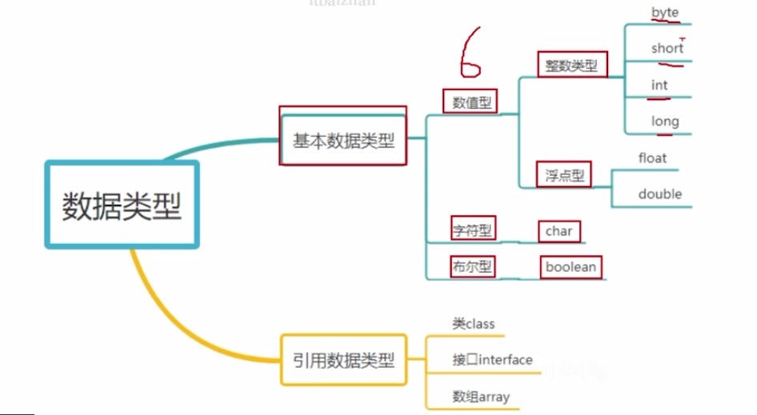

# java初学

- 编译好后
- cmd
	- javac name.java
- 生成字节码文件name.class
- 运行
	- java name

## 注释

- 单行

	- 

	~~~
	//
	~~~

- 多行

	- ~~~
		/*
		
		*/
		~~~

## 起名

~~~
必须以 字母下划线或者$开头
~~~

## 采用Unicode 而不是ASCII字符

- 所以可以是英文 也可以是汉字

## 变量

~~~
int a;
long e;
double s;
~~~

## 常量 final

~~~java
final type varName = value
final double pi = 3.14;

System.out.println("π是" + pi);
>>>π是3.14
~~~

## 基本数据类型

~~~java
        int a = 100;
        int b = 015;// 八进制
        int c = 0x3fff;
        int d = 0x1010101;
        
        int y = 10000102300L; //把整形常量定义为long类型
	    float f = 0.1F// 浮点数默认是double 要是要用float后面加一个F
	    
	    char a = 'a';
		char b = '中';

		String str = "asbdf";

		boolean f = true;// 不能用0 1替代

~~~

