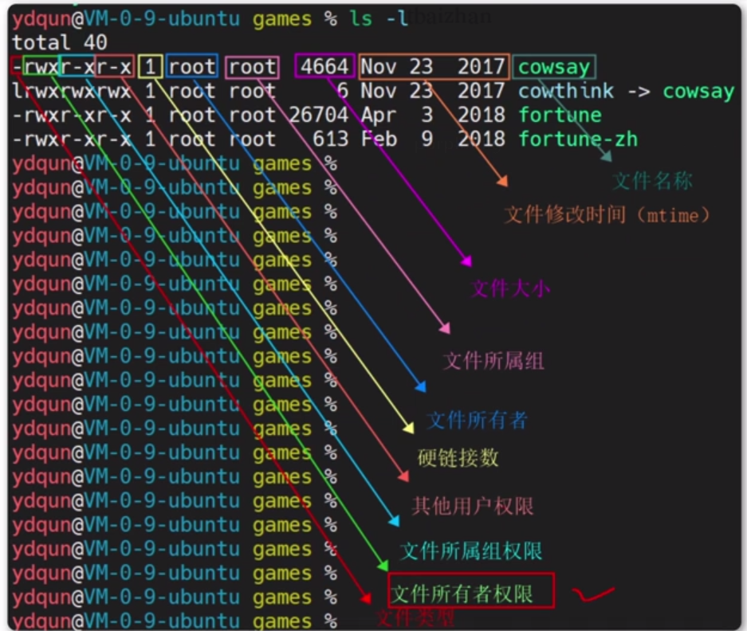
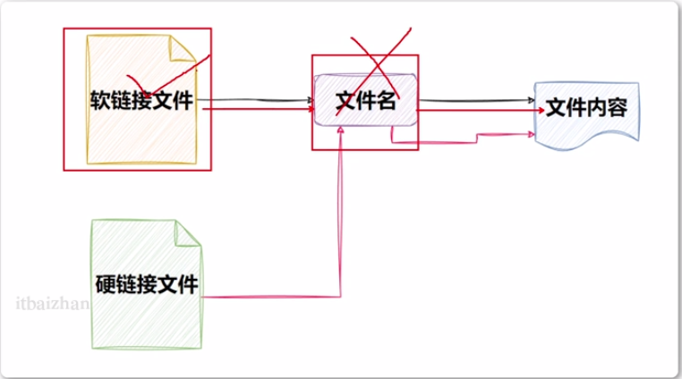

# linux学习01

## 打开shell工具

~~~
ip addr
// 看自己的ip地址

~~~


## 目录

~~~
ll
~~~

~~~ 
第一位是d就是文件夹
否则就不是
~~~




## 路径

### 绝对路径 & 相对路径

~~~
/名/名...
~~~

~~~
../
返回上一级
/ect/shh 到/etc/python
../python
返回多级
../../../
~~~

## 命令格式

~~~
command [-option] [parameter]
命令  	参数 		参数值
~~~

## 命令 ls

- ls 即list
- 列出目录中的文件和子目录
- 只列出当前目录下的文件

~~~
-l 以长列表格式显示文件和目录信息，包括权限、所有者、所属组、大小、修改时间以及文件名。
-a 列出所有文件，包括隐藏文件
-A 类似a但是不列出. .. 这两个特殊的目录条目

-h：以人类可读的格式显示文件大小，如 KB、MB、GB 等。
-t：按最后修改时间排序。
-r：逆序排序。
-S：按文件大小排序。

ls -l /etc/passwd    # 显示/etc/passwd文件的详细信息
ls -l

~~~

~~~~
ls -a -l
等价
ls -al
顺序也不重要
~~~~

## 帮助手册

- 命令 + –help

- ~~~~
	ls --help
	~~~~

## 中英文

~~~
[root@node1 ~]# echo $LANG
zh_CN.UTF-8 # 中文
en_US.UTF-8 # 英文

修改
[root@node1 ~]# LANG="zh_CN.UTF-8"  // 不过是临时的
下载中文包
修改 /etc/locale.conf文件，设置内容为LANG=zh_CN.UTF-8
[root@node1 ~]# yum install man-pages-zh-CN -y
~~~


## 命令man

- j/enter 向下一行
- k 向上一行
- f/空格/PG Down 按页向下翻
- b/Page UP 向上翻页
- p 直接翻到首页
- 查找按/要查找的内容
	- n 查找下一个
	- N 上一个
- q 退出

## cd pwd

- cd = change dir  
- pwd = print work dir 显示目前所在目录

~~~
cd 路径
~~~

~~~
pwd [-p]
~~~

- -p 会不以链接档的数据显示，而是显示正确的完整路径

## ~

~~~
~ 就是家目录
~~~

## 文件夹的删除和创建

### 创建 - mkdir

- make dir
- **-p ：**直接将所需要的目录(包含上一级目录)递归创建起来

~~~
mkdir [-p] name
~~~

### 删除 rmdir

- remove dir
- **-p ：**从该目录起，一次删除多级空目录,把路径写全

~~~
rmdir [-p] name
~~~

- 有文件的文件夹就不能删除

~~~
rmdir -p name
~~~

## 查看文件内容

### 看文件内容比较少

- cat tac

~~~
cat 
~~~

- **-A ：**相当于 -vET 的整合选项，可列出一些特殊字符而不是空白而已；
- **-b ：**列出行号，仅针对非空白行做行号显示，空白行不标行号！
- **-E ：**将结尾的断行字节 $ 显示出来；
- **-n ：**列印出行号，连同空白行也会有行号，与 -b 的选项不同；
- **-T ：**将 [tab] 按键以 ^I 显示出来；
- **-v ：**列出一些看不出来的特殊字符

~~~
tac
~~~

- tac与cat命令刚好相反，文件内容从最后一行开始显示


### more

一页一页翻动,看完就结束了,自动退出

~~~
more path
~~~

- **空白键 (space)** ：代表向下翻一页
- **Enter** ：代表向下翻『一行』
- **/字串** ：代表在这个显示的内容当中，向下搜寻『字串』这个关键字
- **q** ：代表立刻离开 more ，不再显示该文件内容
- **b** ：代表往回翻页

### less

~~~
less path
~~~

- **空白键** ：向下翻动一页；
- **pagedown** ：向下翻动一页；
- **pageup** ：向上翻动一页；
- **/字串** ：向下搜寻『字串』的功能；
- **?字串** ：向上搜寻『字串』的功能；
- **n** ：重复前一个搜寻 (与 / 或 ? 有关！)
- **N** ：反向的重复前一个搜寻 (与 / 或 ? 有关！)
- **q** ：离开 less 这个程序；

### head

取出文件前面几行,默认显示前10行

```
head [-n number] 文件 
head -n 10 01.txt
```

- **-n ：**后面接数字，代表显示几行的意思

### tail

取出文件后面几行

```
tail [-n number] 文件
```

- **-n ：**后面接数字，代表显示几行的意思
- **-f ：**表示持续侦测后面所接的档名，要等到按下ctrl + c 才会结束tail的侦测


## 操作文件和文件夹

### cp

cp(copy) 即拷贝文件和目录

~~~
 cp [-adfilprsu] 来源档(source) 目标档(destination)
 cp text.txt ../../tmep1/text01.txt
~~~

- **-a：**相当于 -pdr 的意思，至于 pdr 请参考下列说明；(常用)
- **-d：**若来源档为链接档的属性(link file)，则复制链接档属性而非文件本身；
- **-f：**为强制(force)的意思，若目标文件已经存在且无法开启，则移除后再尝试一次；
- **-i：**若目标档(destination)已经存在时，在覆盖时会先询问动作的进行(常用)
- **-l：**进行硬式链接(hard link)的链接档创建，而非复制文件本身；
- **-p：**连同文件的属性一起复制过去，而非使用默认属性(备份常用)；
- **-r：**递归持续复制，用于目录的复制行为；(常用)
- **-s：**复制成为符号链接档 (symbolic link)，亦即『捷径』文件

### mv(移动 改名)

mv(move) 移动文件与目录，或修改名称

```
mv [-fiu] 源文件/夹 目录文件/夹
mv temp2 nowtemp2
```

- **-f ：**force 强制的意思，如果目标文件已经存在，不会询问而直接覆盖；
- **-i ：**若目标文件 (destination) 已经存在时，就会询问是否覆盖！
- **-u ：**若目标文件已经存在，且 source 比较新，才会升级 (update)

### rm

rm (remove) 移除文件或目录

```
rm [-fir] 文件或目录
```

- **-f ：**就是 force 的意思，忽略不存在的文件，不会出现警告信息；
- **-i ：**互动模式，在删除前会询问使用者是否动作
- **-r ：**递归删除，最常用在目录的删除了！这是非常危险的选项！！！

> **注意**
>
> 千万不要用root管理员用户执行：rm -rf /
>
> 效果等同于在Windows上执行C盘格式化

### 通配符 *

符号* 表示通配符，即匹配任意内容（包含空）

```
temp*，表示匹配任何以temp开头的内容
*temp，表示匹配任何以temp结尾的内容
*temp*，表示匹配任何包含temp的内容
```

## which

- 查找命令

- 安装软件在哪忘记了

~~~
which 命令
which find
>>> /usr/bin/find
~~~

## find

- 查找文件

~~~
find 搜索的路径 -name "文件名"
find / -name "temp1"
find / -name "passwd"
会把所有结尾的都查找到
find / -name "*passwd*"
把包含的数据全都检索出来了
~~~

## grep

- 文本搜索

~~~
grep [-ivnrlc] 要查找的东西 文件名
i 忽略大小写
v 反向查找
n 显示行号
r 递归查
l 只打印匹配的文件名
c 只打印匹配的行号

yum list installed | grep wget
~~~

## wc

- 统计 数

~~~
wc [-clw]  [--help] [--version] [文件..]
c 字节
l 行数
w 字数
wc temp1.txt
302  	602  	5303   temp1.txt
行数  单词数  	字节数		文件名
~~~

## | 管道符

~~~
ls | grep .txt
查找所有以.txt结尾的文件
ls /etc | grep ^pass 
查找以etc中以pass开头的文件
cat temp.txt | grep 66 
~~~


## touch

- 创建文件   
- 修改文件的时间戳

~~~
touch filename
~~~

~~~
同时创建多个文件
touch file1.txt file2.txt file3.txt
~~~

## echo

- 把文本输出到黑窗口上

~~~~
echo "hello word！"
~~~~

1. 显示 Shell变量

	命令将在终端上输出 `Hello, Linux!`。

	```
	myvar="Hello, Linux!"
	echo $myvar
	```

2. 输出到文件

	可以使用重定向符号 `>` 将 `echo` 命令的输出保存到一个文件中,将 `Hello,Linux!` 并将其保存到一个名为 `myfile.txt` 的文件中

	```
	echo "Hello, Linux!" > myfile.txt
	```

## 重定向符

### >

- 覆盖 将命令的标准输出重定向到一个文件中

~~~
echo "helo" > filename
ll > 02.txt
~~~

这个命令将列出当前目录下的文件，并将结果输出到一个名为 `file.txt` 的文件中。如果该文件不存在，则会创建它；如果存在，则会覆盖原有内容

### >>

- 追加

- ~~~
	echo "hello " >> filename
	~~~


- `<`：使用一个文件的内容作为命令的标准输入，例如：

```
sort < file.txt
```

这个命令将读取 `file.txt` 文件中的内容，并将其传递给 sort 命令，该命令对输入进行排序

- `<<`：将一个字符串作为命令的标准输入，例如：

```
grep 'hello' << EOF
Hello, World!
Goodbye, World!
EOF
```

这个命令将使用 `grep` 命令来查找包含 `hello` 字符串的行。字符串 `EOF` 用于指定输入的结束，之间的文本将作为标准输入

---

 

## 创建链接

- **ln** = **link**

### 软链接  

- 引用

~~~
ln -s goal new
~~~

## 硬链接

- 复制

~~~
ln goal new
~~~



## 服务 Systemctl

Linux系统很多软件（内置或第三方）均支持使用systemctl命令控制：启动、停止、开机自启

能够被systemctl管理的软件，一般也称之为：服务

~~~
systemctl [操作] 服务名
system control
~~~

- start 开启服务
- stop 停止服务
- status 查看当前服务状态
- enable 开启开机自启动
- disable 关闭开机自启动

系统内置的服务比较多，比如：

- NetworkManager，主网络服务
- network，副网络服务
- firewalld，防火墙服务
- sshd，ssh服务

~~~
ls /usr/lib/systemd/system/

~~~

---

不想学了这里

----


